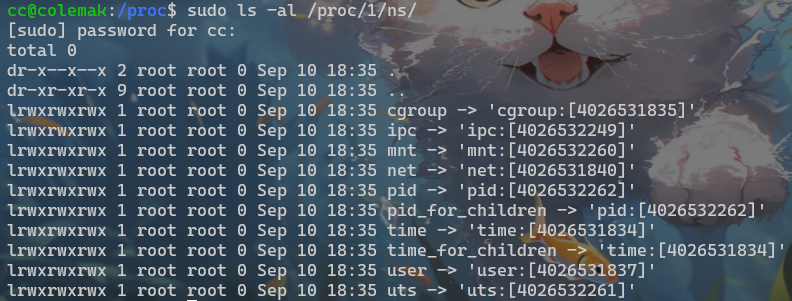
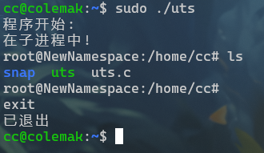
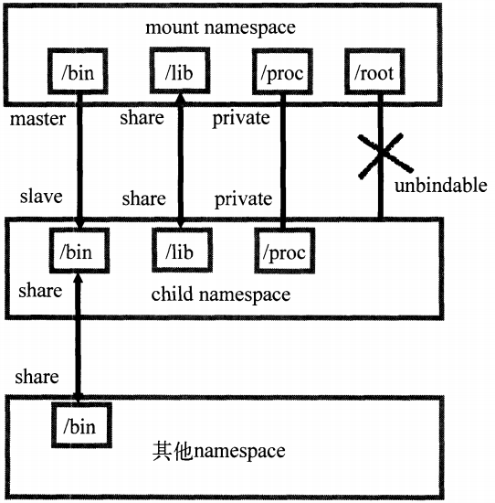

# 容器-OS内核知识

容器技术起源于Linux，是一种内核虚拟化技术，提供轻量级的虚拟化，以便隔离进程和资源。相较于虚拟机，容器更轻量，启动更快，资源占用更少，更适合于云环境。

容器本质上是宿主机上的进程。例如最常见的容器引擎Docker 通过namespace实现了资源隔离，通过cgroups实现了资源限制，通过写时复制机制实现了高效的文件操作。本文主要学习容器层所利用的操作系统内核机制。

## namespace

Linux Namespace提供了一种内核级别隔离系统资源的方法，通过将系统的全局资源放在不同的Namespace中，来实现资源隔离的目的。不同Namespace的程序，可以享有一份独立的系统资源。目前Linux中提供了六类系统资源的隔离机制，分别是：

Namespace|系统调用参数|隔离内容
---|---|---
UTS|CLONE_NEWUTS|主机名与域名
IPC|CLONE_NEWIPC|信号量、消息队列和共享内存
PID|CLONE_NEWPID|进程编号
Network|CLONE_NEWNET|网络设备、网络栈、端口等等
Mount|CLONE_NEWNS|挂载点（文件系统）
User|CLONE_NEWUSER|用户和用户组
Time|CLONE_NEWTIME|系统时钟

从Kernel 3.8开始，用户可以在`/proc/$pid/ns`文件中找到进程的Namespace信息，例如：


上述文件都是对应namespace的文件描述符，方括号中的值是namespace的inode，若inode相同则两个进程处于同一namespace中。

### namespace API

Linux提供了一系列 Namespace API，包括clone()、setns()、unshare()和/proc下部分文件。

**clone：**

通过clone系统调用，创建一个新Namespace的进程，函数描述如下：
```c
int clone(int (*child_func)(void *), void *child_stack, int flags, void *arg);
```

- child_func：子进程的入口函数
- child_stack：子进程的栈空间
- flags：控制子进程的特性，例如使用`CLONE_*`标志位创建新的Namespace、是否与父进程共享虚拟内存等，包括
  - CLONE_FILES: 子进程一般会共享父进程的文件描述符，如果子进程不想共享父进程的文件描述符了，可以通过这个flag来取消共享。
  - CLONE_FS: 使当前进程不再与其他进程共享文件系统信息。
  - CLONE_SYSVSEM: 取消与其他进程共享SYS V信号量。
  - CLONE_NEW*（如前文表格）: 创建新的namespace，并将该进程加入进来。
- arg：传递给子进程的参数

**setns：**
`setns()`函数可以把进程加入到指定的Namespace，函数描述如下：

```c
int setns(int fd, int nstype);
```

- fd：Namespace文件描述符
- nstype：Namespace类型，可能的取值有：
  - 0：可以加入任意的namespace
  - CLONE_NEWIPC：fd 必须指向IPC namespace
  - CLONE_NEWNET：fd 必须指向network namespace
  - CLONE_NEWNS：fd 必须指向mount namespace
  - CLONE_NEWPID：fd 必须指向PID namespace
  - CLONE_NEWUSER： fd 必须指向user namespace
  - CLONE_NEWUTS： fd 必须指向UTS namespace

**unshare：**
unshare()系统调用用于将当前进程和所在的Namespace分离，移入新创建的Namespace中。

```c
int unshare(int flags);
```

- flags：与`clone`系统调用的flags参数相似

!!! tips
    
    unshare()和setns()系统调用对PID Namespace的处理与其它namespace不同。

    unshare()允许用户在原有进程中建立命名空间进行隔离。但是创建了PID namespace后，原先unshare()调用者进程并不进入新的PID namespace，接下来创建的子进程才会进入新的namespace，这个子进程也就随之成为新namespace中的init进程。

    类似的，调用setns()创建新PID namespace时，调用者进程也不进入新的PID namespace，而是随后创建的子进程进入。

    这是因为调用进入新的pid namespace会导致pid变化。而对用户态的程序和库函数来说，他们都认为进程的pid是一个常量，pid的变化会引起这些进程崩溃。

### UTS namespace

UTS（UNIX Time-sharing System）namespace提供了主机名和域名的隔离，这样每个Docker容器就可以拥有独立的主机名和域名，在网络上可以被视作一个独立的节点，而非宿主机上的一个进程。在Docker中，每个镜像基本都以自身所提供的服务名称来命名镜像的hostname，且不会对宿主机产生任何影响，这就是UTS namespace的作用。

例如下面的代码，创建一个新的UTS namespace，并在其中运行一个bash shell：
```c
#define _GNU_SOURCE
#include <sys/types.h>
#include <sys/wait.h>
#include <stdio.h>
#include <sched.h>
#include <signal.h>
#include <unistd.h>
 
#define STACK_SIZE (1024 * 1024)
 
static char child_stack[STACK_SIZE];
char *const child_args[] = {
    "/bin/bash",
    NULL};
 
int child_main(void *args)
{
    printf("在子进程中!\n");
    sethostname("NewNamespace", 12);
    execv(child_args[0], child_args);
    return 1;
}
 
int main()
{
    printf("程序开始: \n");
    int child_pid = clone(child_main, child_stack + STACK_SIZE,
                          CLONE_NEWUTS | SIGCHLD, NULL);
    waitpid(child_pid, NULL, 0);
    printf("已退出\n");
    return 0;
}
```
效果如下：



### IPC namespace

进程间通信（Inter-Process Communication，IPC）涉及到的IPC资源包括常见的信号量、消息队列和共享内存。然而与虚拟机不同的是，容器内部进程间通信对宿主机来说，实际上是具有相同PID namespace中的进程间通信，因此需要一个唯一的标识符来进行区别。申请IPC资源就是申请了一个全局唯一的32位ID，所以IPC namespace中实际上包含了系统IPC标识符以及实现POSIX消息队列的文件系统。在同一个IPC namespace下的进程彼此可见，不同IPC namespace下的进程则互相不可见。

目前使用IPC namespace机制的系统不多，其中比较有名的有PostgreSQL。Docker当前也使用IPC namespace实现了容器与宿主机、容器与容器之间的IPC隔离。

### PID namespace

PID namespace提供了进程编号的隔离，使得容器内部的进程可以拥有自己的PID空间，内核为所有的PID namespace维护了一个树状结构，最顶层的是系统初始时创建的，被称为root namespace。它创建的新PID namespace就称为child namespace（树的子节点）。通过这种方式，不同的PID namespaces会形成一个层级体系。父节点可以看到子节点中的进程，并可以通过信号等方式对子节点中的进程产生影响。反过来，子节点不能看到父节点PID namespace中的任何内容

**init进程**

在传统的UNIX系统中，PID为1的进程是init，地位非常特殊。它作为所有进程的父进程，维护一张进程表，不断检查进程的状态，一旦有某个子进程因为父进程错误成为了“孤儿”进程，init就会负责回收这个子进程占用的资源并结束子进程。所以在要实现的容器中，启动的第一个进程也需要实现类似init的功能，维护所有后续启动进程的运行状态。

当系统中存在树状嵌套结构的PID namespace时，若某个子进程成为孤儿进程，收养该子进程的责任就交给了该子进程所属的PID namespace中的init进程。

**信号**

PID namespace中的init进程拥有信号屏蔽。如果init中没有编写处理某个信号的代码逻辑，那么与init在同一个PID namespace下的进程（即使有超级权限）发送给它的该信号都会被屏蔽。这个功能的主要作用是防止init进程被误杀。

对于父节点中的进程发送给子节点init的信号，如果不是SIGKILL（销毁进程）或SIGSTOP（暂停进程）也会被忽略。但如果发送SIGKILL或SIGSTOP，子节点的init会强制执行（无法通过代码捕捉进行特殊处理），也就是说父节点中的进程有权终止子节点中的进程。

### mount namespace

mount namespace通过隔离文件系统挂载点对隔离文件系统提供支持，它是历史上第一个Linux namespace，所以它的标识位比较特殊，就是`CLONE_NEWNS`。隔离后，不同mount namespace中的文件结构发生变化也互不影响。你可以通过`/proc/$pid/mounts`查看到所有挂载在当前namespace中的文件系统，还可以通过`/proc/$pid/mountstats`看到mount namespace中文件设备的统计信息，包括挂载文件的名字、文件系统类型、挂载位置等等。

进程在创建mount namespace时，会把当前的文件结构复制给新的namespace。新namespace中的所有mount操作都只影响自身的文件系统，对外界不会产生任何影响。这样做法非常严格地实现了隔离。

!!! tips
    
    对某些特殊情况，这种隔离并不适用。例如父节点namespace中的进程挂载了一张CD-ROM，这时子节点namespace复制的目录结构是无法自动挂载上这张CD-ROM，因为该操作会影响到父节点的文件系统。

挂载传播（mount propagation）解决了这个问题，挂载传播定义了挂载对象（mount object）之间的关系，这样的关系包括共享关系和从属关系，系统用这些关系决定任何挂载对象中的挂载事件如何传播到其他挂载对象。

- 共享关系（share relationship）。如果两个挂载对象具有共享关系，那么挂载对象中的挂载事件会互相传播。
- 从属关系（slave relationship）。如果两个挂载对象形成从属关系，只有master中的挂载事件会传播到slave挂载对象。

一个挂载状态可能为如下的其中一种：

- 共享挂载（shared）
- 从属挂载（slave）
- 私有挂载（private）
- 不可绑定挂载（unbindable）

既不传播也不接收传播事件的挂载对象称为私有挂载（private mount）；另一种特殊的挂载对象称为不可绑定的挂载（unbindable mount），它们与私有挂载相似，但是不允许执行绑定挂载，即创建mount namespace时这块文件对象不可被复制。通过下图可以更好地了解它们的状态变化：



Linux 挂载系统更细节的知识可以查看参考资料。

### network namespace

network namespace主要提供了关于网络资源的隔离，包括网络设备、IPv4和IPv6协议栈、IP路由表、防火墙、`/proc/net`目录、`/sys/class/net`目录、socket等等。一个物理的网络设备最多存在在一个network namespace中，可以通过创建veth pair（虚拟网络设备对：类似管道，使数据互相传播）在不同的network namespace间创建通道，以此达到通信的目的。

一般情况下，物理网络设备都分配在最初的root namespace（表示系统默认的namespace）中。如果有多块物理网卡，也可以把其中一块或多块分配给新创建的network namespace。需要注意的是，当新创建的network namespace被释放时（所有内部的进程都终止并且namespace文件没有被挂载或打开），在这个namespace中的物理网卡会返回到root namespace，而非创建该进程的父进程所在的network namespace。

### user namespace

user namespace主要隔离了安全相关的标识符（identifiers）和属性（attributes），包括用户ID、用户组ID、root目录、key（指密钥）以及特殊权限。通俗地讲，一个普通用户的进程通过clone()创建的新进程在新user namespace中可以拥有不同的用户和用户组。这意味着一个进程在容器外属于一个没有特权的普通用户，但是他创建的容器进程却属于拥有所有权限的超级用户。

## cgroups

cgroups（Control Groups）最初叫Process Container，由Google工程师（Paul Menage和Rohit Seth）于2006年提出，后来因为Container有多重含义容易引起误解，就在2007年更名为Control Groups，并被整合进Linux内核。顾名思义就是把进程放到一个组里面统一加以控制。官方的定义如下：

cgroups是Linux内核提供的一种机制，这种机制可以根据需求把一系列系统任务及其子任务整合（或分隔）到按资源划分等级的不同组内，从而为系统资源管理提供一个统一的框架。

通俗的来说，cgroups可以限制、记录任务组使用的物理资源（包括：CPU、Memory、IO等），为容器实现虚拟化提供了基本保证，是构建Docker等一系列虚拟化管理工具的基石。

对开发者来说，cgroups有如下四个特点：

- cgroups的API以一个伪文件系统的方式实现，用户态的程序可以通过文件操作实现cgroups的组织管理。
- cgroups的组织管理操作单元可以细粒度到线程级别，用户态代码可以创建和销毁cgroup，从而实现资源再分配和管理。
- 所有资源管理的功能都以子系统的方式实现，接口统一。
- 子进程创建之初与其父进程处于同一个cgroups的控制组。

本质上来说，cgroups是内核附加在程序上的一系列hook，通过程序运行时对资源的调度触发相应的钩子以达到资源追踪和限制的目的。

**相关术语：**

- task（任务）：在cgroups的术语中，任务表示系统的一个进程或线程。
- cgroup（控制组）：cgroups 中的资源控制都以cgroup为单位实现。cgroup表示按某种资源控制标准划分而成的任务组，包含一个或多个子系统。一个任务可以加入某个cgroup，也可以从某个cgroup迁移到另外一个cgroup。
- subsystem（子系统）：cgroups中的子系统就是一个资源调度控制器。比如CPU子系统可以控制CPU时间分配，内存子系统可以限制cgroup内存使用量。
  - 子系统实际上就是cgroups的资源控制系统，每种子系统独立地控制一种资源，目前Docker使用如下九种子系统，其中，net_cls任务子系统在内核中已经广泛实现，但是Docker尚未使用。以下是它们的用途：
    - blkio：任务可以为块设备设定输入/输出限制，比如物理驱动设备（包括磁盘、固态硬盘、USB等）。
    - cpu：任务使用调度程序控制任务对CPU的使用。
    - cpuacct：自动生成cgroup中任务对CPU资源使用情况的报告。
    - cpuset：可以为cgroup中的任务分配独立的CPU（此处针对多处理器系统）和内存。
    - devices：可以开启或关闭cgroup中任务对设备的访问。
    - freezer：可以挂起或恢复cgroup中的任务。
    - memory：可以设定cgroup中任务对内存使用量的限定，并且自动生成这些任务对内存资源使用情况的报告。
    - perfevent：使用后使cgroup中的任务可以进行统一的性能测试。
    - net_cls：Docker没有直接使用它，它通过使用等级识别符(classid)标记网络数据包，从而允许Linux流量控制程序（Traffic Controller，TC）识别从具体cgroup中生成的数据包。
- hierarchy（层级）：层级由一系列cgroup以一个树状结构排列而成，每个层级通过绑定对应的子系统进行资源控制。层级中的cgroup节点可以包含零或多个子节点，子节点继承父节点挂载的属性。整个系统可以有多个层级。

### cgroups 作用

实现cgroups的主要目的是为不同用户层面的资源管理，提供一个统一化的接口。从单个进程的资源控制到操作系统层面的虚拟化。cgroups提供了以下四大功能：

- 资源限制：cgroups可以对任务使用的资源总额进行限制。如设定应用运行时使用内存的上限，一旦超过这个配额就发出OOM（Out of Memory）。
- 优先级分配：通过分配的CPU时间片数量及硬盘IO带宽大小，实际上就相当于控制了任务运行的优先级。
- 资源统计： cgroups可以统计系统的资源使用量，如CPU使用时长、内存用量等等，这个功能非常适用于计费。
- 任务控制：cgroups可以对任务执行挂起、恢复等操作。

过去内核开发者甚至把namespace也作为一个cgroups的子系统加入进来，也就是说cgroups曾经甚至还包含了资源隔离的能力。但是资源隔离会给cgroups带来许多问题，如pid namespace加入后，PID在循环出现的时候，cgroup会出现了命名冲突、cgroup创建后进入新的namespace导致其他子系统资源脱离了控制等等，所以在2011年就被移除了。

### 组织结构

系统中的多个cgroup是由多个hierarchy构成的森林，在Doccker中，为了方便管理，每个子系统独自控制一个hierarchy。

其中cgroups的管理遵循如下规则：

1. 同一个层级可以附加多个子系统，例如CPU和Memory子系统可以同时附加到同一个hierarchy上。
2. 一个子系统可以管理多个hierarchy，当且仅当子系统是这些hierarchy的唯一一个子系统。
3. 系统每次新建hierarchy时，会自动创建默认包含该系统上的所有任务的cgroup（root cgroup）。一个任务在一个层级中只能属于一个cgroup，但可以属于不同层级的多个cgroups。
4. 任务在fork/clone自身时创建的子任务默认与原任务在同一个cgroup中，但是子任务允许被移动到不同的cgroup中。


## 参考资料

- [Docker基础技术：Linux Namespace（上）](https://coolshell.cn/articles/17010.html)

