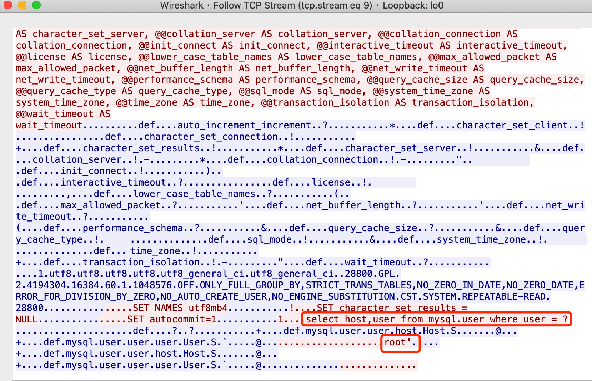
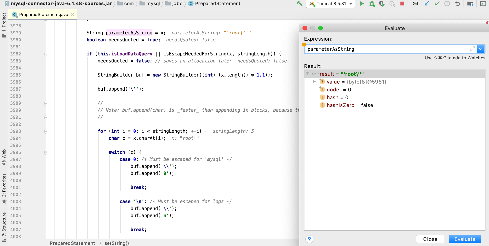
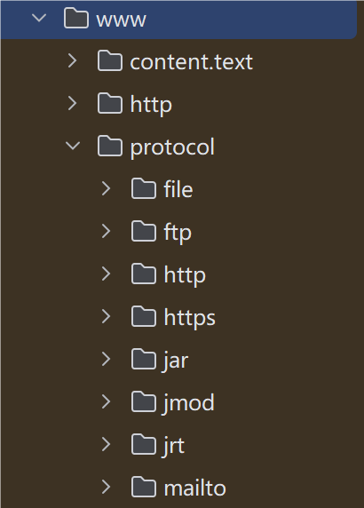
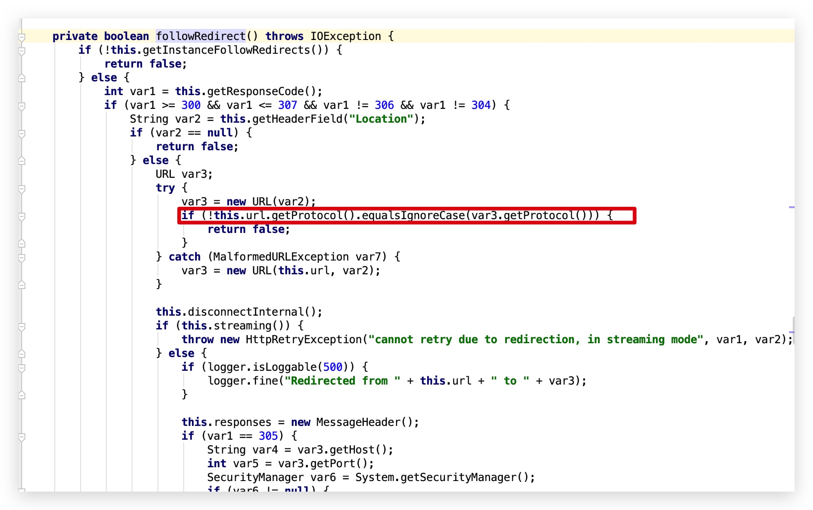

---
tags:
  - Java
  - Web
comment: true
---

# 1 Java 基础

!!! note
    本文档主要介绍 Java Web 安全相关知识归纳总结，[学习路线参考](https://www.javasec.org/)

## 1.1 ClassLoader 机制

JVM 架构图:

Java 类均要经过 ClassLoader 加载后才能运行，AppClassLoader 是默认的类加载器，如果类加载时我们不指定类加载器的情况下，默认会使用 AppClassLoader 加载类，`ClassLoader.getSystemClassLoader()` 返回的系统类加载器也是 AppClassLoader。


### Java 类加载方式

1. **隐式加载**：当程序创建对象实例或使用 `ClassName.MethodName()` 时，如果该对象的类还没有被加载，JVM 会自动调用类加载器加载该类。
2. **显式加载**：通过 Java 反射机制或 ClassLoader 来动态加载类。

   ```java
   // 反射加载TestHelloWorld示例
   Class.forName("xxx.TestHelloWorld");

   // ClassLoader加载TestHelloWorld示例
   this.getClass().getClassLoader().loadClass("xxx.TestHelloWorld");
   ```

   `Class.forName("类名")` 默认会初始化被加载类的静态属性和方法，如果不希望初始化类可以使用 `Class.forName("类名", false, 类加载器)`，而 `ClassLoader.loadClass` 默认不会初始化类方法。

## 1.6 JDBC

### JDBC SQL 注入

本章节只讨论基于 JDBC 查询的 SQL 注入，暂不讨论基于 ORM 实现的框架注入，也不会过多的讨论注入的深入用法、函数等

#### SQL 注入原理

Java 代码片段如下:

```java
// 获取用户传入的用户名
String user = request.getParameter("user");

// 定义最终执行的SQL语句，这里会将用户从请求中传入的host字符串拼接到最终的SQL
// 语句当中，从而导致了SQL注入漏洞。
String sql = "select host,user from mysql.user where user = '" + user + "'";

// 创建预编译对象
PreparedStatement pstt = connection.prepareStatement(sql);

// 执行SQL语句并获取返回结果对象
ResultSet rs = pstt.executeQuery();
```

如上示例程序，我们可以传入 `root' union select 1;--+` 去闭合 SQL 语句，实现注入

具体利用方式 PHP SQL 注入一致，此处不做介绍。

#### SQL 注入防御

通常情况下我们可以使用以下方式来防御 SQL 注入攻击：

1. 转义用户输入的特殊字符或对用户输入的数据进行过滤。
2. 限制用户传入的数据类型，如预期传入的是数字，那么使用 `Integer.parseInt()` 转换为数字。
3. 使用 `PreparedStatement` 预编译 SQL 语句，预编译的 SQL 语句会在执行前进行编译，从而避免了 SQL 注入攻击。

#### PreparedStatement SQL 预编译查询

将上面存在注入的 Java 代码改为 ? 占位的方式即可实现 SQL 预编译查询。
示例代码如下：

```java
// 获取用户传入的用户名
String id = request.getParameter("id");

// 定义最终执行的SQL语句，这里会将用户从请求中传入的host字符串拼接到最终的SQL
String sql = "select id, username from sys_user where id =? ";

// 创建预编译对象
PreparedStatement pstt = connection.prepareStatement(sql);

// 设置参数
pstt.setObject(1, id);

// 执行SQL语句并获取返回结果对象
ResultSet rs = pstt.executeQuery();
```

#### JDBC 预编译

JDBC 预编译查询分为客户端预编译和服务器端预编译，对应的 URL 配置项是 `:useServerPrepStmts`，当 `useServerPrepStmts` 为 false 时使用客户端(驱动包内完成 SQL 转义)预编译，`useServerPrepStmts` 为 true 时使用数据库服务器端预编译。

对于代码：

```java
String sql = "select host,user from mysql.user where user = ? ";
PreparedStatement pstt = connection.prepareStatement(sql);
pstt.setObject(1, user);
```

##### 服务器端预编译



##### 客户端预编译


对应的 Mysql 客户端驱动包预编译代码在 com.mysql.jdbc.PreparedStatement 类的 setString 方法，如下：


预编译前的值为 root', 预编译后的值为'root\''

## 1.7 URLConnection

Java 抽象出来了一个 `URLConnection` 类，它用来表示应用程序以及与 URL 建立通信连接的所有类的超类，通过 URL 类中的 `openConnection` 方法获取到 `URLConnection` 的类对象。

`URLConnection` 支持的协议可以在 `sun.net.www.protocol` 包下找到(jdk_17.0.11)
{width=30%}

其中每个协议都有一个 Handle, Handle 定义了这个协议如何去打开一个连接。

使用 URL 发起一个简单的请求:

```java
public class URLConnectionDemo {

    public static void main(String[] args) throws IOException {
        URL url = new URL("https://www.baidu.com");

        // 打开和url之间的连接
        URLConnection connection = url.openConnection();

        // 设置请求参数
        connection.setRequestProperty("user-agent", "javasec");
        connection.setConnectTimeout(1000);
        connection.setReadTimeout(1000);
        ...

        // 建立实际连接
        connection.connect();

        // 获取响应头字段信息列表
        connection.getHeaderFields();

        // 获取URL响应内容
        StringBuilder response = new StringBuilder();
        BufferedReader in = new BufferedReader(
                new InputStreamReader(connection.getInputStream()));
        String line;

        while ((line = in.readLine()) != null) {
            response.append("/n").append(line);
        }

        System.out.print(response.toString());
    }
}
```

### SSRF

> SSRF(Server-side Request Forge, 服务端请求伪造)。 由攻击者构造的攻击链接传给服务端执行造成的漏洞，一般用来在外网探测或攻击内网服务。

服务端提供了可以从其他服务器获取资源的功能，然而并没有对用户的输入以及发起请求的 url 进行过滤&限制，形成了 SSRF 漏洞。
通常 ssrf 容易出现的功能点如下面几种场景:

- 抓取用户输入图片的地址并且本地化存储
- 从远程服务器请求资源
- 对外发起网络请求
- ...

Java 中 ssrf 漏洞对使用不同类发起的 url 请求有所区别，如果是 URLConnection|URL 发起的请求，那么对于上文中所提到的所有 protocol 都支持，但是如果经过二次包装或者其他的一些类发出的请求，比如:

- HttpURLConnection
- HttpClient
- Request
- okhttp
- ...

那么只支持发起 http|https 协议，否则会抛出异常。
如果传入 url 端口存在，则会返回网页源码，如果端口提供非 web 服务，则会爆出 `Invalid Http response` 或 `Connection reset` 异常，通过对异常的捕获可以探测内网所有的端口服务。

java 中默认对(http|https)做了一些事情，比如:

<div class="annotate" markdown>

- 默认启用了透明 NTLM 认证(1)
- 默认跟随跳转

</div>

1. [《Ghidra 从 XXE 到 RCE》](https://xlab.tencent.com/cn/2019/03/18/ghidra-from-xxe-to-rce/) (To be read)

**默认跟随跳转** 其中有一个坑点



它会对跟随跳转的 url 进行协议判断，所以 Java 的 SSRF 漏洞利用方式整体比较有限:

- 利用 file 协议读取文件内容（仅限使用 URLConnection|URL 发起的请求）
- 利用 http 进行内网 web 服务端口探测
- 利用 http 进行内网非 web 服务端口探测(如果将异常抛出来的情况下)
- 利用 http 进行 ntlmrelay 攻击(仅限 HttpURLConnection 或者二次包装 HttpURLConnection 并未复写 AuthenticationInfo 方法的对象)

## 1.8 JNI 安全基础

Java Native Interface (JNI) 是 Java 与本地代码交互的一种技术。Java 语言是基于 C 语言实现的，Java 底层的很多 API 都是通过 JNI 来实现的。通过 JNI 接口 C/C++ 和 Java 可以互相调用(存在跨平台问题)。Java 可以通过 JNI 调用来弥补语言自身的不足(代码安全性、内存操作等)。

#### JNI-定义 native 方法

首先在 Java 中如果想要调用 `native` 方法, 那么需要在类中先定义一个 `native` 方法。

```java
public class CommandExecution {
    public static native String exec(String cmd);
}
```

如上示例代码，我们使用 `native` 关键字定义一个类似于接口的方法

#### JNI-生成类头文件

如上，我们已经编写好了 CommandExecution.java，现在我们需要编译并生成 c 语言头文件。

`javac -cp . path/to/CommandExecution.java -h dir/to/c_h`

编译完成后会在 `dir/to/c_h` 目录下生成 `CommandExecution.class` 和 `xxx_xxx_CommandExecution.h`。
**_xxx_xxx_CommandExecution.h_**:

```c
/* DO NOT EDIT THIS FILE - it is machine generated */
#include <jni.h>
/* Header for class xxx_xxx_CommandExecution */

#ifndef _Included_xxx_xxx_CommandExecution
#define _Included_xxx_xxx_CommandExecution
#ifdef __cplusplus
extern "C" {
#endif
/*
 * Class:     xxx_xxx_CommandExecution
 * Method:    exec
 * Signature: (Ljava/lang/String;)Ljava/lang/String;
 */
JNIEXPORT jstring JNICALL Java_xxx_xxx_CommandExecution_exec
  (JNIEnv *, jclass, jstring);

#ifdef __cplusplus
}
#endif
#endif
```

**头文件命名强制性**

javah 生成的头文件中的函数命名方式是有非常强制性的约束的，如 `Java\_xxx_xxx_CommandExecution_exec` 中 `Java\_` 是固定的前缀，而 `xxx_xxx_CommandExecution` 也就代表着 Java 的完整包名称: `xxx.xxx.CommandExecution`，`\_exec` 自然是表示的方法名称了。`(JNIEnv \*, jclass, jstring)` 表示分别是 `JNI 环境变量对象`、`java 调用的类对象`、`参数入参类型`。

#### JNI-基础数据类型
需要特别注意的是 Java 和 JNI 定义的类型是需要转换的(1)，不能直接使用 Java 里的类型，也不能直接将 JNI、C/C++的类型直接返回给 Java。
{ .annote }

1. [jni 中 java 与原生代码通信规则](https://blog.csdn.net/qq_25722767/article/details/52557235)

参考如下类型对照表:

| Java 类型 | JNI 类型 | C/C++类型      | 大小         |
| :-------- | :------- | :------------- | :----------- |
| Boolean   | Jblloean | unsigned char  | 无符号 8 位  |
| Byte      | Jbyte    | char           | 有符号 8 位  |
| Char      | Jchar    | unsigned short | 无符号 16 位 |
| Short     | Jshort   | short          | 有符号 16 位 |
| Int       | Jint     | int            | 有符号 32 位 |
| Long      | Jlong    | long long      | 有符号 64 位 |
| Float     | Jfloat   | float          | 32 位        |
| Double    | Jdouble  | double         | 64 位        |

#### JNI-编写C/C++本地命令执行实现

接下来使用C/C++编写函数的最终实现代码。
`xxx_xxx_CommandExecution.cpp`示例：
```cpp
#include <iostream>
#include <stdlib.h>
#include <cstring>
#include <string>
#include "xxx_xxx_CommandExecution.h"

using namespace std;

JNIEXPORT jstring

JNICALL Java_xxx_xxx_CommandExecution_exec
        (JNIEnv *env, jclass jclass, jstring str) {

    if (str != NULL) {
        jboolean jsCopy;
        // 将jstring参数转成char指针
        const char *cmd = env->GetStringUTFChars(str, &jsCopy);

        // 使用popen函数执行系统命令
        FILE *fd  = popen(cmd, "r");

        if (fd != NULL) {
            // 返回结果字符串
            string result;

            // 定义字符串数组
            char buf[128];

            // 读取popen函数的执行结果
            while (fgets(buf, sizeof(buf), fd) != NULL) {
                // 拼接读取到的结果到result
                result +=buf;
            }

            // 关闭popen
            pclose(fd);

            // 返回命令执行结果给Java
            return env->NewStringUTF(result.c_str());
        }

    }

    return NULL;
}
```

- Linux编译：
  ```g++ -fPIC -I"$JAVA_HOME/include" -I"$JAVA_HOME/include/darwin" -shared -o libcmd.jnilib com_anbai_sec_cmd_CommandExecution.cpp```
- Windows编译：
  ```g++ -I"%JAVA_HOME%\include" -I"%JAVA_HOME%\include\win32" -shared -o cmd.dll com_anbai_sec_cmd_CommandExecution.cpp```

编译参考[Java Programming Tutorial Java Native Interface (JNI)](https://www3.ntu.edu.sg/home/ehchua/programming/java/JavaNativeInterface.html)

## 1.9 Java 动态代理

Java反射提供了一种类动态代理机制，可以通过代理接口实现类来完成程序无侵入式扩展。
Java动态代理主要使用场景：

- 统计方法执行所耗时间。
- 在方法执行前后添加日志。
- 检测方法的参数或返回值。
- 方法访问权限控制。
- 方法Mock测试。

### 动态代理API

创建动态代理类