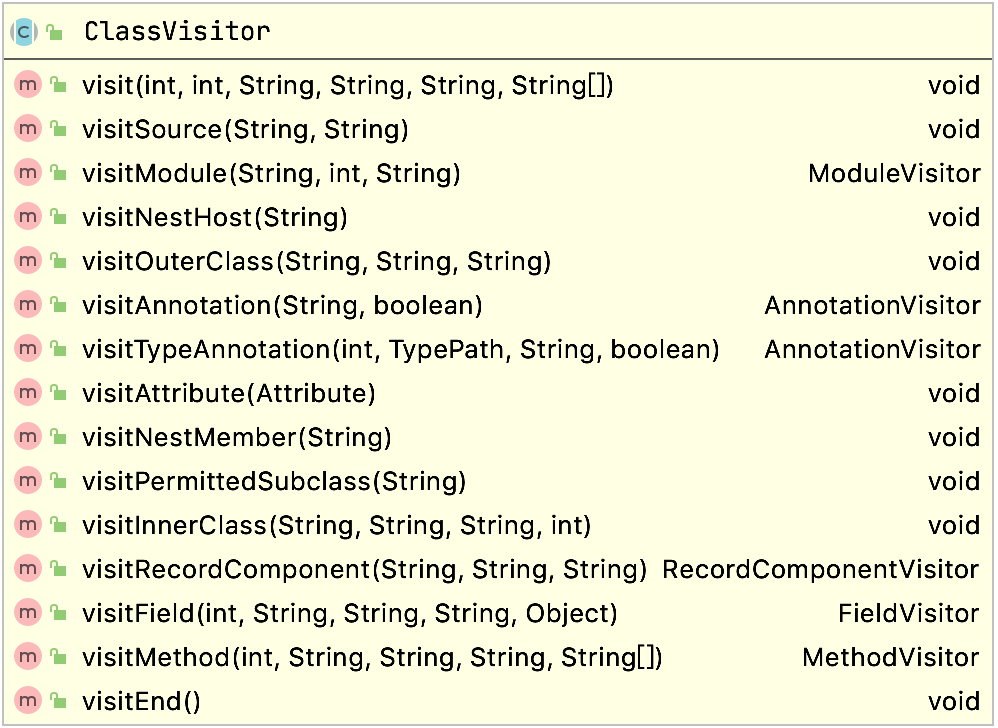
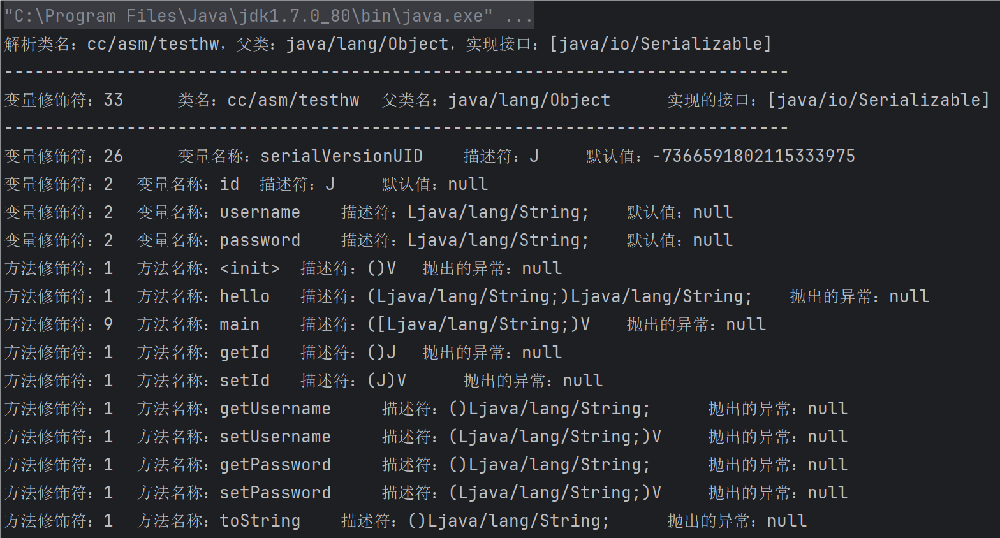
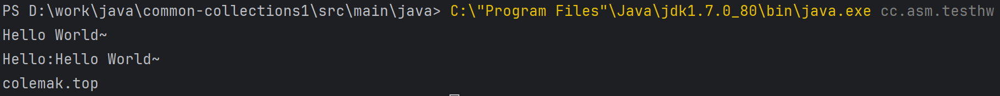
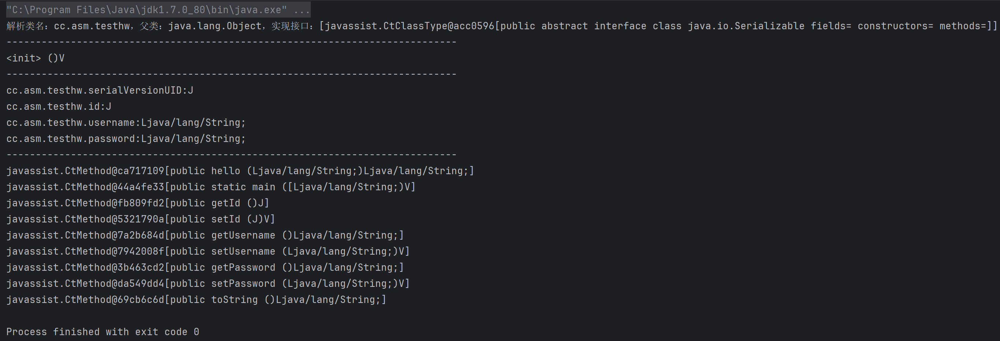
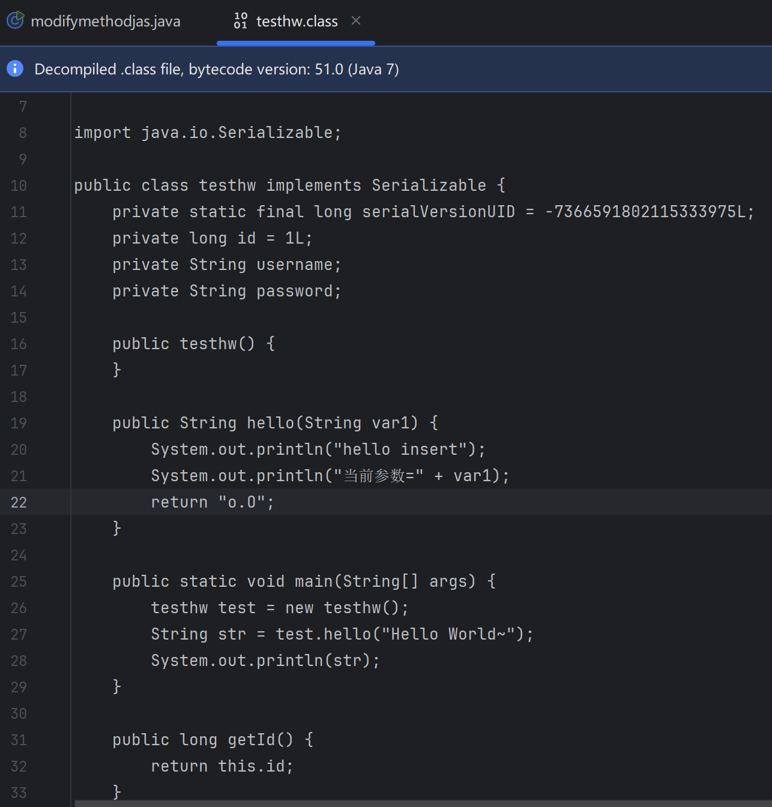
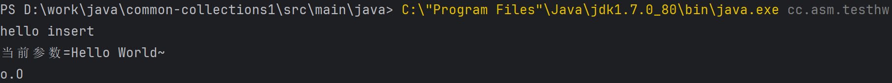

---
tags:
  - Java
  - Web Sec
comments: true
---
# 附录：字节码编辑工具

## ASM

ASM是一种通用Java字节码操作和分析框架，它可以直接以二进制形式修改一个现有的类或动态生成类文件。[ASM官方用户手册](https://asm.ow2.io/asm4-guide.pdf){target="_blank"}

ASM提供了三个基于`ClassVisitor API`的核心API，用于生成和转换类：

1. `ClassReader`类用于解析class文件或二进制流；
2. `ClassWriter`类是`ClassVisitor`的子类，用于生成类二进制；
3. `ClassVisitor`是一个抽象类，自定义`ClassVisitor`重写`visitXXX`方法，可获取捕获ASM类结构访问的所有事件；

### ClassVisitor 和 ClassReader

`ClassReader`类用于解析类字节码，创建`ClassReader`对象可传入类名、类字节码数组或者类输入流对象。

创建完`ClassReader`对象就会触发字节码解析（解析class基础信息，如常量池、接口信息等），所以可以直接通过`ClassReader`对象获取类的基础信息

调用`ClassReader`类的`accpet`方法需要传入自定义的`ClassVisitor`对象，`ClassReader`会按照如下顺序，依次调用该`ClassVisitor`的类方法。

```java
visit
        [ visitSource ] [ visitModule ][ visitNestHost ][ visitPermittedclass ][ visitOuterClass ]
        ( visitAnnotation | visitTypeAnnotation | visitAttribute )*
        ( visitNestMember | visitInnerClass | visitRecordComponent | visitField | visitMethod )*
        visitEnd
```

<figure markdown="span">
  {width=85%}
  <figcaption>ClassVisitor类图</figcaption>
</figure>

### MethodVisitor和AdviceAdapter
`MethodVisitor`同`ClassVisitor`，重写`MethodVisitor`类方法可获取捕获到对应的`visit`事件

`AdviceAdapter`的父类是`GeneratorAdapter`和`LocalVariablesSorter`，在`MethodVisitor`类的基础上封装了非常多的便捷方法，同时还为我们做了非常有必要的计算，所以我们应该尽可能的使用`AdviceAdapter`来修改字节码。

=== "AdviceAdapter"
    `AdviceAdapter`类实现了一些非常有价值的方法，如：`onMethodEnter`（方法进入时回调方法）、`onMethodExit`（方法退出时回调方法），如果我们自己实现很容易掉进坑里面，因为这两个方法都是根据条件推算出来的。比如我们如果在构造方法的第一行直接插入了我们自己的字节码就可能会发现程序一运行就会崩溃，因为Java语法中限制我们第一行代码必须是`super(xxx)`。
=== "GeneratorAdapter"
    `GeneratorAdapter`封装了一些栈指令操作的方法，如`loadArgArray`方法可以直接获取方法所有参数数组、`invokeStatic`方法可以直接调用类方法、`push`方法可压入各种类型的对象等。
=== "LocalVariablesSorter"
    `LocalVariablesSorter`类实现了计算本地变量索引位置的方法，如果要在方法中插入新的局部变量就必须计算变量的索引位置，我们必须先判断是否是非静态方法、是否是`long/double`类型的参数（宽类型占两个位），否则计算出的索引位置还是错的。使用`AdviceAdapter`可以直接调用`mv.newLocal(type)`计算出本地变量存储的位置，为我们省去了许多不必要的麻烦。

### 读取类信息

??? node "code"

    ```java
    package cc.asm;

    import org.objectweb.asm.ClassReader;
    import org.objectweb.asm.ClassVisitor;
    import org.objectweb.asm.FieldVisitor;
    import org.objectweb.asm.MethodVisitor;

    import java.io.IOException;
    import java.util.Arrays;

    import static org.objectweb.asm.ClassReader.EXPAND_FRAMES;
    import static org.objectweb.asm.Opcodes.ASM9;

    public class readinfo {

        public static void main(String[] args) {
            // 定义需要解析的类名称
            String className = "cc.asm.testhw";

            try {
                // 创建ClassReader对象，用于解析类对象，可以根据类名、二进制、输入流的方式创建
                final ClassReader cr = new ClassReader(className);

                System.out.println(
                        "解析类名：" + cr.getClassName() + "，父类：" + cr.getSuperName() +
                                "，实现接口：" + Arrays.toString(cr.getInterfaces())
                );

                System.out.println("-----------------------------------------------------------------------------");

                // 使用自定义的ClassVisitor访问者对象，访问该类文件的结构
                cr.accept(new ClassVisitor(ASM9) {
                    @Override
                    public void visit(int version, int access, String name, String signature, String superName, String[] interfaces) {
                        System.out.println(
                                "变量修饰符：" + access + "\t 类名：" + name + "\t 父类名：" + superName +
                                        "\t 实现的接口：" + Arrays.toString(interfaces)
                        );

                        System.out.println("-----------------------------------------------------------------------------");

                        super.visit(version, access, name, signature, superName, interfaces);
                    }

                    @Override
                    public FieldVisitor visitField(int access, String name, String desc, String signature, Object value) {
                        System.out.println(
                                "变量修饰符：" + access + "\t 变量名称：" + name + "\t 描述符：" + desc + "\t 默认值：" + value
                        );

                        return super.visitField(access, name, desc, signature, value);
                    }

                    @Override
                    public MethodVisitor visitMethod(int access, String name, String desc, String signature, String[] exceptions) {

                        System.out.println(
                                "方法修饰符：" + access + "\t 方法名称：" + name + "\t 描述符：" + desc +
                                        "\t 抛出的异常：" + Arrays.toString(exceptions)
                        );

                        return super.visitMethod(access, name, desc, signature, exceptions);
                    }
                }, EXPAND_FRAMES);
            } catch (IOException e) {
                e.printStackTrace();
            }

        }

    }
    ```
    运行结果：
    {loading="lazy"}

### 修改类

大多数使用ASM库的目的是修改类方法的字节码，在原方法执行的前后动态插入新的Java代码，从而实现类似于AOP的功能。修改类方法字节码的典型应用场景如：APM和RASP；APM需要统计和分析每个类方法的执行时间，而RASP需要在Java底层API方法执行之前插入自身的检测代码，从而实现动态拦截恶意攻击。

使用`ClassWriter`可以实现类修改功能，使用ASM修改类字节码时如果插入了新的局部变量、字节码，需要重新计算`max_stack`和`max_locals`，否则会导致修改后的类文件无法通过JVM校验。手动计算`max_stack`和`max_locals`是一件比较麻烦的事情，ASM为我们提供了内置的自动计算方式，只需在创建`ClassWriter`的时候传入`COMPUTE_FRAMES`即可：`new ClassWriter(cr, ClassWriter.COMPUTE_FRAMES);`

??? note "code"

    ```java
    package cc.asm;

    import org.javaweb.utils.FileUtils;
    import org.objectweb.asm.*;
    import org.objectweb.asm.commons.AdviceAdapter;

    import java.io.File;
    import java.io.IOException;

    import static org.objectweb.asm.ClassReader.EXPAND_FRAMES;
    import static org.objectweb.asm.Opcodes.ASM9;

    public class modifyasm {

        public static void main(String[] args) {
            // 定义需要解析的类名称
            String className = "cc.asm.testhw";

            try {
                // 创建ClassReader对象，用于解析类对象，可以根据类名、二进制、输入流的方式创建
                final ClassReader cr = new ClassReader(className);

                // 创建ClassWriter对象，COMPUTE_FRAMES会自动计算max_stack和max_locals
                final ClassWriter cw = new ClassWriter(cr, ClassWriter.COMPUTE_FRAMES);

                // 使用自定义的ClassVisitor访问者对象，访问该类文件的结构
                cr.accept(new ClassVisitor(ASM9, cw) {
                    @Override
                    public MethodVisitor visitMethod(int access, String name, String desc, String signature, String[] exceptions) {
                        if (name.equals("hello")) {
                            MethodVisitor mv = super.visitMethod(access, name, desc, signature, exceptions);

                            // 创建自定义的MethodVisitor，修改原方法的字节码
                            return new AdviceAdapter(api, mv, access, name, desc) {
                                int newArgIndex;

                                // 获取String的ASM Type对象
                                private final Type stringType = Type.getType(String.class);

                                @Override
                                protected void onMethodEnter() {
                                    // 输出hello方法的第一个参数，因为hello是非static方法，所以0是this，第一个参数的下标应该是1
                                    mv.visitFieldInsn(GETSTATIC, "java/lang/System", "out", "Ljava/io/PrintStream;");
                                    mv.visitVarInsn(ALOAD, 1);
                                    mv.visitMethodInsn(INVOKEVIRTUAL, "java/io/PrintStream", "println", "(Ljava/lang/String;)V", false);

                                    // 创建一个新的局部变量，newLocal会计算出这个新局部对象的索引位置
                                    newArgIndex = newLocal(stringType);

                                    // 压入字符串到栈顶
                                    mv.visitLdcInsn("colemak.top");
                                    storeLocal(newArgIndex, stringType);
                                }

                                @Override
                                protected void onMethodExit(int opcode) {
                                    dup(); // 复制栈顶的返回值

                                    // 创建一个新的局部变量，并获取索引位置
                                    int returnValueIndex = newLocal(stringType);

                                    // 将栈顶的返回值压入新生成的局部变量中
                                    storeLocal(returnValueIndex, stringType);

                                    // 输出hello方法的返回值
                                    mv.visitFieldInsn(GETSTATIC, "java/lang/System", "out", "Ljava/io/PrintStream;");
                                    mv.visitVarInsn(ALOAD, returnValueIndex);
                                    mv.visitMethodInsn(INVOKEVIRTUAL, "java/io/PrintStream", "println", "(Ljava/lang/String;)V", false);

                                    // 压入方法进入(onMethodEnter)时存入到局部变量的var2值到栈顶
                                    loadLocal(newArgIndex);

                                    // 返回一个引用类型，即栈顶的var2字符串，return var2;
                                    // 需要特别注意的是不同数据类型应当使用不同的RETURN指令
                                    mv.visitInsn(ARETURN);
                                }
                            };
                        }

                        return super.visitMethod(access, name, desc, signature, exceptions);
                    }
                }, EXPAND_FRAMES);

                File classFilePath = new File(new File(System.getProperty("user.dir"), "src/main/java/cc/asm/"), "THW.class");

                // 修改后的类字节码
                byte[] classBytes = cw.toByteArray();

                // 写入修改后的字节码到class文件
                FileUtils.writeByteArrayToFile(classFilePath, classBytes);
            } catch (IOException e) {
                e.printStackTrace();
            }
        }

    }
    ```
    编译后发现在指定路径下生成了`THW.class`文件，反编译后发现`hello`方法的字节码已经被修改：

    ```java
        public String hello(String content) {
        System.out.println(content);
        String var2 = "colemak.top";
        String str = "Hello:";
        String var4 = str + content;
        System.out.println(var4);
        return var2;
    }
    ```
    运行结果如下：
    

## Javassist

`Javassist`是一个开源的分析、编辑和创建Java字节码的类库；相比ASM，`Javassist`提供了更加简单便捷的API，使用`Javassist`我们可以像写Java代码一样直接插入Java代码片段，让我们不再需要关注Java底层的字节码的和栈操作，仅需要学会如何使用`Javassist`的API即可实现字节码编辑。学习`Javassist`可以阅读官方的入门教程：[Getting Started with Javassist](http://www.javassist.org/tutorial/tutorial.html)。

### Javassist API和标识符

`Javassist`提供类似于Java反射机制的API：

| 类            | 描述                                                         |
| ------------- | ------------------------------------------------------------ |
| ClassPool     | ClassPool是一个存储CtClass的容器，如果调用`get`方法会搜索并创建一个表示该类的CtClass对象 |
| CtClass       | CtClass表示的是从ClassPool获取的类对象，可对该类就行读写编辑等操作 |
| CtMethod      | 可读写的类方法对象                                           |
| CtConstructor | 可读写的类构造方法对象                                       |
| CtField       | 可读写的类成员变量对象                                       |

`Javassist`使用了内置的标识符来表示一些特定的含义，如：`$_`表示返回值。我们可以在动态插入类代码的时候使用这些特殊的标识符来表示对应的对象。

| 表达式            | 描述                                      |
| ----------------- | ----------------------------------------- |
| `$0, $1, $2, ...` | `this`和方法参数                          |
| `$args`           | `Object[]`类型的参数数组                  |
| `$$`              | 所有的参数，如`m($$)`等价于`m($1,$2,...)` |
| `$cflow(...)`     | cflow变量                                 |
| `$r`              | 返回类型，用于类型转换                    |
| `$w`              | 包装类型，用于类型转换                    |
| `$_`              | 方法返回值                                |
| `$sig`            | 方法签名，返回`java.lang.Class[]`数组类型 |
| `$type`           | 返回值类型，`java.lang.Class`类型         |
| `$class`          | 当前类，`java.lang.Class`类型             |

### 读取类信息

javassist 读取进程类信息较为简单
??? note "code"

    ```java
    package cc.asm;

    import javassist.*;
    import java.util.Arrays;

    public class javassistreadi {

        public static void main(String[] args) {
            // 创建ClassPool对象
            ClassPool classPool = ClassPool.getDefault();

            try {
                CtClass ctClass = classPool.get("cc.asm.testhw");

                System.out.println(
                        "解析类名：" + ctClass.getName() + "，父类：" + ctClass.getSuperclass().getName() +
                                "，实现接口：" + Arrays.toString(ctClass.getInterfaces())
                );

                System.out.println("-----------------------------------------------------------------------------");

                // 获取所有的构造方法
                CtConstructor[] ctConstructors = ctClass.getDeclaredConstructors();

                // 获取所有的成员变量
                CtField[] ctFields = ctClass.getDeclaredFields();

                // 获取所有的成员方法
                CtMethod[] ctMethods = ctClass.getDeclaredMethods();

                // 输出所有的构造方法
                for (CtConstructor ctConstructor : ctConstructors) {
                    System.out.println(ctConstructor.getMethodInfo());
                }

                System.out.println("-----------------------------------------------------------------------------");

                // 输出所有成员变量
                for (CtField ctField : ctFields) {
                    System.out.println(ctField);
                }

                System.out.println("-----------------------------------------------------------------------------");

                // 输出所有的成员方法
                for (CtMethod ctMethod : ctMethods) {
                    System.out.println(ctMethod);
                }
            } catch (NotFoundException e) {
                e.printStackTrace();
            }
        }

    }
    ```
    运行结果：
    {loading="lazy"}

### 修改类方法

`Javassist`实现类方法修改只需调用`CtMethod`类的对应的API。`CtMethod`提供了类方法修改的API，如：`setModifiers`可修改类的访问修饰符，`insertBefore`和`insertAfter`能够实现在类方法执行的前后插入任意的Java代码片段，`setBody`可以修改整个方法的代码等。

??? note "code"

    ```java
    package cc.asm;

    import javassist.ClassPool;
    import javassist.CtClass;
    import javassist.CtMethod;
    import javassist.Modifier;
    import org.javaweb.utils.FileUtils;
    import java.io.File;

    public class modifymethodjas {
        public static void main(String[] args) throws Exception {
            try {
                ClassPool pool = ClassPool.getDefault();
                CtClass cc = pool.get("cc.asm.testhw");
                CtMethod helloMethod = cc.getDeclaredMethod("hello", new CtClass[]{pool.get("java.lang.String")});
                helloMethod.setBody("{System.out.println(\"hello insert\");"
                        + "System.out.println(\"当前参数=\" + $1);" +
                        "return \"o.O\";}");
                File classFilePath = new File(new File(System.getProperty("user.dir"), "src/main/java/cc/asm/"), "testhw.class");
                byte[] bytes = cc.toBytecode();
                FileUtils.writeByteArrayToFile(classFilePath, bytes);
            }
            catch (Exception e) {
                e.printStackTrace();
            }
        }
    }
    ```
    修改后的`hello`方法字节码如下：
    
    运行结果如下：
    

## bytebuddy

## 参考资料
- [ASM字节码操作类库](https://segmentfault.com/a/1190000044409557#item-1){target="_blank"}
- [字节码增强技术探索](https://tech.meituan.com/2019/09/05/java-bytecode-enhancement.html){target="_blank"}