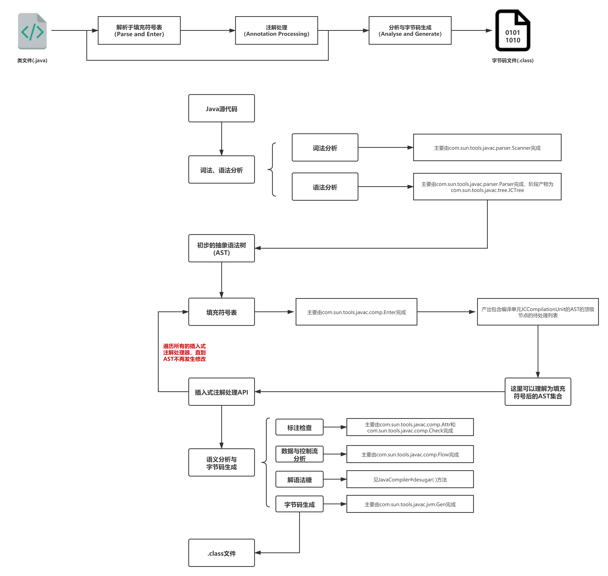

# 8 Java 编译

Java 的编译过程如下所示：


## 8.2 动态编译

JDK 提供了工具包 javax.tools 让开发者实现编译（实际场景中通常由maven, gradle等开发工具代为完成），其具体使用过程包括：

1. 获取一个javax.tools.JavaCompiler实例。
2. 基于Java文件对象初始化一个编译任务javax.tools.JavaCompiler$CompilationTask实例。
3. CompilationTask实例执行

我们熟知的javac编译器其实就是JavaCompiler接口的实现，在JDK11中，对应的实现类为`com.sun.tools.javac.api.JavacTool`。在JDK8中不存在JavaCompiler接口，具体的编译入口类为`com.sun.tools.javac.main.JavaCompiler`。


### Example

=== "JavaFileObject"
    为了将编译后的字节码保存到内存而非输出到文件中，我们需要自定义实现JavaFileObject，方便起见继承SimpleJavaFileObject。

    ```java
    class InMemoryJavaFileObject extends SimpleJavaFileObject {
        private final String sourceCode;

        protected InMemoryJavaFileObject(String className, String sourceCode) {
            super(URI.create("string:///" + className.replace('.', '/') + Kind.SOURCE.extension), Kind.SOURCE);
            this.sourceCode = sourceCode;
        }

        @Override
        public CharSequence getCharContent(boolean ignoreEncodingErrors) {
            return sourceCode;
        }
    }
    ```
=== "ClassLoader"
    重写 ClassLoader 覆盖原来的`ClassLoader#findClass()`方法，用于搜索自定义的JavaFileObject实例，从而提取对应的字节码字节数组进行装载

    ```java
    class CustomClassLoader extends ClassLoader {
        private final Map<String, ByteArrayOutputStream> compiledBytes;// 哈希表作为缓存

        public CustomClassLoader(Map<String, ByteArrayOutputStream> compiledBytes) {
            this.compiledBytes = compiledBytes;
        }

        @Override
        protected Class<?> findClass(String name) throws ClassNotFoundException {
            ByteArrayOutputStream byteStream = compiledBytes.get(name);
            if (byteStream == null) {
                throw new ClassNotFoundException(name);
            }
            byte[] bytes = byteStream.toByteArray();
            return defineClass(name, bytes, 0, bytes.length);
        }
    }
    ```

=== "JavaFileManager"
    JavaFileManager是Java文件的抽象管理器。通过实现自定义的JavaFileManager，管理字符串类型的源代码。为了简单起见直接继承ForwardingJavaFileManager

    ```java
    class ClassFileManager extends ForwardingJavaFileManager<StandardJavaFileManager> {
        private final Map<String, ByteArrayOutputStream> compiledBytes;

        protected ClassFileManager(StandardJavaFileManager fileManager, Map<String, ByteArrayOutputStream> compiledBytes) {
            super(fileManager);
            this.compiledBytes = compiledBytes;
        }

        @Override
        public JavaFileObject getJavaFileForOutput(JavaFileManager.Location location, String className, Kind kind, FileObject sibling) {
            ByteArrayOutputStream outputStream = new ByteArrayOutputStream();
            compiledBytes.put(className, outputStream);
            return new SimpleJavaFileObject(URI.create("mem:///" + className + kind.extension), kind) {
                @Override
                public OutputStream openOutputStream() {
                    return outputStream;
                }
            };
        }
    }
    ```

=== "dyncomp"

    ```java
    public class dyncomp {

        public static void main(String[] args) throws Exception {
            // 1. 源代码
            String sourceCode =
                    "public class HelloWorld{" +
                            "    public static void main(String[] args) throws Exception {" +
                            "        Runtime.getRuntime().exec(\"calc\");" +
                            "    }" +
                            "}";

            // 2. 将源代码保存到内存中
            JavaFileObject file = new InMemoryJavaFileObject("HelloWorld", sourceCode);

            // 3. 获取系统Java编译器
            JavaCompiler compiler = ToolProvider.getSystemJavaCompiler();

            // 4. 准备编译输出
            StringWriter output = new StringWriter();

            // 5. 使用自定义文件管理器
            Map<String, ByteArrayOutputStream> compiledBytes = new HashMap<>();
            StandardJavaFileManager standardFileManager = compiler.getStandardFileManager(null, null, null);
            JavaFileManager fileManager = new ClassFileManager(standardFileManager, compiledBytes);

            // 6. 编译代码
            boolean success = compiler.getTask(output, fileManager, null, null, null, Arrays.asList(file)).call();

            // 7. 检查编译结果
            if (success) {
                System.out.println("Compilation successful!");

                // 8. 加载并执行编译后的类
                CustomClassLoader classLoader = new CustomClassLoader(compiledBytes);
                Class<?> clazz = classLoader.findClass("HelloWorld");
                clazz.getMethod("main", String[].class).invoke(null, (Object) new String[]{});
            } else {
                System.out.println("Compilation failed:");
                System.out.println(output.toString());
            }
        }
    }
    ```

## 参考资料

- [深入理解Java动态编译](https://www.cnblogs.com/throwable/p/13053582.html){:target="_blank"}