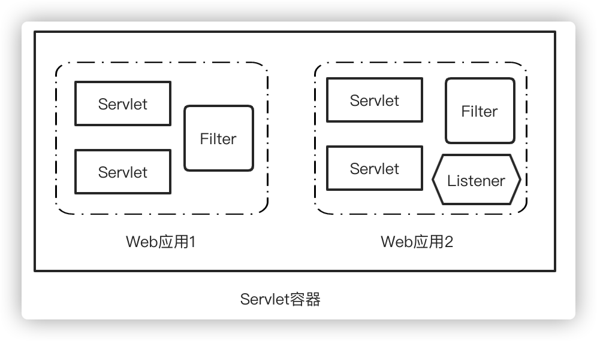

---
tags:
  - Java
  - Web Sec
comments: true
---

# Java 容器安全

由于Java反序列化漏洞带来的巨大冲击，很多我们平时常用的`Web`中间件都出现了`RCE`漏洞，如：`Weblogic`、`Jboss`、`WebSphere`等。运行在容器中的`Web应用`也因此遭受恶意攻击，容器自身的安全问题也引起了越来越多的人的关注。

## Servlet容器基础

参考[Servlet 基础](/CS/PL/Java/JavaSec/java_web/#22-servlet)

`Servlet容器`即实现了[Servlet 规范](https://javaee.github.io/servlet-spec/)的Web应用服务器，负责管理Servlet的生命周期、URL访问请求和`Servlet`映射、`Servlet`注册/卸载等。

自`Java EE 8`开始`Java EE`已更名为[Jakarta EE](https://jakarta.ee/)，所有的`Servlet容器`都必须实现该规范。常见的`Servlet容器`如下：

1. `Tomcat`/`TomEE`
2. `Jetty`
3. `Glassfish Server`
4. `Jboss`/`Undertow`/`WildFly`
5. `Resin`
6. `Weblogic Server`
7. `WebSphere Application Server`/`Liberty`
8. `TongWeb`(东方通)
9. `Apusic`(金蝶)
10. `BES Application Server`(宝兰德)
11. `InforSuite Application Server`(中创)
12. `Primeton AppServer`(普元)

**常见的安全问题**

1. 远程代码执行
2. 反序列化漏洞
3. `XSS`
4. `SSRF`，如：`Weblogic uddiexplorer`
5. 未授权访问
6. `Session`安全
7. 文件/目录解析漏洞，如：未知扩展名向左识别文件后缀、换行解析漏洞、空字符截断、编码绕过后缀、文件名解析逻辑漏洞等
8. 任意文件上传(写入)漏洞，如：`WebDAV PUT`
9. 任意文件读取，如：`Tomcat AJP`
10. 后台管理问题，如：登陆爆破、默认口令、弱口令、部署war包
11. 配置错误导致安全风险，如：目录遍历、信息泄露、CRLF注入、Nginx配置不当
12. 参数解析，如：Http参数污染
13. 拒绝服务攻击，如：由于各种机制导致的服务器响应慢导致的`DOS`、慢连接
