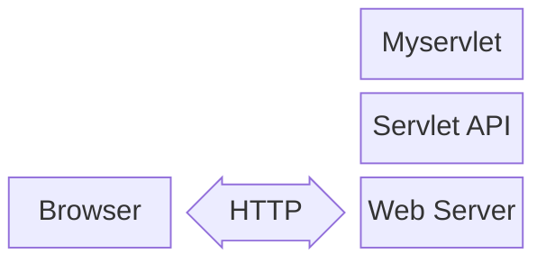
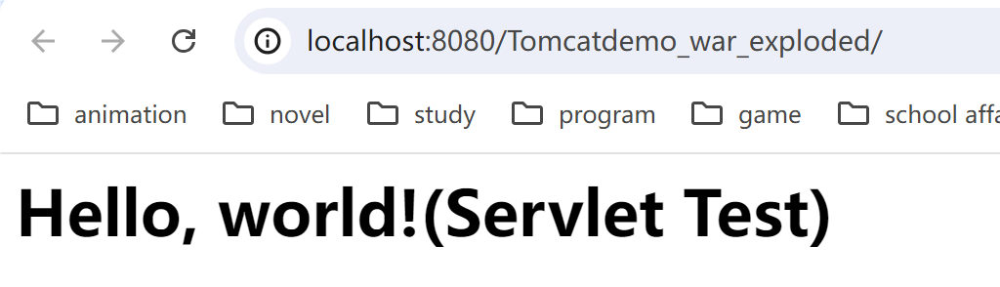

---
tags:
    - Web Sec
    - Java
comments: true
---
# 2 Java Web 基础

Java EE（Java Platform, Enterprise Edition）是一套基于 Java 编程语言的应用程序开发平台，用于开发和部署大型分布式多层架构的企业应用。Java EE 是 Java SE 的扩展，提供了一组 API 和运行时环境，用于构建、部署和管理企业级应用程序。2017 年的 9 月Oracle将`Java EE` 捐赠给 Eclipse 基金会，由于Oracle持有Java商标原因，Eclipse基金于2018年3月将`Java EE`更名为[Jakarta EE](https://jakarta.ee/)。

[Java EE Wiki](https://en.wikipedia.org/wiki/Jakarta_EE)

[Servlet Wiki](https://zh.wikipedia.org/wiki/Java_Servlet)

## 2.1 Request & Response

今天我们访问网站，使用App时，都是基于Web这种Browser/Server模式，简称BS架构，它的特点是，客户端只需要浏览器，应用程序的逻辑和数据都存储在服务器端。浏览器只需要请求服务器，获取Web页面，并把Web页面展示给用户即可。

在`B/S架构`中最重要的就是浏览器和服务器端交互，`Java EE`将其封装为`请求`和`响应对象`，即 `request(HttpServletRequest)` 和 `response(HttpServletResponse)`。

`HttpServletRequest `对象用于处理来自客户端的请求，当客户端通过HTTP协议访问服务器时，HTTP 中的所有信息都封装在这个对象中，通过`HttpServletRequest `对象可以获取到客户端请求的所有信息。

`HttpServletResponse`对象用于响应客户端的请求，通过`HttpServletResponse`对象可以处理服务器端对客户端请求响应。

### `HttpServletRequest `常用方法

| 方法                            | 说明                                       |
| ------------------------------- | ------------------------------------------ |
| getParameter(String name)       | 获取请求中的参数，该参数是由name指定的     |
| getParameterValues(String name) | 返回请求中的参数值，该参数值是由name指定的 |
| getRealPath(String path)        | 获取Web资源目录                            |
| getAttribute(String name)       | 返回name指定的属性值                       |
| getAttributeNames()             | 返回当前请求的所有属性的名字集合           |
| getCookies()                    | 返回客户端发送的Cookie                     |
| getSession()                    | 获取session回话对象                        |
| getInputStream()                | 获取请求主题的输入流                       |
| getReader()                     | 获取请求主体的数据流                       |
| getMethod()                     | 获取发送请求的方式，如GET、POST            |
| getParameterNames()             | 获取请求中所有参数的名称                   |
| getRemoteAddr()                 | 获取客户端的IP地址                         |
| getRemoteHost()                 | 获取客户端名称                             |
| getServerPath()                 | 获取请求的文件的路径                       |

### `HttpServletResponse `常用方法

| 方法                                 | 说明                                 |
| ------------------------------------ | ------------------------------------ |
| getWriter()                          | 获取响应打印流对象                   |
| getOutputStream()                    | 获取响应流对象                       |
| addCookie(Cookie cookie)             | 将指定的Cookie加入到当前的响应中     |
| addHeader(String name,String value)  | 将指定的名字和值加入到响应的头信息中 |
| sendError(int sc)                    | 使用指定状态码发送一个错误到客户端   |
| sendRedirect(String location)        | 发送一个临时的响应到客户端           |
| setDateHeader(String name,long date) | 将给出的名字和日期设置响应的头部     |
| setHeader(String name,String value)  | 将给出的名字和值设置响应的头部       |
| setStatus(int sc)                    | 给当前响应设置状态码                 |
| setContentType(String ContentType)   | 设置响应的MIME类型                   |

## 2.2 Servlet

`Servlet `是在 `Java Web`容器中运行的`小程序`,通常我们用` Servlet `来处理一些较为复杂的服务器端的业务逻辑。` Servlet `是`Java EE`的核心,也是所有的MVC框架的实现的根本。



定义 Servlet 需要继承`javax.servlet.http.HttpServlet`类并重写`doXXX`(如`doGet、doPost`)方法或者`service`方法，重写`HttpServlet`类的`service`方法可以获取到上述七种Http请求方法的请求。

**javax.servlet.http.HttpServlet**类继承于`javax.servlet.GenericServlet`，而`GenericServlet`又实现了`javax.servlet.Servlet`和`javax.servlet.ServletConfig`。

`javax.servlet.Servlet`接口中只定义了`servlet`基础生命周期方法：`init(初始化)`、`getServletConfig(配置)`、`service(服务)`、`destroy(销毁)`,而`HttpServlet`不仅实现了`servlet`的生命周期并通过封装`service`方法抽象出了`doGet/doPost/doDelete/doHead/doPut/doOptions/doTrace`方法用于处理来自客户端的不一样的请求方式，我们的Servlet只需要重写其中的请求方法或者重写`service`方法即可实现`servlet`请求处理。

??? example

    ```java
    // WebServlet注解表示这是一个Servlet，并映射到地址/:
    package cc.servlet;

    import java.io.IOException;
    import java.io.PrintWriter;

    import jakarta.servlet.ServletException;
    import jakarta.servlet.annotation.WebServlet;
    import jakarta.servlet.http.HttpServlet;
    import jakarta.servlet.http.HttpServletRequest;
    import jakarta.servlet.http.HttpServletResponse;

    @WebServlet(urlPatterns = "/")
    public class HelloServlet extends HttpServlet {

        @Override
        protected void doGet(HttpServletRequest req, HttpServletResponse resp) throws ServletException, IOException {
            resp.setContentType("text/html");
            PrintWriter pw = resp.getWriter();
            pw.write("<h1>Hello, world!(Servlet Test)</h1>");
            pw.flush();
        }
    }
    ```
    运行后访问`http://localhost:8080/`即可看到`Hello, world!(Servlet Test)`。
    {loading=“lazy”}

## 2.3 JSP基础

`JSP`(`JavaServer Pages`) 是与 `PHP`、`ASP`、`ASP.NET` 等类似的脚本语言，`JSP`是为了简化`Servlet`的处理流程而出现的替代品，早期的`Java EE`因为只能使用`Servlet`来处理客户端请求而显得非常的繁琐和不便，使用JSP可以快速的完成后端逻辑请求。

正因为在`JSP`中可以直接调用Java代码来实现后端逻辑的这一特性，黑客通常会编写带有恶意攻击的JSP文件(`JSP WebShell`)来实现对服务器资源的恶意请求和控制。

现代的MVC框架(如：`Spring MVC 5.x`)已经完全抛弃了`JSP`技术，采用了`模板引擎(如：Freemark)`或者`RESTful`的方式来实现与客户端的交互工作。

整个JSP的内容实际上是一个HTML，但是稍有不同：
- 包含在<%--和--%>之间的是JSP的注释，它们会被完全忽略；
- 包含在<%和%>之间的是Java代码，可以编写任意Java代码；
- <%= xxx %>可以快捷输出一个变量的值。

JSP内置了几个变量：

| 变量名      | 类型                | 作用                                        |
| ----------- | ------------------- | ------------------------------------------- |
| pageContext | PageContext         | 当前页面共享数据，还可以获取其他8个内置对象 |
| request     | HttpServletRequest  | 客户端请求对象，包含了所有客户端请求信息    |
| session     | HttpSession         | 请求会话                                    |
| application | ServletContext      | 全局对象，所有用户间共享数据                |
| response    | HttpServletResponse | 响应对象，主要用于服务器端设置响应信息      |
| page        | Object              | 当前Servlet对象,`this`                      |
| out         | JspWriter           | 输出对象，数据输出到页面上                  |
| config      | ServletConfig       | Servlet的配置对象                           |
| exception   | Throwable           | 异常对象                                    |

JSP本质上就是一个Servlet，只不过无需配置映射路径，Web Server会根据路径查找对应的.jsp文件，如果找到了，就自动编译成Servlet再执行。在服务器运行过程中，如果修改了JSP的内容，那么服务器会自动重新编译。

### JSP 高级功能

1. `<%@ page ... %>`   定义网页依赖属性，比如脚本语言、error页面、缓存需求等等，也可以引入Java类
2. `<%@ include ... %>`  包含其他文件（静态包含）
3. `<%@ taglib prefix="c" uri="http://java.sun.com/jsp/jstl/core" %>` 引入标签库的定义

## 2.4 Filter

JavaEE的Servlet规范提供了Filter组件，即过滤器，它的作用是，在HTTP请求到达Servlet之前，可以被一个或多个Filter预处理，类似打印日志、登录检查等逻辑。

???+ example 

    ```java
    @WebFilter("/user/*")
    public class AuthFilter implements Filter {
        public void doFilter(ServletRequest request, ServletResponse response, FilterChain chain)
                throws IOException, ServletException {
            System.out.println("AuthFilter: check authentication");
            HttpServletRequest req = (HttpServletRequest) request;
            HttpServletResponse resp = (HttpServletResponse) response;
            if (req.getSession().getAttribute("user") == null) {
                // 未登录，自动跳转到登录页:
                System.out.println("AuthFilter: not signin!");
                resp.sendRedirect("/signin");
            } else {
                // 已登录，继续处理:
                chain.doFilter(request, response);
            }
        }
    }
    ```

Servlet规范并没有对@WebFilter注解标注的Filter规定顺序。如果一定要给每个Filter指定顺序，就必须在web.xml文件中对这些Filter进行配置

## 2.5 Cookie 和 Session 对象


为了跟踪用户状态，服务器可以向浏览器分配一个唯一ID，并以`Cookie`的形式发送到浏览器，浏览器在后续访问时总是附带此`Cookie`，这样，服务器就可以识别用户身份。`Cookie` 是最常用的Http会话跟踪机制，且所有`Servlet容器`都应该支持。当客户端不接受`Cookie`时，服务端可使用`URL重写`的方式作为会话跟踪方式。`Session ID`必须被编码为URL字符串中的一个路径参数，参数的名字必须是 `jsessionid`。

浏览器和服务端创建会话(`Session`)后，服务端将生成一个唯一的会话ID(`sessionid`)用于标识用户身份，然后会将这个会话ID通过`Cookie`的形式返回给浏览器，浏览器接受到`Cookie`后会在每次请求后端服务的时候带上服务端设置`Cookie`值，服务端通过读取浏览器的`Cookie`信息就可以获取到用于标识用户身份的会话ID，从而实现会话跟踪和用户身份识别。

因为`Cookie`中存储了用户身份信息，并且还存储于浏览器端，攻击者可以使用`XSS`漏洞获取到`Cookie`信息并盗取用户身份就行一些恶意的操作。

除了使用Cookie机制可以实现Session外，还可以通过隐藏表单、URL末尾附加ID来追踪Session。这些机制很少使用，最常用的Session机制仍然是Cookie。

