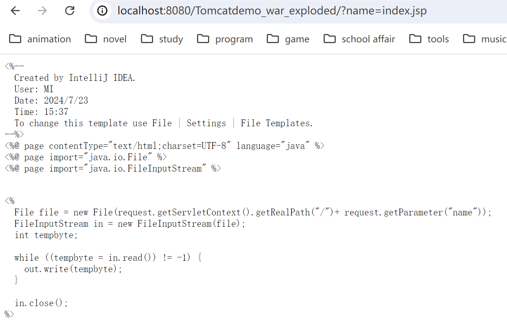
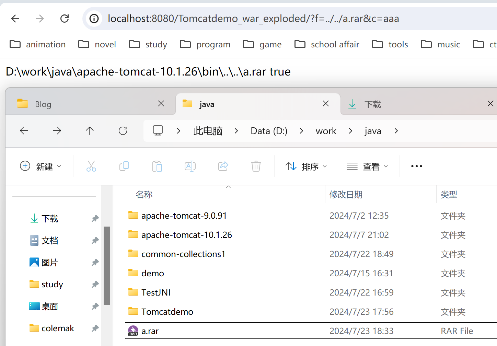
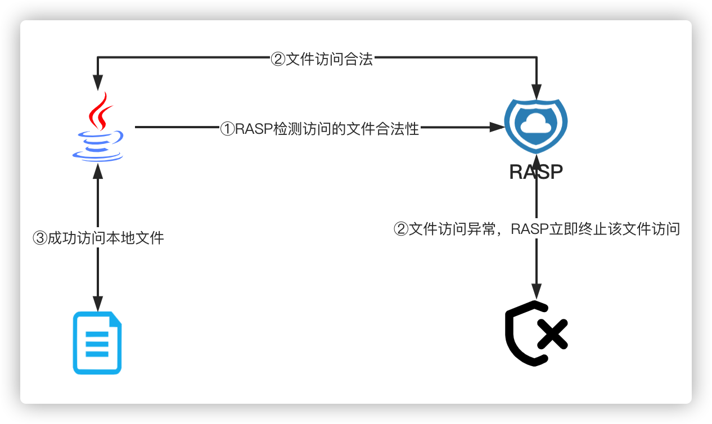

---
tags:
    - Web Sec
    - Java
comments: true
---
# 3 Java Web 常见漏洞
## 3.1 文件访问类漏洞

常见的Java文件操作相关的漏洞大致有如下类型：

1. 任意目录遍历
2. 任意文件、目录复制
3. 任意文件读取/下载
4. 任意文件、目录修改/重命名
5. 任意文件、目录删除
6. ......

产生这些漏洞的原因都是因为程序对文件或目录访问控制不严、程序内部逻辑错误导致的任意文件或目录恶意访问漏洞。

任意文件读写漏洞即因为没有验证请求的资源文件是否合法导致的，此类漏洞在Java中有着较高的几率出现，任意文件读取漏洞原理很简单，但一些知名的中间件：`Weblogic`、`Tomcat`、`Resin`又或者是主流MVC框架:`Spring MVC`、`Struts2`都存在此类漏洞。

### 任意文件读取

???+ example "存在恶意文件读取漏洞代码"

    ```jsp
    <%@ page contentType="text/html;charset=UTF-8" language="java" %>
    <%@ page import="java.io.File" %>
    <%@ page import="java.io.FileInputStream" %>

    <pre>
    <%
    File file = new File(request.getServletContext().getRealPath("/")+ request.getParameter("name"));
    FileInputStream in = new FileInputStream(file);
    int tempbyte;

    while ((tempbyte = in.read()) != -1) {
        out.write(tempbyte);
    }

    in.close();
    %>
    </pre>
    ```

输入`http://localhost:8080/?name=index.jsp`即可读取`index.jsp`文件内容。
{loading=lazy width=80%}  

若网站未对目录访问进行限制，攻击者可以通过路径穿越实现任意文件读取，例如`http://localhost:8080/?name=../../../../../etc/passwd`读取`/etc/passwd`文件内容。

### 任意文件写

???+ example

    ```jsp
    <%@ page contentType="text/html;charset=UTF-8" language="java" %>
    <%@ page import="java.io.File" %>
    <%@ page import="java.io.FileOutputStream" %>

    <%
        File file = new File(request.getParameter("f"));
        FileOutputStream fos = new FileOutputStream(file);
        fos.write(request.getParameter("c").getBytes());
        fos.flush();
        fos.close();

        out.println(file.getAbsoluteFile() + "\t" + file.exists());
    %>
    ```

输入`http://localhost:8080/Tomcatdemo_war_exploded/?f=../../a.rar&c=aaa`即可通过路径穿越实现任意文件写入
{loading=lazy width=80%}

其他目录遍历、重命名等漏洞同理

### 任意文件/目录访问漏洞修复

#### 限制读取目录或文件

在读取文件或者目录时严格控制用户传入参数，禁止或限制用户传入文件路径。

???+ example

    ```jsp
    <%@ page import="java.io.File" %>
    <%@ page contentType="text/html;charset=UTF-8" language="java" %>
    <%!
        // 定义限制用户遍历的文件目录常量
        private static final String IMAGE_DIR = "/data/images/";
    %>
    <%
        // 定义需要遍历的目录
        String dirStr = request.getParameter("dir");

        if (dirStr != null) {
            File dir = new File(dirStr);

            // 获取文件绝对路径，转换成标准的文件路径
            String fileDir = (dir.getAbsoluteFile().getCanonicalFile() + "/").replace("\\\\", "/").replaceAll("/+", "/");
            out.println("<h3>" + fileDir + "</h3>");
            // 检查当前用户传入的目录是否包含在系统限定的目录下
            if (fileDir.startsWith(IMAGE_DIR)) {
                File[] dirs = dir.listFiles();
                out.println("<pre>");
                for (File file : dirs) {
                    out.println(file.getName());
                }
                out.println("</pre>");
            } else {
                out.println("目录不合法!");
            }
        }

    %>
    ```

#### RASP防御恶意文件访问攻击

RASP可以使用Agent机制实现Hook任意的Java类API，因此可以轻易的捕获到Java程序读取的任意文件路径。RASP可以将Hook到的文件路径和Http请求的参数进行关联分析，检测Java读取的文件路径是否会受到Http请求参数的控制，如果发现请求参数最终拼接到了文件路径中应当立即阻断文件访问行为，并记录攻击日志。

**RASP防御思路：**
{loading=lazy width=80%}

具体规则例如：

<div class="annotate" markdown>

1. 禁止文件名空字节访问（防止截断绕过）
2. 禁止写入动态脚本文件（后缀名jsp、php、aspx等）
3. 文件名和请求参数关联分析 (1)
4. 文件名检测规则和黑名单 (禁止例如`/etc/passwd`等文件访问)

</div>

1. 如传入的某个参数最终和Hook到的文件路径完全一致，那么应当立即禁止文件访问请求，因为即便用户请求的不是恶意文件也肯定是一个存在任意文件读取漏洞的业务功能。

### Java 恶意文件访问审计建议

在审计文件读取功能的时候要非常仔细，或许很容易就会有意想不到的收获！快速发现这类漏洞得方式其实也是非常简单的，在IDEA中的项目中重点搜下如下文件读取的类。

1. **JDK原始的`java.io.FileInputStream`、`java.io.FileOutputStream`类**；
2. **JDK原始的`java.io.RandomAccessFile`类**；
3. **Apache Commons IO提供的`org.apache.commons.io.FileUtils`类**；
4. JDK1.7新增的基于NIO非阻塞异步读取文件的`java.nio.channels.AsynchronousFileChannel`类；
5. JDK1.7新增的基于NIO读取文件的`java.nio.file.Files`类。常用方法如:`Files.readAllBytes`、`Files.readAllLines`；
6. `java.io.File`类的`list`、`listFiles`、`listRoots`、`delete`方法；

除此之外，还可以搜索一下`FileUtil/FileUtils`很有可能用户会封装文件操作的工具类。

## 3.2 任意文件上传漏洞

### Apache commons fileupload文件上传

Apache commons-fileupload 是一个非常常用的文件上传解析库，Spring MVC、Struts2、Tomcat等底层处理文件上传请求均使用了它。

??? note "code"

    ```java
    <%@ page contentType="text/html;charset=UTF-8" language="java" %>
    <%@ page import="org.apache.commons.fileupload.FileItemIterator" %>
    <%@ page import="org.apache.commons.fileupload.FileItemStream" %>
    <%@ page import="org.apache.commons.fileupload.servlet.ServletFileUpload" %>
    <%@ page import="org.apache.commons.fileupload.util.Streams" %>
    <%@ page import="java.io.File" %>
    <%@ page import="java.io.FileOutputStream" %>
    <%
        if (ServletFileUpload.isMultipartContent(request)) {
            ServletFileUpload fileUpload       = new ServletFileUpload();
            FileItemIterator  fileItemIterator = fileUpload.getItemIterator(request);

            String dir       = request.getServletContext().getRealPath("/uploads/");
            File   uploadDir = new File(dir);

            if (!uploadDir.exists()) {
                uploadDir.mkdir();
            }

            while (fileItemIterator.hasNext()) {
                FileItemStream fileItemStream = fileItemIterator.next();
                String         fieldName      = fileItemStream.getFieldName();// 字段名称

                if (fileItemStream.isFormField()) {
                    String fieldValue = Streams.asString(fileItemStream.openStream());// 字段值
                    out.println(fieldName + "=" + fieldValue);
                } else {
                    String fileName   = fileItemStream.getName();
                    File   uploadFile = new File(uploadDir, fileName);
                    out.println(fieldName + "=" + fileName);
                    FileOutputStream fos = new FileOutputStream(uploadFile);

                    // 写文件
                    Streams.copy(fileItemStream.openStream(), fos, true);

                    out.println("文件上传成功:" + uploadFile.getAbsolutePath());
                }
            }
        } else {
    %>
    <!DOCTYPE html>
    <html lang="en">
    <head>
        <meta charset="UTF-8">
        <title>File upload</title>
    </head>
    <body>
    <form action="" enctype="multipart/form-data" method="post">
        <p>
            用户名: <input name="username" type="text"/>
            文件: <input id="file" name="file" type="file"/>
        </p>
        <input name="submit" type="submit" value="Submit"/>
    </form>
    </body>
    </html>
    <%
        }
    %>
    ```

### Servlet 内置文件上传解析

Servlet3.0 新增了对文件上传请求解析的支持，javax.servlet.http.HttpServletRequest#getParts，使用request.getParts();即可获取文件上传包解析后的结果。

**JSP multipart-config**:

JSP使用request.getParts();必须配置multipart-config，否则请求时会报错：`Unable to process parts as no multi-part configuration has been provided`（由于没有提供multi-part配置，无法处理parts）。

??? example

    ```xml
    <?xml version="1.0" encoding="UTF-8"?>
    <web-app xmlns:xsi="http://www.w3.org/2001/XMLSchema-instance" version="3.0"
            xmlns="http://java.sun.com/xml/ns/javaee"
            xsi:schemaLocation="http://java.sun.com/xml/ns/javaee http://java.sun.com/xml/ns/javaee/web-app_3_0.xsd">

    <servlet>
            <servlet-name>file-upload-parts.jsp</servlet-name>
            <jsp-file>/modules/servlet/fileupload/file-upload-parts.jsp</jsp-file>
            <multipart-config>
                <max-file-size>1000000</max-file-size>
                <max-request-size>1000000</max-request-size>
                <file-size-threshold>1000000</file-size-threshold>
            </multipart-config>
        </servlet>

        <servlet-mapping>
            <servlet-name>file-upload-parts.jsp</servlet-name>
            <url-pattern>/modules/servlet/fileupload/file-upload-parts.jsp</url-pattern>
        </servlet-mapping>

    </web-app>
    ```

**Servlet @MultipartConfig**

Servlet3.0 需要配置@MultipartConfig注解才能支持multipart解析

??? example

    ```java
    import org.apache.commons.io.FileUtils;
    import org.apache.commons.io.IOUtils;

    import javax.servlet.ServletException;
    import javax.servlet.annotation.MultipartConfig;
    import javax.servlet.annotation.WebServlet;
    import javax.servlet.http.HttpServlet;
    import javax.servlet.http.HttpServletRequest;
    import javax.servlet.http.HttpServletResponse;
    import javax.servlet.http.Part;
    import java.io.File;
    import java.io.IOException;
    import java.io.PrintWriter;
    import java.util.Collection;

    @MultipartConfig
    @WebServlet(urlPatterns = "/FileUploadServlet")
    public class FileUploadServlet extends HttpServlet {

        @Override
        protected void doGet(HttpServletRequest req, HttpServletResponse resp) throws IOException {
            PrintWriter out = resp.getWriter();

            out.println("<!DOCTYPE html>\n" +
                    "<html lang=\"zh\">\n" +
                    "<head>\n" +
                    "    <meta charset=\"UTF-8\">\n" +
                    "    <title>File upload</title>\n" +
                    "</head>\n" +
                    "<body>\n" +
                    "<form action=\"\" enctype=\"multipart/form-data\" method=\"post\">\n" +
                    "    <p>\n" +
                    "        用户名: <input name=\"username\" type=\"text\"/>\n" +
                    "        文件: <input id=\"file\" name=\"file\" type=\"file\"/>\n" +
                    "    </p>\n" +
                    "    <input name=\"submit\" type=\"submit\" value=\"Submit\"/>\n" +
                    "</form>\n" +
                    "</body>\n" +
                    "</html>");

            out.flush();
            out.close();
        }

        @Override
        protected void doPost(HttpServletRequest request, HttpServletResponse response) throws ServletException, IOException {
            PrintWriter out         = response.getWriter();
            String      contentType = request.getContentType();

            // 检测是否是multipart请求
            if (contentType != null && contentType.startsWith("multipart/")) {
                String dir       = request.getSession().getServletContext().getRealPath("/uploads/");
                File   uploadDir = new File(dir);

                if (!uploadDir.exists()) {
                    uploadDir.mkdir();
                }

                Collection<Part> parts = request.getParts();

                for (Part part : parts) {
                    String fileName = part.getSubmittedFileName();

                    if (fileName != null) {
                        File uploadFile = new File(uploadDir, fileName);
                        out.println(part.getName() + ": " + uploadFile.getAbsolutePath());

                        FileUtils.write(uploadFile, IOUtils.toString(part.getInputStream(), "UTF-8"));
                    } else {
                        out.println(part.getName() + ": " + IOUtils.toString(part.getInputStream()));
                    }
                }
            }

            out.flush();
            out.close();
        }

    }
    ```

## 3.3 Spring MVC文件上传

Spring MVC会自动解析multipart/form-data请求，将multipart中的对象封装到MultipartRequest对象中，所以在Controller中使用`@RequestParam`注解就可以映射multipart中的对象了，如：`@RequestParam("file") MultipartFile file。`

??? example

    ```java
    import org.javaweb.utils.FileUtils;
    import org.javaweb.utils.HttpServletResponseUtils;
    import org.springframework.stereotype.Controller;
    import org.springframework.web.bind.annotation.RequestMapping;
    import org.springframework.web.bind.annotation.RequestParam;
    import org.springframework.web.bind.annotation.ResponseBody;
    import org.springframework.web.multipart.MultipartFile;

    import javax.servlet.http.HttpServletRequest;
    import javax.servlet.http.HttpServletResponse;
    import java.io.File;
    import java.io.IOException;
    import java.util.LinkedHashMap;
    import java.util.Map;

    import static org.javaweb.utils.HttpServletRequestUtils.getDocumentRoot;

    @Controller
    @RequestMapping("/FileUpload/")
    public class FileUploadController {

        @RequestMapping("/upload.php")
        public void uploadPage(HttpServletResponse response) {
            HttpServletResponseUtils.responseHTML(response, "<!DOCTYPE html>\n" +
                    "<html lang=\"en\">\n" +
                    "<head>\n" +
                    "    <meta charset=\"UTF-8\">\n" +
                    "    <title>File upload</title>\n" +
                    "</head>\n" +
                    "<body>\n" +
                    "<form action=\"/FileUpload/upload.do\" enctype=\"multipart/form-data\" method=\"post\">\n" +
                    "    <p>\n" +
                    "        用户名: <input name=\"username\" type=\"text\"/>\n" +
                    "        文件: <input id=\"file\" name=\"file\" type=\"file\"/>\n" +
                    "    </p>\n" +
                    "    <input name=\"submit\" type=\"submit\" value=\"Submit\"/>\n" +
                    "</form>\n" +
                    "</body>\n" +
                    "</html>");
        }

        @ResponseBody
        @RequestMapping("/upload.do")
        public Map<String, Object> upload(String username, @RequestParam("file") MultipartFile file, HttpServletRequest request) {
            // 文件名称
            String filePath   = "uploads/" + username + "/" + file.getOriginalFilename();
            File   uploadFile = new File(getDocumentRoot(request), filePath);

            // 上传目录
            File uploadDir = uploadFile.getParentFile();

            // 上传文件对象
            Map<String, Object> jsonMap = new LinkedHashMap<String, Object>();

            if (!uploadDir.exists()) {
                uploadDir.mkdirs();
            }

            try {
                FileUtils.copyInputStreamToFile(file.getInputStream(), uploadFile);

                jsonMap.put("url", filePath);
                jsonMap.put("msg", "上传成功!");
            } catch (IOException e) {
                jsonMap.put("msg", "上传失败，服务器异常!");
            }

            return jsonMap;
        }

    }
    ```

## 3.4 文件上传 - 编码特性