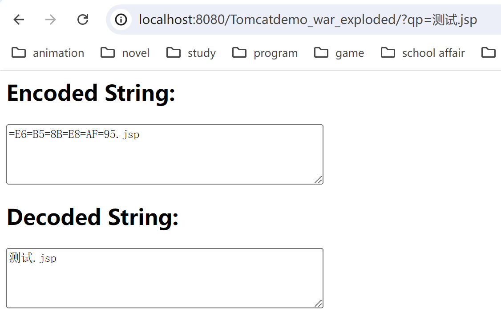
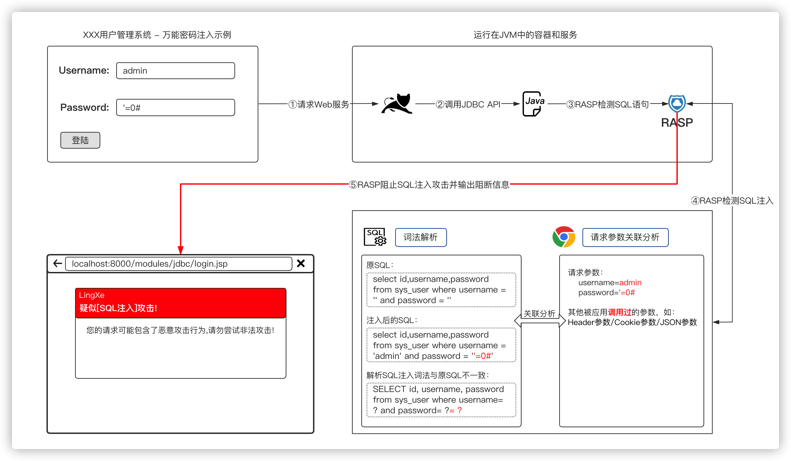
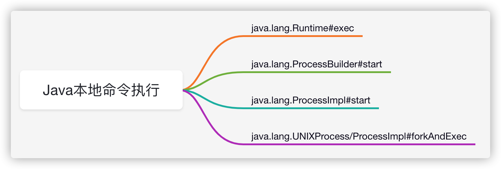

---
tags:
    - Web Sec
    - Java
comments: true
---
# 3 Java Web 常见漏洞
## 3.1 文件访问类漏洞

常见的Java文件操作相关的漏洞大致有如下类型：

1. 任意目录遍历
2. 任意文件、目录复制
3. 任意文件读取/下载
4. 任意文件、目录修改/重命名
5. 任意文件、目录删除
6. ......

产生这些漏洞的原因都是因为程序对文件或目录访问控制不严、程序内部逻辑错误导致的任意文件或目录恶意访问漏洞。

任意文件读写漏洞即因为没有验证请求的资源文件是否合法导致的，此类漏洞在Java中有着较高的几率出现，任意文件读取漏洞原理很简单，但一些知名的中间件：`Weblogic`、`Tomcat`、`Resin`又或者是主流MVC框架:`Spring MVC`、`Struts2`都存在此类漏洞。

### 任意文件读取

???+ example "存在恶意文件读取漏洞代码"

    ```jsp
    <%@ page contentType="text/html;charset=UTF-8" language="java" %>
    <%@ page import="java.io.File" %>
    <%@ page import="java.io.FileInputStream" %>

    <pre>
    <%
    File file = new File(request.getServletContext().getRealPath("/")+ request.getParameter("name"));
    FileInputStream in = new FileInputStream(file);
    int tempbyte;

    while ((tempbyte = in.read()) != -1) {
        out.write(tempbyte);
    }

    in.close();
    %>
    </pre>
    ```

输入`http://localhost:8080/?name=index.jsp`即可读取`index.jsp`文件内容。
{loading=lazy width=80%}  

若网站未对目录访问进行限制，攻击者可以通过路径穿越实现任意文件读取，例如`http://localhost:8080/?name=../../../../../etc/passwd`读取`/etc/passwd`文件内容。

### 任意文件写

???+ example

    ```jsp
    <%@ page contentType="text/html;charset=UTF-8" language="java" %>
    <%@ page import="java.io.File" %>
    <%@ page import="java.io.FileOutputStream" %>

    <%
        File file = new File(request.getParameter("f"));
        FileOutputStream fos = new FileOutputStream(file);
        fos.write(request.getParameter("c").getBytes());
        fos.flush();
        fos.close();

        out.println(file.getAbsoluteFile() + "\t" + file.exists());
    %>
    ```

输入`http://localhost:8080/Tomcatdemo_war_exploded/?f=../../a.rar&c=aaa`即可通过路径穿越实现任意文件写入
{loading=lazy width=80%}

其他目录遍历、重命名等漏洞同理

### 任意文件/目录访问漏洞修复

#### 限制读取目录或文件

在读取文件或者目录时严格控制用户传入参数，禁止或限制用户传入文件路径。

???+ example

    ```jsp
    <%@ page import="java.io.File" %>
    <%@ page contentType="text/html;charset=UTF-8" language="java" %>
    <%!
        // 定义限制用户遍历的文件目录常量
        private static final String IMAGE_DIR = "/data/images/";
    %>
    <%
        // 定义需要遍历的目录
        String dirStr = request.getParameter("dir");

        if (dirStr != null) {
            File dir = new File(dirStr);

            // 获取文件绝对路径，转换成标准的文件路径
            String fileDir = (dir.getAbsoluteFile().getCanonicalFile() + "/").replace("\\\\", "/").replaceAll("/+", "/");
            out.println("<h3>" + fileDir + "</h3>");
            // 检查当前用户传入的目录是否包含在系统限定的目录下
            if (fileDir.startsWith(IMAGE_DIR)) {
                File[] dirs = dir.listFiles();
                out.println("<pre>");
                for (File file : dirs) {
                    out.println(file.getName());
                }
                out.println("</pre>");
            } else {
                out.println("目录不合法!");
            }
        }

    %>
    ```

#### RASP防御恶意文件访问攻击

RASP可以使用Agent机制实现Hook任意的Java类API，因此可以轻易的捕获到Java程序读取的任意文件路径。RASP可以将Hook到的文件路径和Http请求的参数进行关联分析，检测Java读取的文件路径是否会受到Http请求参数的控制，如果发现请求参数最终拼接到了文件路径中应当立即阻断文件访问行为，并记录攻击日志。

**RASP防御思路：**

{loading=lazy width=80%}

具体规则例如：

<div class="annotate" markdown>

1. 禁止文件名空字节访问（防止截断绕过）
2. 禁止写入动态脚本文件（后缀名jsp、php、aspx等）
3. 文件名和请求参数关联分析 (1)
4. 文件名检测规则和黑名单 (禁止例如`/etc/passwd`等文件访问)

</div>

1. 如传入的某个参数最终和Hook到的文件路径完全一致，那么应当立即禁止文件访问请求，因为即便用户请求的不是恶意文件也肯定是一个存在任意文件读取漏洞的业务功能。

### Java 恶意文件访问审计建议

在审计文件读取功能的时候要非常仔细，或许很容易就会有意想不到的收获！快速发现这类漏洞得方式其实也是非常简单的，在IDEA中的项目中重点搜下如下文件读取的类。

1. **JDK原始的`java.io.FileInputStream`、`java.io.FileOutputStream`类**；
2. **JDK原始的`java.io.RandomAccessFile`类**；
3. **Apache Commons IO提供的`org.apache.commons.io.FileUtils`类**；
4. JDK1.7新增的基于NIO非阻塞异步读取文件的`java.nio.channels.AsynchronousFileChannel`类；
5. JDK1.7新增的基于NIO读取文件的`java.nio.file.Files`类。常用方法如:`Files.readAllBytes`、`Files.readAllLines`；
6. `java.io.File`类的`list`、`listFiles`、`listRoots`、`delete`方法；

除此之外，还可以搜索一下`FileUtil/FileUtils`很有可能用户会封装文件操作的工具类。

## 3.2 任意文件上传漏洞

### Apache commons fileupload文件上传

Apache commons-fileupload 是一个非常常用的文件上传解析库，Spring MVC、Struts2、Tomcat等底层处理文件上传请求均使用了它。

??? note "code"

    ```java
    <%@ page contentType="text/html;charset=UTF-8" language="java" %>
    <%@ page import="org.apache.commons.fileupload.FileItemIterator" %>
    <%@ page import="org.apache.commons.fileupload.FileItemStream" %>
    <%@ page import="org.apache.commons.fileupload.servlet.ServletFileUpload" %>
    <%@ page import="org.apache.commons.fileupload.util.Streams" %>
    <%@ page import="java.io.File" %>
    <%@ page import="java.io.FileOutputStream" %>
    <%
        if (ServletFileUpload.isMultipartContent(request)) {
            ServletFileUpload fileUpload       = new ServletFileUpload();
            FileItemIterator  fileItemIterator = fileUpload.getItemIterator(request);

            String dir       = request.getServletContext().getRealPath("/uploads/");
            File   uploadDir = new File(dir);

            if (!uploadDir.exists()) {
                uploadDir.mkdir();
            }

            while (fileItemIterator.hasNext()) {
                FileItemStream fileItemStream = fileItemIterator.next();
                String         fieldName      = fileItemStream.getFieldName();// 字段名称

                if (fileItemStream.isFormField()) {
                    String fieldValue = Streams.asString(fileItemStream.openStream());// 字段值
                    out.println(fieldName + "=" + fieldValue);
                } else {
                    String fileName   = fileItemStream.getName();
                    File   uploadFile = new File(uploadDir, fileName);
                    out.println(fieldName + "=" + fileName);
                    FileOutputStream fos = new FileOutputStream(uploadFile);

                    // 写文件
                    Streams.copy(fileItemStream.openStream(), fos, true);

                    out.println("文件上传成功:" + uploadFile.getAbsolutePath());
                }
            }
        } else {
    %>
    <!DOCTYPE html>
    <html lang="en">
    <head>
        <meta charset="UTF-8">
        <title>File upload</title>
    </head>
    <body>
    <form action="" enctype="multipart/form-data" method="post">
        <p>
            用户名: <input name="username" type="text"/>
            文件: <input id="file" name="file" type="file"/>
        </p>
        <input name="submit" type="submit" value="Submit"/>
    </form>
    </body>
    </html>
    <%
        }
    %>
    ```

### Servlet 内置文件上传解析

Servlet3.0 新增了对文件上传请求解析的支持，javax.servlet.http.HttpServletRequest#getParts，使用request.getParts();即可获取文件上传包解析后的结果。

**JSP multipart-config**:

JSP使用request.getParts();必须配置multipart-config，否则请求时会报错：`Unable to process parts as no multi-part configuration has been provided`（由于没有提供multi-part配置，无法处理parts）。

??? example

    ```xml
    <?xml version="1.0" encoding="UTF-8"?>
    <web-app xmlns:xsi="http://www.w3.org/2001/XMLSchema-instance" version="3.0"
            xmlns="http://java.sun.com/xml/ns/javaee"
            xsi:schemaLocation="http://java.sun.com/xml/ns/javaee http://java.sun.com/xml/ns/javaee/web-app_3_0.xsd">

    <servlet>
            <servlet-name>file-upload-parts.jsp</servlet-name>
            <jsp-file>/modules/servlet/fileupload/file-upload-parts.jsp</jsp-file>
            <multipart-config>
                <max-file-size>1000000</max-file-size>
                <max-request-size>1000000</max-request-size>
                <file-size-threshold>1000000</file-size-threshold>
            </multipart-config>
        </servlet>

        <servlet-mapping>
            <servlet-name>file-upload-parts.jsp</servlet-name>
            <url-pattern>/modules/servlet/fileupload/file-upload-parts.jsp</url-pattern>
        </servlet-mapping>

    </web-app>
    ```

**Servlet @MultipartConfig**

Servlet3.0 需要配置@MultipartConfig注解才能支持multipart解析

??? example

    ```java
    import org.apache.commons.io.FileUtils;
    import org.apache.commons.io.IOUtils;

    import javax.servlet.ServletException;
    import javax.servlet.annotation.MultipartConfig;
    import javax.servlet.annotation.WebServlet;
    import javax.servlet.http.HttpServlet;
    import javax.servlet.http.HttpServletRequest;
    import javax.servlet.http.HttpServletResponse;
    import javax.servlet.http.Part;
    import java.io.File;
    import java.io.IOException;
    import java.io.PrintWriter;
    import java.util.Collection;

    @MultipartConfig
    @WebServlet(urlPatterns = "/FileUploadServlet")
    public class FileUploadServlet extends HttpServlet {

        @Override
        protected void doGet(HttpServletRequest req, HttpServletResponse resp) throws IOException {
            PrintWriter out = resp.getWriter();

            out.println("<!DOCTYPE html>\n" +
                    "<html lang=\"zh\">\n" +
                    "<head>\n" +
                    "    <meta charset=\"UTF-8\">\n" +
                    "    <title>File upload</title>\n" +
                    "</head>\n" +
                    "<body>\n" +
                    "<form action=\"\" enctype=\"multipart/form-data\" method=\"post\">\n" +
                    "    <p>\n" +
                    "        用户名: <input name=\"username\" type=\"text\"/>\n" +
                    "        文件: <input id=\"file\" name=\"file\" type=\"file\"/>\n" +
                    "    </p>\n" +
                    "    <input name=\"submit\" type=\"submit\" value=\"Submit\"/>\n" +
                    "</form>\n" +
                    "</body>\n" +
                    "</html>");

            out.flush();
            out.close();
        }

        @Override
        protected void doPost(HttpServletRequest request, HttpServletResponse response) throws ServletException, IOException {
            PrintWriter out         = response.getWriter();
            String      contentType = request.getContentType();

            // 检测是否是multipart请求
            if (contentType != null && contentType.startsWith("multipart/")) {
                String dir       = request.getSession().getServletContext().getRealPath("/uploads/");
                File   uploadDir = new File(dir);

                if (!uploadDir.exists()) {
                    uploadDir.mkdir();
                }

                Collection<Part> parts = request.getParts();

                for (Part part : parts) {
                    String fileName = part.getSubmittedFileName();

                    if (fileName != null) {
                        File uploadFile = new File(uploadDir, fileName);
                        out.println(part.getName() + ": " + uploadFile.getAbsolutePath());

                        FileUtils.write(uploadFile, IOUtils.toString(part.getInputStream(), "UTF-8"));
                    } else {
                        out.println(part.getName() + ": " + IOUtils.toString(part.getInputStream()));
                    }
                }
            }

            out.flush();
            out.close();
        }

    }
    ```

### Spring MVC文件上传

Spring MVC会自动解析multipart/form-data请求，将multipart中的对象封装到MultipartRequest对象中，所以在Controller中使用`@RequestParam`注解就可以映射multipart中的对象了，如：`@RequestParam("file") MultipartFile file。`

??? example

    ```java
    import org.javaweb.utils.FileUtils;
    import org.javaweb.utils.HttpServletResponseUtils;
    import org.springframework.stereotype.Controller;
    import org.springframework.web.bind.annotation.RequestMapping;
    import org.springframework.web.bind.annotation.RequestParam;
    import org.springframework.web.bind.annotation.ResponseBody;
    import org.springframework.web.multipart.MultipartFile;

    import javax.servlet.http.HttpServletRequest;
    import javax.servlet.http.HttpServletResponse;
    import java.io.File;
    import java.io.IOException;
    import java.util.LinkedHashMap;
    import java.util.Map;

    import static org.javaweb.utils.HttpServletRequestUtils.getDocumentRoot;

    @Controller
    @RequestMapping("/FileUpload/")
    public class FileUploadController {

        @RequestMapping("/upload.php")
        public void uploadPage(HttpServletResponse response) {
            HttpServletResponseUtils.responseHTML(response, "<!DOCTYPE html>\n" +
                    "<html lang=\"en\">\n" +
                    "<head>\n" +
                    "    <meta charset=\"UTF-8\">\n" +
                    "    <title>File upload</title>\n" +
                    "</head>\n" +
                    "<body>\n" +
                    "<form action=\"/FileUpload/upload.do\" enctype=\"multipart/form-data\" method=\"post\">\n" +
                    "    <p>\n" +
                    "        用户名: <input name=\"username\" type=\"text\"/>\n" +
                    "        文件: <input id=\"file\" name=\"file\" type=\"file\"/>\n" +
                    "    </p>\n" +
                    "    <input name=\"submit\" type=\"submit\" value=\"Submit\"/>\n" +
                    "</form>\n" +
                    "</body>\n" +
                    "</html>");
        }

        @ResponseBody
        @RequestMapping("/upload.do")
        public Map<String, Object> upload(String username, @RequestParam("file") MultipartFile file, HttpServletRequest request) {
            // 文件名称
            String filePath   = "uploads/" + username + "/" + file.getOriginalFilename();
            File   uploadFile = new File(getDocumentRoot(request), filePath);

            // 上传目录
            File uploadDir = uploadFile.getParentFile();

            // 上传文件对象
            Map<String, Object> jsonMap = new LinkedHashMap<String, Object>();

            if (!uploadDir.exists()) {
                uploadDir.mkdirs();
            }

            try {
                FileUtils.copyInputStreamToFile(file.getInputStream(), uploadFile);

                jsonMap.put("url", filePath);
                jsonMap.put("msg", "上传成功!");
            } catch (IOException e) {
                jsonMap.put("msg", "上传失败，服务器异常!");
            }

            return jsonMap;
        }

    }
    ```

### 文件上传 - 编码特性

#### QP 编码

[QP编码](https://zh.wikipedia.org/wiki/Quoted-printable){target=_blank}（ `quoted-printable`）是邮件协议中的一种内容编码方式，`Quoted-printable`是使用可打印的ASCII字符（如字母、数字与“=”）表示各种编码格式下的字符，以便能在7-bit数据通路上传输8-bit数据, 或者更一般地说在非8-bit clean媒体上正确处理数据，这被定义为MIME [content transfer encoding](https://zh.wikipedia.org/wiki/MIME#Content-Transfer-Encoding){target=_blank}。

??? example 

    ```jsp
    <%@ page contentType="text/html;charset=UTF-8" language="java" %>
    <%@ page import="jakarta.mail.internet.MimeUtility" %>
    <%@ page import="java.io.*" %>
    <%
    String inputString = request.getParameter("qp");
    if (inputString != null && !inputString.isEmpty()) {
        String encode = MimeUtility.encodeWord(inputString);
        try {
            String decode = MimeUtility.decodeWord(encode);
            out.println("QP编码后：" + encode + "<br/>");
            out.println("QP解码后：" + decode + "<br/>");
        } catch (Exception e) {
            e.printStackTrace();
        }
        
    }
    %>
    ```
    测试结果

    {loading=lazy width=80%}

Apache commons fileupload库从1.3开始支持了RFC 2047 Header值编码，从而支持解析使用QP编码后的文件名。

上传文件的时候选一个文件名经过QP编码后的文件，存储时会将文件名解码后存储，这样就可以绕过文件名检测。

Spring MVC中同样支持QP编码，在Spring中有两种处理`Multipart`的`Resolver`： `org.springframework.web.multipart.commons.CommonsMultipartResolver`和`org.springframework.web.multipart.support.StandardServletMultipartResolver`。`CommonsMultipartResolver`使用的是`commons fileupload`解析的所以支持QP编码。`StandardMultipartHttpServletRequest`比较特殊，Spring 4没有处理QP编码，但是在Spring 5修改了实现，如果文件名是`=?`开始`?=`结尾的话会调用`javax.mail`库的`MimeDelegate`解析QP编码。

#### Spring 内置文件名编码特性

Spring会对文件上传的名称做特殊的处理，`org.springframework.web.multipart.support.StandardMultipartHttpServletRequest#parseRequest`内置了一种比较特殊的解析文件名的方式，如果传入的`multipart`请求无法直接使用`filename=`解析出文件名，Spring还会使用`content-disposition`解析一次（使用`filename*=`(1)解析文件名）。
{ .annotate }

1. 参数“filename”和“filename\*”的不同之处在于，“filename\*”使用[RFC5987]中定义的编码，允许使用ISO-8859-1字符集（[ISO-8859-1]）中不存在的字符。[RFC 6266](https://www.rfc-editor.org/rfc/rfc6266){target=_blank}

#### Multipart字段解析

Multipart请求与普通的GET/POST参数传输有非常大的区别，因为Multipart请求需要后端Web应用解析该请求包，Web容器也不会解析Multipart请求。WAF可能会解析Multipart但是很多时候可以直接绕过，比如很多WAF无法处理一个数据量较大的Multipart请求或者解析Multipart时不标准导致绕过。

在PHP中默认会解析Multipart请求，也就是说我们除了可以以GET/POST方式传参，还可以使用发送Multipart请求，后端一样可以接受到Multipart中的参数。在Java的MVC框架中Spring MVC、Struts2等实现了和PHP类似的功能，当框架发现请求方式是Multipart时就会主动的解析并将解析结果封装到HttpServletRequest中。

### RASP防御恶意文件上传攻击

#### Apache commons fileupload 防御

Apache commons-fileupload`底层处理解析Multipart的类是`org.apache.commons.fileupload.FileUploadBase.FileItemIteratorImpl.FileItemStreamImpl`，只需Hook `FileItemStreamImpl`类的构造方法就可以获取到`Multipart`的字段或者文件名称，RASP只需要检测传入的`pName`参数值`cmd.jsp`是否是一个合法的文件名称就可以实现文件上传校验了。

!!! tip
    Tomcat封装了`Apache commons fileupload`库，并修改了fileupload类的包名，如：`org.apache.tomcat.util.http.fileupload.FileUploadBase.FileItemIteratorImpl.FileItemStreamImpl#FileItemStreamImpl`，所以应当把这个类也放入检测范围内。


#### javax.servlet.http.Part防御

`javax.servlet.http.Part`是一个接口，不同的容器实现可能不同，RASP可以对`javax.servlet.http.Part`接口的`getInputStream`方法进行Hook，然后调用`getName`和`getSubmittedFileName`就可以获取到字段名称、文件名等信息。

为了能够适配高版本`Jakarta` API，`Jakarta EE8`修改了`javax.servlet.http.Part`的API包名为：`jakarta.servlet.http.Part`。

#### Spring MVC文件名内置编码支持

RASP为了更好的防御文件上传类请求，需要支持[RFC 2047](https://www.ietf.org/rfc/rfc2047.txt){target=_blank}的QP编码，还需要支持对Spring MVC内置的文件名编码处理处理。

## 3.3 SQL注入漏洞

攻击方式参考[SQL 注入](/Sec/Web/SQL)

### SQL注入防御

为了避免SQL注入攻击的产生，需要严格检查请求参数的合法性或使用预编译，请参考Java基础中的JDBC SQL注入[防御方案](/CS/PL/Java/JavaSec/java_fund/#sql_1)。

### RASP防御SQL注入

在Java中，所有的数据库读写操作都需要使用JDBC驱动来实现，JDBC规范中定义了数据库查询的接口，不同的数据库厂商通过实现JDBC定义的接口来实现数据库的连接、查询等操作。所以我们可以使用RASP Hook JDBC数据库查询的接口类：`java.sql.Connection`、`java.sql.Statement`。

例如Mysql的驱动包的实现数据库连接的实现类是：`com.mysql.jdbc.ConnectionImpl`，该类实现了`com.mysql.jdbc.MySQLConnection`接口，而`com.mysql.jdbc.MySQLConnection`类是`java.sql.Connection`的子类，也就是说`com.mysql.jdbc.ConnectionImpl`接口必须实现`java.sql.Connection`定义的数据库连接和查询方法。

<figure markdown="span">
    {loading=lazy width=90%}
    <figcaption>RASP防御SQL注入示意</figcaption>
</figure>

## 3.4 XSS 漏洞

### XSS攻击
XSS 攻击方式参考[XSS](/Sec/Web/XSS)

### XSS防御
XSS最为常见的处理方式是转义特殊字符，后端程序在接受任何用户输入的参数时都应当优先考虑是否会存在XSS攻击。

#### htmlspecialchars

在PHP中通常会使用htmlspecialchars函数会将一些可能有攻击威胁的字符串转义为html实体编码，这样可以有效的避免XSS攻击。

| 字符         | 替换后               |
| :----------- | :------------------- |
| `&` (& 符号) | `&amp;`              |
| `"` (双引号) | `&quot;`             |
| `'` (单引号) | `&#039;`或者`&apos;` |
| `<` (小于)   | `&lt;`               |
| `>` (大于)   | `&gt;`               |

在Java中虽然没有内置，但我们可以手动实现其功能，例如全局的XSS过滤器

#### RASP XSS攻击防御

RASP可以实现类似于全局XSSFilter的请求参数过滤功能，比较稳定的一种方式是Hook到`javax.servlet.ServletRequest`接口的实现类的`getParameter/getParameterValues/getParameterMap`等核心方法，在该方法return之后插入RASP的检测代码。这种实现方案虽然麻烦，但是可以避免触发Http请求参数解析问题（Web应用无法获取`getInputStream`和乱码等问题）。

反射型的XSS防御比较简单，过滤或拦截掉`<>`后`input`参数就不再具有攻击性了。

但是POST请求的XSS参数就没有那么容易过滤了，为了兼顾业务，不能简单的使用`htmlSpecialChars`的方式直接转义特殊字符，因为很多时候应用程序是必须支持HTML标签的（如：`、<h1>`等）。RASP在防御XSS攻击的时候应当尽可能的保证用户的正常业务不受影响，否则可能导致用户无法业务流程阻塞或崩溃。

为了支持一些常用的HTML标签和HTML标签属性，RASP可以通过词法解析的方式，将传入的字符串参数值解析成HTML片段，然后分析其中的标签和属性是否合法即可。

## 3.5 反序列化漏洞
### 反序列化攻击
参考[反序列化](/Sec/Web/Deserial)

### 反序列化防御
#### 升级JDK版本

从`JDK6u141`、`JDK7u131`、`JDK 8u121`开始引入了JEP 290，[JEP 290: Filter Incoming Serialization Data](http://openjdk.java.net/jeps/290){target=_blank}限制了RMI类反序列化，添加了安全过滤机制，在一定程度上阻止了反序列化攻击。

`ObjectInputStream`在序列化对象时是会调用`java.io.ObjectInputStream#filterCheck`->`sun.rmi.registry.RegistryImpl#registryFilter`，检测合法性：

当攻击者向一个实现了`JEP 290`的服务端JDK发送反序列化对象时会攻击失败并抛出：`java.io.InvalidClassException: filter status: REJECTED`异常。

JDK9中`ObjectInputStream`可以设置`ObjectInputFilter`，可实现自定义对象过滤器，如下：

```java
ObjectInputStream ois = new ObjectInputStream(bis);
ois.setObjectInputFilter(new ObjectInputFilter() {
   @Override
   public Status checkInput(FilterInfo filterInfo) {
      // 序列化类名称
      String className = filterInfo.serialClass().getName();

      // 类名检测逻辑
      return ALLOWED;
   }
});
```

除此之外，还可以添加JVM启动参数：`-Djdk.serialFilter`过滤危险的类，参考：[JDK approach to address deserialization Vulnerability](https://access.redhat.com/blogs/766093/posts/3135411){target=_blank}。

#### 重写ObjectInputStream类resolveClass

[https://github.com/ikkisoft/SerialKiller](https://github.com/ikkisoft/SerialKiller)是一个非常简单的反序列化攻击检测工具，利用的是继承`ObjectInputStream`重写`resolveClass`方法。

重写ObjectInputStream类方法虽然灵活，但是必须修改每一个需要反序列化输入流的实现类，比较繁琐。

#### RASP防御反序列化攻击

RASP可以利用动态编辑类字节码的优势，直接编辑`ObjectInputStream`类的`resolveClass/resolveProxyClass`方法字节码，动态插入RASP类代码，从而实现检测反序列化脚本攻击。

```java
package java.io;

public class ObjectInputStream extends InputStream implements ObjectInput, ObjectStreamConstants {
  
    // .. 省略其他代码
        
    protected Class<?> resolveClass(ObjectStreamClass desc) throws IOException, ClassNotFoundException {
            // 插入RASP检测代码，检测ObjectStreamClass反序列化的类名是否合法
    }

    protected Class<?> resolveProxyClass(String[] interfaces) throws IOException, ClassNotFoundException {
            // 插入RASP检测代码，检测动态代理类接口类名是否合法
    }
  
}
```

使用RASP检测反序列化攻击，可以不用受制于请求协议、服务、框架等，检测规则可实时更新，从而程度上实现反序列化攻击防御。

## 3.6 本地命令执行

### 本地命令执行攻击

参考[Java基础：命令执行](/CS/PL/Java/JavaSec/java_fund/#15)

### RASP 防御

在Java底层执行系统命令的API是`java.lang.UNIXProcess/ProcessImpl#forkAndExec`方法，`forkAndExec`是一个native方法，如果想要Hook该方法需要使用Agent机制中的`Can-Set-Native-Method-Prefix`，为`forkAndExec`设置一个别名，如：`__RASP__forkAndExec`，然后重写`__RASP__forkAndExec`方法逻辑，即可实现对原`forkAndExec`方法Hook。

<figure markdown="span">
    
    <figcaption>Java本地命令执行API</figcaption>
</figure>

```java title="Hook forkAndExec"
@RASPMethodHook(
      className = "java.lang.ProcessImpl", methodName = CONSTRUCTOR_INIT,
      methodArgsDesc = ".*", methodDescRegexp = true
)
public static class ProcessImplHook extends RASPMethodAdvice {

   @Override
   public RASPHookResult<?> onMethodEnter() {
      try {
         String[] commands = null;

         // JDK9+的API参数不一样！
         if (getArg(0) instanceof String[]) {
            commands = getArg(0);
         } else if (getArg(0) instanceof byte[]) {
            commands = new String[]{new String((byte[]) getArg(0))};
         }

         // 检测执行的命令合法性
         return LocalCommandHookHandler.processCommand(commands, getThisObject(), this);
      } catch (Exception e) {
         RASPLogger.log(AGENT_NAME + "处理ProcessImpl异常:" + e, e);
      }

      return new RASPHookResult<?>(RETURN);
   }

}
```

**请求参数关联分析**

获取到本地命令执行的参数后需要与Http请求的参数进行关联分析，检测当前执行的系统命令是否与请求参数相关，如果确认当前执行的系统命令来源于Http请求参数，那么RASP会立即阻止命令执行并阻断Http请求。

**限制执行本地系统命令**

因为本地命令执行的危害性极大，所以在默认情况下可以直接禁止本地命令执行，如果业务的确有必要开启那么可以对相应的业务URL做白名单。限制的方式可分为两种类型：

1. 完全限制本地命令执行，禁止在Java中执行任何命令；
2. 允许程序内部的本地命令执行，只在有Http请求的时候才禁止执行命令；

这两种类型的禁止方案为可选方案，可在RASP的云端实时配置。

## Others

其余漏洞介绍篇幅过长，不适合在此展开，请参考以下链接：

- [Fastjson 反序列化漏洞](/Sec/Web/Deserial/Fastjson)
- [Struts2 漏洞](../Struts2)
- [Shiro 漏洞](../Shiro)