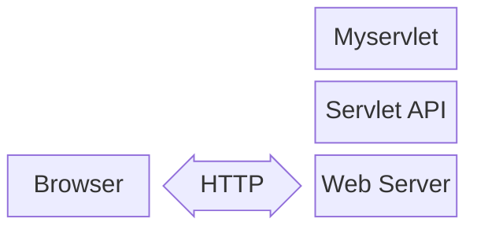
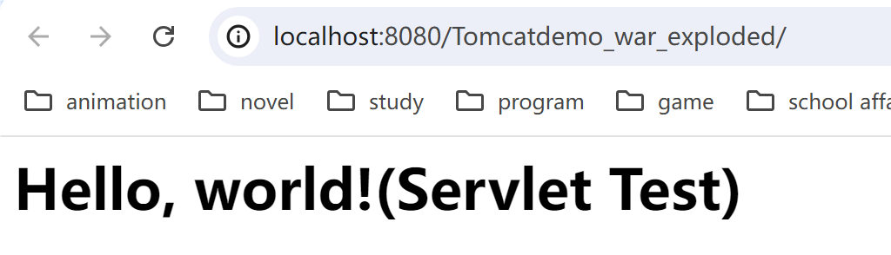
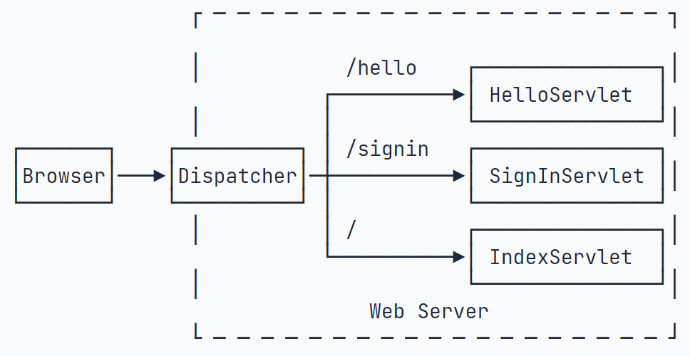
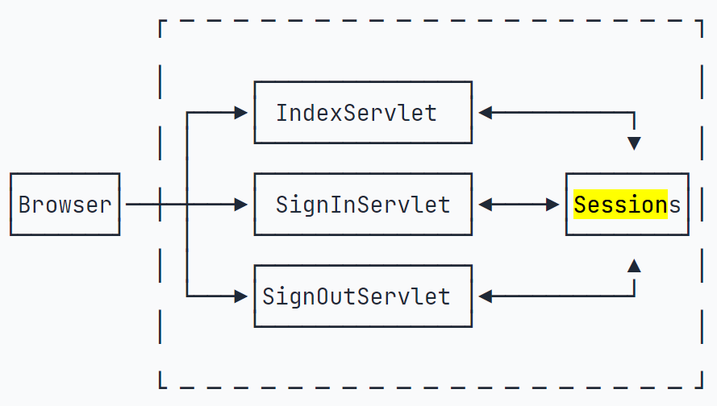

# Servlet

为了简化`Java EE`的开发，`Servlet`应运而生。在JavaEE平台上，处理TCP连接，解析HTTP协议这些底层工作由 Web 服务器完成，Servlet 则是运行在 Web 服务器上的程序，负责处理HTTP请求，生成HTTP响应。Servlet 通过 Servlet API 与 Web 服务器进行交互。

Servlet 通常情况下与使用 CGI（Common Gateway Interface，公共网关接口）实现的程序有异曲同工的效果，但 Servlet 具有很多优势：

1. 性能显著优于 CGI。
2. Servlet 在 Web 服务器的地址空间内执行，不需要单独创建进程处理每个请求。
3. Servlet 是独立于平台的，因为它们是用 Java 编写的。
4. 服务器上的 Java 安全管理器执行了一系列限制，以保护服务器计算机上的资源。因此，Servlet 是可信的。
5. Java 类库的全部功能对 Servlet 来说都是可用的。它可以通过 sockets 和 RMI 机制与 applets、数据库或其他软件进行交互。



## Servlet 基础

通常情况下定义 Servlet 需要继承`javax.servlet.http.HttpServlet`类并重写`doXXX`(如`doGet、doPost`)方法或者`service`方法，重写`HttpServlet`类的`service`方法可以获取到上述七种Http请求方法的请求。也可以继承`GenericServlet`或者自己实现`Servlet`接口。

**javax.servlet.http.HttpServlet**类继承于`javax.servlet.GenericServlet`，而`GenericServlet`又实现了`javax.servlet.Servlet`和`javax.servlet.ServletConfig`。

`javax.servlet.Servlet`接口中只定义了`servlet`基础生命周期方法：`init(初始化)`、`getServletConfig(配置)`、`service(服务)`、`destroy(销毁)`,而`HttpServlet`不仅实现了`servlet`的生命周期并通过封装`service`方法抽象出了`doGet/doPost/doDelete/doHead/doPut/doOptions/doTrace`方法用于处理来自客户端的不一样的请求方式。

```java title="Example"
package cc.servlet;

import java.io.IOException;
import java.io.PrintWriter;

import jakarta.servlet.ServletException;
import jakarta.servlet.annotation.WebServlet;
import jakarta.servlet.http.HttpServlet;
import jakarta.servlet.http.HttpServletRequest;
import jakarta.servlet.http.HttpServletResponse;

// WebServlet注解表示这是一个Servlet，并映射到地址/
@WebServlet(urlPatterns = "/")
public class HelloServlet extends HttpServlet {

    @Override
    protected void doGet(HttpServletRequest req, HttpServletResponse resp) throws ServletException, IOException {
        resp.setContentType("text/html");
        PrintWriter pw = resp.getWriter();
        pw.write("<h1>Hello, world!(Servlet Test)</h1>");
        pw.flush();
    }
}
```
运行后访问`http://localhost:8080/`即可看到`Hello, world!(Servlet Test)`。
{loading=“lazy”}

Servlet 的打包类型为war，表示Java Web Application Archive。普通的java程序通过启动JVM，执行jar包中的main方法，而war则需要部署到Web服务器中，由Web服务器加载。常用的支持 Servlet API 的 Web 服务器有 Tomcat、Jetty、WebLogic、WebSphere 等。

一个Webapp可以有多个Servlet，分别映射不同的路径。例如：

```java
@WebServlet(urlPatterns = "/hello")
public class HelloServlet extends HttpServlet {
    ...
}

@WebServlet(urlPatterns = "/signin")
public class SignInServlet extends HttpServlet {
    ...
}

@WebServlet(urlPatterns = "/")
public class IndexServlet extends HttpServlet {
    ...
}
```



浏览器会根据路由访问不同的Servlet，这种功能被称为dispatch。值得注意的是，`\` 实际匹配所有路径`\*`。

**多线程问题**

一个Servlet类在服务器中只有一个实例，但对于每个HTTP请求，Web服务器会使用多线程执行请求。因此，一个Servlet的doGet()、doPost()等处理请求的方法是多线程并发执行的。如果Servlet中定义了字段，要注意多线程并发访问的问题

## 重定向与转发

**Redirect**
Servlet 可以通过 `HttpServletResponse#sendRedirect()` 发送 302 重定向，使浏览器重新请求一个新的 URL。

```java
// 将 /hi 重定向到 /hello
@WebServlet(urlPatterns = "/hi")
public class RedirectServlet extends HttpServlet {
    protected void doGet(HttpServletRequest req, HttpServletResponse resp) throws ServletException, IOException {
        // 构造重定向的路径:
        String name = req.getParameter("name");
        String redirectToUrl = "/hello" + (name == null ? "" : "?name=" + name);
        // 发送重定向响应:
        resp.sendRedirect(redirectToUrl);
    }
}
```

如果要实现301永久重定向，可以使用`HttpServletResponse#setStatus()`方法设置状态码为301。

```java
resp.setStatus(HttpServletResponse.SC_MOVED_PERMANENTLY);
resp.setHeader("Location", "/hello");
```

**Forwward**

Forward指内部转发，即Servlet在处理请求时，将请求转发给另一个Servlet处理。

```java
@WebServlet(urlPatterns = "/morning")
public class ForwardServlet extends HttpServlet {
    protected void doGet(HttpServletRequest req, HttpServletResponse resp) throws ServletException, IOException {
        req.getRequestDispatcher("/hello").forward(req, resp);
    }
}
```

## Session 和 Cookie

对于Web应用程序来说，我们总是通过HttpSession这个高级接口访问当前Session。可以认为Web服务器在内存中自动维护了一个ID到HttpSession的映射表，我们可以用下图表示：


Servlet容器会在第一次调用`request.getSession()`时自动创建一个SessionID，服务器将其通过`JSSESIONID`这个Cookie发送给浏览器。浏览器在后续的请求中会自动发送这个Cookie，服务器就可以根据这个Cookie找到对应的Session。

除了上述提到的JSESSIONID外，还可以通过`getCookies()`

## Filter

JavaEE的Servlet规范提供了Filter组件，即过滤器，它的作用是，在HTTP请求到达Servlet之前，可以被一个或多个Filter预处理，类似打印日志、登录检查等逻辑。

???+ example 

    ```java
    @WebFilter("/user/*")
    public class AuthFilter implements Filter {
        public void doFilter(ServletRequest request, ServletResponse response, FilterChain chain)
                throws IOException, ServletException {
            System.out.println("AuthFilter: check authentication");
            HttpServletRequest req = (HttpServletRequest) request;
            HttpServletResponse resp = (HttpServletResponse) response;
            if (req.getSession().getAttribute("user") == null) {
                // 未登录，自动跳转到登录页:
                System.out.println("AuthFilter: not signin!");
                resp.sendRedirect("/signin");
            } else {
                // 已登录，继续处理:
                chain.doFilter(request, response);
            }
        }
    }
    ```

Servlet规范并没有对@WebFilter注解标注的Filter规定顺序。如果一定要给每个Filter指定顺序，就必须在web.xml文件中对这些Filter进行配置
