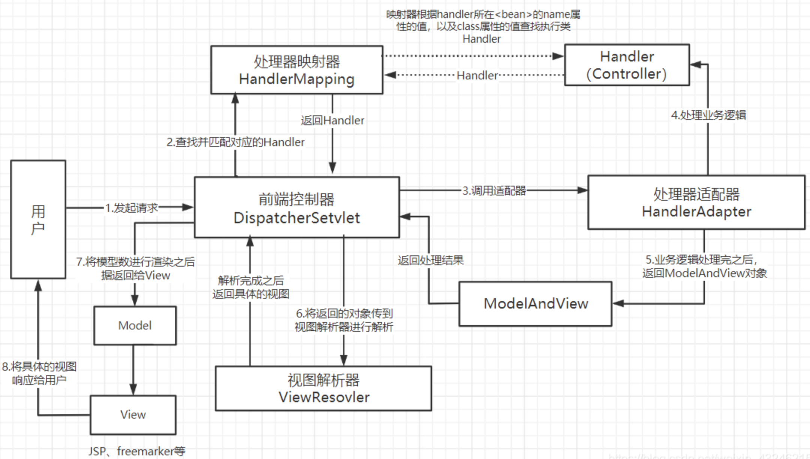
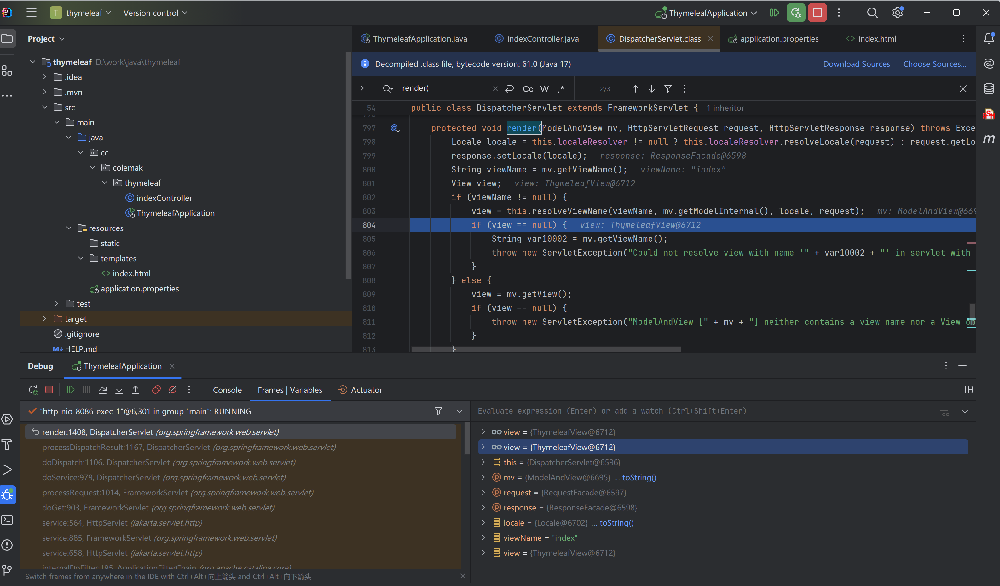

# SpringMVC

## MVC 模式

MVC 是 Model、View 和 Controller 的缩写，分别代表 Web 应用程序中的 3 种职责，MVC是一种软件设计规范。它将业务逻辑、数据、显示分离的方法来组织代码，降低了视图与业务逻辑之间的双向耦合。

>  M：Model，模型层，提供要展示的数据，因此包含数据和行为，可以认为是领域模型或JavaBean组件，不过现在一般都分离开来:
> Value Object（数据Dao） 和 服务层（行为Service）。也就是模型提供了模型数据查询和模型数据的状态更新等功能，包括数据和业务。
> 
> V：View，视图层，指工程中的html或jsp等页面，作用是与用户进行交互，展示数据
> 
> C：Controller，控制层，指工程中的servlet，作用是接收请求和响应浏览器
> 
> MVC的工作流程：
> 用户通过视图层发送请求到服务器，在服务器中请求被Controller接收，Controller调用相应的Model层处理请求，处理完毕将结果返回到Controller，Controller再根据请求处理的结果找到相应的View视图，渲染数据后最终响应给浏览器

最典型的MVC模式就是JSP+Servlet+JavaBean的模式。

## SpringMVC

SpringMVC是Spring中的一个模块，在Spring3.0 后发布。基于 MVC 架构，功能分工明确、解耦合。

SpringMVC也是一个容器，使用IoC核心技术，管理界面层中的控制器对象。SpringMVC的底层就是servlet，以servlet为核心，接收请求、处理请求，显示处理结果给用户。在此之前这个功能是由Servlet来实现的，现在使用SpringMVC来代替Servlet行驶控制器的角色和功能。

SpringMVC 的核心组件：

1. **前端控制器 DispactherServlet：**接收请求、响应结果，相当于转发器，它是SpringMVC框架最核心的组件，有了它就能减少其他组件之间的耦合度。
2. **处理器映射器 HandlerMapping：**根据配置的映射规则（根据请求的URL），找到对应的处理器。
3. **处理器适配器HandlerAdapter：**适配调用具体的处理器，并且执行处理器中处理请求的方法，执行完毕之后返回一个ModelAndView对象。
4. **处理器Handler：**开发者自己编写的处理器，处理请求具体的业务逻辑。
5. **视图解析器ViewResolver：**根据传递过来的ModelAndView对象进行视图解析，根据视图解析名解析称真正的视图View。
6. **视图View：**View是一个接口，它的实现类支持不同类型的视图。比如：JSP、freemarker、Thymeleaf等等。

<figure markdown="span">
    
    <figcaption>SpringMVC执行流程</figcaption>
</figure>


## 调试分析

`org.springframework.web.servlet.DispatcherServlet`负责拦截请求并分发到Handler处理，`DispatcherServlet#doService` 方法是处理请求的入口，所有请求都会经过这个方法，它会调用`doDispatch`来寻找Handler进行处理。

```java
    protected void doDispatch(HttpServletRequest request, HttpServletResponse response) throws Exception {
        HttpServletRequest processedRequest = request;
        HandlerExecutionChain mappedHandler = null;
        boolean multipartRequestParsed = false;
        WebAsyncManager asyncManager = WebAsyncUtils.getAsyncManager(request);

        try {
            try {
                ModelAndView mv = null;
                Exception dispatchException = null;

                try {
                    processedRequest = this.checkMultipart(request);
                    multipartRequestParsed = processedRequest != request;
                    mappedHandler = this.getHandler(processedRequest); // 获取 Handler
                    if (mappedHandler == null) {
                        this.noHandlerFound(processedRequest, response);
                        return;
                    }
                    // 获取 HandlerAdapter
                    HandlerAdapter ha = this.getHandlerAdapter(mappedHandler.getHandler()); 
                    String method = request.getMethod();
                    boolean isGet = HttpMethod.GET.matches(method);
                    if (isGet || HttpMethod.HEAD.matches(method)) {
                        long lastModified = ha.getLastModified(request, mappedHandler.getHandler());
                        if ((new ServletWebRequest(request, response)).checkNotModified(lastModified) && isGet) {
                            return;
                        }
                    }

                    if (!mappedHandler.applyPreHandle(processedRequest, response)) {
                        return;
                    }
                    // 由 HandlerAdapter 分发给对应处理器处理请求
                    mv = ha.handle(processedRequest, response, mappedHandler.getHandler()); 
                    if (asyncManager.isConcurrentHandlingStarted()) {
                        return;
                    }
                    // 如果为mv中没有View，则使用默认的View
                    this.applyDefaultViewName(processedRequest, mv);

                    // 执行所有拦截器的 postHandle 方法
                    mappedHandler.applyPostHandle(processedRequest, response, mv);
                } catch (Exception var20) {
                    Exception ex = var20;
                    dispatchException = ex;
                } catch (Throwable var21) {
                    Throwable err = var21;
                    dispatchException = new ServletException("Handler dispatch failed: " + err, err);
                }
                // 渲染视图 处理异常
                this.processDispatchResult(processedRequest, response, mappedHandler, mv, (Exception)dispatchException);
            } catch (Exception var22) {
                Exception ex = var22;
                // 执行拦截器的 afterCompletion 方法
                triggerAfterCompletion(processedRequest, response, mappedHandler, ex);
            } catch (Throwable var23) {
                Throwable err = var23;
                // 同上
                triggerAfterCompletion(processedRequest, response, mappedHandler, new ServletException("Handler processing failed: " + err, err));
            }

        } finally {
            if (asyncManager.isConcurrentHandlingStarted()) {
                if (mappedHandler != null) {
                    mappedHandler.applyAfterConcurrentHandlingStarted(processedRequest, response);
                }
            } else if (multipartRequestParsed) {
                this.cleanupMultipart(processedRequest);
            }

        }
    }
```
### handler
Todo

### 视图处理

跟入 `DispatcherServlet#processDispatchResult` 方法

```java
    private void processDispatchResult(HttpServletRequest request, HttpServletResponse response, @Nullable HandlerExecutionChain mappedHandler, @Nullable ModelAndView mv, @Nullable Exception exception) throws Exception {
        boolean errorView = false;
        if (exception != null) { // 处理异常
            if (exception instanceof ModelAndViewDefiningException) {
                ModelAndViewDefiningException mavDefiningException = (ModelAndViewDefiningException)exception;
                this.logger.debug("ModelAndViewDefiningException encountered", exception);
                mv = mavDefiningException.getModelAndView();
            } else {
                Object handler = mappedHandler != null ? mappedHandler.getHandler() : null;
                mv = this.processHandlerException(request, response, handler, exception);
                errorView = mv != null;
            }
        }
        
        if (mv != null && !mv.wasCleared()) {
            this.render(mv, request, response); // render 负责渲染视图
            if (errorView) {
                WebUtils.clearErrorRequestAttributes(request);
            }
        } else if (this.logger.isTraceEnabled()) {
            this.logger.trace("No view rendering, null ModelAndView returned.");
        }

        if (!WebAsyncUtils.getAsyncManager(request).isConcurrentHandlingStarted()) {
            if (mappedHandler != null) {
                mappedHandler.triggerAfterCompletion(request, response, (Exception)null);
            }

        }
    }
```

进入`render`方法

```java
    protected void render(ModelAndView mv, HttpServletRequest request, HttpServletResponse response) throws Exception {
        Locale locale = this.localeResolver != null ? this.localeResolver.resolveLocale(request) : request.getLocale();
        response.setLocale(locale);
        
        // 获取视图名称
        String viewName = mv.getViewName();  
        View view;
        if (viewName != null) {
            // 根据视图名称获取视图解析器
            view = this.resolveViewName(viewName, mv.getModelInternal(), locale, request);
            if (view == null) {
                String var10002 = mv.getViewName();
                throw new ServletException("Could not resolve view with name '" + var10002 + "' in servlet with name '" + this.getServletName() + "'");
            }
        } else {
            view = mv.getView();
            if (view == null) {
                throw new ServletException("ModelAndView [" + mv + "] neither contains a view name nor a View object in servlet with name '" + this.getServletName() + "'");
            }
        }

        if (this.logger.isTraceEnabled()) {
            this.logger.trace("Rendering view [" + view + "] ");
        }

        try {
            if (mv.getStatus() != null) {
                request.setAttribute(View.RESPONSE_STATUS_ATTRIBUTE, mv.getStatus());
                response.setStatus(mv.getStatus().value());
            }
            // 渲染视图
            view.render(mv.getModelInternal(), request, response);
        } catch (Exception var8) {
            Exception ex = var8;
            if (this.logger.isDebugEnabled()) {
                this.logger.debug("Error rendering view [" + view + "]", ex);
            }

            throw ex;
        }
    }
```
在render方法中，首先会获取mv对象的viewName，然后调用`resolveViewName`方法，resolveViewName方法最终会获取最匹配的视图解析器，最后调用`View#render`方法渲染视图。

例如在这个demo中采用 Thyemleaf 模板引擎，返回 ThymeleafView



之后的流程各个视图解析器不同，此处不进行详细展开。

Todo

搞模板注入这部分先调到这里
