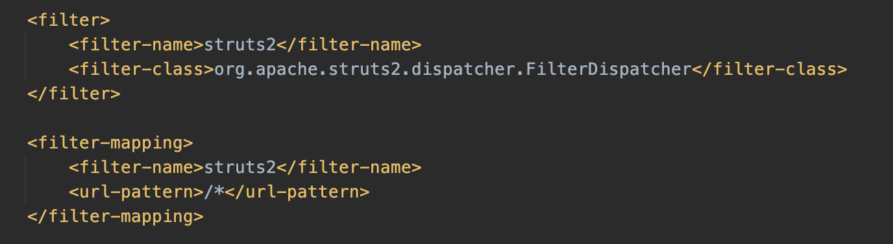
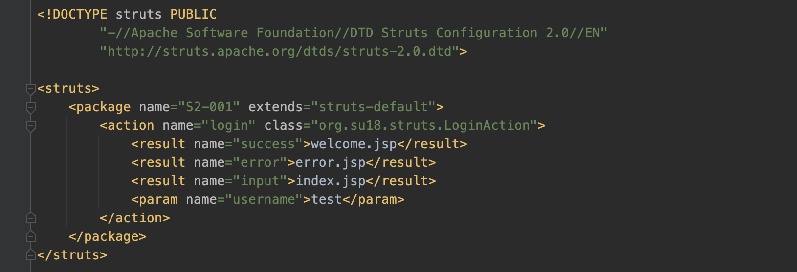

# Struts2

Apache Struts2 是一个基于 MVC 设计模式的Web应用框架，它的本质就相当于一个 servlet，在 MVC 设计模式中，Struts2 作为控制器（Controller）来建立模型与视图的数据交互。Struts2 是在 Struts 和WebWork 的技术的基础上进行合并的全新的框架。Struts2 以 WebWork 为核心，采用拦截器的机制来处理的请求。这样的设计使得业务逻辑控制器能够与 ServletAPI 完全脱离开。

对于一次请求，Struts2 的执行流程如下：

1. Filter：首先经过核心的过滤器，也就是在 web.xml 中配置 filter 及 filter-mapping，通常会配置 `/*` 将全部的路由交给 struts2 来处理。
   
2. Interceptor-stack：执行拦截器，应用程序通常会在拦截器中实现一部分功能。也包括在 struts-core 包中 `struts-default.xml` 文件配置的默认的一些拦截器。
3. Action：根据访问路径，找到处理这个请求对应的 Action 控制类，通常配置在 `struts.xml` 中的 package 中。
   
4. 