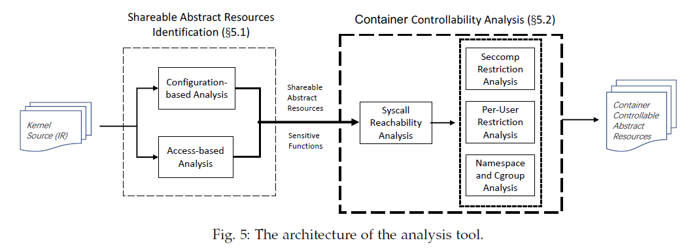

# Towards Understanding and Defeating Abstract Resource Attacks for Container Platforms

> Author: Wenbo Shen, Yifei Wu, Yutian Yang, Qirui Liu, Nanzi Yang, Jinku Li, Kangjie Lu, Jianfeng Ma

!!! Abstract
    由于容器技术通过隔离运行在同一个操作系统内核上，除了硬件资源外，部分OS Kernel中的数据结构、变量也被共享，这为攻击者提供了DoS攻击的可能性。本文提出了一种新的攻击模型，称为Abstract Resource Attack，攻击者通过在受限的容器中创建大量的抽象资源对象，导致OS Kernel中的资源耗尽，从而影响其他容器乃至Kernel的正常运行。针对这种攻击，本文基于eBPF技术提出了一种检测和防御方法，实现了对抽象资源对象的检测和限制。

## 1 现有的抽象资源限制技术

### 1.1 Kernel Layer

#### 1.1.1 rlimit

rlimit 是 Linux v2.4 引入的资源限制机制，针对特有的16种资源类型，进行用户/进程级别的资源限制，例如`RLIMIT_NOFILE`限制每个进程打开的文件数量。

**缺点：**可限制的资源类型固定；只能实现进程/用户级别的限制，而容器通常包含进程树和多个处于同一user namespace下的用户。

#### 1.1.2 sysctl

sysctl 是 Linux 用于配置Kernel参数的接口，可以通过配置六种资源类型的参数来在系统级别限制抽象资源的使用，例如`fs`配置文件系统限制，`vm`配置虚拟内存限制等。

**缺点：**只能对整个系统使用的资源总量进行限制，反而有助于抽象资源攻击。

#### 1.1.3 namespace 和 cgroups

Linux 内核提供的隔离机制，但只能对固定类别的抽象资源进行限制，难以扩展到其他资源类型。

### 1.2 Container Layer

Sysdig Falco 是运行时容器安全监控工具，主要由 event collector 和 event monitor 两个组件组成，通过eBPF和kprobe技术实现运行时hook调整与灵活的事件监控，基于捕获的事件是否违反用户设定的Rules进行相应举措。

**缺点：**Falco 从设计上来说不适用于抽象资源攻击检测，因为其hook点位于syscall的入口和出口，不能有效监控内核资源的变化。

### 1.3 Orchestration Layer

Kubernetes namespace 是容器编排层的资源隔离机制，可以将Kubernetes对象（e.g., pods, services, etc.）划分到不同的namespace中。

Kubernetes还使用limit ranges（基于cgroups）来限制硬件资源的使用。

**缺点：**Kubernetes的namespace和limit都是cluster级别的资源隔离限制，且其底层仍是由Kernel提供的机制实现，因此无法限制抽象资源攻击。

## 2 抽象资源攻击示例

### 2.1 Attacking `idr` of PID 

Linux 内核引入了 `struct idr` 用于整型ID管理，进程管理同样通过`idr`来分配PID，`alloc_pid`函数实现如下：
    
```c
struct pid *alloc_pid(struct pid_namespace *ns,pid_t *set_tid, size_t set_tid_size)
{
    ...
    nr = idr_alloc_cyclic(&tmp->idr, NULL,pid_min, pid_max, GFP_ATOMIC);
    ...
    if (nr < 0) {
        retval = (nr == -ENOSPC) ? -EAGAIN : nr;
        goto out_free;
    }
    pid->numbers[i].nr = nr;
    ...
}
```

攻击者可以通过发起大量fork请求耗尽`idr`中的资源，导致其他进程无法分配PID。

在该攻击中，Linux PID namespace的隔离本质上是实现了namespace内部与root PID namespace中PID的映射，换句话说，root PID namespace仍然是被共享的，因此攻击者可以跨namespace发起攻击耗尽`idr`资源

cgroups机制的确能够限制进程直接fork的数量，但是攻击者可以欺骗内核使其产生大量fork而绕过限制，例如发起大量网络交互或限制device生成NET和Block softrqs（这将导致kernel创建大量中断处理线程）。

### 2.2 Attacking memory dirty ratio

Linux 为了提高文件读写速度采用了缓存机制，先在内存中缓存文件修改内容，待 `dirty` 值较高时kernel唤起后台进程异步写入磁盘，当`dirty ratio`较高时kernel会关闭writeback机制转为直接写入磁盘，因此可以通过耗尽dirty memory来大幅降低系统的文件读写性能。

### 其他攻击 Todo（看完了但是还没写完）

## 3 检测抽象资源

内核中有数以万计的变量和数据结构，本文实现分析工具定位发现其中可能的抽象资源对象，架构如下：

{width=70%}

先通过共享抽象资源检测发现潜在的抽象资源对象，再通过容器可控性分析以确定这些抽象资源是否可以被容器利用。

### 3.1 共享抽象资源检测

#### 3.1.1 Configuration-based Analysis

Linux kernel 提供sysctl接口来配置系统参数，通过观察我们发现大部分配置都用于限制抽象资源的使用，因此我们可以检测sysctl配置项来找出潜在的抽象资源对象，步骤如下：

1. 根据sysctl数据类型找到所有sysctl相关数据结构
2. sysctl数据结构通常包含用于展示位于`/proc/sys/`目录下sysctl值的函数，通过分析这些函数，我们可以精确定位这些系统变量
3. 通过use-def chain分析变量是否参与compare操作（limit时需要比较）

#### 3.1.2 Access-based Analysis

Linux 通常通过 lock 或 atomic 机制保护共享资源，因此我们可以通过分析使用了这些机制的变量以确定抽象资源，如果一个变量在lock和unlock之间的值进行修改，或使用atomic和`percpu counter`，那么这个变量可能是一个抽象资源对象。

### 3.2 容器可控性分析

通过control-flow分析，我们能够发现 syscall 路径中可控的抽象资源，如果这些资源没有被Seccomp、namespace或cgroup限制，该资源即为容器可控。

## 问题？

待了解技术实现细节

1. （Section 5 Table 4）检测抽象资源对象时如何实现统计 Res Type？