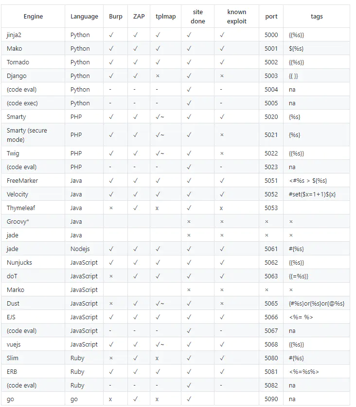

---
tags:
    - Web Sec
comments: true
---
# SSTI (服务器端模板注入漏洞)
模板引擎（这里特指用于Web开发的模板引擎）是为了使用户界面与业务数据（内容）分离而产生的，它可以生成特定格式的文档，利用模板引擎来生成前端的html代码，模板引擎会提供一套生成html代码的程序，然后只需要获取用户的数据，然后放到渲染函数里，然后生成模板+用户数据的前端html页面，然后反馈给浏览器，呈现在用户面前。

模板引擎也会提供沙箱机制来进行漏洞防范，但是可以用沙箱逃逸技术来进行绕过。

SSIT（Server-Side Template Injection）攻击者可以通过构造恶意的模板注入代码，从而执行任意代码。漏洞成因为服务端接收了用户的恶意输入，未经任何处理就将其作为 Web 应用模板内容的一部分，模板引擎在进行目标编译渲染的过程中，执行了用户插入的可以破坏模板的语句，因而可能导致了敏感信息泄露、代码执行、GetShell 等问题。其影响范围主要取决于模版引擎的复杂性。

??? info "模板引擎"
    

## PHP SSTI
- [Twig 模板注入](/Sec/Web/SSTI/twig)
- [Smarty 模板注入](/Sec/Web/SSTI/smarty)

## Java SSTI
- [Velocity 模板注入](/Sec/Web/SSTI/velocity)

## 参考资料
- [SSTI（模板注入）漏洞](https://www.cnblogs.com/bmjoker/p/13508538.html){target="_blank"}