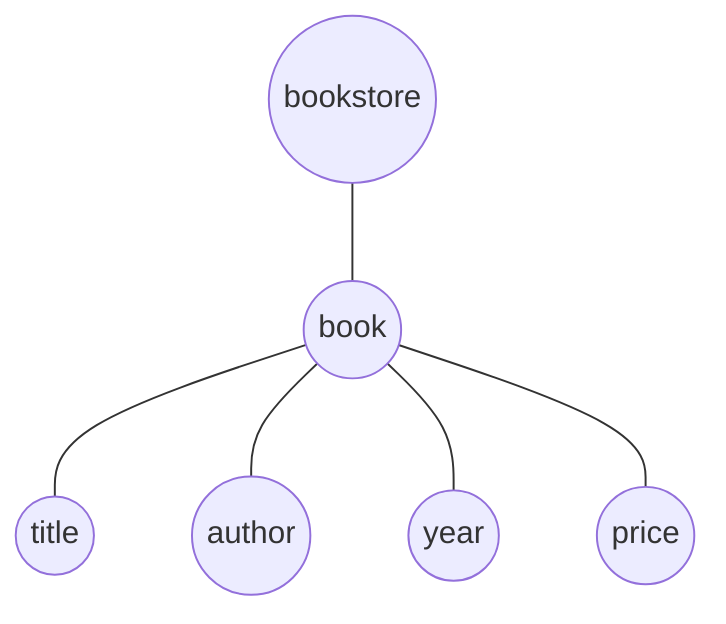

# XPATH

## 简介
XPath 是一门在 XML 文档中查找信息的语言。XPath 可用来在 XML 文档中对元素和属性进行遍历。

例如对于下面的 XML 文档：
```xml
<?xml version="1.0" encoding="ISO-8859-1"?>

<bookstore>

<book>
  <title lang="en">Harry Potter</title>
  <author>J K. Rowling</author> 
  <year>2005</year>
  <price>29.99</price>
</book>

</bookstore>
```



XPath 使用路径表达式来选取 XML 文档中的节点或节点集。节点是通过沿着路径 (path) 或者步 (steps) 来选取的。

表达式|描述
---|---
nodename|	选取此节点的所有子节点。
/|	从根节点选取。
//|	从匹配选择的当前节点选择文档中的节点，而不考虑它们的位置。
.|	选取当前节点。
..|	选取当前节点的父节点。
@	|选取属性。

详细语法参考[XPath 语法](https://www.w3school.com.cn/xpath/xpath_syntax.asp){:target="_blank"}

## XPath 注入

XPath 注入的原理与sql注入大体类似。主要是通过构建特殊的输入，这些输入往往是XPath语法中的一些组合，这些输入将作为参数传入Web 应用程序，通过执行XPath查询而执行入侵者想要的操作。由于xpath不存在访问控制，所以我们不会遇到许多在SQL注入中的访问限制。 注入出现的位置也就是cookie，headers，request parameters/input等

